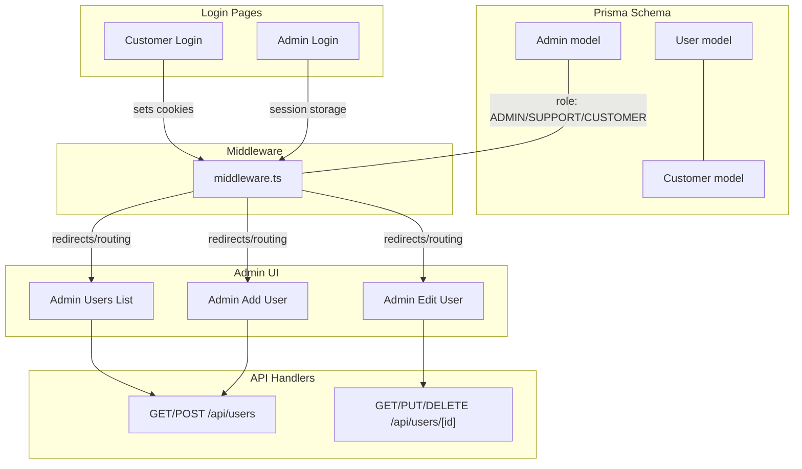
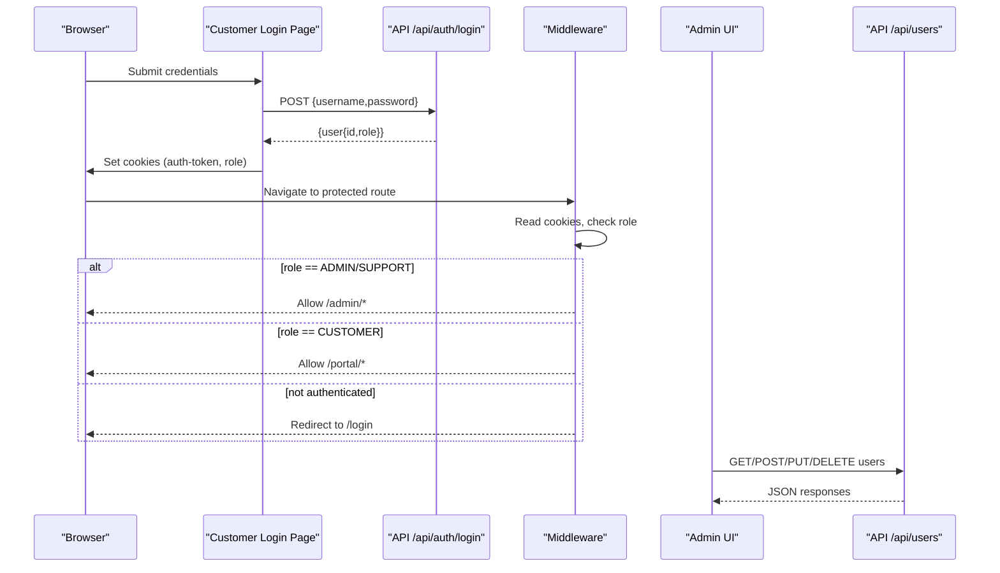
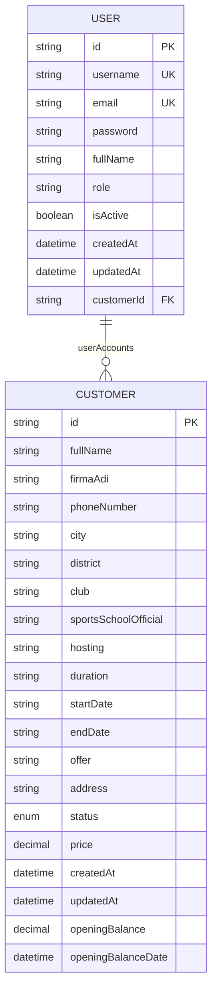
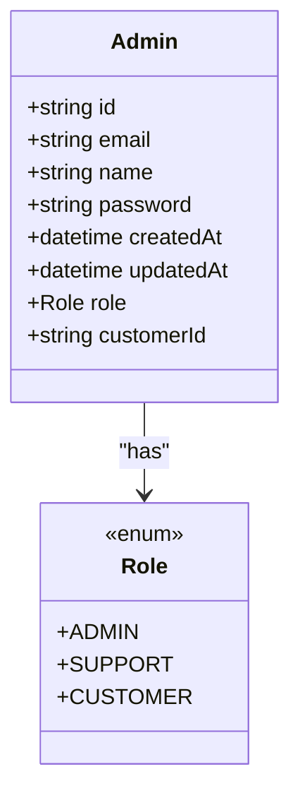
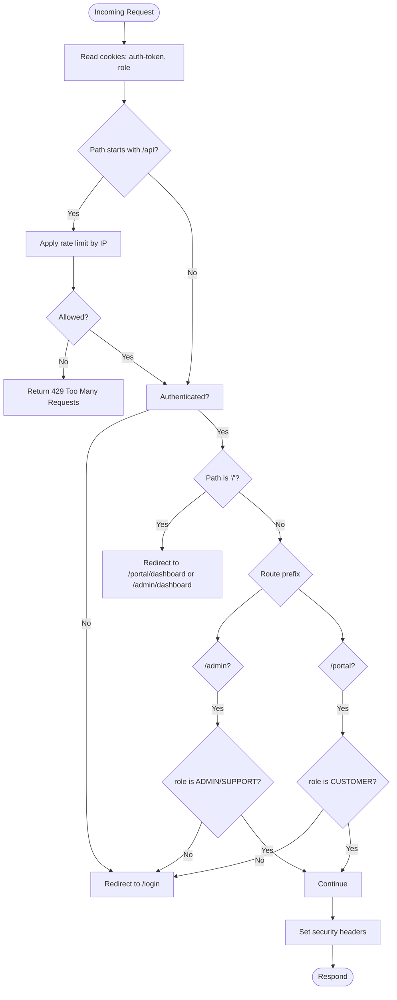
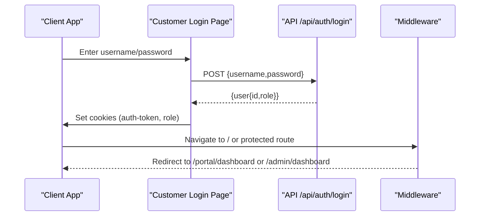
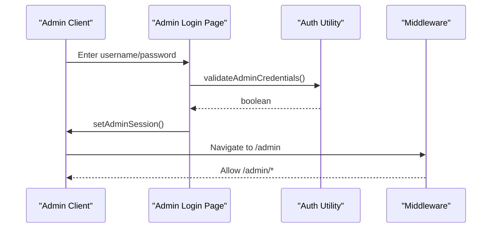
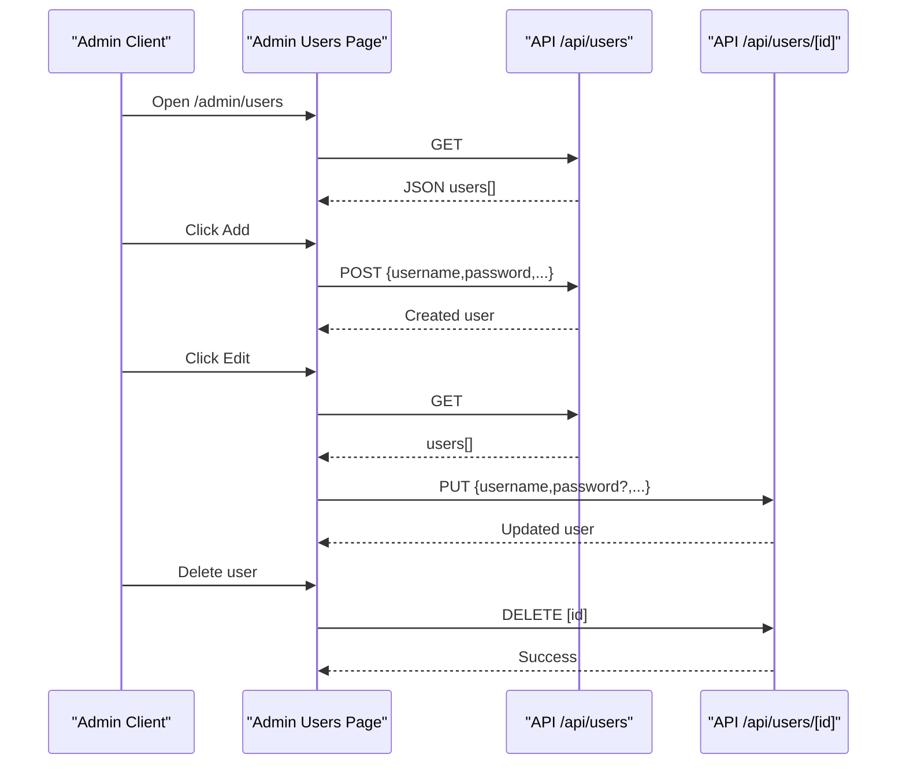
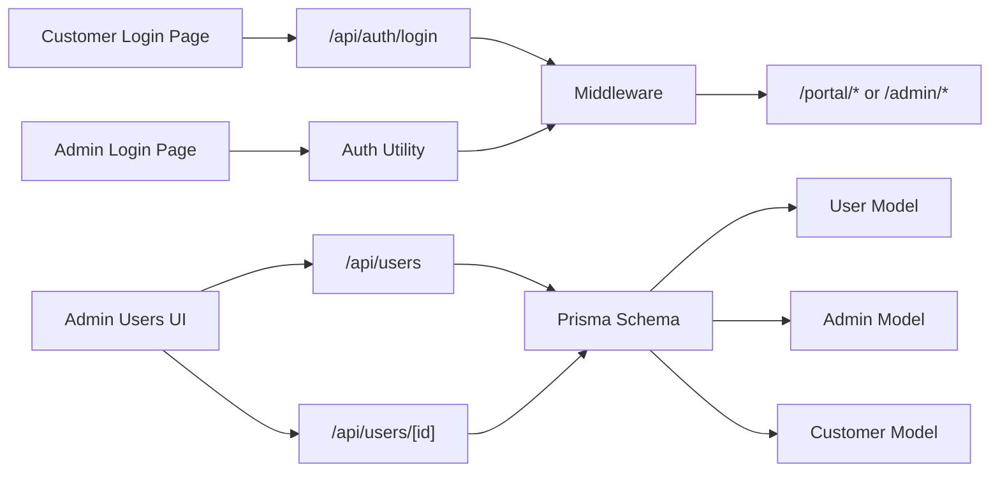

# User and Access Control Entities

<cite>
**Referenced Files in This Document**
- [schema.prisma](file://prisma/schema.prisma)
- [auth.ts](file://src/lib/auth.ts)
- [middleware.ts](file://src/middleware.ts)
- [users.page.tsx](file://src/app/admin/users/page.tsx)
- [users.add.page.tsx](file://src/app/admin/users/add/page.tsx)
- [users.edit.page.tsx](file://src/app/admin/users/[id]/edit/page.tsx)
- [users.route.ts](file://src/app/api/users/route.ts)
- [users.[id].route.ts](file://src/app/api/users/[id]/route.ts)
- [admin.login.page.tsx](file://src/app/admin/login/page.tsx)
- [login.page.tsx](file://src/app/login/page.tsx)
- [validations.ts](file://src/lib/validations.ts)
</cite>

## Table of Contents
1. [Introduction](#introduction)
2. [Project Structure](#project-structure)
3. [Core Components](#core-components)
4. [Architecture Overview](#architecture-overview)
5. [Detailed Component Analysis](#detailed-component-analysis)
6. [Dependency Analysis](#dependency-analysis)
7. [Performance Considerations](#performance-considerations)
8. [Troubleshooting Guide](#troubleshooting-guide)
9. [Conclusion](#conclusion)

## Introduction
This document explains the User and Admin entities and the multi-role authentication and access control system. It covers:
- User entity with credentials, role-based permissions, and customer associations
- Admin entity with role hierarchy (ADMIN, SUPPORT, CUSTOMER), email-based authentication, and administrative privileges
- Relationship between users and customers
- Examples of user registration workflows, role-based access control, session management, and multi-tenant routing based on roles
- Authentication middleware, user form components, and security measures

## Project Structure
The authentication and access control system spans:
- Prisma schema defining User, Admin, and Customer entities and their relations
- Middleware enforcing authentication and role-based routing
- Admin user management UI and API handlers
- Login pages for admin and customer portals
- Validation schemas for secure input handling

**Diagram sources**
- [schema.prisma](file://prisma/schema.prisma)
- [middleware.ts](file://src/middleware.ts)
- [users.page.tsx](file://src/app/admin/users/page.tsx)
- [users.add.page.tsx](file://src/app/admin/users/add/page.tsx)
- [users.edit.page.tsx](file://src/app/admin/users/[id]/edit/page.tsx)
- [users.route.ts](file://src/app/api/users/route.ts)
- [users.[id].route.ts](file://src/app/api/users/[id]/route.ts)
- [admin.login.page.tsx](file://src/app/admin/login/page.tsx)
- [login.page.tsx](file://src/app/login/page.tsx)

**Section sources**
- [schema.prisma](file://prisma/schema.prisma)
- [middleware.ts](file://src/middleware.ts)
- [users.page.tsx](file://src/app/admin/users/page.tsx)
- [users.add.page.tsx](file://src/app/admin/users/add/page.tsx)
- [users.edit.page.tsx](file://src/app/admin/users/[id]/edit/page.tsx)
- [users.route.ts](file://src/app/api/users/route.ts)
- [users.[id].route.ts](file://src/app/api/users/[id]/route.ts)
- [admin.login.page.tsx](file://src/app/admin/login/page.tsx)
- [login.page.tsx](file://src/app/login/page.tsx)

## Core Components
- User entity
  - Fields: unique username, unique email, password, full name, role string, active flag, timestamps
  - Optional relation to Customer via customerId
  - Used for customer portal authentication and multi-tenant routing
- Admin entity
  - Fields: unique email, name, password, timestamps, role enum (ADMIN, SUPPORT, CUSTOMER), optional customerId
  - Used for administrative access and role-based routing
- Customer entity
  - Fields: personal/company info, address, status, financials, relations to subscriptions, domains, hostings, tasks, payments, invoices, account transactions
  - Optional relation to User via userAccounts
- Authentication and routing
  - Cookies carry auth-token and role for customer sessions
  - Middleware enforces redirects and role checks for admin and portal routes
  - Admin login uses in-memory session storage

**Section sources**
- [schema.prisma](file://prisma/schema.prisma)
- [middleware.ts](file://src/middleware.ts)
- [auth.ts](file://src/lib/auth.ts)

## Architecture Overview
The system separates customer and admin experiences:
- Customer portal authentication stores a user id cookie and a role cookie
- Middleware reads cookies to enforce role-aware routing and redirects
- Admin login sets an admin session in browser storage
- User management is exposed via admin UI and API handlers with validation and hashing

**Diagram sources**
- [login.page.tsx](file://src/app/login/page.tsx)
- [middleware.ts](file://src/middleware.ts)
- [users.route.ts](file://src/app/api/users/route.ts)
- [users.[id].route.ts](file://src/app/api/users/[id]/route.ts)

## Detailed Component Analysis

### User Entity and Customer Association
- User model includes credentials, role, and optional customer linkage
- Customer model includes multiple relations (subscriptions, domains, hostings, tasks, payments, invoices, account transactions)
- The relationship enables multi-tenancy: a user can be associated with a customer, and the system routes accordingly

**Diagram sources**
- [schema.prisma](file://prisma/schema.prisma)

**Section sources**
- [schema.prisma](file://prisma/schema.prisma)

### Admin Entity and Role Hierarchy
- Admin model supports three roles: ADMIN, SUPPORT, CUSTOMER
- Email-based authentication is supported by the login page and middleware
- Admins can access admin routes; CUSTOMER role users are treated as customer portal users

**Diagram sources**
- [schema.prisma](file://prisma/schema.prisma)

**Section sources**
- [schema.prisma](file://prisma/schema.prisma)
- [admin.login.page.tsx](file://src/app/admin/login/page.tsx)

### Authentication Middleware and Routing
- Reads auth-token and role cookies
- Redirects unauthenticated users to /login
- Redirects authenticated users to appropriate dashboards (/portal/dashboard or /admin/dashboard)
- Enforces role-based access: /admin requires ADMIN or SUPPORT; /portal requires CUSTOMER
- Applies rate limiting for API routes and security headers for non-API routes

**Diagram sources**
- [middleware.ts](file://src/middleware.ts)

**Section sources**
- [middleware.ts](file://src/middleware.ts)

### Customer Portal Login Workflow
- Client-side form posts credentials to /api/auth/login
- On success, server responds with user info and sets auth-token and role cookies
- Middleware reads cookies and redirects to the appropriate dashboard

**Diagram sources**
- [login.page.tsx](file://src/app/login/page.tsx)
- [middleware.ts](file://src/middleware.ts)

**Section sources**
- [login.page.tsx](file://src/app/login/page.tsx)
- [middleware.ts](file://src/middleware.ts)

### Admin Login Workflow
- Admin login page validates credentials against in-memory constants
- On success, sets admin session in sessionStorage and navigates to /admin

**Diagram sources**
- [admin.login.page.tsx](file://src/app/admin/login/page.tsx)
- [auth.ts](file://src/lib/auth.ts)
- [middleware.ts](file://src/middleware.ts)

**Section sources**
- [admin.login.page.tsx](file://src/app/admin/login/page.tsx)
- [auth.ts](file://src/lib/auth.ts)
- [middleware.ts](file://src/middleware.ts)

### User Management UI and API
- Admin users list page fetches users from /api/users and supports filtering, toggling active status, and deletion
- Add user page validates input and creates a new user via /api/users
- Edit user page loads user data, conditionally updates password, and persists changes via /api/users/[id]

**Diagram sources**
- [users.page.tsx](file://src/app/admin/users/page.tsx)
- [users.add.page.tsx](file://src/app/admin/users/add/page.tsx)
- [users.edit.page.tsx](file://src/app/admin/users/[id]/edit/page.tsx)
- [users.route.ts](file://src/app/api/users/route.ts)
- [users.[id].route.ts](file://src/app/api/users/[id]/route.ts)

**Section sources**
- [users.page.tsx](file://src/app/admin/users/page.tsx)
- [users.add.page.tsx](file://src/app/admin/users/add/page.tsx)
- [users.edit.page.tsx](file://src/app/admin/users/[id]/edit/page.tsx)
- [users.route.ts](file://src/app/api/users/route.ts)
- [users.[id].route.ts](file://src/app/api/users/[id]/route.ts)

### Security Measures
- Password hashing: bcrypt is used when creating/updating users
- Input validation: Zod schemas validate create/update payloads
- Rate limiting: In-process rate limiter per IP for API routes
- Security headers: X-Content-Type-Options, X-Frame-Options, X-XSS-Protection, Referrer-Policy applied to responses
- Cookie-based sessions: auth-token and role cookies for customer sessions
- Admin session: sessionStorage for admin panel

**Section sources**
- [users.route.ts](file://src/app/api/users/route.ts)
- [users.[id].route.ts](file://src/app/api/users/[id]/route.ts)
- [validations.ts](file://src/lib/validations.ts)
- [middleware.ts](file://src/middleware.ts)
- [auth.ts](file://src/lib/auth.ts)

## Dependency Analysis
- User and Admin models depend on Prisma schema definitions
- Admin UI depends on API handlers for CRUD operations
- Middleware depends on cookies and route prefixes to enforce access control
- Login pages depend on API endpoints and middleware for redirection

**Diagram sources**
- [schema.prisma](file://prisma/schema.prisma)
- [login.page.tsx](file://src/app/login/page.tsx)
- [admin.login.page.tsx](file://src/app/admin/login/page.tsx)
- [middleware.ts](file://src/middleware.ts)
- [users.route.ts](file://src/app/api/users/route.ts)
- [users.[id].route.ts](file://src/app/api/users/[id]/route.ts)

**Section sources**
- [schema.prisma](file://prisma/schema.prisma)
- [login.page.tsx](file://src/app/login/page.tsx)
- [admin.login.page.tsx](file://src/app/admin/login/page.tsx)
- [middleware.ts](file://src/middleware.ts)
- [users.route.ts](file://src/app/api/users/route.ts)
- [users.[id].route.ts](file://src/app/api/users/[id]/route.ts)

## Performance Considerations
- Rate limiting reduces API load; consider external caching for distributed environments
- Client-side filtering in admin user list is basic; pagination and server-side filtering recommended for large datasets
- Password hashing adds CPU overhead; tune bcrypt rounds appropriately for environment

## Troubleshooting Guide
- Authentication failures
  - Verify cookies are set after login and read by middleware
  - Confirm role values match expected enums
- Role-based redirects
  - Ensure cookies are present and not expired
  - Check middleware route prefixes and role checks
- User management errors
  - Validate input against Zod schemas
  - Inspect API responses for validation messages and HTTP status codes
- Admin login
  - Confirm in-memory credentials and sessionStorage usage

**Section sources**
- [login.page.tsx](file://src/app/login/page.tsx)
- [middleware.ts](file://src/middleware.ts)
- [users.route.ts](file://src/app/api/users/route.ts)
- [users.[id].route.ts](file://src/app/api/users/[id]/route.ts)
- [admin.login.page.tsx](file://src/app/admin/login/page.tsx)
- [auth.ts](file://src/lib/auth.ts)

## Conclusion
The system implements a clear separation between customer and admin roles with robust middleware-driven access control, secure credential handling, and practical admin user management. Extending the system to support database-backed admin authentication and customer-user linking will further strengthen security and usability.