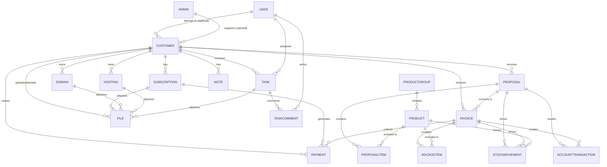
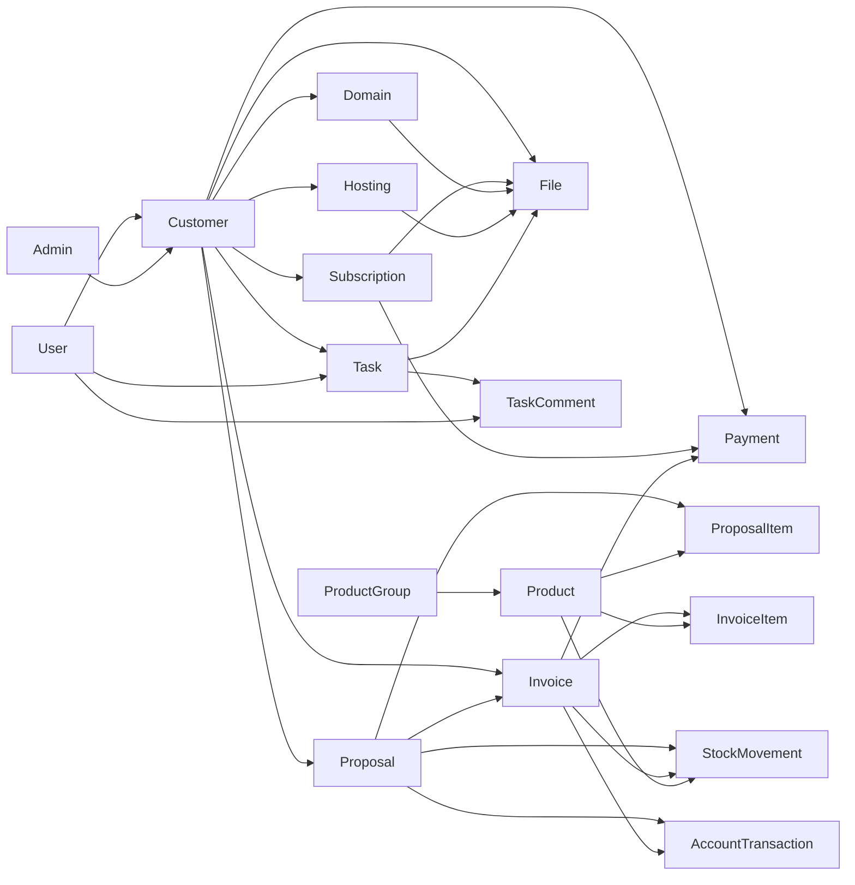

# Database Design

<cite>
**Referenced Files in This Document**
- [schema.prisma](file://prisma/schema.prisma)
- [20251017055625_init/migration.sql](file://prisma/migrations/20251017055625_init/migration.sql)
- [20251017062015_add_application_fields/migration.sql](file://prisma/migrations/20251017062015_add_application_fields/migration.sql)
- [20251017115717_update_application_fields/migration.sql](file://prisma/migrations/20251017115717_update_application_fields/migration.sql)
- [20260206000001_simplify_hosting_model/migration.sql](file://prisma/migrations/20260206000001_simplify_hosting_model/migration.sql)
- [20260215091826_init/migration.sql](file://prisma/migrations/20260215091826_init/migration.sql)
- [20260215094719_add_cost_price_profit_margin/migration.sql](file://prisma/migrations/20260215094719_add_cost_price_profit_margin/migration.sql)
- [20260215095355_add_key_value_settings/migration.sql](file://prisma/migrations/20260215095355_add_key_value_settings/migration.sql)
- [20260216123144_update_user_model/migration.sql](file://prisma/migrations/20260216123144_update_user_model/migration.sql)
- [20260328164310_add_firma_adi_to_domain/migration.sql](file://prisma/migrations/20260328164310_add_firma_adi_to_domain/migration.sql)
- [20260328173759_add_firma_adi_to_customer/migration.sql](file://prisma/migrations/20260328173759_add_firma_adi_to_customer/migration.sql)
- [20260328175634_remove_firma_adi_registrar_from_domain/migration.sql](file://prisma/migrations/20260328175634_remove_firma_adi_registrar_from_domain/migration.sql)
- [migration_lock.toml](file://prisma/migrations/migration_lock.toml)
</cite>

## Table of Contents
1. [Introduction](#introduction)
2. [Project Structure](#project-structure)
3. [Core Components](#core-components)
4. [Architecture Overview](#architecture-overview)
5. [Detailed Component Analysis](#detailed-component-analysis)
6. [Dependency Analysis](#dependency-analysis)
7. [Performance Considerations](#performance-considerations)
8. [Troubleshooting Guide](#troubleshooting-guide)
9. [Conclusion](#conclusion)
10. [Appendices](#appendices)

## Introduction
This document describes the Customer WebMahsul database design centered around the Prisma schema. It details entity relationships, field definitions, data types, primary/foreign keys, indexes, constraints, and validation rules. It explains the customer-centric data model and its relationships to domains, hosting, subscriptions, proposals, and financial transactions. Migration history is documented to show the evolution of the schema, and guidance is provided for extending the data model while maintaining referential integrity and performance.

## Project Structure
The database design is defined in a single Prisma schema file and evolves through PostgreSQL migrations. The schema defines core entities (Customer, Subscription, Domain, Hosting, Task, Payment, Proposal, Invoice, Product, etc.) and their relations. Migrations capture incremental changes to tables, enums, indexes, and constraints over time.

```mermaid
graph TB
subgraph "Prisma Schema"
SCHEMA["schema.prisma"]
end
subgraph "Migrations"
M20251017055625["20251017055625_init"]
M20251017062015["20251017062015_add_application_fields"]
M20251017115717["20251017115717_update_application_fields"]
M20260206000001["20260206000001_simplify_hosting_model"]
M20260215091826["20260215091826_init"]
M20260215094719["20260215094719_add_cost_price_profit_margin"]
M20260215095355["20260215095355_add_key_value_settings"]
M20260216123144["20260216123144_update_user_model"]
M20260328164310["20260328164310_add_firma_adi_to_domain"]
M20260328173759["20260328173759_add_firma_adi_to_customer"]
M20260328175634["20260328175634_remove_firma_adi_registrar_from_domain"]
end
SCHEMA --> M20251017055625
SCHEMA --> M20251017062015
SCHEMA --> M20251017115717
SCHEMA --> M20260206000001
SCHEMA --> M20260215091826
SCHEMA --> M20260215094719
SCHEMA --> M20260215095355
SCHEMA --> M20260216123144
SCHEMA --> M20260328164310
SCHEMA --> M20260328173759
SCHEMA --> M20260328175634
```

**Diagram sources**
- [schema.prisma](file://prisma/schema.prisma)
- [20251017055625_init/migration.sql](file://prisma/migrations/20251017055625_init/migration.sql)
- [20251017062015_add_application_fields/migration.sql](file://prisma/migrations/20251017062015_add_application_fields/migration.sql)
- [20251017115717_update_application_fields/migration.sql](file://prisma/migrations/20251017115717_update_application_fields/migration.sql)
- [20260206000001_simplify_hosting_model/migration.sql](file://prisma/migrations/20260206000001_simplify_hosting_model/migration.sql)
- [20260215091826_init/migration.sql](file://prisma/migrations/20260215091826_init/migration.sql)
- [20260215094719_add_cost_price_profit_margin/migration.sql](file://prisma/migrations/20260215094719_add_cost_price_profit_margin/migration.sql)
- [20260215095355_add_key_value_settings/migration.sql](file://prisma/migrations/20260215095355_add_key_value_settings/migration.sql)
- [20260216123144_update_user_model/migration.sql](file://prisma/migrations/20260216123144_update_user_model/migration.sql)
- [20260328164310_add_firma_adi_to_domain/migration.sql](file://prisma/migrations/20260328164310_add_firma_adi_to_domain/migration.sql)
- [20260328173759_add_firma_adi_to_customer/migration.sql](file://prisma/migrations/20260328173759_add_firma_adi_to_customer/migration.sql)
- [20260328175634_remove_firma_adi_registrar_from_domain/migration.sql](file://prisma/migrations/20260328175634_remove_firma_adi_registrar_from_domain/migration.sql)

**Section sources**
- [schema.prisma](file://prisma/schema.prisma)
- [20251017055625_init/migration.sql](file://prisma/migrations/20251017055625_init/migration.sql)
- [20260215091826_init/migration.sql](file://prisma/migrations/20260215091826_init/migration.sql)

## Core Components
This section documents the customer-centric entities and their attributes, relationships, and constraints as defined in the Prisma schema.

- Customer
  - Primary key: id
  - Fields: fullName, firmaAdi (nullable), phoneNumber, city, district, club, sportsSchoolOfficial, hosting, duration, startDate, endDate, offer, address, status (enum), price (nullable), openingBalance (Decimal), openingBalanceDate (DateTime nullable), timestamps
  - Relationships: One-to-many to subscriptions, domains, hostings, tasks, payments, notifications, files, proposals; One-to-one to accountTransactions and invoices via related models
  - Indexes/constraints: None explicit in schema.prisma; see migration for opening balance defaults

- Subscription
  - Primary key: id
  - Foreign key: customerId → Customer.id (Cascade delete)
  - Fields: name, type (array enum), period (enum), startDate, endDate, autoRenew, status (enum), price, installmentCount (nullable), proposalType (nullable), timestamps
  - Relationships: Many-to-one to Customer; One-to-many to payments and files
  - Indexes/constraints: None explicit in schema.prisma; see migration for defaults and arrays

- Domain
  - Primary key: id
  - Foreign key: customerId → Customer.id (Cascade delete)
  - Fields: name (unique), registerDate, renewDate, whoisNote (nullable), autoRenew, timestamps
  - Relationships: Many-to-one to Customer; One-to-many to files
  - Indexes/constraints: Unique index on name

- Hosting
  - Primary key: id
  - Foreign key: customerId → Customer.id (Cascade delete)
  - Fields: name, endDate, notes (nullable), timestamps
  - Relationships: Many-to-one to Customer; One-to-many to files
  - Indexes/constraints: None explicit in schema.prisma; see migration for simplification

- Task
  - Primary key: id
  - Foreign keys: customerId → Customer.id (Cascade delete); assigneeId → User.id (Set null)
  - Fields: title, description, status (enum), timestamps
  - Relationships: Many-to-one to Customer; Many-to-one to User (assignee)
  - Indexes/constraints: None explicit in schema.prisma

- TaskComment
  - Primary key: id
  - Foreign keys: taskId → Task.id (Cascade delete); userId → User.id (Restrict delete)
  - Fields: content, createdAt
  - Relationships: Many-to-one to Task and User
  - Indexes/constraints: None explicit in schema.prisma

- Payment
  - Primary key: id
  - Foreign keys: customerId → Customer.id (Cascade delete); invoiceId → Invoice.id (Set null); subscriptionId → Subscription.id (Set null)
  - Fields: type (enum), amount (Decimal), currency, date, dueDate (nullable), paidDate (nullable), status (enum), note (nullable), description (nullable), timestamps
  - Relationships: Many-to-one to Customer, optional to Invoice and Subscription; One-to-many to accountTransactions
  - Indexes/constraints: None explicit in schema.prisma; see migration for defaults and Decimal precision

- Notification
  - Primary key: id
  - Foreign key: customerId → Customer.id (Cascade delete)
  - Fields: type (enum), channel (enum), message, scheduledAt, sentAt (nullable), timestamps
  - Relationships: Many-to-one to Customer
  - Indexes/constraints: None explicit in schema.prisma

- File
  - Primary key: id
  - Optional foreign keys: customerId → Customer.id (Set null); subscriptionId → Subscription.id (Set null); domainId → Domain.id (Set null); hostingId → Hosting.id (Set null); taskId → Task.id (Set null)
  - Fields: url, name, type (nullable), size (nullable), timestamps
  - Relationships: Polymorphic-like usage across Customer, Subscription, Domain, Hosting, Task
  - Indexes/constraints: None explicit in schema.prisma

- Proposal
  - Primary key: id
  - Foreign key: customerId → Customer.id (Cascade delete)
  - Fields: number (unique), title, type (enum), description (nullable), amount (Decimal), currency, validUntil, status (enum), sentAt (nullable), approvedBy (nullable), approvedAt (nullable), rejectedAt (nullable), rejectReason (nullable), notes (nullable), timestamps
  - Relationships: Many-to-one to Customer; One-to-many to items (ProposalItem), invoices, accountTransactions, stockMovements
  - Indexes/constraints: Unique index on number

- AccountTransaction
  - Primary key: id
  - Foreign key: customerId → Customer.id (Cascade delete)
  - Fields: type (enum), debit (Decimal), credit (Decimal), balance (Decimal), optional foreign keys to Proposal, Invoice, Payment
  - Relationships: Many-to-one to Customer; Optional many-to-one to Proposal, Invoice, Payment
  - Indexes/constraints: None explicit in schema.prisma

- ProductGroup
  - Primary key: id
  - Fields: name (unique), description (nullable), color, sortOrder, isActive, timestamps
  - Relationships: One-to-many to Product
  - Indexes/constraints: Unique index on name

- Product
  - Primary key: id
  - Foreign key: groupId → ProductGroup.id (Set null)
  - Fields: code (unique), name, description (nullable), stockQuantity (Decimal), minStockLevel (Decimal), costPrice (Decimal nullable), profitMargin (Decimal nullable), unitPrice (Decimal), currency, isActive, timestamps
  - Relationships: Many-to-one to ProductGroup; One-to-many to ProposalItem and InvoiceItem; One-to-many to StockMovement
  - Indexes/constraints: Unique index on code; defaults for Decimal fields

- StockMovement
  - Primary key: id
  - Foreign key: productId → Product.id (Cascade delete)
  - Optional foreign keys: proposalId → Proposal.id (Set null); invoiceId → Invoice.id (Set null)
  - Fields: type (enum), quantity (Decimal), description (nullable), timestamps
  - Relationships: Many-to-one to Product; Optional many-to-one to Proposal and Invoice
  - Indexes/constraints: None explicit in schema.prisma

- ProposalItem
  - Primary key: id
  - Foreign key: proposalId → Proposal.id (Cascade delete)
  - Optional foreign key: productId → Product.id (Set null)
  - Fields: description, quantity (Decimal), unitPrice (Decimal), totalPrice (Decimal)
  - Relationships: Many-to-one to Proposal; Optional many-to-one to Product
  - Indexes/constraints: None explicit in schema.prisma

- Invoice
  - Primary key: id
  - Foreign key: customerId → Customer.id (Cascade delete)
  - Optional foreign key: proposalId → Proposal.id (Set null)
  - Fields: number (unique), type (enum), subtotal (Decimal), taxRate (Decimal), taxAmount (Decimal), total (Decimal), status (enum), issueDate, dueDate, notes (nullable), timestamps
  - Relationships: Many-to-one to Customer; Optional many-to-one to Proposal; One-to-many to items (InvoiceItem), payments, stockMovements, accountTransactions
  - Indexes/constraints: Unique index on number

- InvoiceItem
  - Primary key: id
  - Foreign keys: invoiceId → Invoice.id (Cascade delete); productId → Product.id (Set null)
  - Fields: description, quantity (Decimal), unitPrice (Decimal), totalPrice (Decimal)
  - Relationships: Many-to-one to Invoice; Optional many-to-one to Product
  - Indexes/constraints: None explicit in schema.prisma

- User
  - Primary key: id
  - Fields: username (unique), email (unique), password, fullName, role, isActive, timestamps
  - Optional foreign key: customerId → Customer.id (Set null)
  - Relationships: Optional many-to-one to Customer; One-to-many to Assigned Task and TaskComment
  - Indexes/constraints: Unique indexes on username and email; defaults for role and isActive

- Note
  - Primary key: id
  - Foreign key: customerId → Customer.id (Cascade delete)
  - Fields: content, timestamps
  - Relationships: Many-to-one to Customer
  - Indexes/constraints: None explicit in schema.prisma

- Admin
  - Primary key: id
  - Fields: email (unique), name, password, role (enum), customerId (nullable), timestamps
  - Relationships: Optional many-to-one to Customer
  - Indexes/constraints: Unique index on email; defaults for role and timestamps

- Settings
  - Primary key: id
  - Fields: registrationOpen, maxTeamsPerStage, allowedAgeGroups (array enum), availableStages (array enum), notificationEmail (nullable), timestamps
  - Relationships: None
  - Indexes/constraints: None explicit in schema.prisma

- Setting (Key-Value)
  - Primary key: id
  - Fields: key (unique), value, type, isActive, timestamps
  - Relationships: None
  - Indexes/constraints: Unique index on key

- Enums
  - ApplicationStatus, AgeGroup, Stage, Role, CustomerStatus, SubscriptionType, BillingPeriod, SubscriptionStatus, TaskStatus, PaymentStatus, PaymentType, NotificationType, NotificationChannel, JobType, ProposalStatus, ProposalType, TransactionType, MovementType, InvoiceType, InvoiceStatus

Validation rules and defaults observed:
- Decimal precision and scale are used for monetary values (e.g., amount, unitPrice, costPrice, taxAmount, total).
- Default values for booleans and enums are set in schema.prisma.
- Unique constraints on identifiers (e.g., domains.name, proposals.number, product_groups.name, products.code, invoices.number, users.username, app_settings.key).
- Cascade deletes on customer-related entities ensure referential integrity.

**Section sources**
- [schema.prisma](file://prisma/schema.prisma)

## Architecture Overview
The database follows a customer-centric architecture with strong referential integrity enforced by foreign keys. Financial entities (Proposals, Invoices, Payments, AccountTransactions) and inventory entities (Products, StockMovements, ProposalItems, InvoiceItems) integrate closely with customer records. Supporting entities (Domains, Hosting, Tasks, Notifications, Files) complement customer service offerings.

**Diagram sources**
- [schema.prisma](file://prisma/schema.prisma)

## Detailed Component Analysis

### Customer Entity
- Purpose: Central customer record with contact, status, and financial metadata.
- Key fields: fullName, firmaAdi, phoneNumber, city, district, club, sportsSchoolOfficial, hosting, duration, startDate, endDate, offer, address, status, price, openingBalance, openingBalanceDate.
- Relationships: One-to-many to subscriptions, domains, hostings, tasks, payments, notifications, files, proposals; one-to-one to accountTransactions and invoices via related models.
- Constraints: openingBalance default 0; openingBalanceDate nullable.

**Section sources**
- [schema.prisma](file://prisma/schema.prisma)

### Subscriptions
- Purpose: Track customer service plans with billing cycles and renewal settings.
- Key fields: name, type (array enum), period, startDate, endDate, autoRenew, status, price, installmentCount, proposalType.
- Relationships: Many-to-one to Customer; One-to-many to payments and files.
- Constraints: Defaults for booleans and enums; array enum for type.

**Section sources**
- [schema.prisma](file://prisma/schema.prisma)

### Domains
- Purpose: Manage customer-owned domains with renewal and auto-renew settings.
- Key fields: name (unique), registerDate, renewDate, whoisNote, autoRenew.
- Relationships: Many-to-one to Customer; One-to-many to files.
- Constraints: Unique index on name.

**Section sources**
- [schema.prisma](file://prisma/schema.prisma)

### Hosting
- Purpose: Track hosting accounts with end dates and notes.
- Key fields: name, endDate, notes.
- Relationships: Many-to-one to Customer; One-to-many to files.
- Constraints: Simplified model (name only) per migration.

**Section sources**
- [schema.prisma](file://prisma/schema.prisma)
- [20260206000001_simplify_hosting_model/migration.sql](file://prisma/migrations/20260206000001_simplify_hosting_model/migration.sql)

### Tasks and TaskComments
- Purpose: Internal task management with assignment and comments.
- Key fields: title, description, status; comment content.
- Relationships: Many-to-one to Customer and User; Task to TaskComment.
- Constraints: Assignee deletion handled with Set null.

**Section sources**
- [schema.prisma](file://prisma/schema.prisma)

### Payments
- Purpose: Record financial transactions against subscriptions or invoices.
- Key fields: type (enum), amount (Decimal), currency, date, dueDate, paidDate, status, note, description.
- Relationships: Many-to-one to Customer; optional to Invoice and Subscription; One-to-many to accountTransactions.
- Constraints: Decimal precision for amounts; defaults for enums and currency.

**Section sources**
- [schema.prisma](file://prisma/schema.prisma)

### Proposals, Items, Invoices, Items
- Purpose: Quotation lifecycle and invoicing with itemization and stock movements.
- Key fields: Proposal (number unique, amount, validUntil, status, sent/approve/reject metadata); ProposalItem (quantity, unitPrice, totalPrice); Invoice (number unique, type, subtotal, taxRate, taxAmount, total, status, issueDate, dueDate); InvoiceItem (quantity, unitPrice, totalPrice).
- Relationships: Proposal ↔ Invoice conversion; Proposal/Invoice ↔ Items; StockMovements linked to Proposal/Invoice; AccountTransactions linked to Proposal/Invoice/Payment.
- Constraints: Unique indexes on numbers; Decimal precision for monetary values.

**Section sources**
- [schema.prisma](file://prisma/schema.prisma)

### Products, ProductGroups, StockMovements
- Purpose: Inventory management with groups, pricing, and movement tracking.
- Key fields: ProductGroup (name unique, color, sortOrder, isActive); Product (code unique, name, stockQuantity, minStockLevel, costPrice, profitMargin, unitPrice, currency, isActive); StockMovement (type, quantity, description).
- Relationships: ProductGroup → Product; Product ↔ ProposalItem/InvoiceItem; Product ↔ StockMovement; Proposal/Invoice ↔ StockMovement.
- Constraints: Unique indexes on codes and names; defaults for booleans and Decimal fields.

**Section sources**
- [schema.prisma](file://prisma/schema.prisma)

### Users, Notes, Admins, Settings
- Purpose: System users, internal notes, administrative roles, and global settings.
- Key fields: User (username unique, email unique, fullName, role, isActive); Note (content); Admin (email unique, role, customerId); Settings (registrationOpen, maxTeamsPerStage, allowedAgeGroups, availableStages, notificationEmail); Setting (key unique, value, type, isActive).
- Relationships: Optional Customer linkage for Users/Admins; Settings/Setting support application configuration.
- Constraints: Unique indexes on usernames/emails/keys; defaults for booleans and enums.

**Section sources**
- [schema.prisma](file://prisma/schema.prisma)

### Account Transactions
- Purpose: Financial ledger entries linking to proposals, invoices, and payments.
- Key fields: type (enum), debit (Decimal), credit (Decimal), balance (Decimal), optional foreign keys to Proposal, Invoice, Payment.
- Relationships: Many-to-one to Customer; Optional many-to-one to Proposal, Invoice, Payment.
- Constraints: Decimal precision for amounts.

**Section sources**
- [schema.prisma](file://prisma/schema.prisma)

## Dependency Analysis
This section maps direct dependencies among entities and highlights foreign key relationships and cascading behavior.

**Diagram sources**
- [schema.prisma](file://prisma/schema.prisma)

**Section sources**
- [schema.prisma](file://prisma/schema.prisma)

## Performance Considerations
- Indexes and uniqueness
  - Unique indexes on identifiers (domains.name, proposals.number, product_groups.name, products.code, invoices.number, users.username, app_settings.key) improve lookup performance and enforce data integrity.
- Data types
  - Decimal fields are used for monetary values to avoid floating-point precision issues. Ensure consistent scale and precision across calculations.
- Cascading deletes
  - Cascade deletes on customer-related entities reduce orphaned records but can impact write performance during bulk deletions. Monitor cascade depth in reporting queries.
- Enum arrays
  - Arrays of enums (e.g., Subscription.type, ProductGroup.allowedAgeGroups) enable flexible filtering but may complicate indexing strategies. Consider separate junction tables if cardinality grows.
- Polymorphic-like files
  - The File entity references multiple parent entities via nullable foreign keys. This avoids multiple tables but may require careful joins and indexing strategies for efficient queries.
- Auditability
  - createdAt/updatedAt timestamps enable time-based analytics and change tracking. Consider partitioning or materialized views for historical reporting.

[No sources needed since this section provides general guidance]

## Troubleshooting Guide
Common issues and resolutions grounded in schema and migration definitions:

- Duplicate unique keys
  - Symptoms: Insert/update failures on unique fields (e.g., domains.name, proposals.number, products.code, invoices.number, users.username, app_settings.key).
  - Resolution: Ensure unique constraints are respected; validate inputs before writes.
  - Evidence: Unique indexes created in initial migration and later additions.

- Missing required fields after enum updates
  - Symptoms: Errors when altering enums or adding required columns in intermediate migrations.
  - Resolution: Apply migrations in order; ensure new columns have appropriate defaults or non-null values before unique constraints are added.
  - Evidence: Warnings and alterations in application fields and user model migrations.

- Data loss after dropping columns
  - Symptoms: Absence of expected columns (e.g., domains.firmaAdi, domains.registrar, hosting.package/server/ip/panel fields).
  - Resolution: Reconcile application logic with simplified schema; reapply data as needed.
  - Evidence: Column drops in hosting and domain migrations.

- Cascade delete behavior
  - Symptoms: Unexpected removal of dependent records when deleting a customer.
  - Resolution: Understand cascade semantics; use soft-delete patterns if needed for audit trails.
  - Evidence: Cascade deletes defined in schema and foreign keys in migration.

**Section sources**
- [20251017115717_update_application_fields/migration.sql](file://prisma/migrations/20251017115717_update_application_fields/migration.sql)
- [20260206000001_simplify_hosting_model/migration.sql](file://prisma/migrations/20260206000001_simplify_hosting_model/migration.sql)
- [20260328175634_remove_firma_adi_registrar_from_domain/migration.sql](file://prisma/migrations/20260328175634_remove_firma_adi_registrar_from_domain/migration.sql)
- [schema.prisma](file://prisma/schema.prisma)

## Conclusion
The Customer WebMahsul database design centers on the Customer entity and integrates domains, hosting, subscriptions, proposals, and financial workflows through well-defined relationships and constraints. The schema’s evolution through migrations demonstrates iterative improvements, including simplification of hosting, addition of inventory and financial modules, and refinement of user and settings models. Adhering to unique indexes, decimal precision, and cascade semantics ensures data integrity and performance. Extending the model should preserve referential integrity, maintain consistent data types, and leverage migrations for safe evolution.

[No sources needed since this section summarizes without analyzing specific files]

## Appendices

### Migration History and Evolution
- Initial schema (20251017055625_init): Establishes teams, admins, settings, and foundational tables (customers, subscriptions, domains, hosting, tasks, payments, notifications, job_schedules, files, webhooks, proposals, account_transactions, product_groups, products, stock_movements, proposal_items, invoices, invoice_items, users, notes). Creates enums and unique indexes.
- Application fields (20251017062015): Adds ageGroups, email, logoUrl, stage to team_applications.
- Application update (20251017115717): Updates Stage enum and refactors team_applications fields.
- Hosting simplification (20260206000001): Adds name with default, removes legacy hosting fields.
- Full initialization (20260215091826): Adds Role, CustomerStatus, SubscriptionType, BillingPeriod, SubscriptionStatus, TaskStatus, PaymentStatus, PaymentType, NotificationType, NotificationChannel, JobType, ProposalStatus, ProposalType, TransactionType, MovementType, InvoiceType, InvoiceStatus; introduces openingBalance defaults and foreign keys; creates unique indexes.
- Cost and margins (20260215094719): Adds costPrice and profitMargin to products.
- Key-value settings (20260215095355): Adds app_settings table with unique key.
- User model update (20260216123144): Drops name, adds username (unique), fullName, isActive, role; enforces unique username.
- Domain and customer firmaAdi (20260328164310, 20260328173759): Adds firmaAdi to domain and customer; later removes firmaAdi and registrar from domain.
- Lock file: Tracks applied migrations to prevent re-execution.

**Section sources**
- [20251017055625_init/migration.sql](file://prisma/migrations/20251017055625_init/migration.sql)
- [20251017062015_add_application_fields/migration.sql](file://prisma/migrations/20251017062015_add_application_fields/migration.sql)
- [20251017115717_update_application_fields/migration.sql](file://prisma/migrations/20251017115717_update_application_fields/migration.sql)
- [20260206000001_simplify_hosting_model/migration.sql](file://prisma/migrations/20260206000001_simplify_hosting_model/migration.sql)
- [20260215091826_init/migration.sql](file://prisma/migrations/20260215091826_init/migration.sql)
- [20260215094719_add_cost_price_profit_margin/migration.sql](file://prisma/migrations/20260215094719_add_cost_price_profit_margin/migration.sql)
- [20260215095355_add_key_value_settings/migration.sql](file://prisma/migrations/20260215095355_add_key_value_settings/migration.sql)
- [20260216123144_update_user_model/migration.sql](file://prisma/migrations/20260216123144_update_user_model/migration.sql)
- [20260328164310_add_firma_adi_to_domain/migration.sql](file://prisma/migrations/20260328164310_add_firma_adi_to_domain/migration.sql)
- [20260328173759_add_firma_adi_to_customer/migration.sql](file://prisma/migrations/20260328173759_add_firma_adi_to_customer/migration.sql)
- [20260328175634_remove_firma_adi_registrar_from_domain/migration.sql](file://prisma/migrations/20260328175634_remove_firma_adi_registrar_from_domain/migration.sql)
- [migration_lock.toml](file://prisma/migrations/migration_lock.toml)

### Data Access Patterns and Recommendations
- Customer-centric queries
  - Retrieve customer with related domains/hostings/subscriptions/tasks/payments/proposals/invoices by joining foreign keys.
  - Use unique indexes for lookups (e.g., customer ID, domain name, invoice number).
- Financial reporting
  - Use AccountTransaction to reconcile Proposal/Invoice/Payment entries; aggregate balances efficiently with window functions.
- Inventory tracking
  - Join StockMovement with Proposal/Invoice to track stock changes; monitor minStockLevel thresholds.
- Bulk operations
  - Apply cascading deletes carefully; batch operations may benefit from transaction isolation and reduced cascade depth for reporting.

[No sources needed since this section provides general guidance]

### Guidance for Extending the Data Model
- Preserve referential integrity
  - Always define foreign keys and cascading behavior explicitly in schema.prisma; add migrations for indexes and constraints.
- Maintain data types
  - Use Decimal for monetary values; ensure consistent precision/scale across related fields.
- Enforce uniqueness
  - Add unique indexes for identifiers (codes, numbers, usernames, keys) to prevent duplicates.
- Version control migrations
  - Keep migrations ordered and atomic; use migration_lock.toml to track applied changes.
- Audit and traceability
  - Retain createdAt/updatedAt timestamps; consider audit tables for sensitive changes.

[No sources needed since this section provides general guidance]