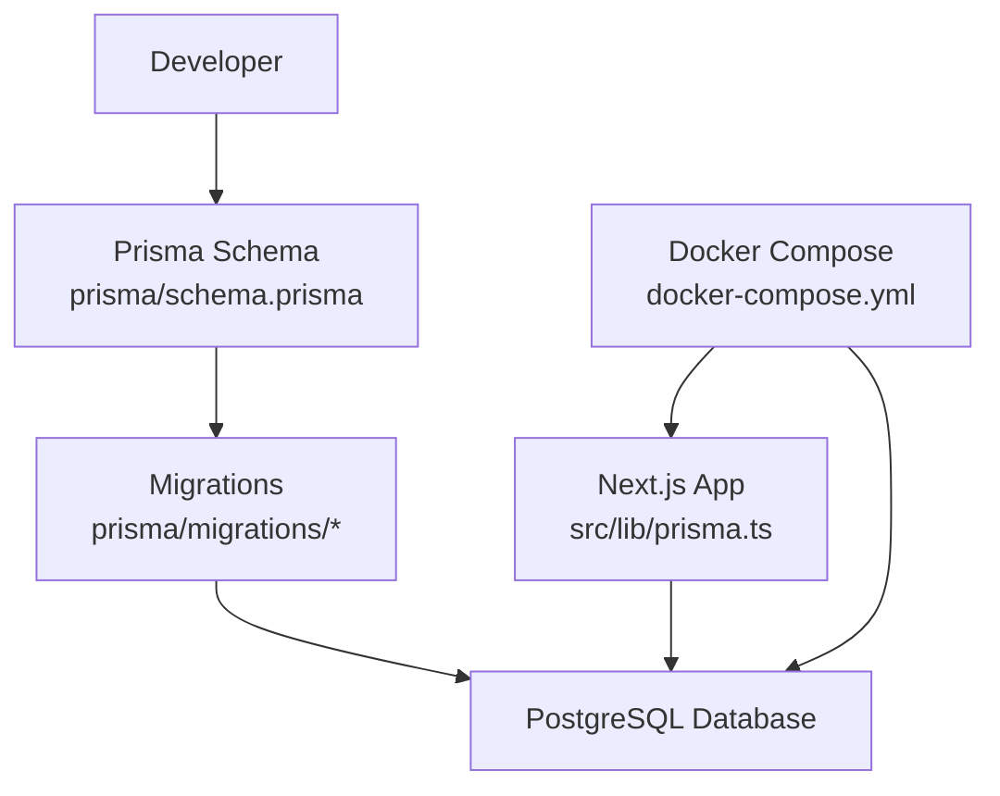
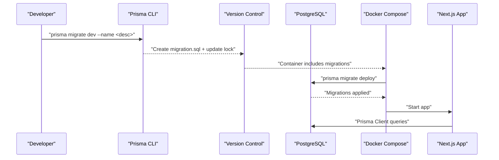
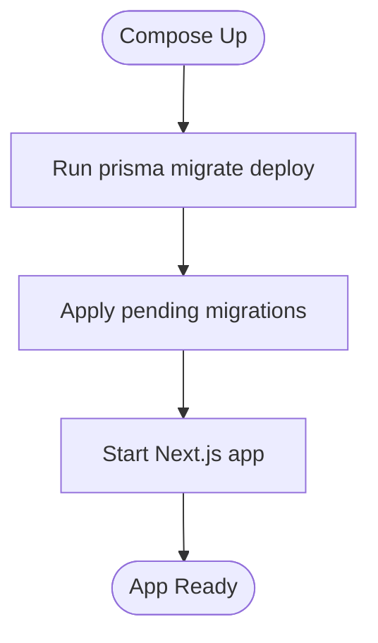
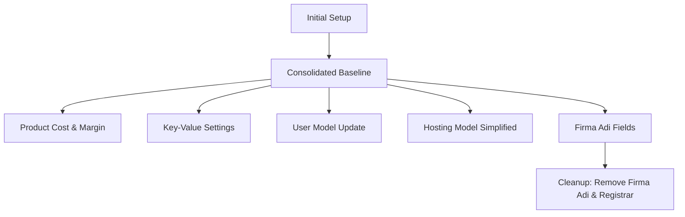
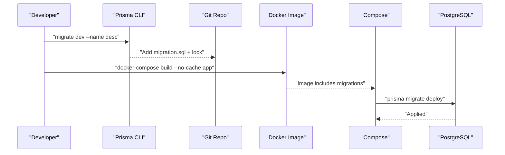
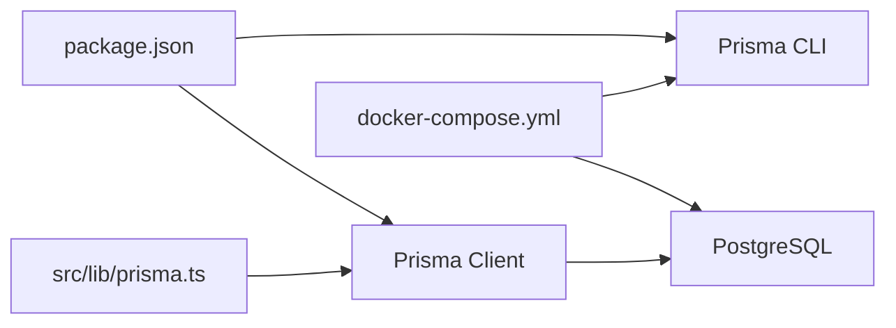

# Migration Management

<cite>
**Referenced Files in This Document**
- [schema.prisma](file://prisma/schema.prisma)
- [migration_lock.toml](file://prisma/migrations/migration_lock.toml)
- [20251017055625_init/migration.sql](file://prisma/migrations/20251017055625_init/migration.sql)
- [20260215091826_init/migration.sql](file://prisma/migrations/20260215091826_init/migration.sql)
- [20260215094719_add_cost_price_profit_margin/migration.sql](file://prisma/migrations/20260215094719_add_cost_price_profit_margin/migration.sql)
- [20260215095355_add_key_value_settings/migration.sql](file://prisma/migrations/20260215095355_add_key_value_settings/migration.sql)
- [20260216123144_update_user_model/migration.sql](file://prisma/migrations/20260216123144_update_user_model/migration.sql)
- [20260206000001_simplify_hosting_model/migration.sql](file://prisma/migrations/20260206000001_simplify_hosting_model/migration.sql)
- [20260328164310_add_firma_adi_to_domain/migration.sql](file://prisma/migrations/20260328164310_add_firma_adi_to_domain/migration.sql)
- [20260328173759_add_firma_adi_to_customer/migration.sql](file://prisma/migrations/20260328173759_add_firma_adi_to_customer/migration.sql)
- [20260328175634_remove_firma_adi_registrar_from_domain/migration.sql](file://prisma/migrations/20260328175634_remove_firma_adi_registrar_from_domain/migration.sql)
- [docker-compose.yml](file://docker-compose.yml)
- [docker-compose.dev.yml](file://docker-compose.dev.yml)
- [package.json](file://package.json)
- [prisma.ts](file://src/lib/prisma.ts)
- [VERIFICATION_SUMMARY.md](file://VERIFICATION_SUMMARY.md)
- [ENVIRONMENT_VERIFICATION_REPORT.md](file://ENVIRONMENT_VERIFICATION_REPORT.md)
</cite>

## Table of Contents
1. [Introduction](#introduction)
2. [Project Structure](#project-structure)
3. [Core Components](#core-components)
4. [Architecture Overview](#architecture-overview)
5. [Detailed Component Analysis](#detailed-component-analysis)
6. [Dependency Analysis](#dependency-analysis)
7. [Performance Considerations](#performance-considerations)
8. [Troubleshooting Guide](#troubleshooting-guide)
9. [Conclusion](#conclusion)
10. [Appendices](#appendices)

## Introduction
This document explains the database migration management strategy for Customer WebMahsul. It covers how Prisma schema changes are transformed into migrations, how migrations are versioned and deployed, and how to evolve the schema safely while maintaining backward compatibility. It also documents the deployment pipeline using Docker Compose and outlines best practices for creating, testing, rolling back, and deploying migrations in production.

## Project Structure
The migration system centers around Prisma’s schema-driven approach:
- The Prisma schema defines the canonical data model.
- Prisma generates SQL migrations under prisma/migrations/<timestamp>_name/.
- The Docker Compose setup applies migrations automatically at container startup via prisma migrate deploy.
- The application connects to the database through a Prisma Client initialized in the backend runtime.

**Diagram sources**
- [schema.prisma](file://prisma/schema.prisma)
- [20260215091826_init/migration.sql](file://prisma/migrations/20260215091826_init/migration.sql)
- [docker-compose.yml](file://docker-compose.yml)
- [prisma.ts](file://src/lib/prisma.ts)

**Section sources**
- [schema.prisma](file://prisma/schema.prisma)
- [docker-compose.yml](file://docker-compose.yml)
- [docker-compose.dev.yml](file://docker-compose.dev.yml)
- [prisma.ts](file://src/lib/prisma.ts)

## Core Components
- Prisma schema: Defines models, enums, relations, and attributes. It is the single source of truth for the database structure.
- Migration files: Generated SQL scripts representing incremental schema changes. Each migration is timestamped and immutable.
- Migration lock: Tracks the provider and ensures consistent migration application.
- Docker Compose: Automates migration deployment and app startup against the database.
- Prisma Client: Provides type-safe database access in the application.

Key responsibilities:
- Schema evolution: Add models, fields, enums, and relations in schema.prisma.
- Migration generation: Use prisma migrate dev to create SQL migrations.
- Version control: Commit migration files and migration_lock.toml.
- Deployment: Use prisma migrate deploy in Docker Compose to apply migrations.
- Backward compatibility: Maintain nullable fields, defaults, and soft-deletion patterns where appropriate.

**Section sources**
- [schema.prisma](file://prisma/schema.prisma)
- [migration_lock.toml](file://prisma/migrations/migration_lock.toml)
- [docker-compose.yml](file://docker-compose.yml)
- [prisma.ts](file://src/lib/prisma.ts)

## Architecture Overview
The migration lifecycle integrates development and production through Prisma and Docker Compose.

**Diagram sources**
- [20260215091826_init/migration.sql](file://prisma/migrations/20260215091826_init/migration.sql)
- [docker-compose.yml](file://docker-compose.yml)
- [prisma.ts](file://src/lib/prisma.ts)

## Detailed Component Analysis

### Prisma Schema and Model Evolution
The schema defines the canonical model. It includes:
- Core business entities: customers, subscriptions, domains, hosting, tasks, payments, proposals, invoices, etc.
- New accounting modules: products, product_groups, stock_movements, account_transactions, proposal_items, invoice_items.
- Enums for statuses, types, and transaction categories.
- Relations with foreign keys and cascading deletes where appropriate.

Guidelines for extending the schema:
- Add new models and relations in schema.prisma.
- Use optional fields and defaults to preserve backward compatibility.
- Define enums for controlled values and statuses.
- Keep referential integrity with relations and onDelete policies.

**Section sources**
- [schema.prisma](file://prisma/schema.prisma)

### Migration Generation and Version Control
- Create migrations locally using prisma migrate dev --name <description>.
- Commit migration files and migration_lock.toml to version control.
- Ensure Docker images include the latest migration files after schema changes.

Best practices:
- Keep migration names descriptive and scoped to a single logical change.
- Avoid destructive changes when possible; prefer additive changes (add columns, create tables).
- Use defaults and nullable fields to maintain compatibility during rollout.

**Section sources**
- [20260215091826_init/migration.sql](file://prisma/migrations/20260215091826_init/migration.sql)
- [migration_lock.toml](file://prisma/migrations/migration_lock.toml)
- [VERIFICATION_SUMMARY.md](file://VERIFICATION_SUMMARY.md)

### Deployment Pipeline with Docker Compose
Docker Compose automates migration application and app startup:
- The app service runs prisma migrate deploy before starting the server.
- DATABASE_URL is configured to point to the Postgres service.
- Volumes mount uploads and keep the database persistent.

**Diagram sources**
- [docker-compose.yml](file://docker-compose.yml)

**Section sources**
- [docker-compose.yml](file://docker-compose.yml)
- [docker-compose.dev.yml](file://docker-compose.dev.yml)

### Migration Files and Their Purposes
Below is a chronological summary of the migration history and their impact on the schema.

- Initial setup (legacy fragments):
  - [20251017055625_init/migration.sql](file://prisma/migrations/20251017055625_init/migration.sql): Establishes enums and initial tables (team_applications, teams, admins, settings) with basic relations.

- Consolidated baseline (latest):
  - [20260215091826_init/migration.sql](file://prisma/migrations/20260215091826_init/migration.sql): Adds core business entities (customers, subscriptions, domains, hosting, tasks, payments, notifications, job_schedules, files, webhooks, proposals, and the new accounting modules). Includes extensive enums and relations.

- Enhancements:
  - [20260215094719_add_cost_price_profit_margin/migration.sql](file://prisma/migrations/20260215094719_add_cost_price_profit_margin/migration.sql): Adds costPrice and profitMargin to products.
  - [20260215095355_add_key_value_settings/migration.sql](file://prisma/migrations/20260215095355_add_key_value_settings/migration.sql): Adds a key-value settings table (app_settings).
  - [20260216123144_update_user_model/migration.sql](file://prisma/migrations/20260216123144_update_user_model/migration.sql): Updates users with username, fullName, role, isActive; enforces uniqueness on username.
  - [20260206000001_simplify_hosting_model/migration.sql](file://prisma/migrations/20260206000001_simplify_hosting_model/migration.sql): Simplifies hosting by consolidating fields and removing legacy panel details.

- Data model refinements:
  - [20260328164310_add_firma_adi_to_domain/migration.sql](file://prisma/migrations/20260328164310_add_firma_adi_to_domain/migration.sql): Adds firmaAdi to domains.
  - [20260328173759_add_firma_adi_to_customer/migration.sql](file://prisma/migrations/20260328173759_add_firma_adi_to_customer/migration.sql): Adds firmaAdi to customers.
  - [20260328175634_remove_firma_adi_registrar_from_domain/migration.sql](file://prisma/migrations/20260328175634_remove_firma_adi_registrar_from_domain/migration.sql): Removes firmaAdi and registrar from domains.

**Diagram sources**
- [20251017055625_init/migration.sql](file://prisma/migrations/20251017055625_init/migration.sql)
- [20260215091826_init/migration.sql](file://prisma/migrations/20260215091826_init/migration.sql)
- [20260215094719_add_cost_price_profit_margin/migration.sql](file://prisma/migrations/20260215094719_add_cost_price_profit_margin/migration.sql)
- [20260215095355_add_key_value_settings/migration.sql](file://prisma/migrations/20260215095355_add_key_value_settings/migration.sql)
- [20260216123144_update_user_model/migration.sql](file://prisma/migrations/20260216123144_update_user_model/migration.sql)
- [20260206000001_simplify_hosting_model/migration.sql](file://prisma/migrations/20260206000001_simplify_hosting_model/migration.sql)
- [20260328164310_add_firma_adi_to_domain/migration.sql](file://prisma/migrations/20260328164310_add_firma_adi_to_domain/migration.sql)
- [20260328173759_add_firma_adi_to_customer/migration.sql](file://prisma/migrations/20260328173759_add_firma_adi_to_customer/migration.sql)
- [20260328175634_remove_firma_adi_registrar_from_domain/migration.sql](file://prisma/migrations/20260328175634_remove_firma_adi_registrar_from_domain/migration.sql)

**Section sources**
- [20251017055625_init/migration.sql](file://prisma/migrations/20251017055625_init/migration.sql)
- [20260215091826_init/migration.sql](file://prisma/migrations/20260215091826_init/migration.sql)
- [20260215094719_add_cost_price_profit_margin/migration.sql](file://prisma/migrations/20260215094719_add_cost_price_profit_margin/migration.sql)
- [20260215095355_add_key_value_settings/migration.sql](file://prisma/migrations/20260215095355_add_key_value_settings/migration.sql)
- [20260216123144_update_user_model/migration.sql](file://prisma/migrations/20260216123144_update_user_model/migration.sql)
- [20260206000001_simplify_hosting_model/migration.sql](file://prisma/migrations/20260206000001_simplify_hosting_model/migration.sql)
- [20260328164310_add_firma_adi_to_domain/migration.sql](file://prisma/migrations/20260328164310_add_firma_adi_to_domain/migration.sql)
- [20260328173759_add_firma_adi_to_customer/migration.sql](file://prisma/migrations/20260328173759_add_firma_adi_to_customer/migration.sql)
- [20260328175634_remove_firma_adi_registrar_from_domain/migration.sql](file://prisma/migrations/20260328175634_remove_firma_adi_registrar_from_domain/migration.sql)

### Migration Creation Workflow
Steps to create and integrate a new migration:
1. Modify schema.prisma to define the desired change (add model, field, relation, enum).
2. Generate the migration:
   - Run prisma migrate dev --name <description_of_change>
3. Review the generated migration.sql in prisma/migrations/<timestamp>_name/.
4. Commit migration files and migration_lock.toml to version control.
5. Rebuild the Docker image to include the new migration:
   - docker-compose build --no-cache app
6. Restart containers to apply migrations:
   - docker-compose up -d

**Diagram sources**
- [schema.prisma](file://prisma/schema.prisma)
- [docker-compose.yml](file://docker-compose.yml)

**Section sources**
- [schema.prisma](file://prisma/schema.prisma)
- [VERIFICATION_SUMMARY.md](file://VERIFICATION_SUMMARY.md)

### Testing Procedures
- Local verification:
  - Start the database container and run the app locally to ensure endpoints return expected responses.
  - Confirm that new tables and relations are accessible via Prisma Client.
- Docker verification:
  - Use docker-compose up -d to spin up the full stack.
  - Verify API endpoints and confirm migrations were applied.
- Regression checks:
  - Validate existing data remains intact after schema changes.
  - Ensure backward-compatible fields remain populated.

**Section sources**
- [VERIFICATION_SUMMARY.md](file://VERIFICATION_SUMMARY.md)
- [docker-compose.dev.yml](file://docker-compose.dev.yml)

### Rollback Strategies
Rollbacks depend on the nature of the change:
- Non-destructive changes (adds):
  - Revert by removing the migration file and re-running prisma migrate dev with a corrective migration.
- Destructive changes (drops/renames):
  - Use prisma migrate resolve --applied "<timestamp>" to mark a migration as applied without running it again.
  - Create a compensating migration to restore dropped structures or data.
- Emergency reset (development only):
  - Down the stack, reset migrations, then re-up:
    - docker-compose down
    - docker-compose up -d postgres
    - npx prisma migrate reset --force
    - docker-compose up -d app

**Section sources**
- [VERIFICATION_SUMMARY.md](file://VERIFICATION_SUMMARY.md)
- [ENVIRONMENT_VERIFICATION_REPORT.md](file://ENVIRONMENT_VERIFICATION_REPORT.md)

### Production Deployment Steps
- Ensure migrations are committed and the Docker image includes them.
- Deploy to production using Docker Compose:
  - docker-compose up -d
- Confirm migrations applied:
  - Check logs for prisma migrate deploy completion.
- Monitor application endpoints and database connectivity.

**Section sources**
- [docker-compose.yml](file://docker-compose.yml)
- [VERIFICATION_SUMMARY.md](file://VERIFICATION_SUMMARY.md)

### Extending the Schema Safely
Guidance for adding new entities and modifying relationships:
- Add models and relations in schema.prisma with appropriate relations and onDelete policies.
- Use optional fields and defaults to avoid breaking existing records.
- Define enums for controlled values to prevent invalid states.
- For existing entities, prefer additive changes (new columns, new tables) over destructive ones.
- Maintain referential integrity with foreign keys and indexes as needed.

**Section sources**
- [schema.prisma](file://prisma/schema.prisma)

## Dependency Analysis
The migration system relies on the following dependencies:
- Prisma Client and Prisma CLI versions are managed in package.json.
- Docker Compose orchestrates migration application and app startup.
- The Prisma Client initialization in the app connects to the database.

**Diagram sources**
- [package.json](file://package.json)
- [docker-compose.yml](file://docker-compose.yml)
- [prisma.ts](file://src/lib/prisma.ts)

**Section sources**
- [package.json](file://package.json)
- [docker-compose.yml](file://docker-compose.yml)
- [prisma.ts](file://src/lib/prisma.ts)

## Performance Considerations
- Keep migrations small and focused to minimize downtime.
- Use defaults and nullable fields to reduce costly schema alterations.
- Index frequently queried columns to improve query performance.
- Avoid long-running migrations on large datasets; consider background jobs for heavy transformations.

## Troubleshooting Guide
Common issues and resolutions:
- Docker API returns 404:
  - Rebuild the app image after schema changes and migrations:
    - docker-compose build --no-cache app
    - docker-compose up -d
- Migrations fail:
  - Reset and reapply in development:
    - docker-compose down
    - docker-compose up -d postgres
    - npx prisma migrate reset --force
    - docker-compose up -d app
- Migration files out of sync:
  - Ensure the Docker image includes the latest migration files and that prisma migrate deploy runs during container startup.

**Section sources**
- [VERIFICATION_SUMMARY.md](file://VERIFICATION_SUMMARY.md)
- [ENVIRONMENT_VERIFICATION_REPORT.md](file://ENVIRONMENT_VERIFICATION_REPORT.md)
- [docker-compose.yml](file://docker-compose.yml)

## Conclusion
Customer WebMahsul’s migration management follows a schema-first, version-controlled approach powered by Prisma and Docker Compose. By generating targeted migrations, committing them alongside the schema, and applying them automatically at startup, the system maintains consistency across environments. Following the outlined workflow, testing procedures, and rollback strategies ensures safe evolution of the database schema while preserving backward compatibility and minimizing operational risk.

## Appendices
- Prisma Client initialization in the application:
  - [prisma.ts](file://src/lib/prisma.ts)
- Migration lock file:
  - [migration_lock.toml](file://prisma/migrations/migration_lock.toml)