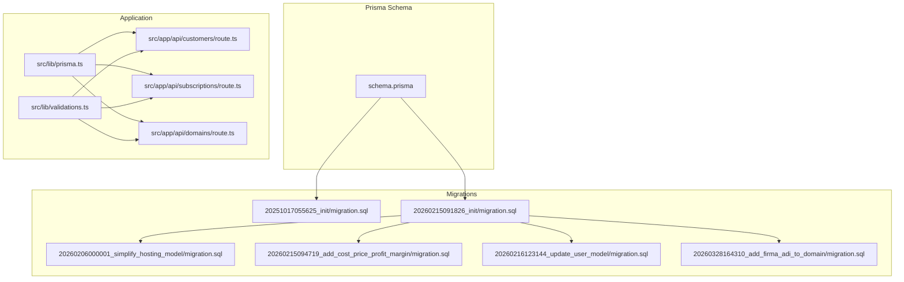
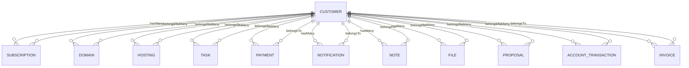
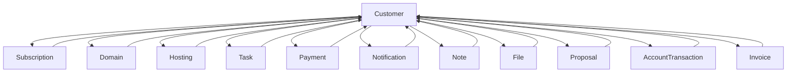

# Relationships and Constraints

<cite>
**Referenced Files in This Document**
- [schema.prisma](file://prisma/schema.prisma)
- [20260215091826_init/migration.sql](file://prisma/migrations/20260215091826_init/migration.sql)
- [20251017055625_init/migration.sql](file://prisma/migrations/20251017055625_init/migration.sql)
- [20260206000001_simplify_hosting_model/migration.sql](file://prisma/migrations/20260206000001_simplify_hosting_model/migration.sql)
- [20260215094719_add_cost_price_profit_margin/migration.sql](file://prisma/migrations/20260215094719_add_cost_price_profit_margin/migration.sql)
- [20260216123144_update_user_model/migration.sql](file://prisma/migrations/20260216123144_update_user_model/migration.sql)
- [20260328164310_add_firma_adi_to_domain/migration.sql](file://prisma/migrations/20260328164310_add_firma_adi_to_domain/migration.sql)
- [prisma.ts](file://src/lib/prisma.ts)
- [route.ts (customers)](file://src/app/api/customers/route.ts)
- [route.ts (subscriptions)](file://src/app/api/subscriptions/route.ts)
- [route.ts (domains)](file://src/app/api/domains/route.ts)
- [validations.ts](file://src/lib/validations.ts)
- [fix_sub_type.sql](file://scripts/fix_sub_type.sql)
</cite>

## Table of Contents
1. [Introduction](#introduction)
2. [Project Structure](#project-structure)
3. [Core Components](#core-components)
4. [Architecture Overview](#architecture-overview)
5. [Detailed Component Analysis](#detailed-component-analysis)
6. [Dependency Analysis](#dependency-analysis)
7. [Performance Considerations](#performance-considerations)
8. [Troubleshooting Guide](#troubleshooting-guide)
9. [Conclusion](#conclusion)

## Introduction
This document explains the database relationships and constraints in Customer WebMahsul with a focus on the customer-service relationship model. It documents foreign keys, cascade behaviors, unique constraints, and indexes. It also clarifies bidirectional relationships, optional versus required associations, referential integrity rules, constraint validation, and data consistency rules. Finally, it provides examples of complex queries and explains how cascade options impact data integrity.

## Project Structure
The schema and migrations define the core relational model. The Prisma client is initialized in the application and used by API routes to enforce referential integrity and query relationships.

**Diagram sources**
- [schema.prisma:1-756](file://prisma/schema.prisma#L1-L756)
- [20251017055625_init/migration.sql:1-75](file://prisma/migrations/20251017055625_init/migration.sql#L1-L75)
- [20260215091826_init/migration.sql:1-527](file://prisma/migrations/20260215091826_init/migration.sql#L1-L527)
- [20260206000001_simplify_hosting_model/migration.sql:1-14](file://prisma/migrations/20260206000001_simplify_hosting_model/migration.sql#L1-L14)
- [20260215094719_add_cost_price_profit_margin/migration.sql:1-4](file://prisma/migrations/20260215094719_add_cost_price_profit_margin/migration.sql#L1-L4)
- [20260216123144_update_user_model/migration.sql:1-19](file://prisma/migrations/20260216123144_update_user_model/migration.sql#L1-L19)
- [20260328164310_add_firma_adi_to_domain/migration.sql:1-3](file://prisma/migrations/20260328164310_add_firma_adi_to_domain/migration.sql#L1-L3)
- [prisma.ts:1-9](file://src/lib/prisma.ts#L1-L9)
- [route.ts (customers):1-105](file://src/app/api/customers/route.ts#L1-L105)
- [route.ts (subscriptions):1-134](file://src/app/api/subscriptions/route.ts#L1-L134)
- [route.ts (domains):1-65](file://src/app/api/domains/route.ts#L1-L65)
- [validations.ts:1-243](file://src/lib/validations.ts#L1-L243)

**Section sources**
- [schema.prisma:1-756](file://prisma/schema.prisma#L1-L756)
- [20260215091826_init/migration.sql:1-527](file://prisma/migrations/20260215091826_init/migration.sql#L1-L527)

## Core Components
This section focuses on the customer-service relationship model: subscriptions, domains, and hosting linked to customers. It also covers bidirectional relationships, optional vs required associations, and referential integrity rules.

- Customer is the central entity with multiple related collections:
  - Subscriptions: One-to-many, required on the child side (onDelete: Cascade).
  - Domains: One-to-many, required on the child side (onDelete: Cascade).
  - Hosting: One-to-many, required on the child side (onDelete: Cascade).
  - Tasks: One-to-many, required on the child side (onDelete: Cascade).
  - Payments: One-to-many, required on the child side (onDelete: Cascade).
  - Notifications: One-to-many, required on the child side (onDelete: Cascade).
  - Notes: One-to-many, required on the child side (onDelete: Cascade).
  - Files: One-to-many, optional on the child side (onDelete: SetNull).
  - Proposals: One-to-many, required on the child side (onDelete: Cascade).
  - Users: One-to-many, optional on the child side (onDelete: SetNull).
  - AccountTransactions: One-to-many, required on the child side (onDelete: Cascade).
  - Invoices: One-to-many, required on the child side (onDelete: Cascade).

- Bidirectional relationships:
  - Child models expose a relation field pointing to Customer (e.g., Subscription.customer).
  - Customer exposes relation fields to children (e.g., Customer.subscriptions).
  - These are implemented via foreign keys and Prisma relations.

- Optional vs required:
  - Required: Subscriptions, Domains, Hosting, Tasks, Payments, Notifications, Notes, Proposals, AccountTransactions, Invoices.
  - Optional: Files (can belong to customer, subscription, domain, hosting, task), Users (can belong to a customer), and some relation fields like proposalType on Subscription.

- Referential integrity:
  - Foreign keys are defined in migrations and enforced by PostgreSQL.
  - Cascade delete ensures that deleting a Customer removes all related records in dependent tables.
  - SetNull cascades set foreign keys to NULL when referenced rows are deleted (e.g., Files).

**Section sources**
- [schema.prisma:94-134](file://prisma/schema.prisma#L94-L134)
- [schema.prisma:206-226](file://prisma/schema.prisma#L206-L226)
- [schema.prisma:228-242](file://prisma/schema.prisma#L228-L242)
- [schema.prisma:244-256](file://prisma/schema.prisma#L244-L256)
- [20260215091826_init/migration.sql:429-478](file://prisma/migrations/20260215091826_init/migration.sql#L429-L478)
- [20260215091826_init/migration.sql:479-526](file://prisma/migrations/20260215091826_init/migration.sql#L479-L526)

## Architecture Overview
The customer-service relationship model is centered around Customer and its related entities. The following diagram maps the core relations and their cascade behaviors.

**Diagram sources**
- [schema.prisma:94-134](file://prisma/schema.prisma#L94-L134)
- [schema.prisma:206-226](file://prisma/schema.prisma#L206-L226)
- [schema.prisma:228-242](file://prisma/schema.prisma#L228-L242)
- [schema.prisma:244-256](file://prisma/schema.prisma#L244-L256)
- [20260215091826_init/migration.sql:429-478](file://prisma/migrations/20260215091826_init/migration.sql#L429-L478)

## Detailed Component Analysis

### Customer-Centric Model
- Cardinality:
  - One Customer to many Subscriptions, Domains, Hosting, Tasks, Payments, Notifications, Notes, Files, Proposals, AccountTransactions, Invoices.
- Cascade behavior:
  - Deleting a Customer deletes all related records in the above entities (Cascade).
- Uniqueness and indexes:
  - Unique constraints on domains.name, proposals.number, product_groups.name, products.code, invoices.number, users.email.
- Optional relationships:
  - Files can optionally belong to customer, subscription, domain, hosting, or task (SetNull cascade).
  - Users can optionally belong to a customer (SetNull cascade).
  - Some relation fields like proposalType on Subscription are optional.

**Section sources**
- [schema.prisma:228-242](file://prisma/schema.prisma#L228-L242)
- [schema.prisma:244-256](file://prisma/schema.prisma#L244-L256)
- [schema.prisma:206-226](file://prisma/schema.prisma#L206-L226)
- [20260215091826_init/migration.sql:411-427](file://prisma/migrations/20260215091826_init/migration.sql#L411-L427)
- [20260215091826_init/migration.sql:463-475](file://prisma/migrations/20260215091826_init/migration.sql#L463-L475)
- [20260215091826_init/migration.sql:523](file://prisma/migrations/20260215091826_init/migration.sql#L523)

### Subscriptions
- Purpose: Track customer service subscriptions, including multi-type support and billing cycles.
- Key constraints:
  - customer: required (onDelete: Cascade).
  - type: array of SubscriptionType (multi-type supported).
  - period: BillingPeriod (MONTHLY or YEARLY).
  - status: SubscriptionStatus (ACTIVE, EXPIRED, CANCELED).
  - price: stored as string; validated by API schema.
- Cascade behavior:
  - Delete customer → delete subscriptions (Cascade).
- Optional fields:
  - proposalType, installmentCount.

**Section sources**
- [schema.prisma:206-226](file://prisma/schema.prisma#L206-L226)
- [20260215091826_init/migration.sql:82-99](file://prisma/migrations/20260215091826_init/migration.sql#L82-L99)
- [route.ts (subscriptions):1-134](file://src/app/api/subscriptions/route.ts#L1-L134)
- [validations.ts:101-138](file://src/lib/validations.ts#L101-L138)

### Domains
- Purpose: Manage customer-owned domains with renewal and auto-renew settings.
- Key constraints:
  - customer: required (onDelete: Cascade).
  - name: unique.
  - registerDate, renewDate: required dates.
- Cascade behavior:
  - Delete customer → delete domains (Cascade).

**Section sources**
- [schema.prisma:228-242](file://prisma/schema.prisma#L228-L242)
- [20260215091826_init/migration.sql:102-115](file://prisma/migrations/20260215091826_init/migration.sql#L102-L115)
- [route.ts (domains):1-65](file://src/app/api/domains/route.ts#L1-L65)
- [validations.ts:140-148](file://src/lib/validations.ts#L140-L148)

### Hosting
- Purpose: Track hosting accounts with end dates and notes.
- Key constraints:
  - customer: required (onDelete: Cascade).
  - name: required string.
  - endDate: required date.
- Cascade behavior:
  - Delete customer → delete hosting (Cascade).
- Historical change:
  - Simplified hosting model by dropping legacy columns and adding a simple name field.

**Section sources**
- [schema.prisma:244-256](file://prisma/schema.prisma#L244-L256)
- [20260215091826_init/migration.sql:118-133](file://prisma/migrations/20260215091826_init/migration.sql#L118-L133)
- [20260206000001_simplify_hosting_model/migration.sql:1-14](file://prisma/migrations/20260206000001_simplify_hosting_model/migration.sql#L1-L14)

### Tasks, Payments, Notifications, Notes, Files
- Tasks: customer required (onDelete: Cascade), optional assigneeId (onDelete: SetNull).
- Payments: customer required (onDelete: Cascade), optional invoiceId and subscriptionId (onDelete: SetNull).
- Notifications: customer required (onDelete: Cascade).
- Notes: customer required (onDelete: Cascade).
- Files: optional links to customer, subscription, domain, hosting, task (onDelete: SetNull).

**Section sources**
- [schema.prisma:264-279](file://prisma/schema.prisma#L264-L279)
- [schema.prisma:305-343](file://prisma/schema.prisma#L305-L343)
- [schema.prisma:358-370](file://prisma/schema.prisma#L358-L370)
- [schema.prisma:746-755](file://prisma/schema.prisma#L746-L755)
- [schema.prisma:388-407](file://prisma/schema.prisma#L388-L407)
- [20260215091826_init/migration.sql:439, 451, 460, 477-478](file://prisma/migrations/20260215091826_init/migration.sql#L439, 451, 460, 477-L478)

### Users and Account Transactions
- Users: optional customerId (onDelete: SetNull).
- AccountTransactions: customer required (onDelete: Cascade), optional links to proposal, invoice, payment (onDelete: SetNull).

**Section sources**
- [schema.prisma:725-743](file://prisma/schema.prisma#L725-L743)
- [schema.prisma:510-539](file://prisma/schema.prisma#L510-L539)
- [20260215091826_init/migration.sql:523, 481-490](file://prisma/migrations/20260215091826_init/migration.sql#L523, 481-L490)

### Proposals, Invoices, Products, Stock Movements
- Proposals: customer required (onDelete: Cascade), unique number.
- Invoices: customer required (onDelete: Cascade), unique number, optional proposalId (onDelete: SetNull).
- Products: optional groupId (onDelete: SetNull), optional costPrice and profitMargin.
- StockMovements: productId required (onDelete: Cascade), optional proposalId and invoiceId (onDelete: SetNull).

**Section sources**
- [schema.prisma:458-503](file://prisma/schema.prisma#L458-L503)
- [schema.prisma:646-693](file://prisma/schema.prisma#L646-L693)
- [schema.prisma:565-599](file://prisma/schema.prisma#L565-L599)
- [schema.prisma:602-621](file://prisma/schema.prisma#L602-L621)
- [20260215091826_init/migration.sql:414, 424, 493, 496](file://prisma/migrations/20260215091826_init/migration.sql#L414, 424, 493-L496)

### Constraint Validation and Data Consistency
- Prisma schema enforces:
  - Required fields, unique constraints, and relation fields.
  - Enum types for statuses and periods.
- API validation (Zod):
  - Ensures non-empty customerId, valid date formats, positive amounts, and proper refinements for proposalType.
- Migration-level uniqueness:
  - Unique indexes on domains.name, proposals.number, product_groups.name, products.code, invoices.number, users.email.

**Section sources**
- [schema.prisma:184-204](file://prisma/schema.prisma#L184-L204)
- [schema.prisma:206-226](file://prisma/schema.prisma#L206-L226)
- [schema.prisma:228-242](file://prisma/schema.prisma#L228-L242)
- [schema.prisma:244-256](file://prisma/schema.prisma#L244-L256)
- [validations.ts:101-138](file://src/lib/validations.ts#L101-L138)
- [validations.ts:140-148](file://src/lib/validations.ts#L140-L148)
- [20260215091826_init/migration.sql:411-427](file://prisma/migrations/20260215091826_init/migration.sql#L411-L427)

### Relationship Cardinality
- One-to-many from Customer to Subscriptions, Domains, Hosting, Tasks, Payments, Notifications, Notes, Files, Proposals, AccountTransactions, Invoices.
- Many-to-one from each child to Customer.
- Optional relationships:
  - Files, Users, and some relation fields are optional.

**Section sources**
- [schema.prisma:94-134](file://prisma/schema.prisma#L94-L134)
- [schema.prisma:206-256](file://prisma/schema.prisma#L206-L256)

### Examples of Complex Queries
Below are conceptual examples of complex queries that involve multiple relationships. Replace placeholders with actual IDs and filters as needed.

- Find a customer with all related subscriptions, domains, hosting, tasks, payments, notifications, notes, files, proposals, account transactions, and invoices:
  - Use include to fetch all relations.
  - Filter by customerId and optional name search across subscriptions and domains.
  - Paginate results and count totals.

- List subscriptions for a given customer with customer name included:
  - Use include on customer relation to fetch fullName.

- List domains for a given customer with optional search:
  - Filter by customerId and name contains.

- Retrieve account transactions for a customer with linked proposal/invoice/payment details:
  - Use include to fetch related proposal, invoice, and payment records.

- Get invoices with items and linked customer/proposal:
  - Use include to fetch items, customer, and proposal.

- Stock movements for a product with linked proposal and invoice:
  - Use include to fetch proposal and invoice.

- Users optionally linked to a customer:
  - Use include on customer relation to fetch user details.

These examples illustrate how Prisma relations and foreign keys enable efficient joins and data retrieval across the customer-service model.

**Section sources**
- [route.ts (customers):32-57](file://src/app/api/customers/route.ts#L32-L57)
- [route.ts (subscriptions):24-43](file://src/app/api/subscriptions/route.ts#L24-L43)
- [route.ts (domains):23-38](file://src/app/api/domains/route.ts#L23-L38)
- [schema.prisma:510-539](file://prisma/schema.prisma#L510-L539)
- [schema.prisma:646-693](file://prisma/schema.prisma#L646-L693)
- [schema.prisma:602-621](file://prisma/schema.prisma#L602-L621)
- [schema.prisma:725-743](file://prisma/schema.prisma#L725-L743)

### Impact of Cascade Options on Data Integrity
- Cascade (onDelete: Cascade):
  - Ensures referential integrity by automatically removing child records when a parent is deleted.
  - Prevents orphaned records in subscriptions, domains, hosting, tasks, payments, notifications, notes, proposals, account transactions, and invoices.
- SetNull (onDelete: SetNull):
  - Allows deletion of parent while setting foreign keys to NULL in child records.
  - Useful for optional relationships (Files, Users) to preserve child records without a parent.
- Restrict/Restrict-like behavior:
  - Some relations explicitly restrict deletion when children exist (e.g., task_comments user relation).
- Multi-type subscriptions:
  - The subscription type is modeled as an array of enums. A script updates the type column to match the new enum array type safely.

**Section sources**
- [schema.prisma:208, 230, 246, 266, 307, 360, 394-403, 460, 513, 573, 605, 632, 654, 680, 736](file://prisma/schema.prisma#L208, 230, 246, 266, 307, 360, 394-L403, 460, 513, 573, 605, 632, 654, 680, 736)
- [20260215091826_init/migration.sql:439, 451, 460, 463-475, 477-478, 481-490, 493, 496, 505, 511, 517, 523, 525](file://prisma/migrations/20260215091826_init/migration.sql#L439, 451, 460, 463-L475, 477-L478, 481-L490, 493, 496, 505, 511, 517, 523, 525)
- [fix_sub_type.sql:1-13](file://scripts/fix_sub_type.sql#L1-L13)

## Dependency Analysis
The following diagram shows dependencies among core models and their foreign keys.

**Diagram sources**
- [schema.prisma:94-134](file://prisma/schema.prisma#L94-L134)
- [schema.prisma:206-256](file://prisma/schema.prisma#L206-L256)
- [schema.prisma:305-343](file://prisma/schema.prisma#L305-L343)
- [schema.prisma:358-370](file://prisma/schema.prisma#L358-L370)
- [schema.prisma:388-407](file://prisma/schema.prisma#L388-L407)
- [schema.prisma:458-503](file://prisma/schema.prisma#L458-L503)
- [schema.prisma:510-539](file://prisma/schema.prisma#L510-L539)
- [schema.prisma:646-693](file://prisma/schema.prisma#L646-L693)

**Section sources**
- [schema.prisma:94-134](file://prisma/schema.prisma#L94-L134)
- [20260215091826_init/migration.sql:429-526](file://prisma/migrations/20260215091826_init/migration.sql#L429-L526)

## Performance Considerations
- Indexes:
  - Unique indexes on domains.name, proposals.number, product_groups.name, products.code, invoices.number, users.email reduce lookup costs and enforce uniqueness efficiently.
- Pagination:
  - API routes use skip/take with reasonable limits to avoid heavy scans.
- Selective includes:
  - Prefer selective includes to minimize payload size and improve response times.
- Cascade behavior:
  - Cascade deletes can be expensive on large datasets; batch operations and monitoring are recommended.

[No sources needed since this section provides general guidance]

## Troubleshooting Guide
- Unique constraint violations:
  - Attempting to insert duplicate domains.name, proposals.number, product_groups.name, products.code, invoices.number, or users.email will fail. Ensure uniqueness before inserts.
- Foreign key violations:
  - Inserting child records with invalid customerId or missing required relations will fail. Validate relations before creation.
- Cascade deletion side effects:
  - Deleting a Customer deletes all related records. Backups or soft-delete strategies may be needed depending on business requirements.
- Multi-type subscription updates:
  - If encountering type conversion errors, apply the migration script to update the subscription type column safely.

**Section sources**
- [20260215091826_init/migration.sql:411-427](file://prisma/migrations/20260215091826_init/migration.sql#L411-L427)
- [fix_sub_type.sql:1-13](file://scripts/fix_sub_type.sql#L1-L13)

## Conclusion
Customer WebMahsul’s database model centers on Customer with robust one-to-many relationships to Subscriptions, Domains, Hosting, Tasks, Payments, Notifications, Notes, Files, Proposals, AccountTransactions, and Invoices. Foreign keys, unique constraints, and indexes ensure referential integrity and data consistency. Cascade behaviors maintain data integrity by automatically removing dependent records when a parent is deleted, while SetNull preserves optional relationships. API routes and validation schemas complement database constraints to enforce business rules and provide predictable query patterns across the customer-service model.