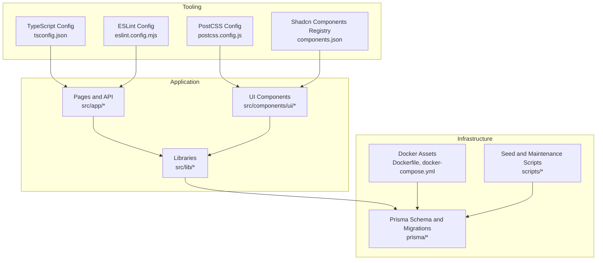
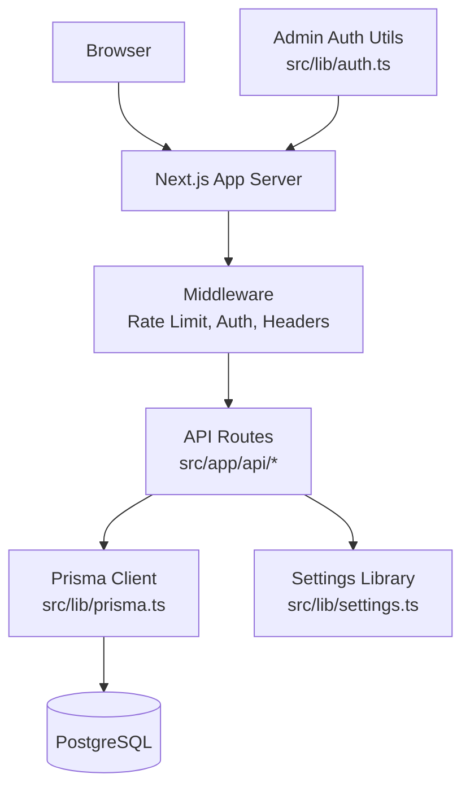
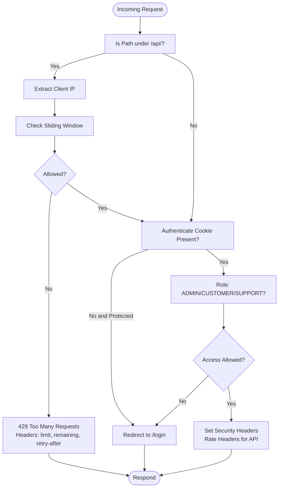
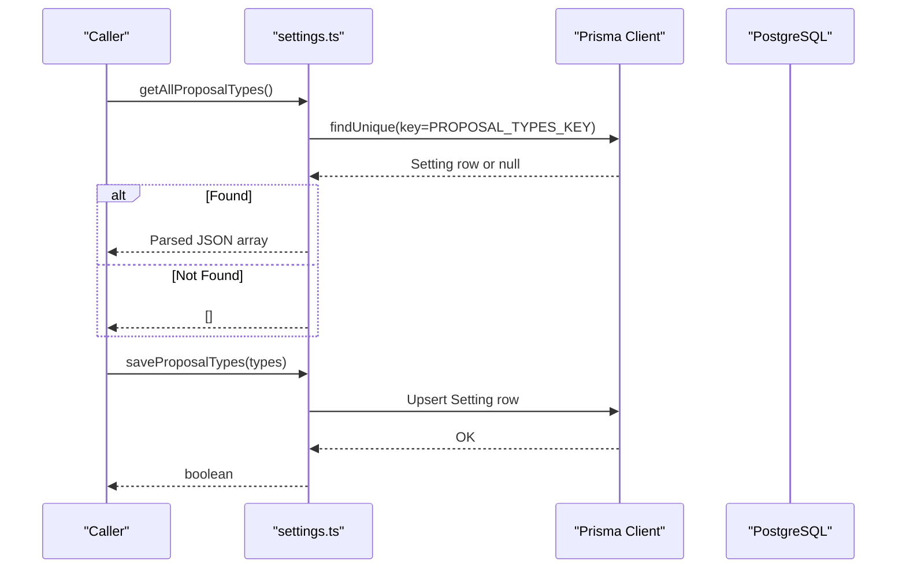
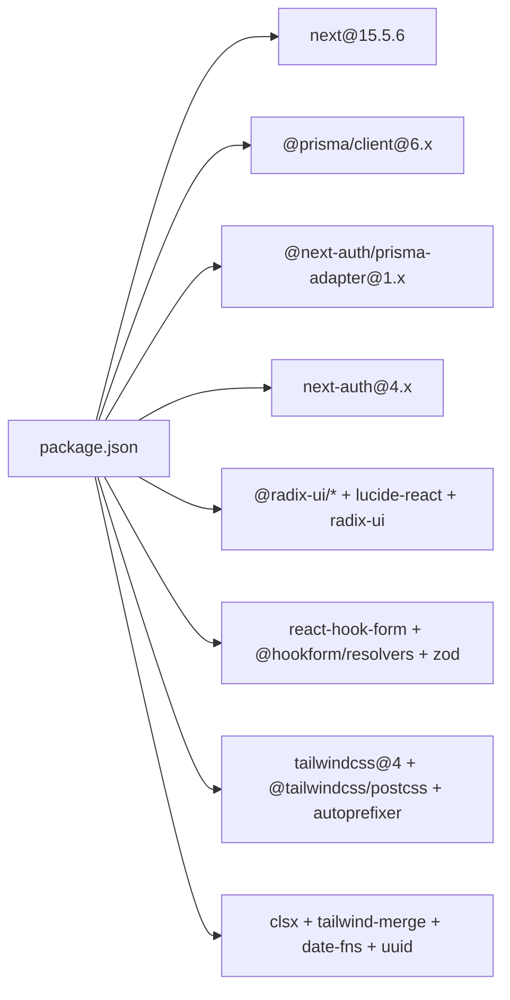

# Development Guide

<cite>
**Referenced Files in This Document**
- [package.json](file://package.json)
- [tsconfig.json](file://tsconfig.json)
- [eslint.config.mjs](file://eslint.config.mjs)
- [next.config.ts](file://next.config.ts)
- [Dockerfile](file://Dockerfile)
- [docker-compose.yml](file://docker-compose.yml)
- [docker-compose.dev.yml](file://docker-compose.dev.yml)
- [postcss.config.js](file://postcss.config.js)
- [components.json](file://components.json)
- [src/middleware.ts](file://src/middleware.ts)
- [src/lib/auth.ts](file://src/lib/auth.ts)
- [src/lib/prisma.ts](file://src/lib/prisma.ts)
- [src/lib/settings.ts](file://src/lib/settings.ts)
- [src/lib/utils.ts](file://src/lib/utils.ts)
- [src/lib/types.ts](file://src/lib/types.ts)
- [prisma/schema.prisma](file://prisma/schema.prisma)
- [scripts/docker-setup.sh](file://scripts/docker-setup.sh)
- [scripts/seed.js](file://scripts/seed.js)
- [scripts/seed-settings.js](file://scripts/seed-settings.js)
- [scripts/create-user.mjs](file://scripts/create-user.mjs)
- [scripts/clean-settings.js](file://scripts/clean-settings.js)
- [README.md](file://README.md)
</cite>

## Table of Contents
1. [Introduction](#introduction)
2. [Project Structure](#project-structure)
3. [Core Components](#core-components)
4. [Architecture Overview](#architecture-overview)
5. [Detailed Component Analysis](#detailed-component-analysis)
6. [Dependency Analysis](#dependency-analysis)
7. [Performance Considerations](#performance-considerations)
8. [Troubleshooting Guide](#troubleshooting-guide)
9. [Conclusion](#conclusion)
10. [Appendices](#appendices)

## Introduction
This development guide explains how to build, test, debug, and deploy Customer WebMahsul. It covers the TypeScript configuration, ESLint rules, code formatting standards, local development setup, Docker-based environments, build and deployment processes, and troubleshooting tips. It also documents the middleware-driven security model, admin authentication utilities, Prisma client initialization, and dynamic settings persistence.

## Project Structure
The project is a Next.js 15 application using TypeScript, Radix UI primitives, Tailwind CSS v4, and Prisma ORM. Key areas:
- Application pages and API routes under src/app
- Shared UI components under src/components
- Libraries for auth, database, settings, types, and utilities under src/lib
- Prisma schema and migrations under prisma
- Docker assets and compose files for local and CI environments
- Scripts for seeding and maintenance under scripts

**Diagram sources**
- [tsconfig.json:1-28](file://tsconfig.json#L1-L28)
- [eslint.config.mjs:1-26](file://eslint.config.mjs#L1-L26)
- [postcss.config.js:1-6](file://postcss.config.js#L1-L6)
- [components.json:1-23](file://components.json#L1-L23)
- [prisma/schema.prisma](file://prisma/schema.prisma)

**Section sources**
- [README.md:1-37](file://README.md#L1-L37)
- [package.json:1-64](file://package.json#L1-L64)

## Core Components
- TypeScript configuration enforces strict checks, bundler module resolution, and Next.js plugin integration.
- ESLint extends Next.js recommended rules for web vitals and TypeScript support with project-wide ignores.
- PostCSS and Tailwind v4 enable utility-first styling with shadcn/ui integration.
- Middleware enforces rate limiting, redirects, and security headers.
- Prisma client is initialized globally to avoid multiple instances.
- Settings library persists and retrieves JSON settings via Prisma.
- Utilities consolidate Tailwind class merging and shared types.

**Section sources**
- [tsconfig.json:1-28](file://tsconfig.json#L1-L28)
- [eslint.config.mjs:1-26](file://eslint.config.mjs#L1-L26)
- [postcss.config.js:1-6](file://postcss.config.js#L1-L6)
- [components.json:1-23](file://components.json#L1-L23)
- [src/middleware.ts:1-101](file://src/middleware.ts#L1-L101)
- [src/lib/prisma.ts:1-9](file://src/lib/prisma.ts#L1-L9)
- [src/lib/settings.ts:1-154](file://src/lib/settings.ts#L1-L154)
- [src/lib/utils.ts:1-7](file://src/lib/utils.ts#L1-L7)
- [src/lib/types.ts:1-28](file://src/lib/types.ts#L1-L28)

## Architecture Overview
The runtime architecture integrates a Next.js frontend with a PostgreSQL backend via Prisma. Docker Compose provisions the database and runs the Next.js server with health checks. Middleware handles authentication redirects, role-based access, rate limiting, and security headers.

**Diagram sources**
- [src/middleware.ts:1-101](file://src/middleware.ts#L1-L101)
- [src/lib/prisma.ts:1-9](file://src/lib/prisma.ts#L1-L9)
- [src/lib/settings.ts:1-154](file://src/lib/settings.ts#L1-L154)
- [src/lib/auth.ts:1-35](file://src/lib/auth.ts#L1-L35)

## Detailed Component Analysis

### TypeScript Configuration
- Strict mode enabled with no emit to rely on Next’s type checking.
- Bundler module resolution and JSX preserve for Next App Router.
- Path aliases mapped via tsconfig for clean imports.
- Incremental builds and isolated modules improve DX and CI reliability.

**Section sources**
- [tsconfig.json:1-28](file://tsconfig.json#L1-L28)

### ESLint and Formatting Standards
- Flat config extends Next.js core-web-vitals and TypeScript presets.
- Ignores node_modules, build artifacts, and generated types.
- Run lint via the project script to enforce standards across the codebase.

**Section sources**
- [eslint.config.mjs:1-26](file://eslint.config.mjs#L1-L26)
- [package.json:5-11](file://package.json#L5-L11)

### PostCSS and Tailwind Integration
- PostCSS loads Tailwind and Autoprefixer plugins.
- Tailwind v4 configured with shadcn/ui style and CSS variables.
- Aliases in components.json streamline imports for UI and utils.

**Section sources**
- [postcss.config.js:1-6](file://postcss.config.js#L1-L6)
- [components.json:1-23](file://components.json#L1-L23)

### Middleware Security and Routing
Key behaviors:
- Rate limiting for API routes with sliding window tracking.
- Authentication-aware redirects for login, admin, and portal routes.
- Role-based access control enforcing admin vs customer contexts.
- Security headers for non-API routes; rate headers for API routes.
- Matcher excludes static assets and images.

**Diagram sources**
- [src/middleware.ts:9-94](file://src/middleware.ts#L9-L94)

**Section sources**
- [src/middleware.ts:1-101](file://src/middleware.ts#L1-L101)

### Prisma Client Initialization
- Global singleton pattern prevents multiple client instances.
- Development guard stores client on globalThis to avoid hot reload duplication.

**Section sources**
- [src/lib/prisma.ts:1-9](file://src/lib/prisma.ts#L1-L9)

### Settings Persistence Library
- Stores proposal types as JSON under a dedicated key.
- Provides CRUD operations with fallback defaults.
- Uses Prisma ORM and includes logging for observability.

**Diagram sources**
- [src/lib/settings.ts:12-95](file://src/lib/settings.ts#L12-L95)
- [src/lib/prisma.ts:1-9](file://src/lib/prisma.ts#L1-L9)

**Section sources**
- [src/lib/settings.ts:1-154](file://src/lib/settings.ts#L1-L154)

### Admin Authentication Utilities
- Simple in-memory credential validation for admin panel.
- Session helpers manage admin_authenticated flag in browser storage.

**Section sources**
- [src/lib/auth.ts:1-35](file://src/lib/auth.ts#L1-L35)

### Shared Utilities and Types
- cn merges Tailwind classes safely.
- Shared types define paginated responses and customer filters.

**Section sources**
- [src/lib/utils.ts:1-7](file://src/lib/utils.ts#L1-L7)
- [src/lib/types.ts:1-28](file://src/lib/types.ts#L1-L28)

## Dependency Analysis
- Next.js 15 with Turbopack dev and standalone output for optimized containers.
- Prisma client and adapter for database access.
- Radix UI primitives and shadcn/ui components.
- React Hook Form with Zod resolvers for forms.
- Tailwind CSS v4 and PostCSS toolchain.
- TypeScript 5.x for type safety.

**Diagram sources**
- [package.json:12-49](file://package.json#L12-L49)

**Section sources**
- [package.json:1-64](file://package.json#L1-L64)

## Performance Considerations
- Use standalone output for smaller Docker images and faster cold starts.
- Leverage incremental TypeScript builds and isolated modules.
- Minimize unnecessary re-renders by memoizing props and avoiding excessive state churn.
- Prefer server-side rendering and static generation where appropriate.
- Monitor API rate-limiting thresholds and adjust windows/rate accordingly.
- Keep Tailwind purging effective to reduce CSS bundle size.

## Troubleshooting Guide
Common development issues and resolutions:
- Lint failures: Run the lint script to auto-fix or address reported issues.
- Type errors during build: Review Next config’s ignoreBuildErrors setting and resolve underlying type issues.
- Database connection errors: Verify DATABASE_URL and container connectivity in Docker Compose.
- Health check failures: Inspect healthcheck script and container logs.
- Middleware redirect loops: Confirm cookie presence and role values; ensure matcher exclusions are correct.
- Prisma client warnings: Ensure global singleton initialization and migrations are applied.

**Section sources**
- [package.json:5-11](file://package.json#L5-L11)
- [next.config.ts:3-11](file://next.config.ts#L3-L11)
- [docker-compose.yml:25-41](file://docker-compose.yml#L25-L41)
- [src/middleware.ts:96-101](file://src/middleware.ts#L96-L101)
- [src/lib/prisma.ts:1-9](file://src/lib/prisma.ts#L1-L9)

## Conclusion
This guide outlined the development workflow, configuration, and operational practices for Customer WebMahsul. By following the TypeScript and ESLint standards, leveraging Docker for local and CI environments, and adhering to the middleware and Prisma patterns, contributors can maintain a secure, scalable, and efficient application.

## Appendices

### Local Development Setup
- Install dependencies and start the dev server using your preferred package manager.
- For Docker-based development, use the development compose file to spin up the database and app with hot reload.
- Apply Prisma migrations and seed data using provided scripts.

**Section sources**
- [README.md:5-15](file://README.md#L5-L15)
- [docker-compose.dev.yml:1-47](file://docker-compose.dev.yml#L1-L47)
- [scripts/docker-setup.sh](file://scripts/docker-setup.sh)
- [scripts/seed.js](file://scripts/seed.js)
- [scripts/seed-settings.js](file://scripts/seed-settings.js)

### Build and Deployment
- Build the app with standalone output and generate Prisma client.
- Production Dockerfile sets environment variables, creates non-root user, exposes port, and defines health checks.
- Docker Compose orchestrates database and app lifecycle, applying migrations before starting the server.

**Section sources**
- [Dockerfile:1-73](file://Dockerfile#L1-L73)
- [docker-compose.yml:1-49](file://docker-compose.yml#L1-L49)

### Environment Configuration
- DATABASE_URL points to the PostgreSQL service.
- NEXTAUTH_SECRET and NEXTAUTH_URL configure session security and origin.
- Port exposure and hostname are set for containerized operation.

**Section sources**
- [docker-compose.yml:25-28](file://docker-compose.yml#L25-L28)
- [Dockerfile:31-67](file://Dockerfile#L31-L67)

### Testing Strategies
- Use unit tests for pure functions and libraries (e.g., cn, settings helpers).
- Mock Prisma client and cookies for middleware tests.
- Snapshot or integration tests for API routes covering success and error paths.
- End-to-end tests for critical flows (login, role redirects, rate limiting).

[No sources needed since this section provides general guidance]

### Contribution Guidelines
- Branch management: Feature branches from develop; merge via pull requests.
- Code review: Require at least one reviewer; ensure passing CI checks.
- Commit hygiene: Keep commits small and descriptive; reference issues.
- Code standards: Enforce ESLint and TypeScript rules; keep Tailwind usage consistent.

[No sources needed since this section provides general guidance]

### Debugging Techniques
- Enable verbose logging in settings library to trace JSON retrieval/saving.
- Inspect middleware headers and redirects using browser dev tools.
- Use Docker logs to diagnose startup and migration issues.
- Profile builds with Next.js profiler and analyze bundle sizes.

[No sources needed since this section provides general guidance]

### Performance Profiling
- Analyze bundle composition with Next.js stats and Treemap.
- Optimize images and fonts via Next.js automatic optimization.
- Reduce payload sizes by filtering API responses and enabling compression.

[No sources needed since this section provides general guidance]