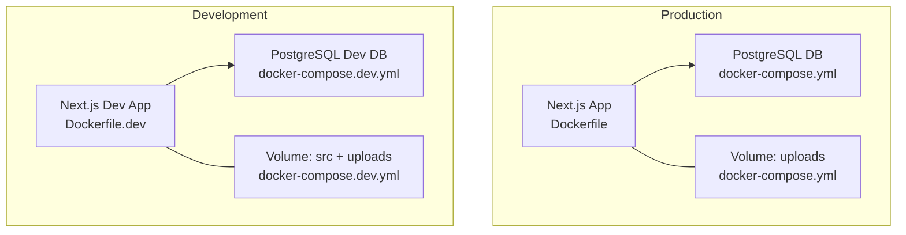
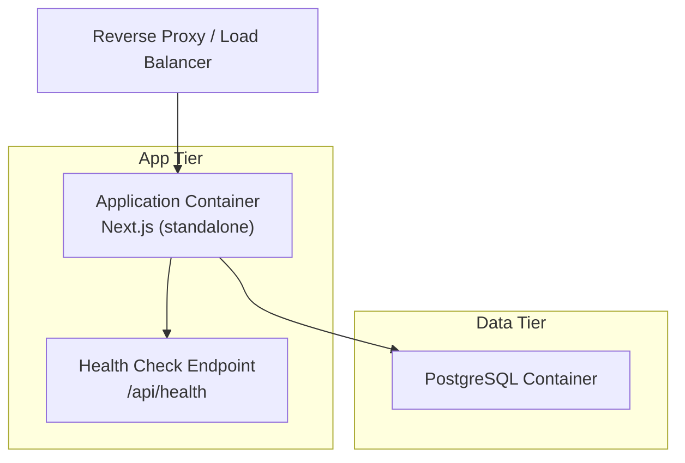
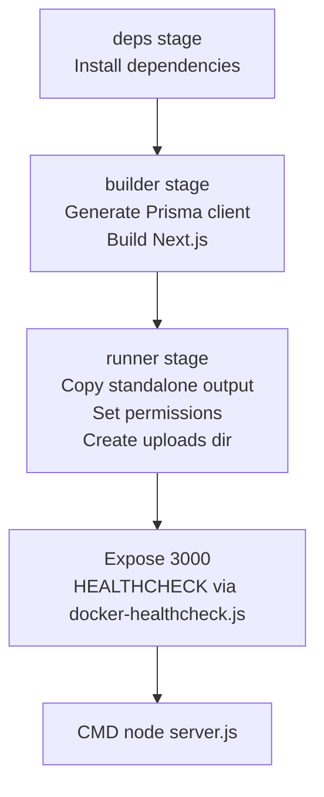
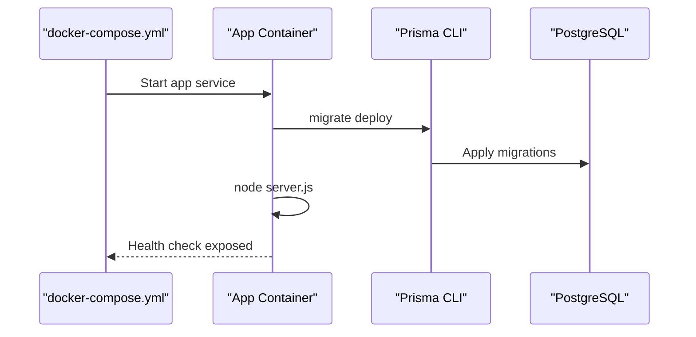
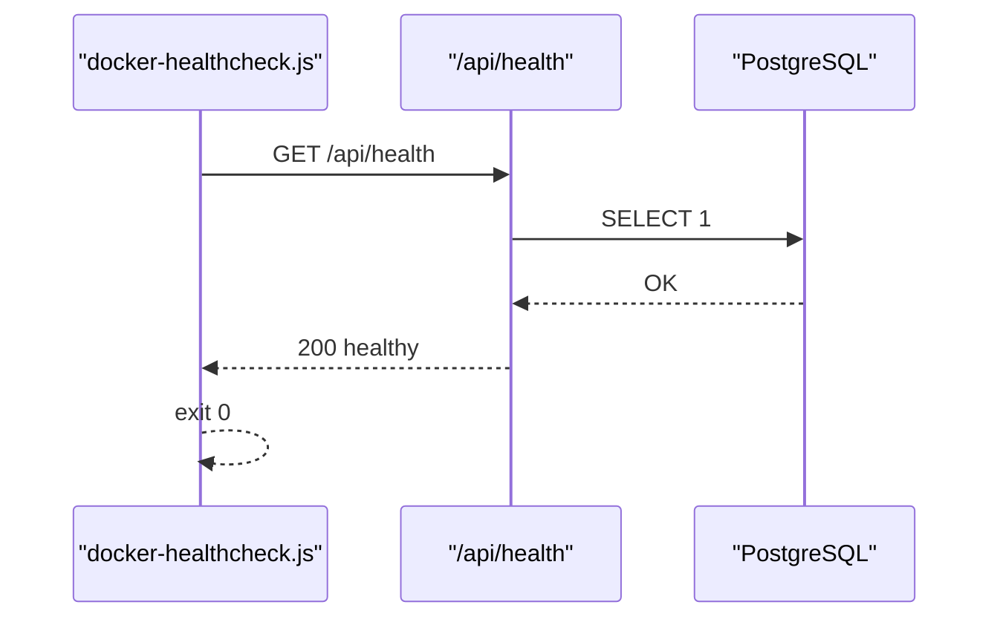
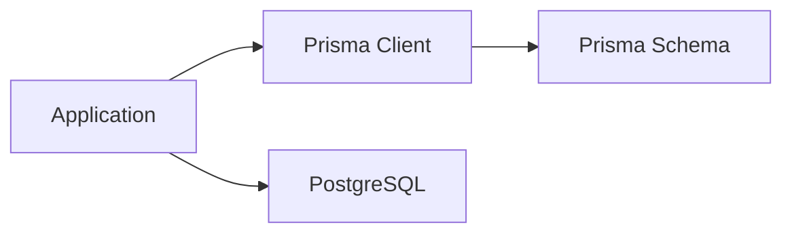

# Docker & Deployment

<cite>
**Referenced Files in This Document**
- [Dockerfile](file://Dockerfile)
- [Dockerfile.dev](file://Dockerfile.dev)
- [docker-compose.yml](file://docker-compose.yml)
- [docker-compose.dev.yml](file://docker-compose.dev.yml)
- [README-Docker.md](file://README-Docker.md)
- [package.json](file://package.json)
- [next.config.ts](file://next.config.ts)
- [docker-healthcheck.js](file://docker-healthcheck.js)
- [scripts/docker-setup.sh](file://scripts/docker-setup.sh)
- [src/app/api/health/route.ts](file://src/app/api/health/route.ts)
- [src/lib/prisma.ts](file://src/lib/prisma.ts)
- [prisma/schema.prisma](file://prisma/schema.prisma)
</cite>

## Table of Contents
1. [Introduction](#introduction)
2. [Project Structure](#project-structure)
3. [Core Components](#core-components)
4. [Architecture Overview](#architecture-overview)
5. [Detailed Component Analysis](#detailed-component-analysis)
6. [Dependency Analysis](#dependency-analysis)
7. [Performance Considerations](#performance-considerations)
8. [Troubleshooting Guide](#troubleshooting-guide)
9. [Conclusion](#conclusion)
10. [Appendices](#appendices)

## Introduction
This document provides comprehensive Docker and deployment guidance for Customer WebMahsul. It covers containerization setup, environment configuration, production deployment strategies, scaling considerations, reverse proxy and SSL configuration, monitoring and logging, CI/CD integration, automated deployments, rollback procedures, performance tuning, resource allocation, and disaster recovery planning. The guide references the actual Dockerfiles, docker-compose configurations, health checks, and supporting scripts included in the repository.

## Project Structure
Customer WebMahsul uses a dual-environment setup:
- Production: Single-container application with a standalone Next.js output and a PostgreSQL database.
- Development: Hot-reload-enabled development container with bind-mounted source code and a separate PostgreSQL service.

Key deployment artifacts:
- Production Dockerfile builds a minimal, production-ready image with standalone output and health checks.
- Development Dockerfile enables hot reload and bind-mounts source code for rapid iteration.
- docker-compose.yml orchestrates the production stack with database migrations executed at startup.
- docker-compose.dev.yml orchestrates the development stack with hot reload and shared volumes.
- A setup script automates initial environment preparation and launch prompts.
- A health check script and endpoint monitor application readiness and database connectivity.

**Diagram sources**
- [Dockerfile:1-73](file://Dockerfile#L1-L73)
- [Dockerfile.dev:1-20](file://Dockerfile.dev#L1-L20)
- [docker-compose.yml:1-49](file://docker-compose.yml#L1-L49)
- [docker-compose.dev.yml:1-47](file://docker-compose.dev.yml#L1-L47)

**Section sources**
- [Dockerfile:1-73](file://Dockerfile#L1-L73)
- [Dockerfile.dev:1-20](file://Dockerfile.dev#L1-L20)
- [docker-compose.yml:1-49](file://docker-compose.yml#L1-L49)
- [docker-compose.dev.yml:1-47](file://docker-compose.dev.yml#L1-L47)
- [README-Docker.md:12-32](file://README-Docker.md#L12-L32)
- [scripts/docker-setup.sh:1-56](file://scripts/docker-setup.sh#L1-L56)

## Core Components
- Production image
  - Multi-stage build: deps → builder → runner.
  - Standalone Next.js output and Prisma client generation.
  - Non-root user, safe permissions, and health check integration.
  - Exposes port 3000 with environment variables for host and port.
- Development image
  - Hot reload enabled with development server.
  - Bind mounts for fast iteration and shared uploads directory.
- Orchestration
  - Production compose runs database migrations on startup via Prisma.
  - Development compose mounts source and node_modules separately for performance.
- Health monitoring
  - Health check script and endpoint validate database connectivity and uploads directory accessibility.
- Environment configuration
  - DATABASE_URL, NEXTAUTH_SECRET, NEXTAUTH_URL, and optional SMTP settings.
  - Separate environment templates for production and development.

**Section sources**
- [Dockerfile:15-73](file://Dockerfile#L15-L73)
- [Dockerfile.dev:10-20](file://Dockerfile.dev#L10-L20)
- [docker-compose.yml:18-41](file://docker-compose.yml#L18-L41)
- [docker-compose.dev.yml:20-40](file://docker-compose.dev.yml#L20-L40)
- [docker-healthcheck.js:1-39](file://docker-healthcheck.js#L1-L39)
- [src/app/api/health/route.ts:1-37](file://src/app/api/health/route.ts#L1-L37)
- [README-Docker.md:66-85](file://README-Docker.md#L66-L85)

## Architecture Overview
The production architecture consists of a single Next.js application container and a PostgreSQL database container. The application performs database migrations at startup and exposes a health endpoint consumed by the Docker health check.

**Diagram sources**
- [docker-compose.yml:18-41](file://docker-compose.yml#L18-L41)
- [src/app/api/health/route.ts:1-37](file://src/app/api/health/route.ts#L1-L37)
- [docker-healthcheck.js:1-39](file://docker-healthcheck.js#L1-L39)

## Detailed Component Analysis

### Production Dockerfile
- Multi-stage build ensures minimal final image size and secure defaults.
- Prisma client generation and Next.js build occur in the builder stage.
- Runner stage sets non-root user, creates uploads directory, and configures health checks.
- Exposes port 3000 and defines HOSTNAME and PORT environment variables.
- Uses a health check script to probe the application’s health endpoint.

**Diagram sources**
- [Dockerfile:15-73](file://Dockerfile#L15-L73)

**Section sources**
- [Dockerfile:15-73](file://Dockerfile#L15-L73)

### Development Dockerfile
- Copies dependencies and source code, generates Prisma client.
- Starts Next.js in development mode with hot reload.
- Mounts source code and node_modules separately for performance and isolation.

**Section sources**
- [Dockerfile.dev:1-20](file://Dockerfile.dev#L1-L20)
- [docker-compose.dev.yml:35-38](file://docker-compose.dev.yml#L35-L38)

### docker-compose (Production)
- Defines PostgreSQL service with persistent volume and mapped port.
- Defines application service with environment variables, port mapping, and volume for uploads.
- Runs Prisma migrations on startup and starts the server.
- Uses a dedicated network for service discovery.

**Diagram sources**
- [docker-compose.yml:18-41](file://docker-compose.yml#L18-L41)

**Section sources**
- [docker-compose.yml:1-49](file://docker-compose.yml#L1-L49)

### docker-compose (Development)
- Similar to production but with hot reload and bind mounts.
- Ports mapped differently for development convenience.
- Dedicated network and volumes for persistence and source sharing.

**Section sources**
- [docker-compose.dev.yml:1-47](file://docker-compose.dev.yml#L1-L47)

### Health Check Script and Endpoint
- Health check script probes the application’s health endpoint with a timeout.
- Health endpoint validates database connectivity and uploads directory accessibility.
- Health check integrates with Docker HEALTHCHECK.

**Diagram sources**
- [docker-healthcheck.js:1-39](file://docker-healthcheck.js#L1-L39)
- [src/app/api/health/route.ts:1-37](file://src/app/api/health/route.ts#L1-L37)

**Section sources**
- [docker-healthcheck.js:1-39](file://docker-healthcheck.js#L1-L39)
- [src/app/api/health/route.ts:1-37](file://src/app/api/health/route.ts#L1-L37)

### Environment Configuration
- Production environment variables include database URL, NextAuth secret and URL, and optional SMTP settings.
- Development environment mirrors production variables with local ports and credentials.
- A setup script prepares the environment and launches containers.

**Section sources**
- [README-Docker.md:66-85](file://README-Docker.md#L66-L85)
- [docker-compose.yml:25-28](file://docker-compose.yml#L25-L28)
- [docker-compose.dev.yml:27-30](file://docker-compose.dev.yml#L27-L30)
- [scripts/docker-setup.sh:22-31](file://scripts/docker-setup.sh#L22-L31)

### Reverse Proxy and SSL
- Nginx reverse proxy configuration forwards requests to the application on port 3000.
- SSL certificates can be provisioned via Certbot with Nginx.

**Section sources**
- [README-Docker.md:160-180](file://README-Docker.md#L160-L180)

### Monitoring and Logging
- Health endpoint and Docker health checks provide basic application and container health signals.
- Container logs can be streamed for diagnostics.
- Resource usage can be monitored via Docker stats and system disk usage.

**Section sources**
- [README-Docker.md:182-202](file://README-Docker.md#L182-L202)

### CI/CD Integration and Automated Deployments
- Recommended flow: pull latest code, rebuild images without cache, redeploy services.
- Rollback can be achieved by redeploying previous image tags or by downgrading database migrations as appropriate.

**Section sources**
- [README-Docker.md:204-215](file://README-Docker.md#L204-L215)

### Disaster Recovery Planning
- Back up the PostgreSQL data volume and uploaded files.
- Restore backups by recreating the database container and restoring data.

**Section sources**
- [README-Docker.md:100-108](file://README-Docker.md#L100-L108)

## Dependency Analysis
- Application depends on PostgreSQL via DATABASE_URL.
- Prisma client is generated during the build stage and embedded in the final image.
- Next.js is configured to produce a standalone output for containerized deployment.

**Diagram sources**
- [Dockerfile:20-25](file://Dockerfile#L20-L25)
- [prisma/schema.prisma:1-14](file://prisma/schema.prisma#L1-L14)
- [src/lib/prisma.ts:1-9](file://src/lib/prisma.ts#L1-L9)

**Section sources**
- [Dockerfile:20-25](file://Dockerfile#L20-L25)
- [prisma/schema.prisma:1-14](file://prisma/schema.prisma#L1-L14)
- [src/lib/prisma.ts:1-9](file://src/lib/prisma.ts#L1-L9)
- [next.config.ts:1-14](file://next.config.ts#L1-L14)

## Performance Considerations
- Use the standalone Next.js output to minimize container startup overhead.
- Keep Prisma client and migrations in the build stage to avoid runtime overhead.
- Persist the uploads directory to prevent data loss and improve reliability.
- Monitor CPU and memory usage with Docker stats and adjust resource limits accordingly.

**Section sources**
- [next.config.ts:1-14](file://next.config.ts#L1-L14)
- [Dockerfile:45-56](file://Dockerfile#L45-L56)
- [README-Docker.md:194-202](file://README-Docker.md#L194-L202)

## Troubleshooting Guide
Common issues and resolutions:
- Port conflicts: stop conflicting services or change port mappings.
- Database connection failures: restart services and inspect database logs.
- Insufficient disk space: prune unused images and volumes.

Operational commands:
- Start/stop/restart services.
- Stream logs for application and database.
- Reset database volume if needed.

**Section sources**
- [README-Docker.md:110-147](file://README-Docker.md#L110-L147)

## Conclusion
Customer WebMahsul’s Docker and deployment setup provides a robust foundation for both development and production environments. The multi-stage build, standalone Next.js output, and integrated health checks ensure reliable containerized operation. With proper reverse proxy configuration, SSL provisioning, monitoring, and CI/CD automation, the system can be scaled and maintained effectively in production.

## Appendices

### Environment Variables Reference
- DATABASE_URL: PostgreSQL connection string.
- NEXTAUTH_SECRET: Secret for session signing.
- NEXTAUTH_URL: Base URL for authentication callbacks.
- Optional SMTP_* variables for email support.

**Section sources**
- [README-Docker.md:66-85](file://README-Docker.md#L66-L85)
- [docker-compose.yml:25-28](file://docker-compose.yml#L25-L28)
- [docker-compose.dev.yml:27-30](file://docker-compose.dev.yml#L27-L30)

### Build and Run Commands
- Production: build and start services with docker-compose.
- Development: start development environment with hot reload.
- Logs: stream container logs for diagnostics.

**Section sources**
- [README-Docker.md:34-64](file://README-Docker.md#L34-L64)
- [scripts/docker-setup.sh:34-39](file://scripts/docker-setup.sh#L34-L39)