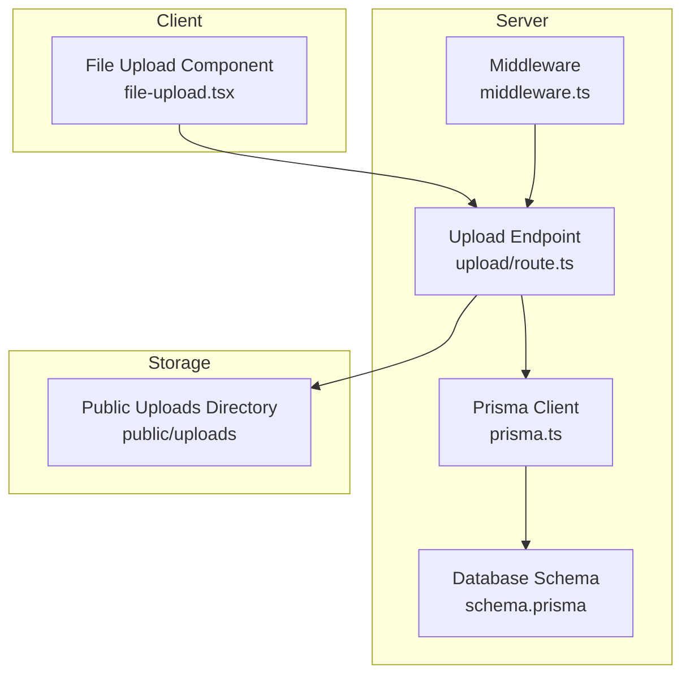
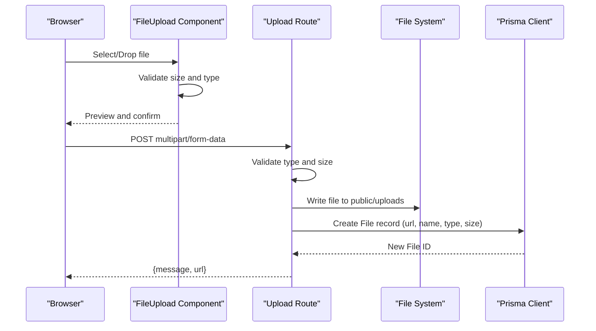
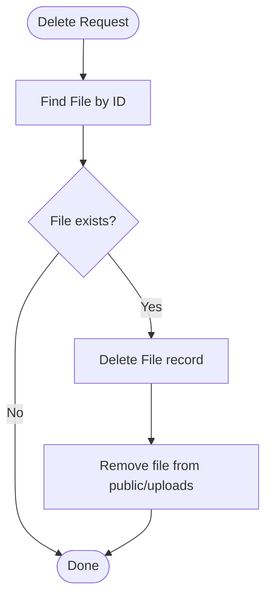
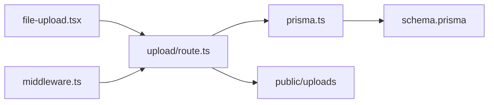

# File Management

<cite>
**Referenced Files in This Document**
- [upload/route.ts](file://src/app/api/upload/route.ts)
- [file-upload.tsx](file://src/components/ui/file-upload.tsx)
- [schema.prisma](file://prisma/schema.prisma)
- [middleware.ts](file://src/middleware.ts)
- [auth.ts](file://src/lib/auth.ts)
- [prisma.ts](file://src/lib/prisma.ts)
- [ENVIRONMENT_VERIFICATION_REPORT.md](file://ENVIRONMENT_VERIFICATION_REPORT.md)
- [VERIFICATION_SUMMARY.md](file://VERIFICATION_SUMMARY.md)
- [seed.js](file://scripts/seed.js)
- [seed-demo.js](file://scripts/seed-demo.js)
- [route.ts](file://src/app/api/tasks/route.ts)
- [route.ts](file://src/app/api/customers/[id]/route.ts)
</cite>

## Table of Contents
1. [Introduction](#introduction)
2. [Project Structure](#project-structure)
3. [Core Components](#core-components)
4. [Architecture Overview](#architecture-overview)
5. [Detailed Component Analysis](#detailed-component-analysis)
6. [Dependency Analysis](#dependency-analysis)
7. [Performance Considerations](#performance-considerations)
8. [Troubleshooting Guide](#troubleshooting-guide)
9. [Conclusion](#conclusion)
10. [Appendices](#appendices)

## Introduction
This document describes the file management capabilities in Customer WebMahsul. It covers the file upload system, storage management, file organization, access control, supported file types and sizes, metadata handling, integration with customer profiles, service records, and task management. It also outlines deletion procedures, versioning considerations, and storage optimization strategies.

## Project Structure
The file management system centers around:
- A public file store under the application’s public directory
- A dedicated API endpoint for uploading files
- A reusable UI component for drag-and-drop file selection and preview
- A unified File entity in the database that can attach to multiple business entities (Customer, Subscription, Domain, Hosting, Task)
- Middleware-driven authentication and role-based access control

**Diagram sources**
- [file-upload.tsx:1-139](file://src/components/ui/file-upload.tsx#L1-L139)
- [upload/route.ts:1-65](file://src/app/api/upload/route.ts#L1-L65)
- [prisma.ts:1-9](file://src/lib/prisma.ts#L1-L9)
- [schema.prisma:388-407](file://prisma/schema.prisma#L388-L407)
- [middleware.ts:1-101](file://src/middleware.ts#L1-L101)

**Section sources**
- [ENVIRONMENT_VERIFICATION_REPORT.md:104-108](file://ENVIRONMENT_VERIFICATION_REPORT.md#L104-L108)
- [VERIFICATION_SUMMARY.md:211-211](file://VERIFICATION_SUMMARY.md#L211-L211)

## Core Components
- File upload API endpoint: Validates type and size, writes to disk, returns a public URL
- File upload UI component: Drag-and-drop, preview, size validation, removal
- File entity: Generic attachment container with optional relations to Customer, Subscription, Domain, Hosting, Task
- Authentication and access control: Middleware enforces session and role checks; admin portal vs customer portal routing
- Prisma client: Centralized database access

Key behaviors:
- Supported file types: Images (JPEG, JPG, PNG, GIF)
- Size limit: 5 MB
- Storage location: public/uploads
- Metadata persisted: url, name, type, size, plus optional foreign keys to business entities

**Section sources**
- [upload/route.ts:18-34](file://src/app/api/upload/route.ts#L18-L34)
- [upload/route.ts:44-51](file://src/app/api/upload/route.ts#L44-L51)
- [file-upload.tsx:19-32](file://src/components/ui/file-upload.tsx#L19-L32)
- [schema.prisma:388-407](file://prisma/schema.prisma#L388-L407)
- [middleware.ts:31-80](file://src/middleware.ts#L31-L80)

## Architecture Overview
The upload flow integrates UI, server-side validation, persistence, and storage.

**Diagram sources**
- [file-upload.tsx:28-40](file://src/components/ui/file-upload.tsx#L28-L40)
- [upload/route.ts:6-65](file://src/app/api/upload/route.ts#L6-L65)
- [prisma.ts:1-9](file://src/lib/prisma.ts#L1-L9)
- [schema.prisma:388-407](file://prisma/schema.prisma#L388-L407)

## Detailed Component Analysis

### File Upload Endpoint
Responsibilities:
- Parse multipart form data
- Validate file type and size
- Generate a unique filename
- Persist file to public/uploads
- Record metadata in the File table
- Return a public URL

Security and validation:
- Type whitelist: JPEG, JPG, PNG, GIF
- Size cap: 5 MB
- Unique filename generation prevents collisions

Persistence:
- Creates a File record with url, name, type, size, and optional foreign keys

**Section sources**
- [upload/route.ts:6-65](file://src/app/api/upload/route.ts#L6-L65)
- [schema.prisma:388-407](file://prisma/schema.prisma#L388-L407)

### File Upload UI Component
Responsibilities:
- Accept file via click or drag-and-drop
- Preview selected image
- Enforce client-side size limit
- Allow removal of selected file
- Pass selected file to parent for submission

User experience:
- Clear instructions and accepted formats
- Visual feedback during drag-and-drop
- Immediate preview after selection

**Section sources**
- [file-upload.tsx:17-139](file://src/components/ui/file-upload.tsx#L17-L139)

### File Entity and Attachments
The File entity supports attaching to multiple business entities:
- Customer
- Subscription
- Domain
- Hosting
- Task

This enables:
- Organizing files by customer or service context
- Retrieving all files for a given record
- Simplified cleanup when deleting records (see Deletion Procedures)

**Section sources**
- [schema.prisma:388-407](file://prisma/schema.prisma#L388-L407)
- [schema.prisma:118-123](file://prisma/schema.prisma#L118-L123)
- [schema.prisma:223-223](file://prisma/schema.prisma#L223-L223)
- [schema.prisma:239-239](file://prisma/schema.prisma#L239-L239)
- [schema.prisma:253-253](file://prisma/schema.prisma#L253-L253)
- [schema.prisma:276-276](file://prisma/schema.prisma#L276-L276)

### Access Control and Authentication
- Middleware enforces authentication via cookie and redirects unauthenticated users to login
- Role-based routing:
  - ADMIN/SUPPORT users go to admin dashboard
  - CUSTOMER users go to portal dashboard
- Rate limiting for API endpoints
- Security headers applied to responses

Note: The current upload endpoint does not enforce per-record access checks. It returns a public URL to the uploaded file. To restrict access, implement per-file authorization checks in the upload route and serve files through a protected route.

**Section sources**
- [middleware.ts:31-94](file://src/middleware.ts#L31-L94)
- [auth.ts:13-35](file://src/lib/auth.ts#L13-L35)

### Integration with Business Entities
- Customers: Files can be attached to a customer record
- Subscriptions: Files can be attached to a subscription record
- Domains: Files can be attached to a domain record
- Hosting: Files can be attached to a hosting record
- Tasks: Files can be attached to a task record

This allows organizing documents by context (e.g., customer contract files, domain renewal documents, hosting logs, task-related notes).

**Section sources**
- [schema.prisma:118-123](file://prisma/schema.prisma#L118-L123)
- [schema.prisma:223-223](file://prisma/schema.prisma#L223-L223)
- [schema.prisma:239-239](file://prisma/schema.prisma#L239-L239)
- [schema.prisma:253-253](file://prisma/schema.prisma#L253-L253)
- [schema.prisma:276-276](file://prisma/schema.prisma#L276-L276)

### File Sharing Between Users
- The current upload endpoint returns a public URL to the uploaded file
- There is no built-in mechanism to share files across users or set granular permissions
- To enable controlled sharing, implement per-file access checks and optionally introduce a shared link mechanism with expiring tokens

[No sources needed since this section provides general guidance]

### File Versioning
- The File entity stores a single URL and basic metadata (name, type, size)
- There is no explicit version history field on the File entity
- To support versioning, add a version column to the File model and/or maintain separate files with versioned names

**Section sources**
- [schema.prisma:388-407](file://prisma/schema.prisma#L388-L407)

### File Deletion Procedures
- Delete the File record from the database
- Remove the corresponding file from the public/uploads directory
- Optionally cascade deletes when removing parent records (e.g., Customer, Subscription, Domain, Hosting, Task) depending on onDelete behavior

**Diagram sources**
- [schema.prisma:388-407](file://prisma/schema.prisma#L388-L407)

**Section sources**
- [schema.prisma:388-407](file://prisma/schema.prisma#L388-L407)

### Supported File Types and Size Limits
- Types: JPEG, JPG, PNG, GIF
- Size: Maximum 5 MB
- Client-side and server-side enforcement ensures compliance

**Section sources**
- [upload/route.ts:18-34](file://src/app/api/upload/route.ts#L18-L34)
- [file-upload.tsx:19-32](file://src/components/ui/file-upload.tsx#L19-L32)

### File Metadata Handling
- Persisted fields: url, name, type, size
- Optional foreign keys: customerId, subscriptionId, domainId, hostingId, taskId
- Creation timestamp is recorded automatically

**Section sources**
- [schema.prisma:388-407](file://prisma/schema.prisma#L388-L407)

### Storage Management
- Files are stored under public/uploads
- Mounted in Docker to persist across runs
- Consider implementing:
  - Cleanup jobs for orphaned files
  - Archival policies for old files
  - CDN integration for scalability

**Section sources**
- [ENVIRONMENT_VERIFICATION_REPORT.md:104-108](file://ENVIRONMENT_VERIFICATION_REPORT.md#L104-L108)

## Dependency Analysis
- The upload endpoint depends on:
  - Prisma client for persistence
  - File system for writing
  - UI component for user input
- Middleware enforces authentication and rate limits
- File entity has optional relations to multiple business entities

**Diagram sources**
- [file-upload.tsx:1-139](file://src/components/ui/file-upload.tsx#L1-L139)
- [upload/route.ts:1-65](file://src/app/api/upload/route.ts#L1-L65)
- [prisma.ts:1-9](file://src/lib/prisma.ts#L1-L9)
- [schema.prisma:388-407](file://prisma/schema.prisma#L388-L407)
- [middleware.ts:1-101](file://src/middleware.ts#L1-L101)

**Section sources**
- [prisma.ts:1-9](file://src/lib/prisma.ts#L1-L9)
- [schema.prisma:388-407](file://prisma/schema.prisma#L388-L407)

## Performance Considerations
- Limit file sizes to reduce I/O and memory usage
- Offload file serving to a CDN or reverse proxy for improved latency
- Implement asynchronous processing for heavy operations (e.g., virus scanning, thumbnail generation)
- Use background jobs for cleanup and archival
- Monitor disk usage and implement quotas per customer or subscription

[No sources needed since this section provides general guidance]

## Troubleshooting Guide
Common issues and resolutions:
- Upload fails with invalid type or size:
  - Verify client-side and server-side limits match expectations
- File not found after upload:
  - Confirm the file exists in public/uploads and the URL is correct
- Access denied errors:
  - Ensure authentication cookies are present and roles are correct
- Rate limit exceeded:
  - Reduce client-side polling frequency or adjust middleware limits

**Section sources**
- [upload/route.ts:18-34](file://src/app/api/upload/route.ts#L18-L34)
- [middleware.ts:40-54](file://src/middleware.ts#L40-L54)

## Conclusion
Customer WebMahsul provides a straightforward, image-focused file upload pipeline with strong database modeling for flexible file attachments. The system currently lacks per-file access control, versioning, and advanced storage optimization. Enhancements should focus on secure file serving, versioning, and scalable storage strategies while maintaining the existing clean separation between UI, API, and persistence.

## Appendices

### Appendix A: Seed Data References
Seed scripts demonstrate customer creation and can be extended to include file associations for demonstration purposes.

**Section sources**
- [seed.js:13-51](file://scripts/seed.js#L13-L51)
- [seed-demo.js:6-26](file://scripts/seed-demo.js#L6-L26)

### Appendix B: Related API Routes
- Tasks API supports listing and creating tasks; files can be attached to tasks
- Customers API supports retrieval and updates; files can be attached to customers

**Section sources**
- [route.ts:1-64](file://src/app/api/tasks/route.ts#L1-L64)
- [route.ts:1-121](file://src/app/api/customers/[id]/route.ts#L1-L121)