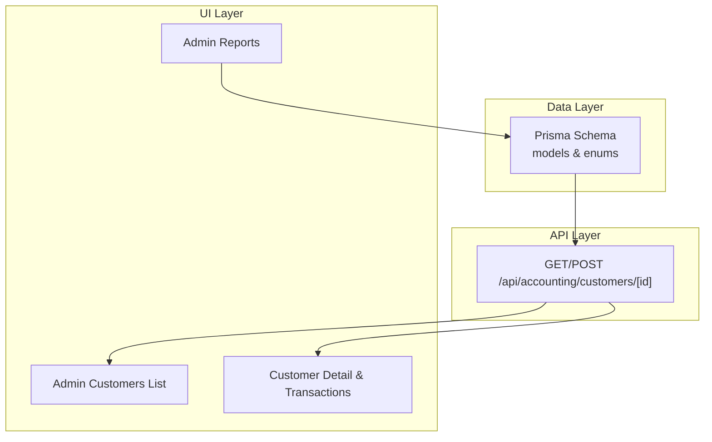
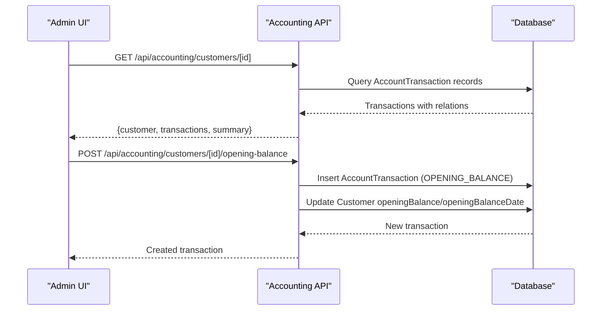
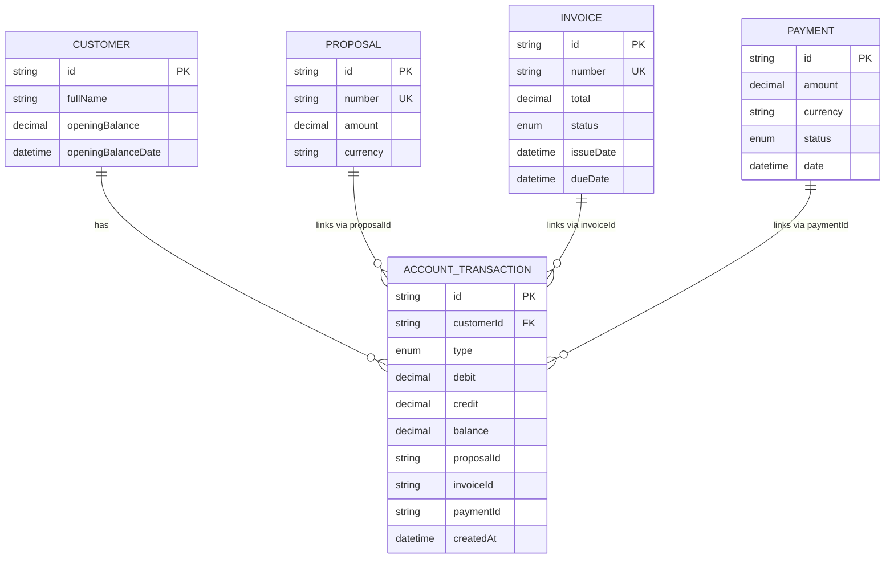
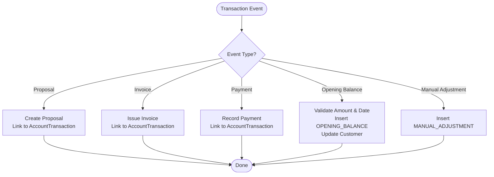
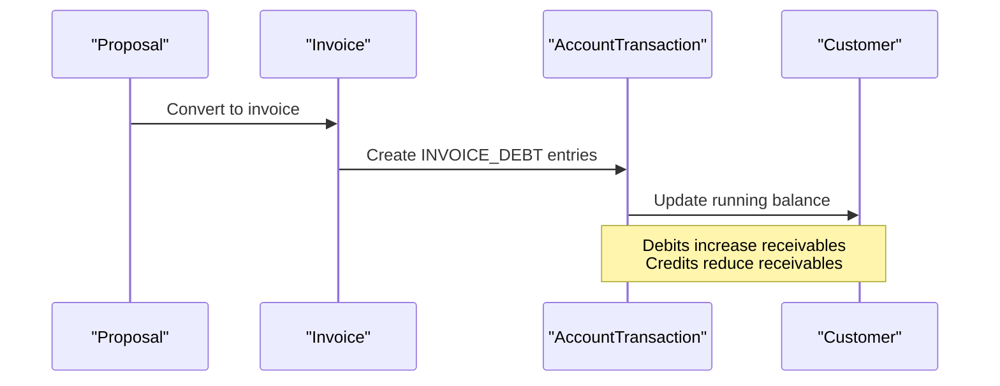
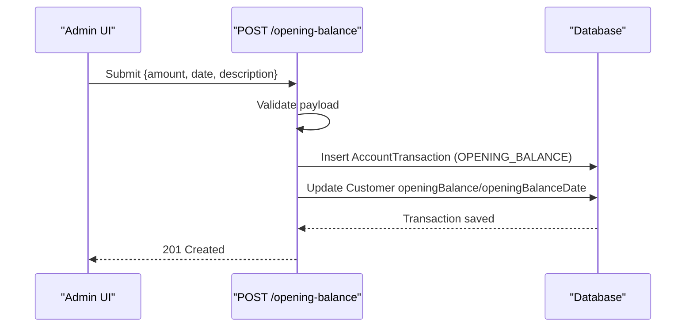
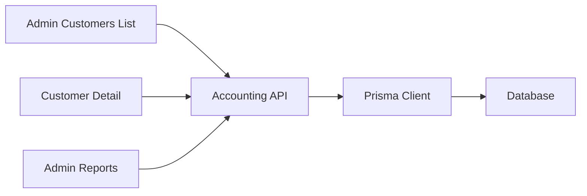

# Accounting Integration

<cite>
**Referenced Files in This Document**
- [schema.prisma](file://prisma/schema.prisma)
- [route.ts](file://src/app/api/accounting/customers/[id]/route.ts)
- [page.tsx](file://src/app/admin/accounting/customers/page.tsx)
- [page.tsx](file://src/app/admin/accounting/customers/[id]/page.tsx)
- [page.tsx](file://src/app/admin/reports/page.tsx)
- [prisma.ts](file://src/lib/prisma.ts)
</cite>

## Table of Contents
1. [Introduction](#introduction)
2. [Project Structure](#project-structure)
3. [Core Components](#core-components)
4. [Architecture Overview](#architecture-overview)
5. [Detailed Component Analysis](#detailed-component-analysis)
6. [Dependency Analysis](#dependency-analysis)
7. [Performance Considerations](#performance-considerations)
8. [Troubleshooting Guide](#troubleshooting-guide)
9. [Conclusion](#conclusion)
10. [Appendices](#appendices)

## Introduction
This document explains the accounting integration built into the system, focusing on the chart of accounts, transaction logging, financial reporting, and related workflows. It covers the data model for customer current accounts, revenue recognition signals via proposals and invoices, expense categorization hooks, opening balance management, financial period closures, year-end procedures, integration with external accounting software, export capabilities, audit trail maintenance, profit and loss reporting, balance sheet generation, tax reporting features, multi-company accounting scenarios, and currency translation for international operations.

## Project Structure
The accounting integration spans:
- Data modeling in the Prisma schema
- API endpoints for customer current account queries and opening balance adjustments
- Admin UI pages for browsing customers, viewing account details, and exporting reports
- Utility module for Prisma client initialization

**Diagram sources**
- [schema.prisma](file://prisma/schema.prisma)
- [route.ts](file://src/app/api/accounting/customers/[id]/route.ts)
- [page.tsx](file://src/app/admin/accounting/customers/page.tsx)
- [page.tsx](file://src/app/admin/accounting/customers/[id]/page.tsx)
- [page.tsx](file://src/app/admin/reports/page.tsx)

**Section sources**
- [schema.prisma](file://prisma/schema.prisma)
- [route.ts](file://src/app/api/accounting/customers/[id]/route.ts)
- [page.tsx](file://src/app/admin/accounting/customers/page.tsx)
- [page.tsx](file://src/app/admin/accounting/customers/[id]/page.tsx)
- [page.tsx](file://src/app/admin/reports/page.tsx)
- [prisma.ts](file://src/lib/prisma.ts)

## Core Components
- Customer current account model with running balance and linked documents
- Transaction types for opening balances, proposals, invoices, payments, and manual adjustments
- API endpoints for retrieving customer account details and posting opening balances
- Admin UI for customer listing, account detail, and financial report exports

Key capabilities:
- Track customer receivables/payables with running balance
- Log transactions against proposals, invoices, and payments
- Support opening balance entries with validation and audit trail
- Exportable financial reports and grouped CSV exports

**Section sources**
- [schema.prisma](file://prisma/schema.prisma)
- [route.ts](file://src/app/api/accounting/customers/[id]/route.ts)
- [page.tsx](file://src/app/admin/accounting/customers/page.tsx)
- [page.tsx](file://src/app/admin/accounting/customers/[id]/page.tsx)
- [page.tsx](file://src/app/admin/reports/page.tsx)

## Architecture Overview
The accounting integration follows a layered architecture:
- Data layer: Prisma models define entities and relationships
- API layer: Route handlers expose current account operations
- UI layer: Admin pages render summaries, transactions, and reports

**Diagram sources**
- [route.ts](file://src/app/api/accounting/customers/[id]/route.ts)
- [schema.prisma](file://prisma/schema.prisma)

## Detailed Component Analysis

### Data Model: Chart of Accounts and Current Accounts
The system models:
- Customer entity with optional opening balance fields
- AccountTransaction entity capturing debits, credits, running balance, and relation to proposals, invoices, and payments
- TransactionType enum supporting opening balances, proposal debt, invoice debt, payment credit, and manual adjustments

**Diagram sources**
- [schema.prisma](file://prisma/schema.prisma)

**Section sources**
- [schema.prisma](file://prisma/schema.prisma)

### Transaction Logging Workflow
- Proposals and invoices can be linked to account transactions to reflect receivable creation
- Payments are linked to account transactions to reflect cash receipts
- Opening balances are posted as dedicated transactions with validated amounts and dates
- Manual adjustments are supported via the manual adjustment transaction type

**Diagram sources**
- [schema.prisma](file://prisma/schema.prisma)
- [route.ts](file://src/app/api/accounting/customers/[id]/route.ts)

**Section sources**
- [schema.prisma](file://prisma/schema.prisma)
- [route.ts](file://src/app/api/accounting/customers/[id]/route.ts)

### Revenue Recognition Principles
- Recognize receivable when a proposal becomes payable or converts to an invoice
- Debit/credit entries mirror the economic event; balance reflects cumulative position
- Currency is tracked per record to support multi-currency operations

**Diagram sources**
- [schema.prisma](file://prisma/schema.prisma)

**Section sources**
- [schema.prisma](file://prisma/schema.prisma)

### Expense Categorization
- Expenses are not modeled in the current schema snapshot
- To support expense tracking, introduce an expense category model and an expense transaction model linked to suppliers and categories
- Use a similar pattern to AccountTransaction with debits/credits and running totals

[No sources needed since this section proposes future modeling without analyzing specific files]

### Opening Balance Management
- Endpoint validates amount, date, and optional description
- Inserts an opening balance transaction and updates the customer’s opening balance fields
- Maintains audit trail via createdAt timestamps

**Diagram sources**
- [route.ts](file://src/app/api/accounting/customers/[id]/route.ts)

**Section sources**
- [route.ts](file://src/app/api/accounting/customers/[id]/route.ts)

### Financial Period Closures and Year-End Procedures
- No explicit period closure or year-end logic exists in the current schema or API
- Recommended approach:
  - Define fiscal periods and closing workflows
  - Transfer retained earnings to equity at year-end
  - Freeze prior periods for auditing while allowing re-open under policy
  - Generate reconciliation reports before closing

[No sources needed since this section provides general guidance]

### Multi-Company Accounting Scenarios
- The schema does not include a company/entity dimension
- To support multi-entity accounting:
  - Add a Company entity and tenant isolation
  - Scope Customer, AccountTransaction, Proposal, Invoice, and Payment by company
  - Enforce company-aware queries and reporting

[No sources needed since this section provides general guidance]

### Currency Translation for International Operations
- Currency fields exist on Customer, Proposal, Payment, and Product entities
- Implement periodic exchange rate updates and translation entries for foreign currency positions
- Maintain separate ledger entries for translated balances and translation adjustments

[No sources needed since this section provides general guidance]

### Audit Trail Maintenance
- All AccountTransaction records include createdAt timestamps
- Customer opening balance updates are auditable via transaction history
- Proposal, invoice, and payment links provide traceability to underlying documents

**Section sources**
- [schema.prisma](file://prisma/schema.prisma)
- [route.ts](file://src/app/api/accounting/customers/[id]/route.ts)

### Profit and Loss Reporting
- The current reports page focuses on payments and subscriptions
- To build P&L:
  - Aggregate income from invoice totals by issue date
  - Track expenses via supplier invoices and journal entries
  - Compute period revenues minus expenses
  - Support multi-currency conversions at period rates

[No sources needed since this section provides general guidance]

### Balance Sheet Generation
- Assets: Cash (payments), Receivables (customer balances)
- Liabilities: Not modeled yet; introduce payable tracking for supplier obligations
- Equity: Retained earnings (year-end transfer)
- Multi-currency: Translate assets/liabilities at period-end rates

[No sources needed since this section provides general guidance]

### Tax Reporting Features
- Invoice tax rate and tax amount are stored
- Report taxes by period and jurisdiction
- Support tax-exempt and reverse-charge scenarios via invoice flags

**Section sources**
- [schema.prisma](file://prisma/schema.prisma)

### Integration with External Accounting Software
- Export capabilities:
  - CSV export of filtered datasets from the reports page
  - Grouped CSV exports per customer
- Import hooks:
  - Add endpoints to ingest external journals and reconcile balances
  - Maintain audit logs for imported entries

**Section sources**
- [page.tsx](file://src/app/admin/reports/page.tsx)

## Dependency Analysis
- API depends on Prisma client initialized in a shared module
- UI pages depend on API endpoints for data and actions
- Models define relationships enabling transaction tracing across proposals, invoices, and payments

**Diagram sources**
- [prisma.ts](file://src/lib/prisma.ts)
- [route.ts](file://src/app/api/accounting/customers/[id]/route.ts)
- [page.tsx](file://src/app/admin/accounting/customers/page.tsx)
- [page.tsx](file://src/app/admin/accounting/customers/[id]/page.tsx)
- [page.tsx](file://src/app/admin/reports/page.tsx)

**Section sources**
- [prisma.ts](file://src/lib/prisma.ts)
- [route.ts](file://src/app/api/accounting/customers/[id]/route.ts)
- [page.tsx](file://src/app/admin/accounting/customers/page.tsx)
- [page.tsx](file://src/app/admin/accounting/customers/[id]/page.tsx)
- [page.tsx](file://src/app/admin/reports/page.tsx)

## Performance Considerations
- Indexing: Ensure indexes on AccountTransaction.customerId, Proposal.customerId, Invoice.customerId, Payment.customerId for fast lookups
- Pagination: Apply limit and cursor-based pagination for large transaction lists
- Aggregation: Precompute daily balances or maintain materialized summaries for dashboards
- Caching: Cache frequently accessed customer summaries with invalidation on transaction writes

[No sources needed since this section provides general guidance]

## Troubleshooting Guide
Common issues and resolutions:
- Validation errors on opening balance: Ensure amount is numeric and date is valid; check error payload returned by the endpoint
- Missing customer: Verify customer ID exists before querying or posting
- Large transaction lists: Use server-side filtering and pagination
- Export failures: Confirm filtered dataset is non-empty and browser supports Blob downloads

**Section sources**
- [route.ts](file://src/app/api/accounting/customers/[id]/route.ts)
- [page.tsx](file://src/app/admin/reports/page.tsx)

## Conclusion
The system provides a solid foundation for customer current accounts with transaction logging, opening balance management, and basic financial reporting. Extending the model to include expenses, liabilities, and company scoping will enable full P&L and balance sheet reporting. Multi-currency support and period-end procedures can be incrementally introduced to meet compliance and audit needs.

## Appendices

### API Definitions
- GET /api/accounting/customers/[id]
  - Returns customer, transactions, and summary totals
- POST /api/accounting/customers/[id]/opening-balance
  - Creates an opening balance transaction and updates customer fields

**Section sources**
- [route.ts](file://src/app/api/accounting/customers/[id]/route.ts)

### UI Workflows
- Customer list: Search, view balances, navigate to detail and transaction history
- Customer detail: View summary cards, recent transactions, and links to related pages
- Reports: Filter by date range, status, currency, and customer; export CSV/PDF

**Section sources**
- [page.tsx](file://src/app/admin/accounting/customers/page.tsx)
- [page.tsx](file://src/app/admin/accounting/customers/[id]/page.tsx)
- [page.tsx](file://src/app/admin/reports/page.tsx)