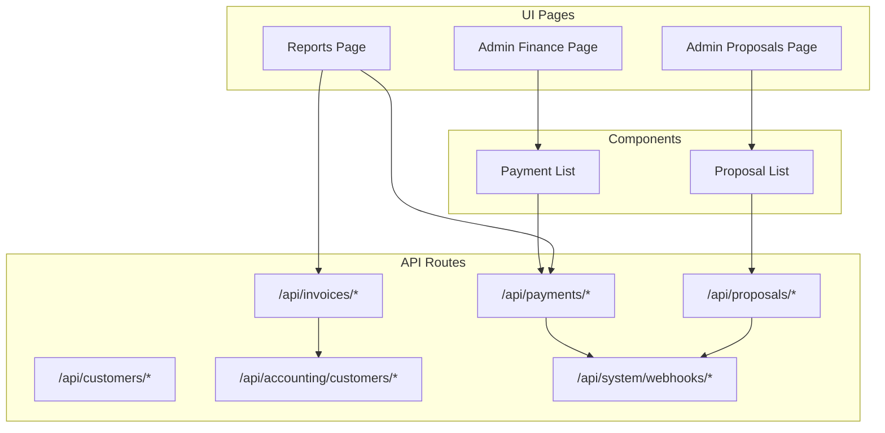
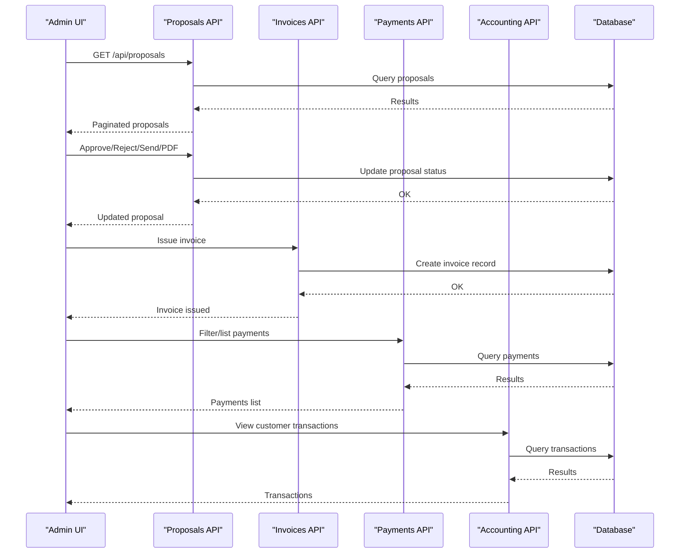
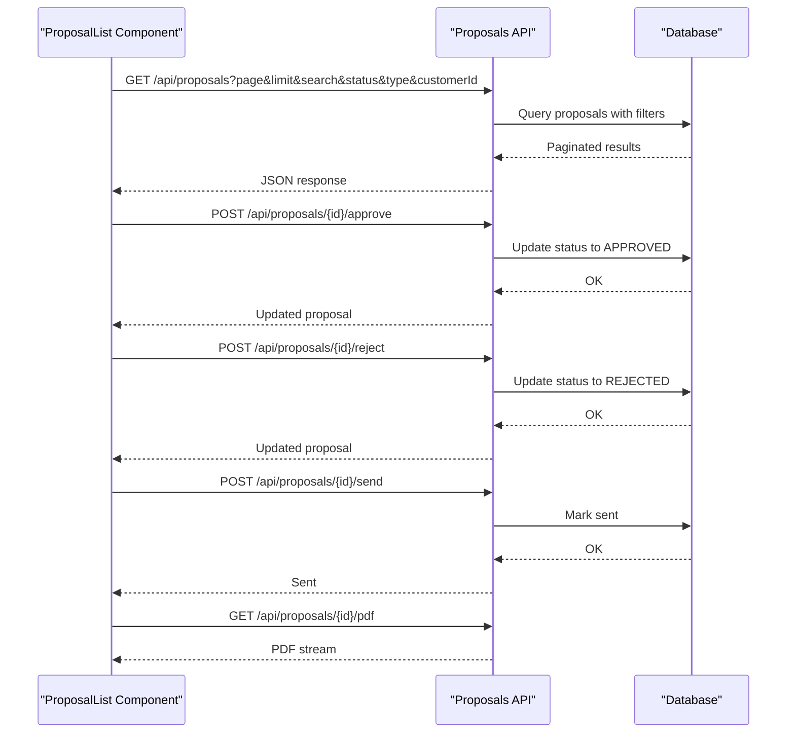
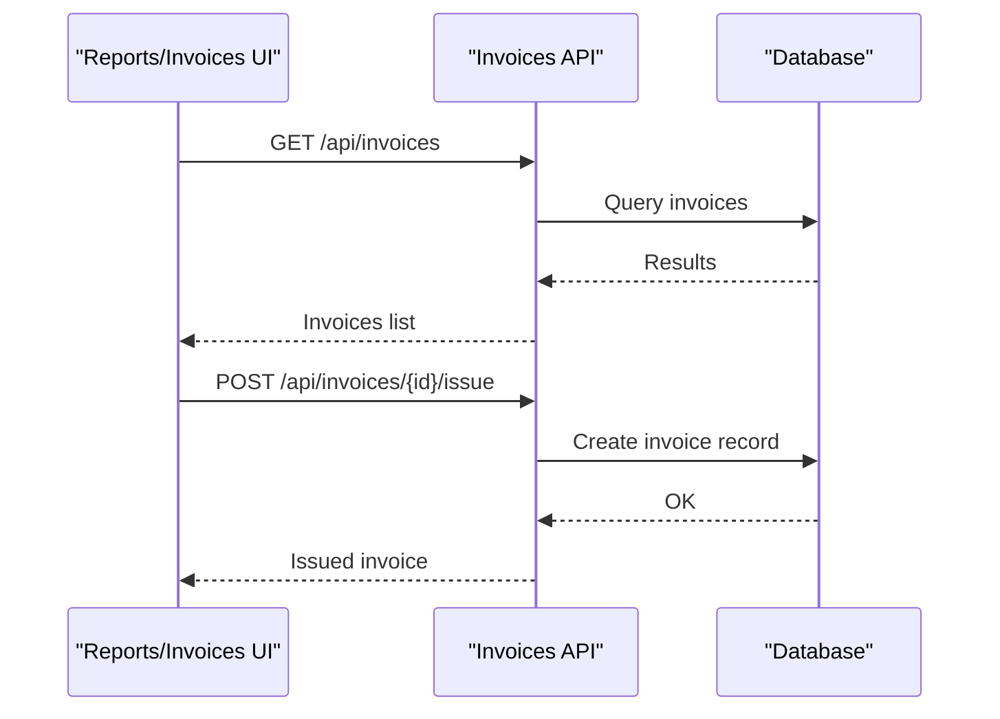
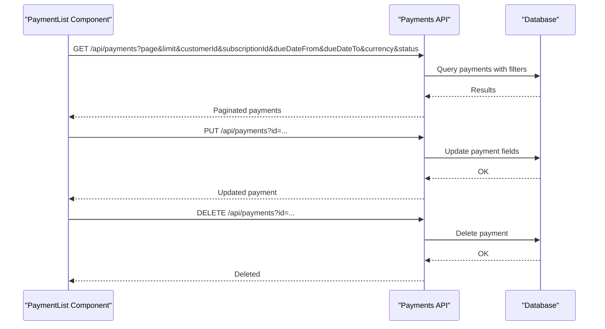
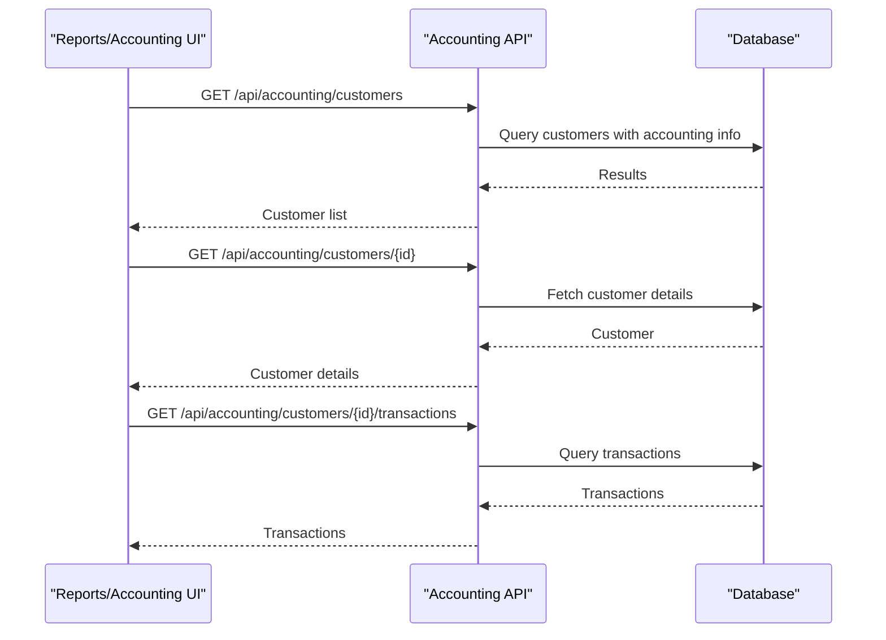
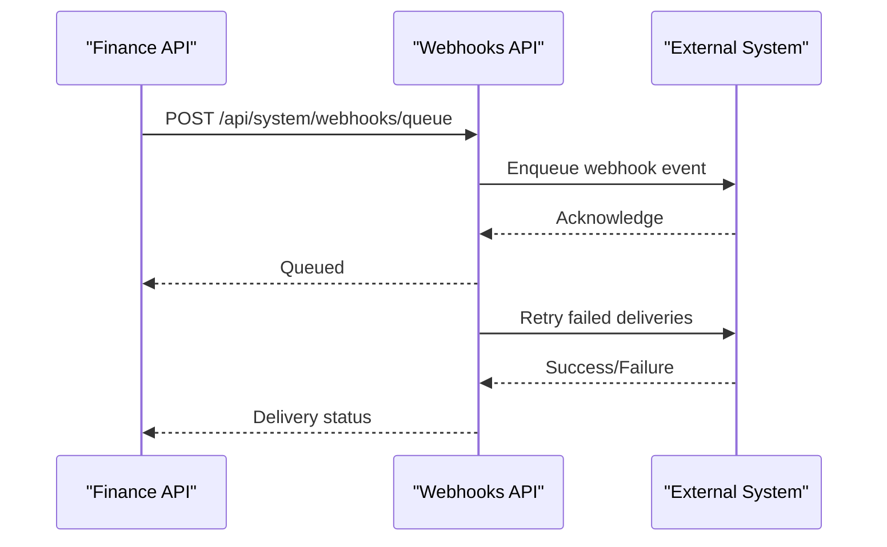
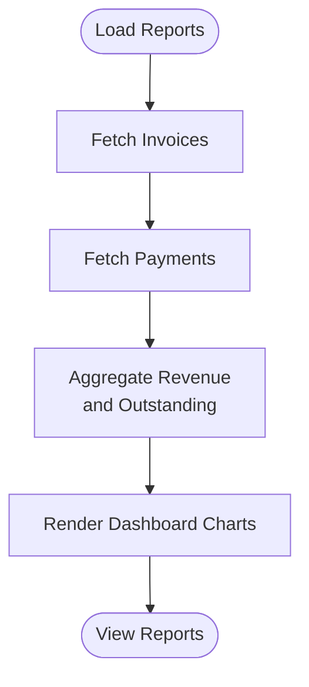
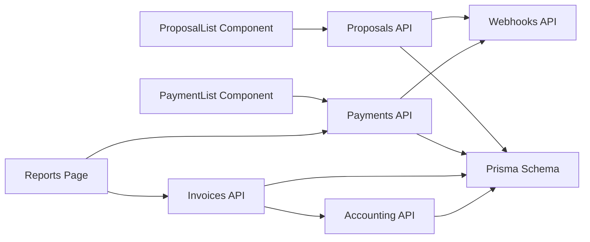
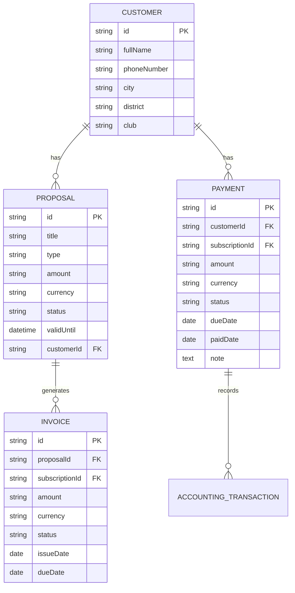

# Financial Management

<cite>
**Referenced Files in This Document**
- [src/app/admin/finance/page.tsx](file://src/app/admin/finance/page.tsx)
- [src/app/admin/proposals/page.tsx](file://src/app/admin/proposals/page.tsx)
- [src/app/admin/reports/page.tsx](file://src/app/admin/reports/page.tsx)
- [src/components/proposal-list.tsx](file://src/components/proposal-list.tsx)
- [src/components/payment-list.tsx](file://src/components/payment-list.tsx)
- [src/app/api/proposals/route.ts](file://src/app/api/proposals/route.ts)
- [src/app/api/proposals/[id]/approve/route.ts](file://src/app/api/proposals/[id]/approve/route.ts)
- [src/app/api/proposals/[id]/reject/route.ts](file://src/app/api/proposals/[id]/reject/route.ts)
- [src/app/api/proposals/[id]/send/route.ts](file://src/app/api/proposals/[id]/send/route.ts)
- [src/app/api/proposals/[id]/pdf/route.ts](file://src/app/api/proposals/[id]/pdf/route.ts)
- [src/app/api/invoices/route.ts](file://src/app/api/invoices/route.ts)
- [src/app/api/invoices/[id]/issue/route.ts](file://src/app/api/invoices/[id]/issue/route.ts)
- [src/app/api/payments/route.ts](file://src/app/api/payments/route.ts)
- [src/app/api/customers/route.ts](file://src/app/api/customers/route.ts)
- [src/app/api/accounting/customers/rroute.ts](file://src/app/api/accounting/customers/route.ts)
- [src/app/api/accounting/customers/[id]/route.ts](file://src/app/api/accounting/customers/[id]/route.ts)
- [src/app/api/system/webhooks/queue/route.ts](file://src/app/api/system/webhooks/queue/route.ts)
- [src/app/api/system/webhooks/retry/route.ts](file://src/app/api/system/webhooks/retry/route.ts)
- [src/lib/types.ts](file://src/lib/types.ts)
- [prisma/schema.prisma](file://prisma/schema.prisma)
</cite>

## Table of Contents
1. [Introduction](#introduction)
2. [Project Structure](#project-structure)
3. [Core Components](#core-components)
4. [Architecture Overview](#architecture-overview)
5. [Detailed Component Analysis](#detailed-component-analysis)
6. [Dependency Analysis](#dependency-analysis)
7. [Performance Considerations](#performance-considerations)
8. [Troubleshooting Guide](#troubleshooting-guide)
9. [Conclusion](#conclusion)
10. [Appendices](#appendices)

## Introduction
This document describes the financial management capabilities of the system, focusing on the end-to-end financial workflow from proposal creation and approval to invoice generation, payment processing, reconciliation, and accounting integration. It also covers financial reporting, revenue tracking, analytics, multi-currency support, tax calculation logic, and financial audit trails. The goal is to provide a comprehensive yet accessible guide for both technical and non-technical stakeholders.

## Project Structure
The financial domain spans UI pages, client components, and server-side API routes. Key areas include:
- Proposal management (creation, approval, rejection, sending, PDF export)
- Invoice management (listing, issuing)
- Payment management (listing, filtering, editing, deletion)
- Accounting integration (customer accounting endpoints)
- Reporting and dashboards
- Webhook system for asynchronous integrations

**Diagram sources**
- [src/app/admin/finance/page.tsx:1-32](file://src/app/admin/finance/page.tsx#L1-L32)
- [src/app/admin/proposals/page.tsx:1-32](file://src/app/admin/proposals/page.tsx#L1-L32)
- [src/app/admin/reports/page.tsx](file://src/app/admin/reports/page.tsx)
- [src/components/proposal-list.tsx:1-274](file://src/components/proposal-list.tsx#L1-L274)
- [src/components/payment-list.tsx:1-285](file://src/components/payment-list.tsx#L1-L285)
- [src/app/api/proposals/route.ts](file://src/app/api/proposals/route.ts)
- [src/app/api/invoices/route.ts](file://src/app/api/invoices/route.ts)
- [src/app/api/payments/route.ts](file://src/app/api/payments/route.ts)
- [src/app/api/accounting/customers/route.ts](file://src/app/api/accounting/customers/route.ts)
- [src/app/api/system/webhooks/queue/route.ts](file://src/app/api/system/webhooks/queue/route.ts)

**Section sources**
- [src/app/admin/finance/page.tsx:1-32](file://src/app/admin/finance/page.tsx#L1-L32)
- [src/app/admin/proposals/page.tsx:1-32](file://src/app/admin/proposals/page.tsx#L1-L32)
- [src/app/admin/reports/page.tsx](file://src/app/admin/reports/page.tsx)
- [src/components/proposal-list.tsx:1-274](file://src/components/proposal-list.tsx#L1-L274)
- [src/components/payment-list.tsx:1-285](file://src/components/payment-list.tsx#L1-L285)

## Core Components
- Proposal management: Listing, filtering, viewing, editing, deleting, approving, rejecting, sending, and exporting to PDF.
- Invoice management: Listing invoices and issuing invoices against proposals or subscriptions.
- Payment management: Listing payments with filters (customer, subscription, due date range, currency, status), editing payment details, and deleting payments.
- Accounting integration: Customer accounting endpoints for transaction history and balances.
- Reporting: Revenue tracking and financial analytics dashboards.
- Webhooks: Queue and retry mechanisms for asynchronous integrations.

**Section sources**
- [src/components/proposal-list.tsx:1-274](file://src/components/proposal-list.tsx#L1-L274)
- [src/components/payment-list.tsx:1-285](file://src/components/payment-list.tsx#L1-L285)
- [src/app/api/proposals/route.ts](file://src/app/api/proposals/route.ts)
- [src/app/api/invoices/route.ts](file://src/app/api/invoices/route.ts)
- [src/app/api/payments/route.ts](file://src/app/api/payments/route.ts)
- [src/app/api/accounting/customers/route.ts](file://src/app/api/accounting/customers/route.ts)
- [src/app/api/system/webhooks/queue/route.ts](file://src/app/api/system/webhooks/queue/route.ts)

## Architecture Overview
The financial workflow is driven by UI components that call API routes. These routes coordinate with database operations and optional external systems via webhooks. The architecture supports:
- Multi-currency display and filtering
- Proposal lifecycle (draft → pending → approved/rejected → expired)
- Invoice issuance linked to proposals/subscriptions
- Payment tracking with statuses (due, late, paid)
- Accounting integration for customer-level transactions
- Reporting and analytics dashboards

**Diagram sources**
- [src/app/api/proposals/route.ts](file://src/app/api/proposals/route.ts)
- [src/app/api/proposals/[id]/approve/route.ts](file://src/app/api/proposals/[id]/approve/route.ts)
- [src/app/api/proposals/[id]/reject/route.ts](file://src/app/api/proposals/[id]/reject/route.ts)
- [src/app/api/proposals/[id]/send/route.ts](file://src/app/api/proposals/[id]/send/route.ts)
- [src/app/api/proposals/[id]/pdf/route.ts](file://src/app/api/proposals/[id]/pdf/route.ts)
- [src/app/api/invoices/route.ts](file://src/app/api/invoices/route.ts)
- [src/app/api/invoices/[id]/issue/route.ts](file://src/app/api/invoices/[id]/issue/route.ts)
- [src/app/api/payments/route.ts](file://src/app/api/payments/route.ts)
- [src/app/api/accounting/customers/route.ts](file://src/app/api/accounting/customers/route.ts)

## Detailed Component Analysis

### Proposal Management Workflow
Proposal management includes listing, filtering, viewing, editing, deleting, approving, rejecting, sending, and generating PDFs. The frontend component handles pagination, search, and status/type filters, while backend routes manage CRUD and lifecycle transitions.

**Diagram sources**
- [src/components/proposal-list.tsx:1-274](file://src/components/proposal-list.tsx#L1-L274)
- [src/app/api/proposals/route.ts](file://src/app/api/proposals/route.ts)
- [src/app/api/proposals/[id]/approve/route.ts](file://src/app/api/proposals/[id]/approve/route.ts)
- [src/app/api/proposals/[id]/reject/route.ts](file://src/app/api/proposals/[id]/reject/route.ts)
- [src/app/api/proposals/[id]/send/route.ts](file://src/app/api/proposals/[id]/send/route.ts)
- [src/app/api/proposals/[id]/pdf/route.ts](file://src/app/api/proposals/[id]/pdf/route.ts)

**Section sources**
- [src/components/proposal-list.tsx:1-274](file://src/components/proposal-list.tsx#L1-L274)
- [src/app/api/proposals/route.ts](file://src/app/api/proposals/route.ts)
- [src/app/api/proposals/[id]/approve/route.ts](file://src/app/api/proposals/[id]/approve/route.ts)
- [src/app/api/proposals/[id]/reject/route.ts](file://src/app/api/proposals/[id]/reject/route.ts)
- [src/app/api/proposals/[id]/send/route.ts](file://src/app/api/proposals/[id]/send/route.ts)
- [src/app/api/proposals/[id]/pdf/route.ts](file://src/app/api/proposals/[id]/pdf/route.ts)

### Invoice Generation and Tax Calculations
Invoice management allows listing invoices and issuing invoices. While the current API surface focuses on listing and issuing, tax calculation logic and multi-currency handling are typically configured via settings and applied during invoice creation and rendering.

**Diagram sources**
- [src/app/api/invoices/route.ts](file://src/app/api/invoices/route.ts)
- [src/app/api/invoices/[id]/issue/route.ts](file://src/app/api/invoices/[id]/issue/route.ts)

**Section sources**
- [src/app/api/invoices/route.ts](file://src/app/api/invoices/route.ts)
- [src/app/api/invoices/[id]/issue/route.ts](file://src/app/api/invoices/[id]/issue/route.ts)

### Payment Processing and Tracking
Payment management supports listing payments with robust filters (customer, subscription, due date range, currency, status), editing payment details, and deleting payments. Statuses include due, late, and paid.

**Diagram sources**
- [src/components/payment-list.tsx:1-285](file://src/components/payment-list.tsx#L1-L285)
- [src/app/api/payments/route.ts](file://src/app/api/payments/route.ts)

**Section sources**
- [src/components/payment-list.tsx:1-285](file://src/components/payment-list.tsx#L1-L285)
- [src/app/api/payments/route.ts](file://src/app/api/payments/route.ts)

### Accounting Integration
Customer accounting endpoints enable viewing transactions and balances per customer, supporting reconciliation and audit trails.

**Diagram sources**
- [src/app/api/accounting/customers/route.ts](file://src/app/api/accounting/customers/route.ts)
- [src/app/api/accounting/customers/[id]/route.ts](file://src/app/api/accounting/customers/[id]/route.ts)

**Section sources**
- [src/app/api/accounting/customers/route.ts](file://src/app/api/accounting/customers/route.ts)
- [src/app/api/accounting/customers/[id]/route.ts](file://src/app/api/accounting/customers/[id]/route.ts)

### Webhook System for Integrations
Webhooks support asynchronous integrations for financial systems. The queue and retry endpoints facilitate reliable delivery and recovery.

**Diagram sources**
- [src/app/api/system/webhooks/queue/route.ts](file://src/app/api/system/webhooks/queue/route.ts)
- [src/app/api/system/webhooks/retry/route.ts](file://src/app/api/system/webhooks/retry/route.ts)

**Section sources**
- [src/app/api/system/webhooks/queue/route.ts](file://src/app/api/system/webhooks/queue/route.ts)
- [src/app/api/system/webhooks/retry/route.ts](file://src/app/api/system/webhooks/retry/route.ts)

### Financial Reporting, Revenue Tracking, and Analytics
Reporting and analytics dashboards provide insights into revenue trends, outstanding receivables, and payment performance. These views integrate data from invoices and payments APIs.

[No sources needed since this diagram shows conceptual workflow, not actual code structure]

## Dependency Analysis
The financial domain exhibits clear separation of concerns:
- UI components depend on API routes for data operations
- API routes depend on the database schema and Prisma-generated types
- Accounting endpoints depend on customer and transaction models
- Webhooks provide decoupled integration points

**Diagram sources**
- [src/components/proposal-list.tsx:1-274](file://src/components/proposal-list.tsx#L1-L274)
- [src/components/payment-list.tsx:1-285](file://src/components/payment-list.tsx#L1-L285)
- [src/app/api/proposals/route.ts](file://src/app/api/proposals/route.ts)
- [src/app/api/invoices/route.ts](file://src/app/api/invoices/route.ts)
- [src/app/api/payments/route.ts](file://src/app/api/payments/route.ts)
- [src/app/api/accounting/customers/route.ts](file://src/app/api/accounting/customers/route.ts)
- [src/app/api/system/webhooks/queue/route.ts](file://src/app/api/system/webhooks/queue/route.ts)
- [prisma/schema.prisma](file://prisma/schema.prisma)

**Section sources**
- [src/lib/types.ts:1-28](file://src/lib/types.ts#L1-L28)
- [prisma/schema.prisma](file://prisma/schema.prisma)

## Performance Considerations
- Pagination and filtering: Use page and limit parameters to avoid large payloads.
- Debounced search: Frontend debounces reduce unnecessary API calls.
- Efficient queries: Backend routes should apply filters at the database level.
- Currency display: Normalize currency formatting on the client side for readability.
- Webhook retries: Implement exponential backoff and dead-letter queues for reliability.

[No sources needed since this section provides general guidance]

## Troubleshooting Guide
Common issues and resolutions:
- Proposal operations failing: Verify proposal ID exists and status transitions are permitted.
- Invoice issuance errors: Confirm proposal or subscription linkage and required fields.
- Payment updates/deletions: Ensure correct query parameters and IDs.
- Accounting data missing: Check customer existence and transaction records.
- Webhook failures: Inspect queue and retry endpoints for error logs.

**Section sources**
- [src/components/proposal-list.tsx:1-274](file://src/components/proposal-list.tsx#L1-L274)
- [src/components/payment-list.tsx:1-285](file://src/components/payment-list.tsx#L1-L285)
- [src/app/api/proposals/route.ts](file://src/app/api/proposals/route.ts)
- [src/app/api/invoices/route.ts](file://src/app/api/invoices/route.ts)
- [src/app/api/payments/route.ts](file://src/app/api/payments/route.ts)
- [src/app/api/accounting/customers/route.ts](file://src/app/api/accounting/customers/route.ts)
- [src/app/api/system/webhooks/queue/route.ts](file://src/app/api/system/webhooks/queue/route.ts)

## Conclusion
The system provides a complete financial management solution with proposal lifecycle management, invoice issuance, payment tracking, and accounting integration. Multi-currency support and filtering enable flexible financial oversight, while webhooks facilitate extensibility. Reporting and analytics offer visibility into revenue and receivables, and the modular architecture supports future enhancements.

[No sources needed since this section summarizes without analyzing specific files]

## Appendices

### Data Model Overview
The financial domain relies on Prisma models for proposals, invoices, payments, customers, and accounting records. The schema defines relationships and constraints that underpin the financial workflows.

**Diagram sources**
- [prisma/schema.prisma](file://prisma/schema.prisma)

### Financial Audit Trail
Audit trail capabilities are supported by:
- Proposal status changes (draft → pending → approved/rejected → expired)
- Invoice issuance timestamps and statuses
- Payment edits and deletions
- Accounting transaction logs per customer

**Section sources**
- [src/app/api/proposals/[id]/approve/route.ts](file://src/app/api/proposals/[id]/approve/route.ts)
- [src/app/api/proposals/[id]/reject/route.ts](file://src/app/api/proposals/[id]/reject/route.ts)
- [src/app/api/invoices/[id]/issue/route.ts](file://src/app/api/invoices/[id]/issue/route.ts)
- [src/app/api/payments/route.ts](file://src/app/api/payments/route.ts)
- [src/app/api/accounting/customers/[id]/route.ts](file://src/app/api/accounting/customers/[id]/route.ts)