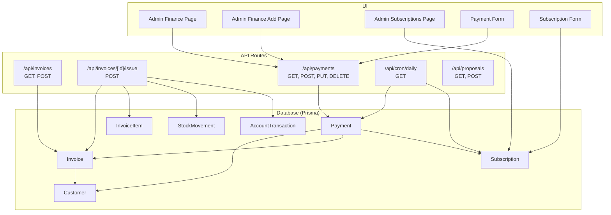
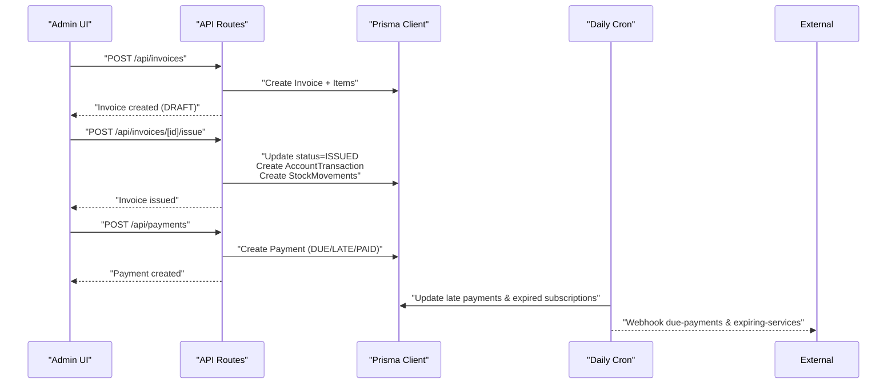
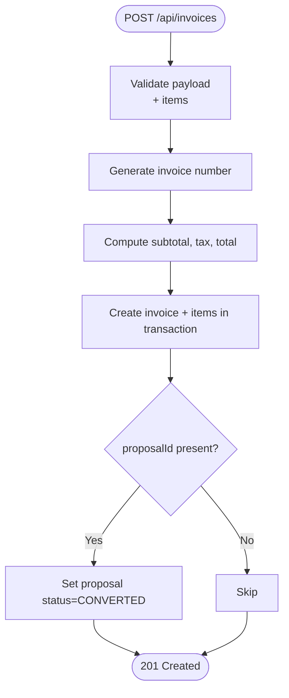
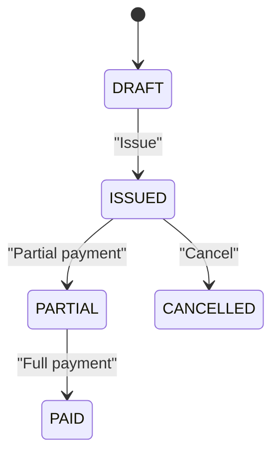
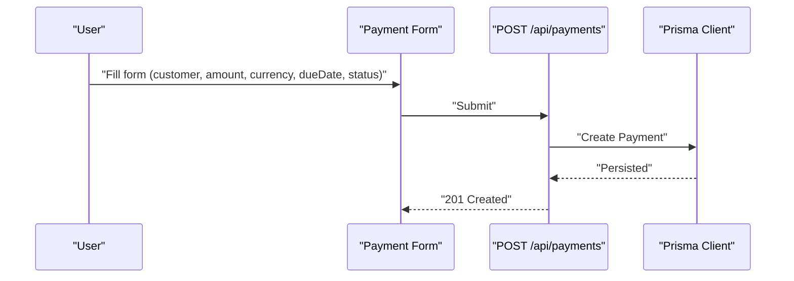
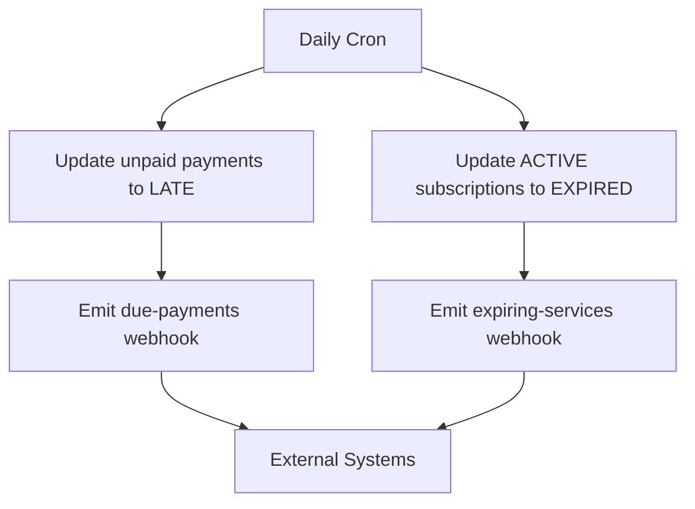
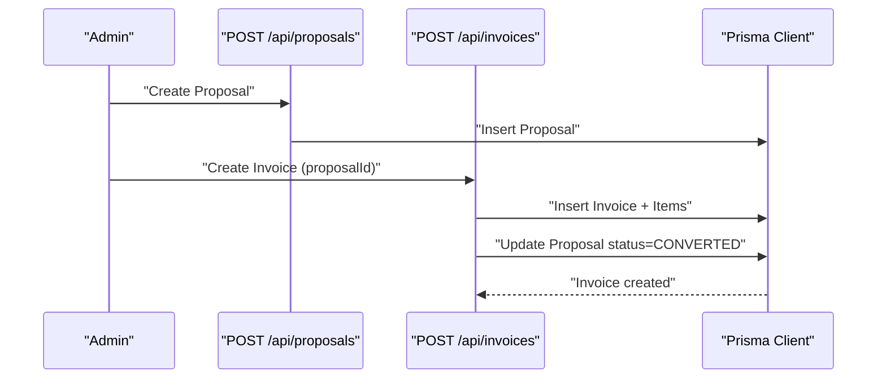
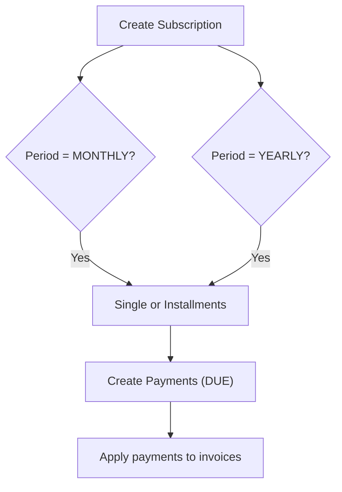
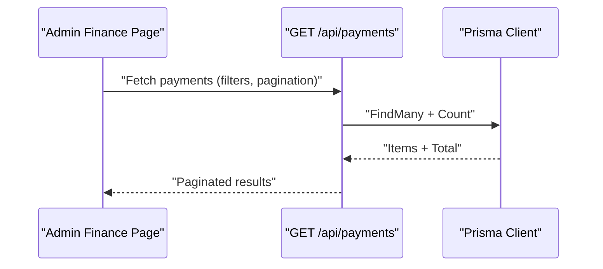
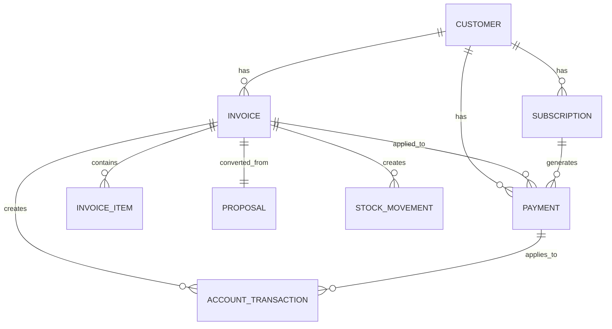

# Invoicing System

<cite>
**Referenced Files in This Document**
- [schema.prisma](file://prisma/schema.prisma)
- [invoices route](file://src/app/api/invoices/route.ts)
- [invoice issue route](file://src/app/api/invoices/[id]/issue/route.ts)
- [payments route](file://src/app/api/payments/route.ts)
- [payment form](file://src/components/payment-form.tsx)
- [cron daily route](file://src/app/api/cron/daily/route.ts)
- [proposals route](file://src/app/api/proposals/route.ts)
- [admin finance page](file://src/app/admin/finance/page.tsx)
- [admin finance add page](file://src/app/admin/finance/add/page.tsx)
- [admin subscriptions page](file://src/app/admin/subscriptions/page.tsx)
- [subscription form](file://src/components/subscription-form.tsx)
- [validations](file://src/lib/validations.ts)
</cite>

## Table of Contents
1. [Introduction](#introduction)
2. [Project Structure](#project-structure)
3. [Core Components](#core-components)
4. [Architecture Overview](#architecture-overview)
5. [Detailed Component Analysis](#detailed-component-analysis)
6. [Dependency Analysis](#dependency-analysis)
7. [Performance Considerations](#performance-considerations)
8. [Troubleshooting Guide](#troubleshooting-guide)
9. [Conclusion](#conclusion)
10. [Appendices](#appendices)

## Introduction
This document describes the invoicing system, covering invoice generation, tax calculations, payment tracking, and financial reporting. It explains how invoices relate to proposals, how subscription billing cycles and recurring payments are modeled, and how multi-currency is supported. It also documents invoice status workflows, reminder automation, and late fee handling, along with practical examples for creating invoices from proposals, manual invoice entry, payment application, and financial reconciliation.

## Project Structure
The invoicing system spans API routes, database models, UI forms, and background jobs:
- Database models define invoices, payments, customers, subscriptions, and supporting enums.
- API routes implement invoice CRUD, invoice issuance, payment CRUD, and daily reminders.
- UI components provide forms for manual payments and subscription setup.
- Validation schemas enforce data integrity across the system.

**Diagram sources**
- [invoices route:24-169](file://src/app/api/invoices/route.ts#L24-L169)
- [invoice issue route:4-100](file://src/app/api/invoices/[id]/issue/route.ts#L4-L100)
- [payments route:7-116](file://src/app/api/payments/route.ts#L7-L116)
- [cron daily route:7-135](file://src/app/api/cron/daily/route.ts#L7-L135)
- [proposals route:6-117](file://src/app/api/proposals/route.ts#L6-L117)
- [admin finance page:10-31](file://src/app/admin/finance/page.tsx#L10-L31)
- [admin finance add page:6-14](file://src/app/admin/finance/add/page.tsx#L6-L14)
- [admin subscriptions page:10-31](file://src/app/admin/subscriptions/page.tsx#L10-L31)
- [payment form:25-360](file://src/components/payment-form.tsx#L25-L360)
- [subscription form:133-194](file://src/components/subscription-form.tsx#L133-L194)
- [schema.prisma:648-710](file://prisma/schema.prisma#L648-L710)

**Section sources**
- [schema.prisma:648-710](file://prisma/schema.prisma#L648-L710)
- [invoices route:24-169](file://src/app/api/invoices/route.ts#L24-L169)
- [invoice issue route:4-100](file://src/app/api/invoices/[id]/issue/route.ts#L4-L100)
- [payments route:7-116](file://src/app/api/payments/route.ts#L7-L116)
- [cron daily route:7-135](file://src/app/api/cron/daily/route.ts#L7-L135)
- [proposals route:6-117](file://src/app/api/proposals/route.ts#L6-L117)
- [admin finance page:10-31](file://src/app/admin/finance/page.tsx#L10-L31)
- [admin finance add page:6-14](file://src/app/admin/finance/add/page.tsx#L6-L14)
- [admin subscriptions page:10-31](file://src/app/admin/subscriptions/page.tsx#L10-L31)
- [payment form:25-360](file://src/components/payment-form.tsx#L25-L360)
- [subscription form:133-194](file://src/components/subscription-form.tsx#L133-L194)
- [validations:167-177](file://src/lib/validations.ts#L167-L177)

## Core Components
- Invoice model and status workflow: Invoices track number, type (sale/return), dates, totals, tax rate, and status (draft, issued, partial, paid, cancelled). They link to a customer and optional proposal, contain items, and maintain payments and stock movements.
- Payment model and status workflow: Payments link to a customer, optional invoice and subscription, include amount and currency, due/paid dates, and status (due, late, paid). They support multi-currency via currency field.
- Proposal model: Proposals include customer, number, title, type, amounts, currency, validity, and items. Converting a proposal to an invoice updates the proposal status.
- Daily automation: A cron job updates late payments and expiration statuses, and emits webhook events for upcoming due dates and expiring services.
- Manual payment entry: A form supports creating payments with customer selection, optional subscription linkage, amount, currency, due date, status, and notes.

**Section sources**
- [schema.prisma:648-710](file://prisma/schema.prisma#L648-L710)
- [schema.prisma:206-226](file://prisma/schema.prisma#L206-L226)
- [schema.prisma:305-343](file://prisma/schema.prisma#L305-L343)
- [invoices route:13-22](file://src/app/api/invoices/route.ts#L13-L22)
- [invoice issue route:35-92](file://src/app/api/invoices/[id]/issue/route.ts#L35-L92)
- [payments route:7-51](file://src/app/api/payments/route.ts#L7-L51)
- [cron daily route:12-27](file://src/app/api/cron/daily/route.ts#L12-L27)
- [proposals route:58-117](file://src/app/api/proposals/route.ts#L58-L117)
- [payment form:25-360](file://src/components/payment-form.tsx#L25-L360)

## Architecture Overview
The invoicing system integrates UI, API, database, and background jobs:
- UI pages trigger API endpoints for invoice creation and payment management.
- API routes validate inputs, calculate totals, persist records, and update related entities.
- Database models capture invoice lifecycle, payment application, and inventory adjustments.
- Cron job automates status updates and emits reminders via webhooks.

**Diagram sources**
- [invoices route:79-169](file://src/app/api/invoices/route.ts#L79-L169)
- [invoice issue route:5-100](file://src/app/api/invoices/[id]/issue/route.ts#L5-L100)
- [payments route:53-76](file://src/app/api/payments/route.ts#L53-L76)
- [cron daily route:7-135](file://src/app/api/cron/daily/route.ts#L7-L135)

## Detailed Component Analysis

### Invoice Generation and Tax Calculations
- Creation endpoint validates invoice payload, generates sequential invoice number per year, computes subtotal, tax amount, and total from items and tax rate, and persists invoice with items inside a transaction.
- Issuance endpoint transitions invoice from draft to issued, creates a receivable account transaction, and adjusts stock quantities for sold items while preventing negative stock.

**Diagram sources**
- [invoices route:80-169](file://src/app/api/invoices/route.ts#L80-L169)

**Section sources**
- [invoices route:80-169](file://src/app/api/invoices/route.ts#L80-L169)
- [schema.prisma:648-710](file://prisma/schema.prisma#L648-L710)

### Invoice Status Workflows
- Statuses: DRAFT, ISSUED, PARTIAL, PAID, CANCELLED.
- Draft invoices can be issued; upon issuance, a receivable transaction is recorded and stock is adjusted.

**Diagram sources**
- [schema.prisma:700-706](file://prisma/schema.prisma#L700-L706)
- [invoice issue route:35-42](file://src/app/api/invoices/[id]/issue/route.ts#L35-L42)

**Section sources**
- [schema.prisma:700-706](file://prisma/schema.prisma#L700-L706)
- [invoice issue route:28-42](file://src/app/api/invoices/[id]/issue/route.ts#L28-L42)

### Payment Tracking and Multi-Currency Support
- Payments support amount and currency fields, with status tracking (DUE, LATE, PAID).
- Manual payment entry allows specifying customer, optional subscription, amount, currency, due date, paid date, status, and notes.
- Recurring payments can be generated from subscriptions (monthly/yearly) and split into installments.

**Diagram sources**
- [payment form:100-152](file://src/components/payment-form.tsx#L100-L152)
- [payments route:53-76](file://src/app/api/payments/route.ts#L53-L76)

**Section sources**
- [payments route:7-116](file://src/app/api/payments/route.ts#L7-L116)
- [payment form:25-360](file://src/components/payment-form.tsx#L25-L360)
- [subscription form:133-194](file://src/components/subscription-form.tsx#L133-L194)

### Reminder Automation and Late Fee Handling
- Daily cron job updates unpaid invoices past due date to LATE and expired subscriptions to EXPIRED.
- Emits webhooks for upcoming due payments and expiring services.

**Diagram sources**
- [cron daily route:12-27](file://src/app/api/cron/daily/route.ts#L12-L27)
- [cron daily route:76-129](file://src/app/api/cron/daily/route.ts#L76-L129)

**Section sources**
- [cron daily route:7-135](file://src/app/api/cron/daily/route.ts#L7-L135)

### Relationship Between Invoices and Proposals
- Proposals can be converted into invoices; on conversion, the proposal status is updated to converted.
- Invoices optionally link back to the original proposal.

**Diagram sources**
- [proposals route:58-117](file://src/app/api/proposals/route.ts#L58-L117)
- [invoices route:144-150](file://src/app/api/invoices/route.ts#L144-L150)

**Section sources**
- [proposals route:58-117](file://src/app/api/proposals/route.ts#L58-L117)
- [invoices route:144-150](file://src/app/api/invoices/route.ts#L144-L150)

### Subscription Billing Cycles and Recurring Invoices
- Subscriptions support monthly/yearly periods and optional auto-renewal.
- Recurring payments can be created as single charges or split into installments.
- Payments can be linked to subscriptions for automated billing.

**Diagram sources**
- [schema.prisma:206-226](file://prisma/schema.prisma#L206-L226)
- [subscription form:133-194](file://src/components/subscription-form.tsx#L133-L194)
- [payments route:53-76](file://src/app/api/payments/route.ts#L53-L76)

**Section sources**
- [schema.prisma:206-226](file://prisma/schema.prisma#L206-L226)
- [subscription form:133-194](file://src/components/subscription-form.tsx#L133-L194)
- [payments route:53-76](file://src/app/api/payments/route.ts#L53-L76)

### Financial Reconciliation and Reporting
- Receivables are recorded as account transactions when invoices are issued.
- Payments update balances and can be applied to invoices or subscriptions.
- UI pages expose lists and forms for managing payments and viewing financial summaries.

**Diagram sources**
- [admin finance page:10-31](file://src/app/admin/finance/page.tsx#L10-L31)
- [payments route:7-51](file://src/app/api/payments/route.ts#L7-L51)

**Section sources**
- [admin finance page:10-31](file://src/app/admin/finance/page.tsx#L10-L31)
- [admin finance add page:6-14](file://src/app/admin/finance/add/page.tsx#L6-L14)
- [payments route:7-51](file://src/app/api/payments/route.ts#L7-L51)

## Dependency Analysis
- Invoices depend on customers and optionally proposals; they maintain items and payments.
- Payments depend on customers and optionally invoices and subscriptions.
- Stock movements and account transactions are created during invoice issuance.
- Daily cron updates payment and subscription statuses and emits webhooks.

**Diagram sources**
- [schema.prisma:648-710](file://prisma/schema.prisma#L648-L710)
- [schema.prisma:206-226](file://prisma/schema.prisma#L206-L226)
- [schema.prisma:305-343](file://prisma/schema.prisma#L305-L343)

**Section sources**
- [schema.prisma:648-710](file://prisma/schema.prisma#L648-L710)
- [schema.prisma:206-226](file://prisma/schema.prisma#L206-L226)
- [schema.prisma:305-343](file://prisma/schema.prisma#L305-L343)

## Performance Considerations
- Use database indexes on frequently filtered fields (customerId, status, dueDate, number) to optimize invoice and payment queries.
- Batch operations for recurring payments (installments) reduce API overhead.
- Keep invoice item arrays minimal to avoid large payloads and complex calculations.
- Offload heavy reporting to read replicas or materialized views if needed.

## Troubleshooting Guide
- Invoice creation fails validation: Ensure items include description, positive quantity and unitPrice, and totalPrice; confirm taxRate is numeric.
- Issuance errors: Verify invoice exists, is in DRAFT status; check stock availability before issuing.
- Payment creation errors: Confirm amount is numeric, dueDate is valid, and currency is set appropriately.
- Late status not updating: Ensure cron job runs daily and timezone alignment; verify dueDate comparisons.
- Multi-currency discrepancies: Validate currency values and exchange rates if used externally; ensure consistent storage and display.

**Section sources**
- [invoices route:156-168](file://src/app/api/invoices/route.ts#L156-L168)
- [invoice issue route:21-33](file://src/app/api/invoices/[id]/issue/route.ts#L21-L33)
- [payments route:78-87](file://src/app/api/payments/route.ts#L78-L87)
- [cron daily route:12-27](file://src/app/api/cron/daily/route.ts#L12-L27)
- [validations:167-177](file://src/lib/validations.ts#L167-L177)

## Conclusion
The invoicing system provides robust invoice lifecycle management, payment tracking, and automation. It supports proposal-to-invoice conversion, subscription billing, and multi-currency payments. Daily reminders and webhook emissions help keep operations timely and transparent. The modular design enables easy extension for advanced features like international tax compliance and exchange rate handling.

## Appendices

### Example Workflows

- Create invoice from proposal
  - Create a proposal via the proposals API.
  - Create an invoice referencing the proposal’s ID; the system sets the proposal status to converted.
  - Issue the invoice to finalize receivables and stock adjustments.

- Manually enter a payment
  - Use the payment form to specify customer, amount, currency, due date, and status.
  - Submit to create a payment record.

- Apply a payment to an invoice
  - Create a payment linked to the target invoice; the payment status reflects application against the invoice balance.

- Financial reconciliation
  - Use the admin finance page to list payments with filters and pagination.
  - Review account transactions generated on invoice issuance and payment application.

**Section sources**
- [proposals route:58-117](file://src/app/api/proposals/route.ts#L58-L117)
- [invoices route:144-150](file://src/app/api/invoices/route.ts#L144-L150)
- [invoice issue route:35-92](file://src/app/api/invoices/[id]/issue/route.ts#L35-L92)
- [payment form:100-152](file://src/components/payment-form.tsx#L100-L152)
- [admin finance page:10-31](file://src/app/admin/finance/page.tsx#L10-L31)