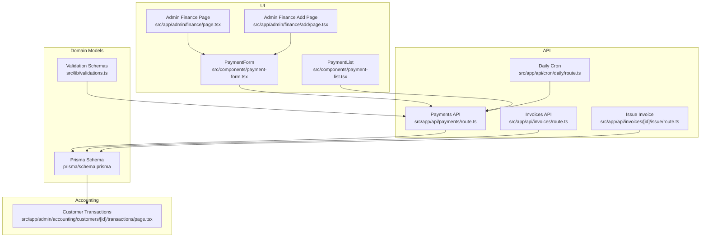
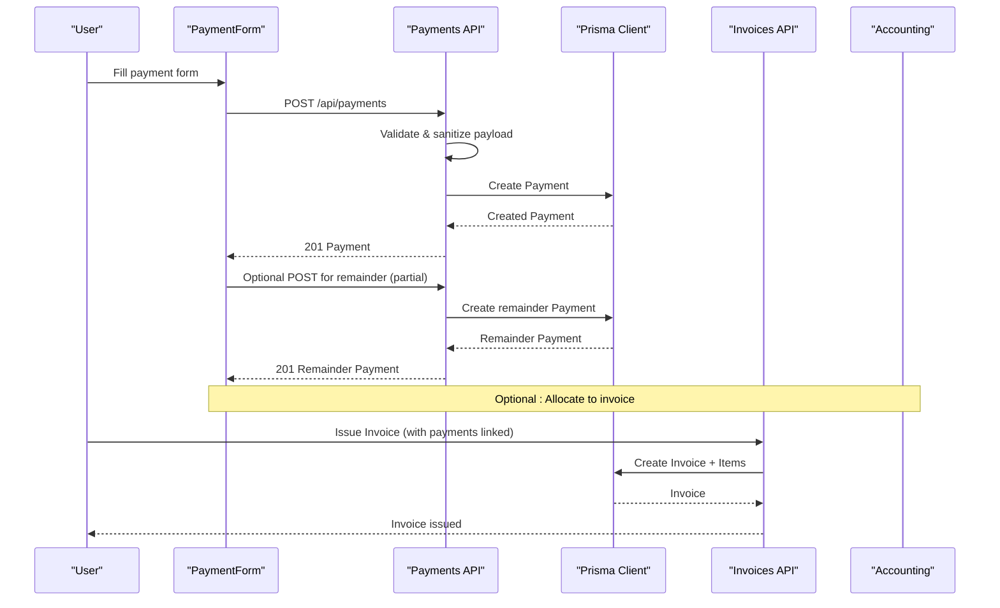
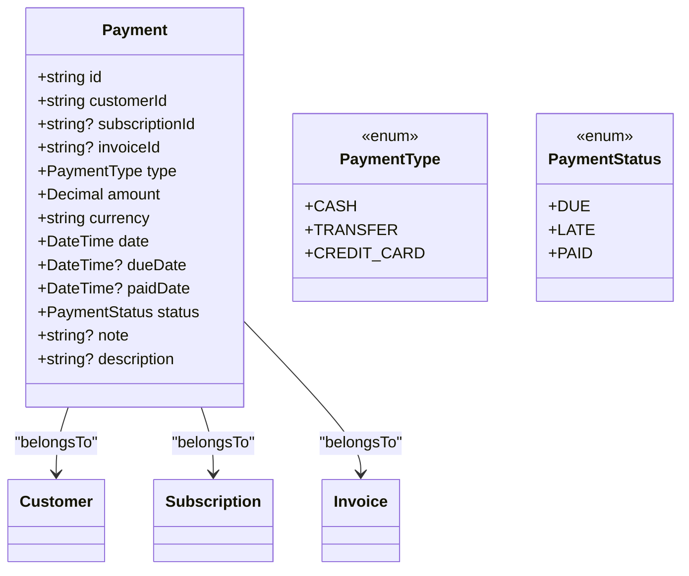
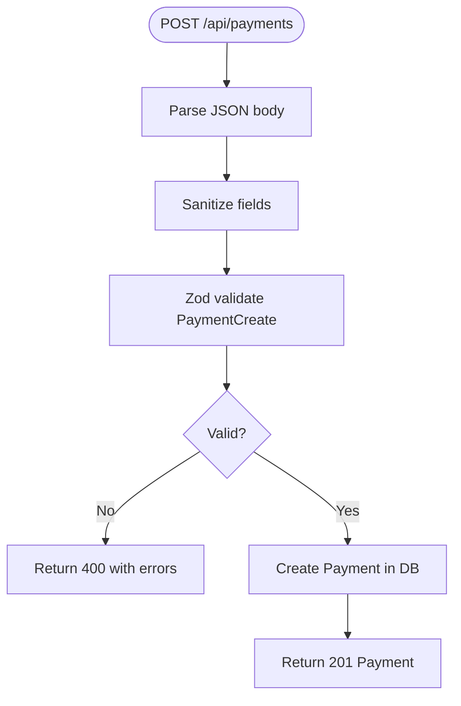
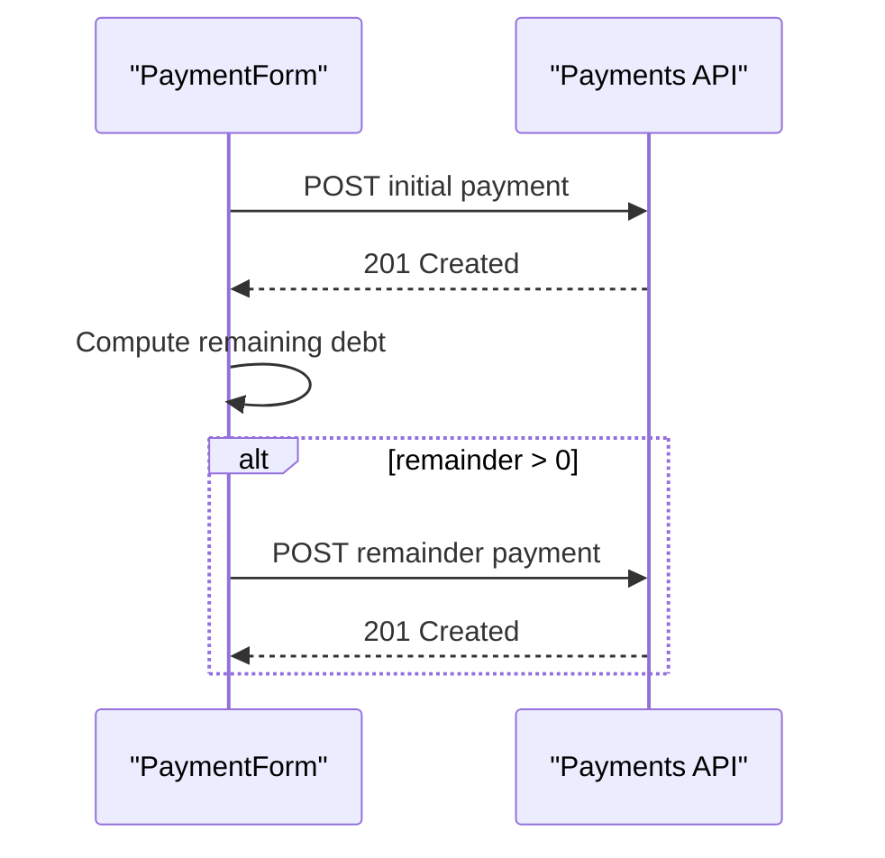
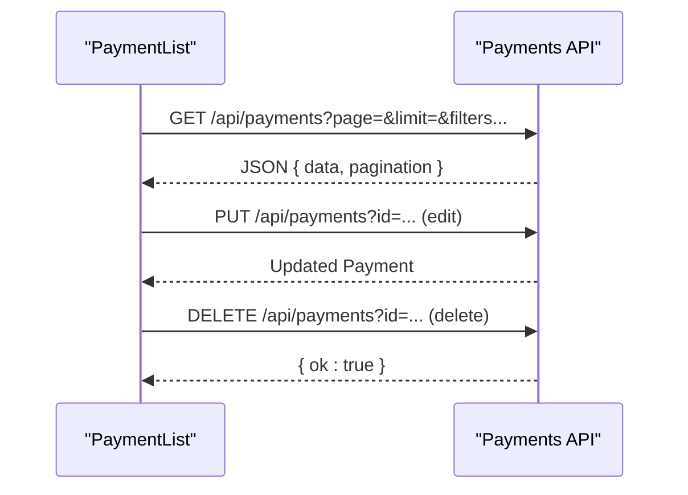
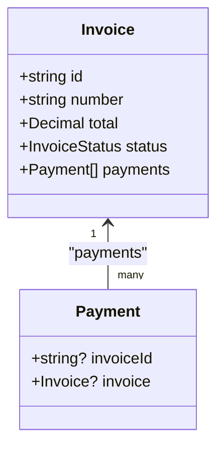
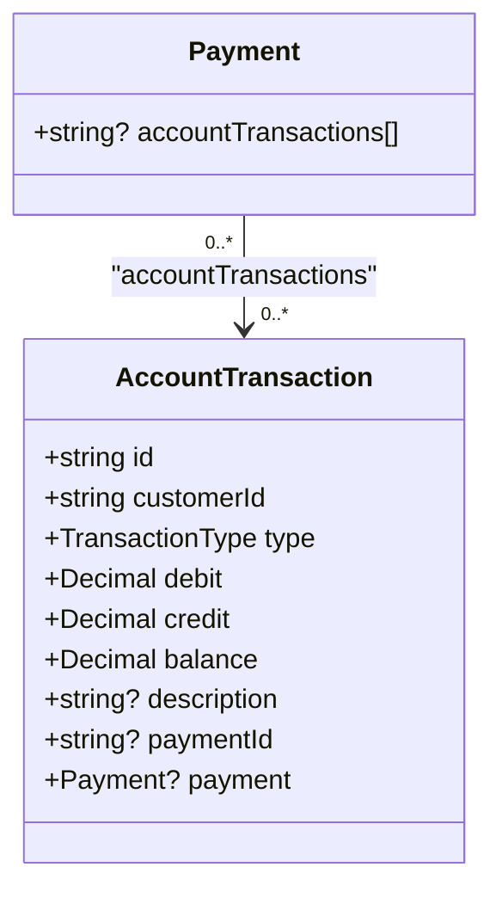
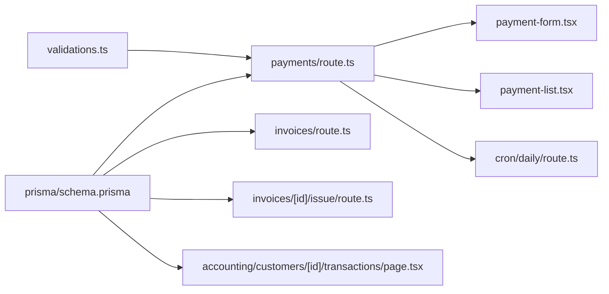

# Payment Processing

<cite>
**Referenced Files in This Document**
- [schema.prisma](file://prisma/schema.prisma)
- [route.ts](file://src/app/api/payments/route.ts)
- [payment-form.tsx](file://src/components/payment-form.tsx)
- [payment-list.tsx](file://src/components/payment-list.tsx)
- [page.tsx](file://src/app/admin/finance/page.tsx)
- [page.tsx](file://src/app/admin/finance/add/page.tsx)
- [validations.ts](file://src/lib/validations.ts)
- [route.ts](file://src/app/api/invoices/route.ts)
- [route.ts](file://src/app/api/invoices/[id]/issue/route.ts)
- [page.tsx](file://src/app/admin/accounting/customers/[id]/transactions/page.tsx)
- [route.ts](file://src/app/api/cron/daily/route.ts)
- [page.tsx](file://src/app/admin/reports/page.tsx)
- [page.tsx](file://src/app/admin/dashboard/page.tsx)
</cite>

## Table of Contents
1. [Introduction](#introduction)
2. [Project Structure](#project-structure)
3. [Core Components](#core-components)
4. [Architecture Overview](#architecture-overview)
5. [Detailed Component Analysis](#detailed-component-analysis)
6. [Dependency Analysis](#dependency-analysis)
7. [Performance Considerations](#performance-considerations)
8. [Troubleshooting Guide](#troubleshooting-guide)
9. [Conclusion](#conclusion)
10. [Appendices](#appendices)

## Introduction
This document explains the payment processing capabilities implemented in the system. It covers payment method types, creation and management of payments, allocation to subscriptions and invoices, partial payment handling, reconciliation and cash book integration via account transactions, validation rules, duplicate detection strategies, refund processing, and integration with accounting systems for accurate financial reporting. The goal is to provide a practical guide for both technical and non-technical users to operate and maintain the payment workflows effectively.

## Project Structure
The payment processing feature spans UI components, API endpoints, validation schemas, and database models. Payments are stored in the database with optional links to subscriptions and invoices. Accounting integrations are handled through account transactions that track debits, credits, and running balances per customer.

**Diagram sources**
- [payment-form.tsx:1-361](file://src/components/payment-form.tsx#L1-L361)
- [payment-list.tsx:1-285](file://src/components/payment-list.tsx#L1-L285)
- [page.tsx:1-32](file://src/app/admin/finance/page.tsx#L1-L32)
- [page.tsx:1-15](file://src/app/admin/finance/add/page.tsx#L1-L15)
- [route.ts:1-117](file://src/app/api/payments/route.ts#L1-L117)
- [route.ts:1-170](file://src/app/api/invoices/route.ts#L1-L170)
- [route.ts:51-100](file://src/app/api/invoices/[id]/issue/route.ts#L51-L100)
- [route.ts:76-99](file://src/app/api/cron/daily/route.ts#L76-L99)
- [schema.prisma:305-343](file://prisma/schema.prisma#L305-L343)
- [validations.ts:167-177](file://src/lib/validations.ts#L167-L177)
- [page.tsx:1-216](file://src/app/admin/accounting/customers/[id]/transactions/page.tsx#L1-L216)

**Section sources**
- [payment-form.tsx:1-361](file://src/components/payment-form.tsx#L1-L361)
- [payment-list.tsx:1-285](file://src/components/payment-list.tsx#L1-L285)
- [page.tsx:1-32](file://src/app/admin/finance/page.tsx#L1-L32)
- [page.tsx:1-15](file://src/app/admin/finance/add/page.tsx#L1-L15)
- [route.ts:1-117](file://src/app/api/payments/route.ts#L1-L117)
- [route.ts:1-170](file://src/app/api/invoices/route.ts#L1-L170)
- [route.ts:51-100](file://src/app/api/invoices/[id]/issue/route.ts#L51-L100)
- [route.ts:76-99](file://src/app/api/cron/daily/route.ts#L76-L99)
- [schema.prisma:305-343](file://prisma/schema.prisma#L305-L343)
- [validations.ts:167-177](file://src/lib/validations.ts#L167-L177)
- [page.tsx:1-216](file://src/app/admin/accounting/customers/[id]/transactions/page.tsx#L1-L216)

## Core Components
- Payment entity with support for multiple payment types (cash, transfer, credit card), amounts, dates, status, and optional subscription/invoice linkage.
- Payment creation and update endpoints with strict validation and sanitization.
- Frontend forms for creating and editing payments, including automatic debt computation for subscriptions and subsequent partial payment allocation.
- Payment listing with filters (status, customer, subscription, due date range, currency) and pagination.
- Accounting integration via account transactions that record debits/credits and running balances per customer.
- Daily cron job to notify external systems about due payments.

**Section sources**
- [schema.prisma:299-343](file://prisma/schema.prisma#L299-L343)
- [route.ts:53-116](file://src/app/api/payments/route.ts#L53-L116)
- [validations.ts:167-177](file://src/lib/validations.ts#L167-L177)
- [payment-form.tsx:100-152](file://src/components/payment-form.tsx#L100-L152)
- [payment-list.tsx:36-140](file://src/components/payment-list.tsx#L36-L140)
- [page.tsx:55-73](file://src/app/admin/accounting/customers/[id]/transactions/page.tsx#L55-L73)
- [route.ts:76-99](file://src/app/api/cron/daily/route.ts#L76-L99)

## Architecture Overview
The payment lifecycle integrates UI, API, validation, persistence, and accounting:

**Diagram sources**
- [payment-form.tsx:100-152](file://src/components/payment-form.tsx#L100-L152)
- [route.ts:53-76](file://src/app/api/payments/route.ts#L53-L76)
- [route.ts:80-156](file://src/app/api/invoices/route.ts#L80-L156)
- [schema.prisma:305-343](file://prisma/schema.prisma#L305-L343)

## Detailed Component Analysis

### Payment Entity and Types
- PaymentType supports cash, transfer, and credit card.
- Payment includes amount, currency, date, dueDate, paidDate, status, optional subscription and invoice relations, and optional description.
- Payment status supports DUE, LATE, PAID.

**Diagram sources**
- [schema.prisma:299-343](file://prisma/schema.prisma#L299-L343)

**Section sources**
- [schema.prisma:299-343](file://prisma/schema.prisma#L299-L343)

### Payment Creation and Validation
- Validation enforces required fields, numeric amount, valid date formats, and acceptable status values.
- Sanitization cleans incoming data before parsing.
- API creates Payment with normalized dates and status.

**Diagram sources**
- [route.ts:53-76](file://src/app/api/payments/route.ts#L53-L76)
- [validations.ts:167-177](file://src/lib/validations.ts#L167-L177)

**Section sources**
- [route.ts:53-76](file://src/app/api/payments/route.ts#L53-L76)
- [validations.ts:167-177](file://src/lib/validations.ts#L167-L177)

### Payment Allocation to Subscriptions and Automatic Remainder
- When a subscription is selected, the form computes outstanding debt for that subscription.
- If the entered payment amount is less than the debt, a second payment is automatically posted for the remainder with an adjusted due date (based on subscription period).
- This enables partial payment handling and automatic allocation.

**Diagram sources**
- [payment-form.tsx:87-152](file://src/components/payment-form.tsx#L87-L152)
- [route.ts:53-76](file://src/app/api/payments/route.ts#L53-L76)

**Section sources**
- [payment-form.tsx:87-152](file://src/components/payment-form.tsx#L87-L152)

### Payment Listing, Filtering, and Editing
- Paginated listing with filters for customer, subscription, status, due date range, and currency.
- Edit dialog updates payment fields with validation.
- Delete removes a payment.

**Diagram sources**
- [payment-list.tsx:36-140](file://src/components/payment-list.tsx#L36-L140)
- [route.ts:7-116](file://src/app/api/payments/route.ts#L7-L116)

**Section sources**
- [payment-list.tsx:36-140](file://src/components/payment-list.tsx#L36-L140)
- [route.ts:7-116](file://src/app/api/payments/route.ts#L7-L116)

### Payment-Invoice Relationship and Allocation
- Payments can be linked to invoices via the invoiceId relation.
- Invoices are created with items and totals; payments can later be associated to invoices to reflect allocations.
- The system tracks payments per invoice for partial and full settlements.

**Diagram sources**
- [schema.prisma:646-693](file://prisma/schema.prisma#L646-L693)

**Section sources**
- [schema.prisma:646-693](file://prisma/schema.prisma#L646-L693)
- [route.ts:80-156](file://src/app/api/invoices/route.ts#L80-L156)

### Cash Book and Reconciliation Integration
- Account transactions record debits, credits, and running balances per customer.
- Each payment can be reflected as a credit entry in the customer’s account transactions.
- The customer transactions page displays the ledger with debits/credits and running balance, enabling reconciliation.

**Diagram sources**
- [schema.prisma:509-539](file://prisma/schema.prisma#L509-L539)

**Section sources**
- [schema.prisma:509-539](file://prisma/schema.prisma#L509-L539)
- [page.tsx:55-73](file://src/app/admin/accounting/customers/[id]/transactions/page.tsx#L55-L73)

### Bank Statement Matching and Bank Transfer Handling
- Supported PaymentType includes TRANSFER for bank transfers.
- While direct bank statement import is not shown in the referenced files, the system can:
  - Record bank transfers as payments with type TRANSFER.
  - Link payments to invoices for allocation.
  - Use account transactions for reconciliation against recorded entries.

**Section sources**
- [schema.prisma:299-303](file://prisma/schema.prisma#L299-L303)
- [schema.prisma:509-539](file://prisma/schema.prisma#L509-L539)

### Refund Processing
- Refunds are modeled as credits in the accounting system (credit entries).
- The account transaction model supports credits and running balances suitable for refund entries.
- No explicit refund API is present in the referenced files; refunds would be handled via account transactions and possibly invoice adjustments outside the referenced code.

**Section sources**
- [schema.prisma:518-523](file://prisma/schema.prisma#L518-L523)
- [schema.prisma:509-539](file://prisma/schema.prisma#L509-L539)

### Duplicate Detection
- No explicit duplicate detection logic is present in the referenced files.
- Recommended strategies:
  - Unique constraint on combination of payer, amount, currency, and date.
  - Dedupe checks before creating payments.
  - Use webhook signatures and idempotency keys for external integrations.

[No sources needed since this section provides general guidance]

### Payment Reconciliation Workflows
- Use the customer transactions page to reconcile payments against account transactions.
- Compare recorded payments, account transaction credits, and invoice allocations.
- Investigate discrepancies by reviewing payment notes and descriptions.

**Section sources**
- [page.tsx:142-212](file://src/app/admin/accounting/customers/[id]/transactions/page.tsx#L142-L212)

### Reporting and Dashboards
- Dashboard aggregates payment metrics (pending, late, paid counts and totals).
- Reports page shows payment counts by status for quick visibility.

**Section sources**
- [page.tsx:144-766](file://src/app/admin/dashboard/page.tsx#L144-L766)
- [page.tsx:340-372](file://src/app/admin/reports/page.tsx#L340-L372)

## Dependency Analysis
The payment feature depends on:
- Prisma models for Payment, Subscription, Invoice, and AccountTransaction.
- Zod validation schemas for input sanitization and enforcement.
- Next.js API routes for CRUD operations and cron-triggered notifications.

**Diagram sources**
- [validations.ts:167-177](file://src/lib/validations.ts#L167-L177)
- [route.ts:1-117](file://src/app/api/payments/route.ts#L1-L117)
- [schema.prisma:305-343](file://prisma/schema.prisma#L305-L343)
- [route.ts:1-170](file://src/app/api/invoices/route.ts#L1-L170)
- [route.ts:51-100](file://src/app/api/invoices/[id]/issue/route.ts#L51-L100)
- [payment-form.tsx:1-361](file://src/components/payment-form.tsx#L1-L361)
- [payment-list.tsx:1-285](file://src/components/payment-list.tsx#L1-L285)
- [route.ts:76-99](file://src/app/api/cron/daily/route.ts#L76-L99)
- [page.tsx:1-216](file://src/app/admin/accounting/customers/[id]/transactions/page.tsx#L1-L216)

**Section sources**
- [route.ts:1-117](file://src/app/api/payments/route.ts#L1-L117)
- [schema.prisma:305-343](file://prisma/schema.prisma#L305-L343)
- [validations.ts:167-177](file://src/lib/validations.ts#L167-L177)

## Performance Considerations
- Pagination limits: API enforces a maximum page size to prevent heavy queries.
- Efficient filtering: Use indexed fields (customerId, status, dueDate range) to reduce DB load.
- Batch operations: Prefer bulk updates for statuses or notes after filtering.
- Indexing: Ensure database indexes on frequently queried fields (e.g., dueDate, status, customerId).

**Section sources**
- [route.ts:10-11](file://src/app/api/payments/route.ts#L10-L11)

## Troubleshooting Guide
- Validation failures: Check amount format, date formats, and required fields.
- Sanitization errors: Ensure numeric inputs and safe strings.
- Missing id on update/delete: Provide a valid payment id.
- Cron delivery issues: Inspect webhook logs and retry mechanisms.

**Section sources**
- [route.ts:53-116](file://src/app/api/payments/route.ts#L53-L116)
- [route.ts:76-99](file://src/app/api/cron/daily/route.ts#L76-L99)

## Conclusion
The system provides robust payment creation, validation, and allocation to subscriptions and invoices, with strong accounting integration via account transactions. Partial payments are supported through automatic remainder creation. While bank statement import is not implemented in the referenced files, bank transfers are supported as a payment type and can be reconciled using account transactions. Additional enhancements such as duplicate detection, refund processing, and bank statement matching can be introduced to further strengthen the payment lifecycle.

## Appendices

### Supported Payment Methods
- Cash
- Transfer (bank transfer)
- Credit Card

**Section sources**
- [schema.prisma:299-303](file://prisma/schema.prisma#L299-L303)

### Payment Validation Rules
- Amount must be numeric and positive.
- Dates must follow YYYY-MM-DD format.
- Status must be one of DUE, LATE, PAID.
- Currency length constrained.

**Section sources**
- [validations.ts:167-177](file://src/lib/validations.ts#L167-L177)

### Payment Search and Filtering
- Filters: customer, subscription, status, due date range, currency.
- Pagination: page, limit (max 100).

**Section sources**
- [payment-list.tsx:36-140](file://src/components/payment-list.tsx#L36-L140)
- [route.ts:7-51](file://src/app/api/payments/route.ts#L7-L51)

### Batch Processing
- Use API filters to select batches of payments for bulk updates (status, notes).
- Apply updates via PUT requests with sanitized payloads.

**Section sources**
- [route.ts:90-116](file://src/app/api/payments/route.ts#L90-L116)

### Integration with Accounting Systems
- Account transactions capture debits/credits and running balances.
- Customer transactions page provides reconciliation interface.

**Section sources**
- [schema.prisma:509-539](file://prisma/schema.prisma#L509-L539)
- [page.tsx:142-212](file://src/app/admin/accounting/customers/[id]/transactions/page.tsx#L142-L212)