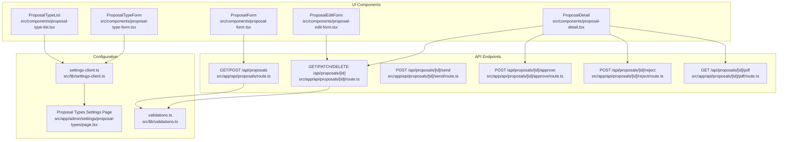
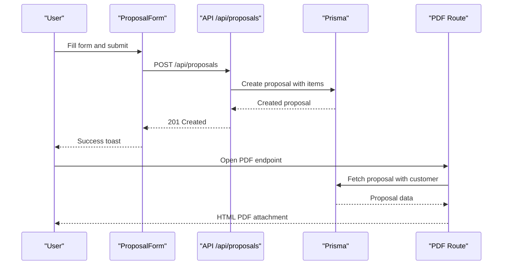
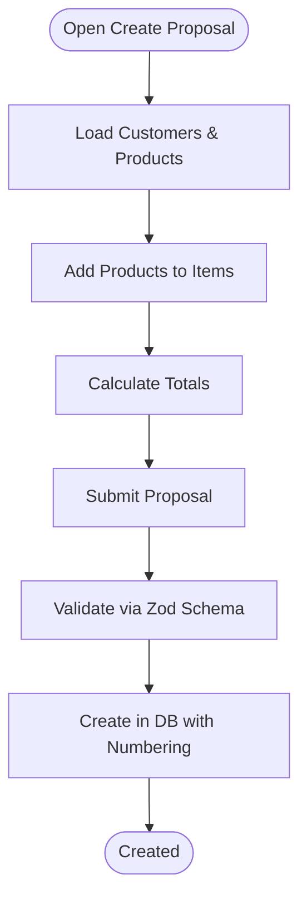
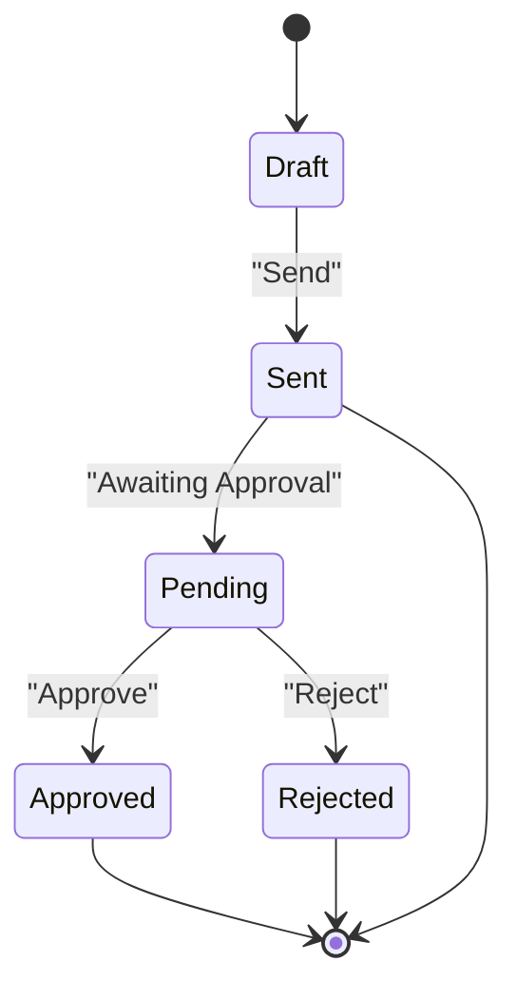
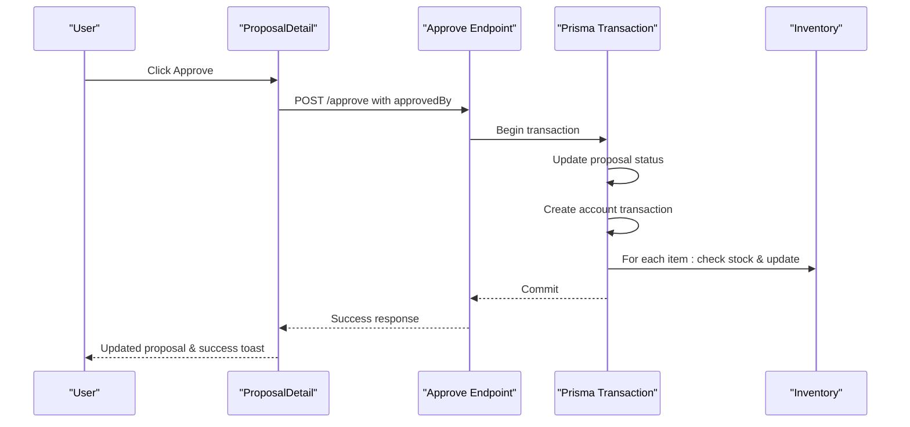
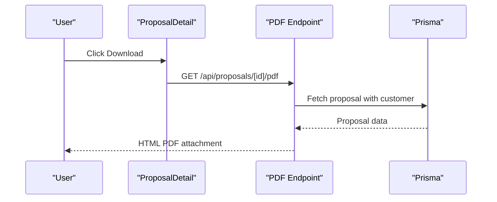
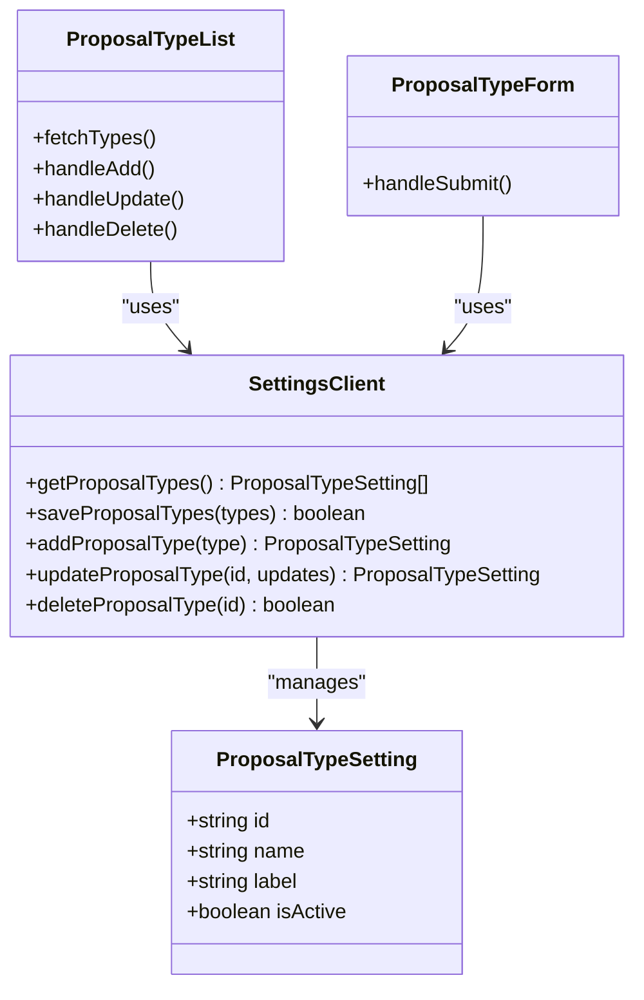
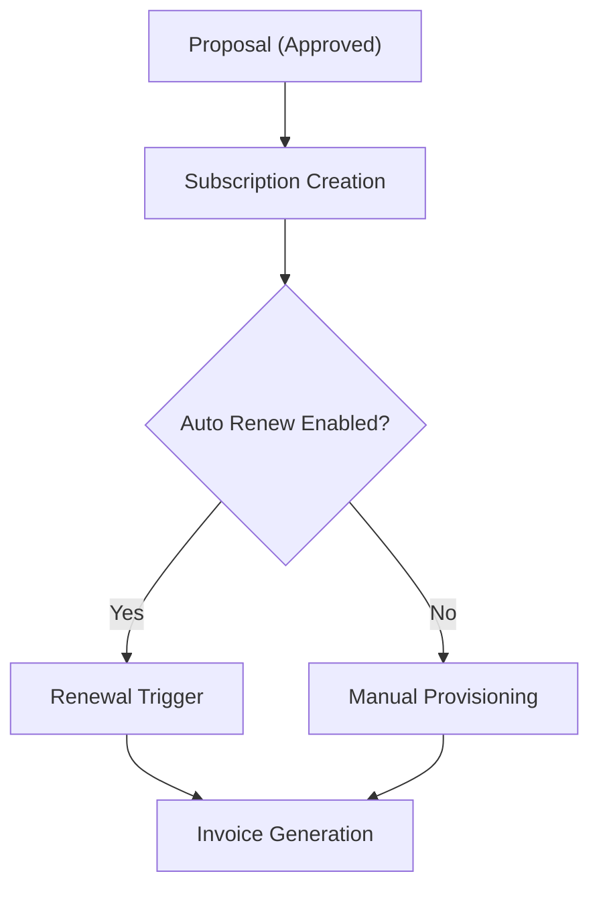
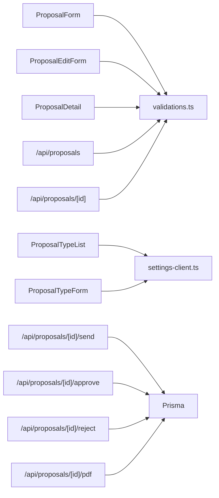

# Proposal System

<cite>
**Referenced Files in This Document**
- [proposal-form.tsx](file://src/components/proposal-form.tsx)
- [proposal-edit-form.tsx](file://src/components/proposal-edit-form.tsx)
- [proposal-detail.tsx](file://src/components/proposal-detail.tsx)
- [proposal-type-list.tsx](file://src/components/proposal-type-list.tsx)
- [proposal-type-form.tsx](file://src/components/proposal-type-form.tsx)
- [route.ts](file://src/app/api/proposals/route.ts)
- [route.ts](file://src/app/api/proposals/[id]/route.ts)
- [route.ts](file://src/app/api/proposals/[id]/pdf/route.ts)
- [route.ts](file://src/app/api/proposals/[id]/approve/route.ts)
- [route.ts](file://src/app/api/proposals/[id]/reject/route.ts)
- [route.ts](file://src/app/api/proposals/[id]/send/route.ts)
- [page.tsx](file://src/app/admin/settings/proposal-types/page.tsx)
- [settings-client.ts](file://src/lib/settings-client.ts)
- [validations.ts](file://src/lib/validations.ts)
</cite>

## Table of Contents
1. [Introduction](#introduction)
2. [Project Structure](#project-structure)
3. [Core Components](#core-components)
4. [Architecture Overview](#architecture-overview)
5. [Detailed Component Analysis](#detailed-component-analysis)
6. [Dependency Analysis](#dependency-analysis)
7. [Performance Considerations](#performance-considerations)
8. [Troubleshooting Guide](#troubleshooting-guide)
9. [Conclusion](#conclusion)

## Introduction
This document describes the complete proposal system, covering the lifecycle from creation to execution. It explains proposal templates and custom fields, pricing calculations, approval workflows, status management, PDF generation, email notifications, proposal types configuration, custom validation rules, and multi-currency support. It also documents the relationship between proposals and subscriptions, including automatic renewal triggers and service provisioning, along with practical examples of creation workflows, approvals, and invoicing integration.

## Project Structure
The proposal system spans UI components, API endpoints, validation schemas, and settings management:
- UI components for creating, editing, viewing, and managing proposals
- API endpoints for CRUD, status transitions, PDF generation, and approval/rejection
- Validation schemas ensuring data integrity
- Settings client for dynamic proposal types configuration
- Proposal types administration page

**Diagram sources**
- [proposal-form.tsx:36-192](file://src/components/proposal-form.tsx#L36-L192)
- [proposal-edit-form.tsx:41-112](file://src/components/proposal-edit-form.tsx#L41-L112)
- [proposal-detail.tsx:66-141](file://src/components/proposal-detail.tsx#L66-L141)
- [proposal-type-list.tsx:13-81](file://src/components/proposal-type-list.tsx#L13-L81)
- [proposal-type-form.tsx:22-104](file://src/components/proposal-type-form.tsx#L22-L104)
- [route.ts:6-117](file://src/app/api/proposals/route.ts#L6-L117)
- [route.ts:5-88](file://src/app/api/proposals/[id]/route.ts#L5-L88)
- [route.ts:5-47](file://src/app/api/proposals/[id]/send/route.ts#L5-L47)
- [route.ts:10-120](file://src/app/api/proposals/[id]/approve/route.ts#L10-L120)
- [route.ts:10-62](file://src/app/api/proposals/[id]/reject/route.ts#L10-L62)
- [route.ts:4-123](file://src/app/api/proposals/[id]/pdf/route.ts#L4-L123)
- [settings-client.ts:10-71](file://src/lib/settings-client.ts#L10-L71)
- [page.tsx:7-22](file://src/app/admin/settings/proposal-types/page.tsx#L7-L22)
- [validations.ts:190-242](file://src/lib/validations.ts#L190-L242)

**Section sources**
- [proposal-form.tsx:36-192](file://src/components/proposal-form.tsx#L36-L192)
- [proposal-edit-form.tsx:41-112](file://src/components/proposal-edit-form.tsx#L41-L112)
- [proposal-detail.tsx:66-141](file://src/components/proposal-detail.tsx#L66-L141)
- [proposal-type-list.tsx:13-81](file://src/components/proposal-type-list.tsx#L13-L81)
- [proposal-type-form.tsx:22-104](file://src/components/proposal-type-form.tsx#L22-L104)
- [route.ts:6-117](file://src/app/api/proposals/route.ts#L6-L117)
- [route.ts:5-88](file://src/app/api/proposals/[id]/route.ts#L5-L88)
- [route.ts:5-47](file://src/app/api/proposals/[id]/send/route.ts#L5-L47)
- [route.ts:10-120](file://src/app/api/proposals/[id]/approve/route.ts#L10-L120)
- [route.ts:10-62](file://src/app/api/proposals/[id]/reject/route.ts#L10-L62)
- [route.ts:4-123](file://src/app/api/proposals/[id]/pdf/route.ts#L4-L123)
- [settings-client.ts:10-71](file://src/lib/settings-client.ts#L10-L71)
- [page.tsx:7-22](file://src/app/admin/settings/proposal-types/page.tsx#L7-L22)
- [validations.ts:190-242](file://src/lib/validations.ts#L190-L242)

## Core Components
- Proposal creation form with dynamic items, totals calculation, and validation
- Proposal edit form with status transitions and multi-currency support
- Proposal detail view with approval/rejection actions and PDF download
- Proposal types management with dynamic configuration via settings
- API endpoints for proposal lifecycle operations and PDF generation

Key behaviors:
- Pricing calculations are computed client-side and persisted server-side
- Proposal types are configurable and filterable by activity
- Approval workflow updates status, creates account transactions, and manages inventory
- PDF generation renders proposal details into HTML for download

**Section sources**
- [proposal-form.tsx:166-170](file://src/components/proposal-form.tsx#L166-L170)
- [proposal-edit-form.tsx:23-23](file://src/components/proposal-edit-form.tsx#L23-L23)
- [proposal-detail.tsx:155-161](file://src/components/proposal-detail.tsx#L155-L161)
- [settings-client.ts:10-31](file://src/lib/settings-client.ts#L10-L31)
- [route.ts:38-111](file://src/app/api/proposals/[id]/pdf/route.ts#L38-L111)

## Architecture Overview
The proposal system follows a layered architecture:
- Presentation layer: React components for forms, lists, and detail views
- API layer: Next.js routes handling proposal operations
- Validation layer: Zod schemas enforcing data integrity
- Persistence layer: Prisma ORM interacting with the database
- Configuration layer: Dynamic settings for proposal types

**Diagram sources**
- [proposal-form.tsx:172-192](file://src/components/proposal-form.tsx#L172-L192)
- [route.ts:58-117](file://src/app/api/proposals/route.ts#L58-L117)
- [route.ts:4-123](file://src/app/api/proposals/[id]/pdf/route.ts#L4-L123)

## Detailed Component Analysis

### Proposal Creation Workflow
The creation workflow involves:
- Loading customers and products
- Building items with quantity, unit price, and total price
- Calculating totals and submitting the proposal
- Generating a sequential proposal number

**Diagram sources**
- [proposal-form.tsx:87-138](file://src/components/proposal-form.tsx#L87-L138)
- [proposal-form.tsx:166-170](file://src/components/proposal-form.tsx#L166-L170)
- [route.ts:58-117](file://src/app/api/proposals/route.ts#L58-L117)
- [validations.ts:200-233](file://src/lib/validations.ts#L200-L233)

**Section sources**
- [proposal-form.tsx:87-138](file://src/components/proposal-form.tsx#L87-L138)
- [proposal-form.tsx:166-170](file://src/components/proposal-form.tsx#L166-L170)
- [route.ts:58-117](file://src/app/api/proposals/route.ts#L58-L117)
- [validations.ts:200-233](file://src/lib/validations.ts#L200-L233)

### Proposal Status Management
Proposal statuses include draft, sent, pending, approved, rejected, and expired. Transitions are enforced by API endpoints:
- Draft → Sent: Send endpoint
- Sent/Pending → Approved: Approve endpoint (with transaction and inventory adjustments)
- Sent/Pending → Rejected: Reject endpoint
- Pending → Expired: Manual update or external process

**Diagram sources**
- [route.ts:21-26](file://src/app/api/proposals/[id]/send/route.ts#L21-L26)
- [route.ts:37-42](file://src/app/api/proposals/[id]/approve/route.ts#L37-L42)
- [route.ts:29-34](file://src/app/api/proposals/[id]/reject/route.ts#L29-L34)
- [proposal-edit-form.tsx:137-148](file://src/components/proposal-edit-form.tsx#L137-L148)

**Section sources**
- [route.ts:21-26](file://src/app/api/proposals/[id]/send/route.ts#L21-L26)
- [route.ts:37-42](file://src/app/api/proposals/[id]/approve/route.ts#L37-L42)
- [route.ts:29-34](file://src/app/api/proposals/[id]/reject/route.ts#L29-L34)
- [proposal-edit-form.tsx:137-148](file://src/components/proposal-edit-form.tsx#L137-L148)

### Approval Workflow and Inventory Integration
The approval process performs:
- Status update to approved
- Creation of an account transaction (debit for proposal amount)
- Stock movements and inventory updates for each item
- Atomic transaction to ensure consistency

**Diagram sources**
- [proposal-detail.tsx:105-122](file://src/components/proposal-detail.tsx#L105-L122)
- [route.ts:44-101](file://src/app/api/proposals/[id]/approve/route.ts#L44-L101)

**Section sources**
- [proposal-detail.tsx:105-122](file://src/components/proposal-detail.tsx#L105-L122)
- [route.ts:44-101](file://src/app/api/proposals/[id]/approve/route.ts#L44-L101)

### PDF Generation
The PDF endpoint generates an HTML document containing:
- Company header and title
- Customer information
- Proposal details (type, validity, status)
- Amount and notes
- Footer with issue date and proposal ID

**Diagram sources**
- [proposal-detail.tsx:188-193](file://src/components/proposal-detail.tsx#L188-L193)
- [route.ts:4-123](file://src/app/api/proposals/[id]/pdf/route.ts#L4-L123)

**Section sources**
- [proposal-detail.tsx:188-193](file://src/components/proposal-detail.tsx#L188-L193)
- [route.ts:4-123](file://src/app/api/proposals/[id]/pdf/route.ts#L4-L123)

### Proposal Types Configuration
Proposal types are managed dynamically:
- List current types and toggle activity
- Add/update/delete types
- Persist to settings storage
- Forms enforce technical names and readable labels

**Diagram sources**
- [settings-client.ts:1-71](file://src/lib/settings-client.ts#L1-L71)
- [proposal-type-list.tsx:13-81](file://src/components/proposal-type-list.tsx#L13-L81)
- [proposal-type-form.tsx:22-104](file://src/components/proposal-type-form.tsx#L22-L104)

**Section sources**
- [settings-client.ts:10-71](file://src/lib/settings-client.ts#L10-L71)
- [proposal-type-list.tsx:13-81](file://src/components/proposal-type-list.tsx#L13-L81)
- [proposal-type-form.tsx:22-104](file://src/components/proposal-type-form.tsx#L22-L104)
- [page.tsx:7-22](file://src/app/admin/settings/proposal-types/page.tsx#L7-L22)

### Multi-Currency Support
The system supports multiple currencies:
- Currency selection in the edit form
- Amount formatting in detail view and PDF
- Default currency configured in validation schema

**Section sources**
- [proposal-edit-form.tsx:241-244](file://src/components/proposal-edit-form.tsx#L241-L244)
- [proposal-detail.tsx:240-246](file://src/components/proposal-detail.tsx#L240-L246)
- [route.ts:100-101](file://src/app/api/proposals/[id]/pdf/route.ts#L100-L101)
- [validations.ts:208-208](file://src/lib/validations.ts#L208-L208)

### Email Notification System
There is no dedicated email notification module in the reviewed files. Notifications are handled via toast messages in the UI for user feedback during operations such as creation, updates, and approvals.

**Section sources**
- [proposal-form.tsx:185-188](file://src/components/proposal-form.tsx#L185-L188)
- [proposal-edit-form.tsx:85-88](file://src/components/proposal-edit-form.tsx#L85-L88)
- [proposal-detail.tsx:114-118](file://src/components/proposal-detail.tsx#L114-L118)

### Relationship Between Proposals and Subscriptions
Subscriptions can be linked to proposals:
- Subscription creation requires a proposal type when applicable
- Validation enforces non-empty proposal type when provided
- Automatic renewal and provisioning are governed by subscription logic

**Diagram sources**
- [validations.ts:118-127](file://src/lib/validations.ts#L118-L127)

**Section sources**
- [validations.ts:118-127](file://src/lib/validations.ts#L118-L127)

## Dependency Analysis
- UI components depend on:
  - Zod schemas for validation
  - Settings client for proposal types
  - API routes for persistence and operations
- API routes depend on:
  - Prisma for database operations
  - Zod schemas for request validation
- Settings client depends on:
  - Settings API for storage

**Diagram sources**
- [proposal-form.tsx:12-14](file://src/components/proposal-form.tsx#L12-L14)
- [proposal-edit-form.tsx:12-14](file://src/components/proposal-edit-form.tsx#L12-L14)
- [proposal-detail.tsx:11-11](file://src/components/proposal-detail.tsx#L11-L11)
- [proposal-type-list.tsx:9-9](file://src/components/proposal-type-list.tsx#L9-L9)
- [proposal-type-form.tsx:22-22](file://src/components/proposal-type-form.tsx#L22-L22)
- [route.ts:3-4](file://src/app/api/proposals/route.ts#L3-L4)
- [route.ts:3-3](file://src/app/api/proposals/[id]/route.ts#L3-L3)
- [route.ts:1-2](file://src/app/api/proposals/[id]/send/route.ts#L1-L2)
- [route.ts:1-2](file://src/app/api/proposals/[id]/approve/route.ts#L1-L2)
- [route.ts:1-2](file://src/app/api/proposals/[id]/reject/route.ts#L1-L2)
- [route.ts:1-2](file://src/app/api/proposals/[id]/pdf/route.ts#L1-L2)

**Section sources**
- [proposal-form.tsx:12-14](file://src/components/proposal-form.tsx#L12-L14)
- [proposal-edit-form.tsx:12-14](file://src/components/proposal-edit-form.tsx#L12-L14)
- [proposal-detail.tsx:11-11](file://src/components/proposal-detail.tsx#L11-L11)
- [proposal-type-list.tsx:9-9](file://src/components/proposal-type-list.tsx#L9-L9)
- [proposal-type-form.tsx:22-22](file://src/components/proposal-type-form.tsx#L22-L22)
- [route.ts:3-4](file://src/app/api/proposals/route.ts#L3-L4)
- [route.ts:3-3](file://src/app/api/proposals/[id]/route.ts#L3-L3)
- [route.ts:1-2](file://src/app/api/proposals/[id]/send/route.ts#L1-L2)
- [route.ts:1-2](file://src/app/api/proposals/[id]/approve/route.ts#L1-L2)
- [route.ts:1-2](file://src/app/api/proposals/[id]/reject/route.ts#L1-L2)
- [route.ts:1-2](file://src/app/api/proposals/[id]/pdf/route.ts#L1-L2)

## Performance Considerations
- Client-side totals calculation reduces server load during form edits
- Pagination and filtering in proposal listing reduce payload sizes
- Single transaction for approval ensures atomicity and avoids partial updates
- PDF generation is lightweight HTML rendering suitable for small documents

## Troubleshooting Guide
Common issues and resolutions:
- Validation errors on submission: Ensure required fields meet schema constraints (customer, title length, amount positivity, date format)
- Approval failures: Verify proposal status is SENT or PENDING and that inventory quantities are sufficient
- PDF generation errors: Confirm proposal exists and endpoint is reachable
- Proposal types not appearing: Check type activity flag and settings persistence

**Section sources**
- [validations.ts:214-233](file://src/lib/validations.ts#L214-L233)
- [route.ts:37-42](file://src/app/api/proposals/[id]/approve/route.ts#L37-L42)
- [route.ts:19-21](file://src/app/api/proposals/[id]/pdf/route.ts#L19-L21)
- [settings-client.ts:10-31](file://src/lib/settings-client.ts#L10-L31)

## Conclusion
The proposal system provides a robust lifecycle from creation to execution, with strong validation, dynamic configuration, and integrated financial operations. It supports multi-currency, PDF generation, and approval workflows that connect to inventory and accounting. The modular design allows easy extension for additional proposal types, custom fields, and integrations.