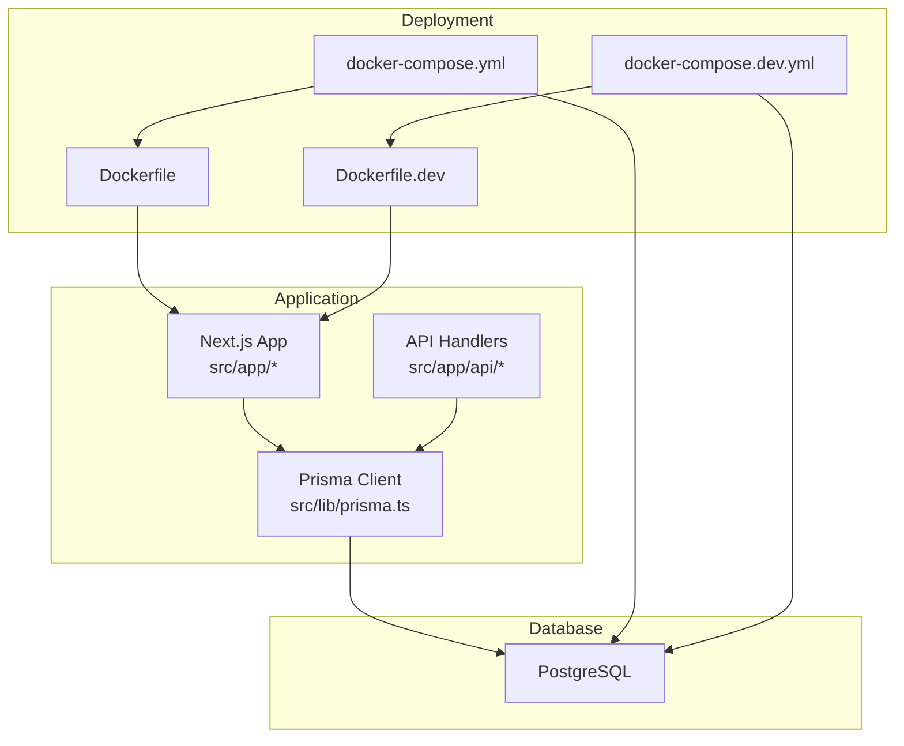
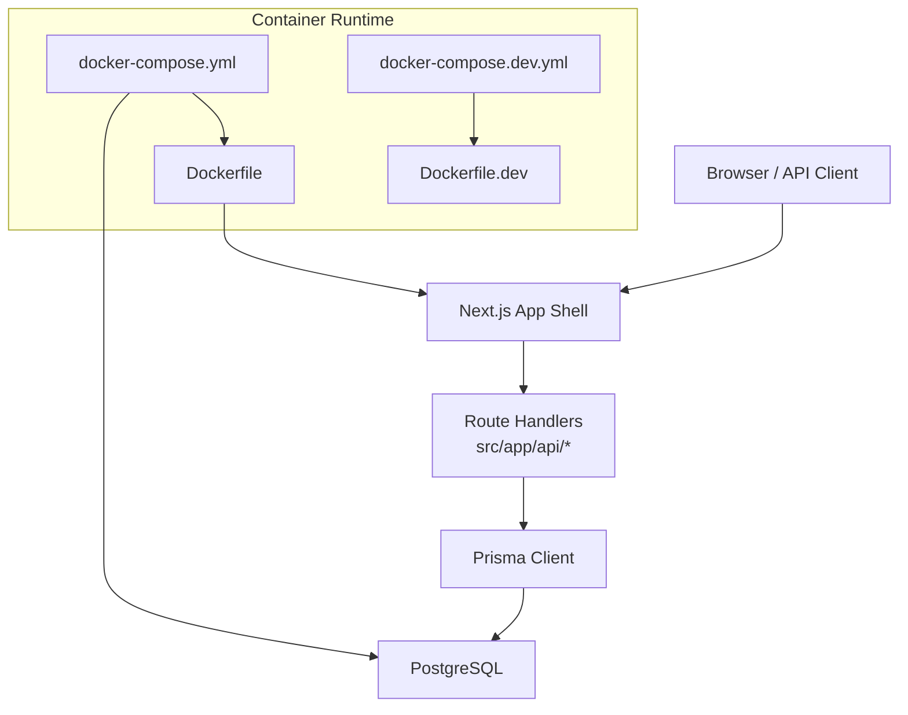
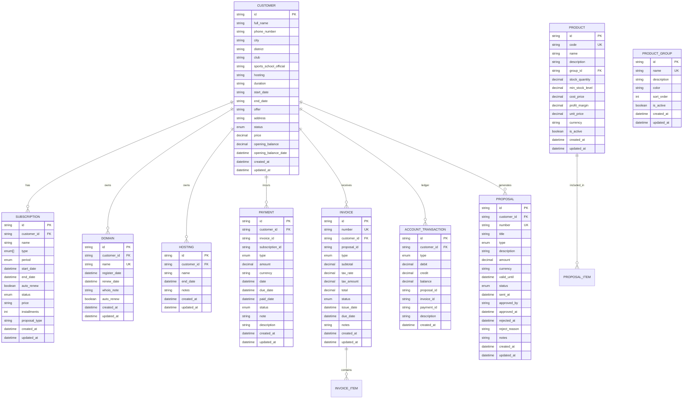
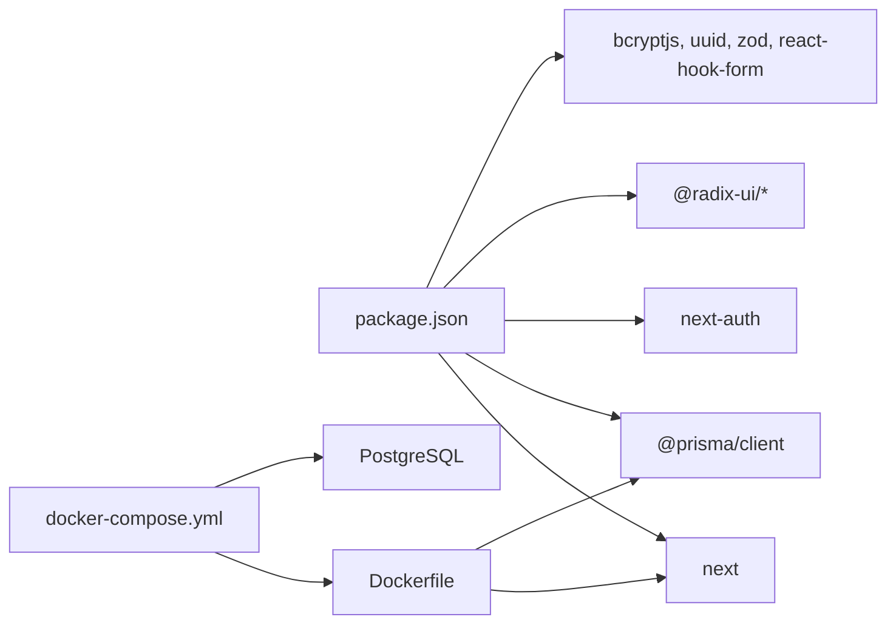

# Getting Started

<cite>
**Referenced Files in This Document**
- [README.md](file://README.md)
- [README-Docker.md](file://README-Docker.md)
- [package.json](file://package.json)
- [next.config.ts](file://next.config.ts)
- [tsconfig.json](file://tsconfig.json)
- [Dockerfile](file://Dockerfile)
- [Dockerfile.dev](file://Dockerfile.dev)
- [docker-compose.yml](file://docker-compose.yml)
- [docker-compose.dev.yml](file://docker-compose.dev.yml)
- [docker-healthcheck.js](file://docker-healthcheck.js)
- [prisma/schema.prisma](file://prisma/schema.prisma)
- [src/lib/prisma.ts](file://src/lib/prisma.ts)
- [scripts/docker-setup.sh](file://scripts/docker-setup.sh)
- [scripts/seed.js](file://scripts/seed.js)
- [VERIFICATION_SUMMARY.md](file://VERIFICATION_SUMMARY.md)
- [ENVIRONMENT_VERIFICATION_REPORT.md](file://ENVIRONMENT_VERIFICATION_REPORT.md)
</cite>

## Table of Contents
1. [Introduction](#introduction)
2. [Project Structure](#project-structure)
3. [Core Components](#core-components)
4. [Architecture Overview](#architecture-overview)
5. [Detailed Component Analysis](#detailed-component-analysis)
6. [Dependency Analysis](#dependency-analysis)
7. [Performance Considerations](#performance-considerations)
8. [Troubleshooting Guide](#troubleshooting-guide)
9. [Conclusion](#conclusion)
10. [Appendices](#appendices)

## Introduction
Customer WebMahsul is a Next.js 15 application with TypeScript, Prisma ORM, and PostgreSQL. It provides a modern admin and customer portal for managing customers, subscriptions, domains, hosting, proposals, invoices, inventory, and accounting. This guide helps you install prerequisites, configure the environment, set up the database, seed data, and launch the application in development and Dockerized production-like environments. It also covers production deployment options, environment variable configuration, verification steps, and troubleshooting.

## Project Structure
At a high level, the project consists of:
- Frontend and API routes under src/app
- Backend services and API handlers under src/app/api
- Prisma schema and migrations under prisma
- Docker assets for local and production deployments
- Scripts for seeding and Docker orchestration
- Configuration files for Next.js, TypeScript, and linting

**Diagram sources**
- [Dockerfile:1-73](file://Dockerfile#L1-L73)
- [docker-compose.yml:1-49](file://docker-compose.yml#L1-L49)
- [Dockerfile.dev:1-20](file://Dockerfile.dev#L1-L20)
- [docker-compose.dev.yml:1-47](file://docker-compose.dev.yml#L1-L47)
- [src/lib/prisma.ts:1-9](file://src/lib/prisma.ts#L1-L9)
- [prisma/schema.prisma:1-756](file://prisma/schema.prisma#L1-L756)

**Section sources**
- [README.md:1-37](file://README.md#L1-L37)
- [package.json:1-64](file://package.json#L1-L64)
- [next.config.ts:1-14](file://next.config.ts#L1-L14)
- [tsconfig.json:1-28](file://tsconfig.json#L1-L28)

## Core Components
- Next.js App Shell and Pages: Entry points under src/app define pages and layouts for admin, customer, portal, and API routes.
- Prisma ORM: Provides strongly-typed database access and integrates with PostgreSQL via DATABASE_URL.
- Docker Images and Compose: Two Dockerfiles and two compose files support development and production builds.
- Health Check: A Node-based health check verifies the application’s readiness at runtime.

Key capabilities:
- Admin dashboard, customer management, subscriptions, domains, hosting, proposals, invoices, and accounting
- Authentication via NextAuth (configured via environment variables)
- File uploads stored under public/uploads

**Section sources**
- [prisma/schema.prisma:1-756](file://prisma/schema.prisma#L1-L756)
- [src/lib/prisma.ts:1-9](file://src/lib/prisma.ts#L1-L9)
- [Dockerfile:1-73](file://Dockerfile#L1-L73)
- [docker-compose.yml:1-49](file://docker-compose.yml#L1-L49)
- [Dockerfile.dev:1-20](file://Dockerfile.dev#L1-L20)
- [docker-compose.dev.yml:1-47](file://docker-compose.dev.yml#L1-L47)
- [docker-healthcheck.js:1-39](file://docker-healthcheck.js#L1-L39)

## Architecture Overview
The system follows a layered architecture:
- Presentation Layer: Next.js app shell and pages
- API Layer: Route handlers under src/app/api
- Persistence Layer: Prisma client connecting to PostgreSQL
- Containerization: Docker images and compose orchestration

**Diagram sources**
- [docker-compose.yml:1-49](file://docker-compose.yml#L1-L49)
- [Dockerfile:1-73](file://Dockerfile#L1-L73)
- [docker-compose.dev.yml:1-47](file://docker-compose.dev.yml#L1-L47)
- [Dockerfile.dev:1-20](file://Dockerfile.dev#L1-L20)
- [src/lib/prisma.ts:1-9](file://src/lib/prisma.ts#L1-L9)
- [prisma/schema.prisma:1-756](file://prisma/schema.prisma#L1-L756)

## Detailed Component Analysis

### Prerequisites
- Node.js: The project uses Next.js 15 and relies on npm scripts. Ensure Node.js LTS is installed.
- Docker: Required for Docker-based deployment and development environments.
- PostgreSQL: Used by Prisma; either run locally or via Docker Compose.

Verification:
- Confirm Docker and Docker Compose availability using the provided setup script.

**Section sources**
- [README-Docker.md:5-11](file://README-Docker.md#L5-L11)
- [scripts/docker-setup.sh:8-18](file://scripts/docker-setup.sh#L8-L18)

### Step-by-Step Installation and Environment Setup
1. Clone the repository and install dependencies
   - Use your preferred package manager to install dependencies as defined in package.json.

2. Prepare the environment
   - Create the uploads directory if missing.
   - Copy the Docker environment template to .env.production and adjust variables for production.

3. Start the database
   - Use Docker Compose to start PostgreSQL in the background.

4. Initialize Prisma
   - Generate Prisma client and apply migrations.

5. Seed data (optional)
   - Run the seed script to populate initial customer records.

6. Launch the application
   - Start the Next.js dev server or use Docker Compose for a production-like environment.

**Section sources**
- [scripts/docker-setup.sh:22-31](file://scripts/docker-setup.sh#L22-L31)
- [docker-compose.yml:3-16](file://docker-compose.yml#L3-L16)
- [Dockerfile:20-25](file://Dockerfile#L20-L25)
- [scripts/seed.js:1-76](file://scripts/seed.js#L1-L76)
- [README.md:5-15](file://README.md#L5-L15)

### Database Configuration
- Prisma datasource uses PostgreSQL and reads DATABASE_URL from the environment.
- The schema defines core business entities including customers, subscriptions, domains, hosting, proposals, invoices, products, and accounting tables.
- Migrations are managed under prisma/migrations and applied at startup in Docker Compose.

**Diagram sources**
- [prisma/schema.prisma:95-756](file://prisma/schema.prisma#L95-L756)

**Section sources**
- [prisma/schema.prisma:10-14](file://prisma/schema.prisma#L10-L14)
- [docker-compose.yml:25-28](file://docker-compose.yml#L25-L28)

### Initial Application Launch
- Local development
  - Start the database container, then run the Next.js dev server on port 3001.
  - Access the app at http://localhost:3001.

- Dockerized production-like environment
  - Start both app and PostgreSQL containers with Docker Compose.
  - Access the app at http://localhost:3002.

- Health checks
  - A health check endpoint is available and integrated into the Docker healthcheck.

**Section sources**
- [README.md:5-15](file://README.md#L5-L15)
- [docker-compose.yml:37-41](file://docker-compose.yml#L37-L41)
- [docker-healthcheck.js:10-26](file://docker-healthcheck.js#L10-L26)

### Development Environment Setup
- Use the development Docker Compose file to spin up a hot-reload-enabled environment.
- Mount source code and node_modules separately for fast iteration.
- Environment variables for development are preconfigured in the compose file.

**Section sources**
- [docker-compose.dev.yml:20-40](file://docker-compose.dev.yml#L20-L40)
- [Dockerfile.dev:1-20](file://Dockerfile.dev#L1-L20)

### Production Deployment Options
- Docker image build
  - The production Dockerfile builds a standalone Next.js app, generates Prisma client, and exposes port 3000.
  - Health checks are configured to monitor readiness.

- Reverse proxy and SSL
  - The documentation outlines Nginx proxy configuration and Let’s Encrypt usage for production.

- Environment variables
  - Configure DATABASE_URL, NEXTAUTH_SECRET, NEXTAUTH_URL, and optional SMTP settings in .env.production.

**Section sources**
- [Dockerfile:1-73](file://Dockerfile#L1-L73)
- [docker-compose.yml:25-28](file://docker-compose.yml#L25-L28)
- [README-Docker.md:66-85](file://README-Docker.md#L66-L85)
- [README-Docker.md:149-180](file://README-Docker.md#L149-L180)

### Environment Variable Configuration
- DATABASE_URL: Points to PostgreSQL. In Docker Compose, it targets the service name and port.
- NEXTAUTH_SECRET: Secret key for session signing.
- NEXTAUTH_URL: Base URL for NextAuth.
- SMTP_*: Optional email configuration for notifications.

**Section sources**
- [docker-compose.yml:25-28](file://docker-compose.yml#L25-L28)
- [README-Docker.md:68-85](file://README-Docker.md#L68-L85)

### Verification Steps
- API endpoints
  - Confirm that core endpoints return 200 OK in both local and Docker environments.
- Database schema
  - Ensure migrations are applied and the schema matches the latest migration.
- Ports and containers
  - Verify no port conflicts and that containers are healthy.

**Section sources**
- [VERIFICATION_SUMMARY.md:22-38](file://VERIFICATION_SUMMARY.md#L22-L38)
- [VERIFICATION_SUMMARY.md:62-68](file://VERIFICATION_SUMMARY.md#L62-L68)
- [VERIFICATION_SUMMARY.md:85-90](file://VERIFICATION_SUMMARY.md#L85-L90)

### Basic Usage Examples
- Local development
  - Start the database container, then run the dev server and open http://localhost:3001.
- Dockerized environment
  - Start all containers and visit http://localhost:3002.
- Seed data
  - Run the seed script to insert sample customer records.

**Section sources**
- [README.md:5-15](file://README.md#L5-L15)
- [docker-compose.yml:37-41](file://docker-compose.yml#L37-L41)
- [scripts/seed.js:6-12](file://scripts/seed.js#L6-L12)

## Dependency Analysis
- Next.js and React: Core framework and UI library.
- Prisma: Database ORM with client generation and migrations.
- NextAuth: Authentication integration with Prisma adapter.
- Tailwind and Radix UI: Styling and UI primitives.
- Docker toolchain: Build, runtime, and orchestration.

**Diagram sources**
- [package.json:12-49](file://package.json#L12-L49)
- [Dockerfile:1-73](file://Dockerfile#L1-L73)
- [docker-compose.yml:1-49](file://docker-compose.yml#L1-L49)

**Section sources**
- [package.json:12-49](file://package.json#L12-L49)
- [next.config.ts:1-14](file://next.config.ts#L1-L14)
- [tsconfig.json:1-28](file://tsconfig.json#L1-L28)

## Performance Considerations
- Development vs. production builds
  - Local dev uses Turbopack for fast refresh; production builds are optimized.
- Startup and response times
  - Benchmarks show acceptable startup and response times in both environments.
- Migration performance
  - Applying migrations is fast in both environments.

**Section sources**
- [VERIFICATION_SUMMARY.md:259-271](file://VERIFICATION_SUMMARY.md#L259-L271)

## Troubleshooting Guide
Common issues and resolutions:
- Docker API returns 404
  - Rebuild the Docker image and restart containers.
- Migration failures
  - Reset and reapply migrations, then restart the app.
- Port conflicts
  - Inspect running containers and adjust port mappings.
- Database connection failures
  - Check PostgreSQL logs and verify environment variables.

Security and maintenance:
- Update NEXTAUTH_SECRET and other secrets for production.
- Enable SSL/TLS and consider rate limiting and monitoring.

**Section sources**
- [VERIFICATION_SUMMARY.md:220-256](file://VERIFICATION_SUMMARY.md#L220-L256)
- [README-Docker.md:110-147](file://README-Docker.md#L110-L147)
- [README-Docker.md:149-180](file://README-Docker.md#L149-L180)

## Conclusion
You now have the essentials to install, configure, and run Customer WebMahsul locally and in a Dockerized environment. Use the provided scripts and compose files to streamline setup, verify endpoints and migrations, and prepare for production with secure environment variables and reverse proxy configuration.

## Appendices

### Appendix A: Quick Commands
- Local development
  - Start database: docker-compose up -d postgres
  - Start dev server: npm run dev
- Dockerized environment
  - Start app and database: docker-compose up -d
  - View logs: docker-compose logs -f
- Rebuild and restart
  - Rebuild image: docker-compose build --no-cache
  - Restart: docker-compose up -d

**Section sources**
- [scripts/docker-setup.sh:34-39](file://scripts/docker-setup.sh#L34-L39)
- [docker-compose.yml:37-41](file://docker-compose.yml#L37-L41)