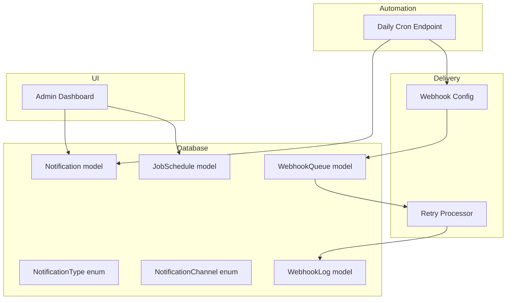
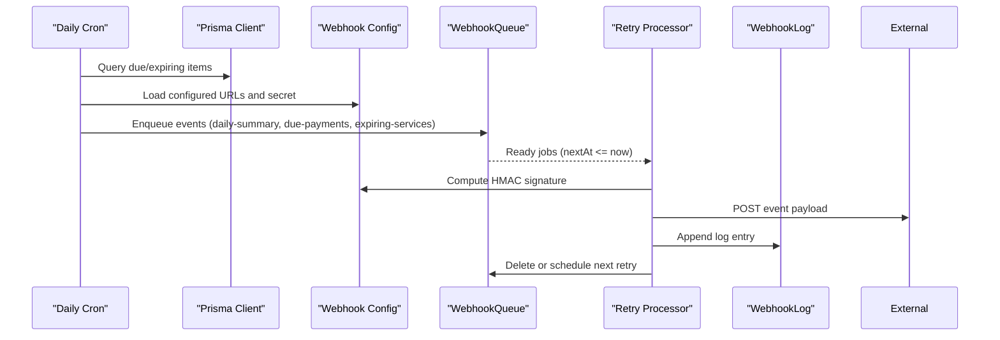
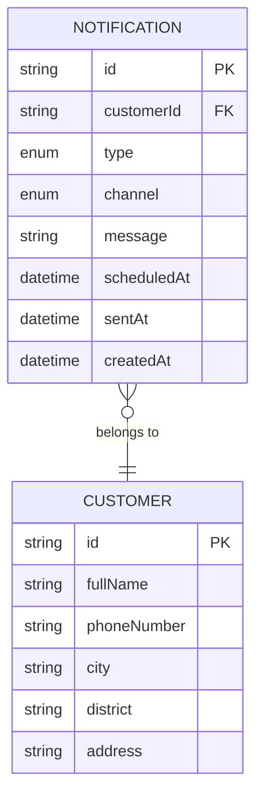
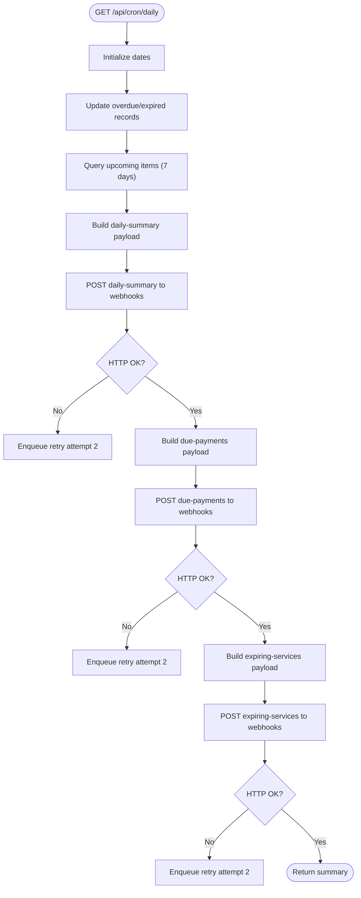
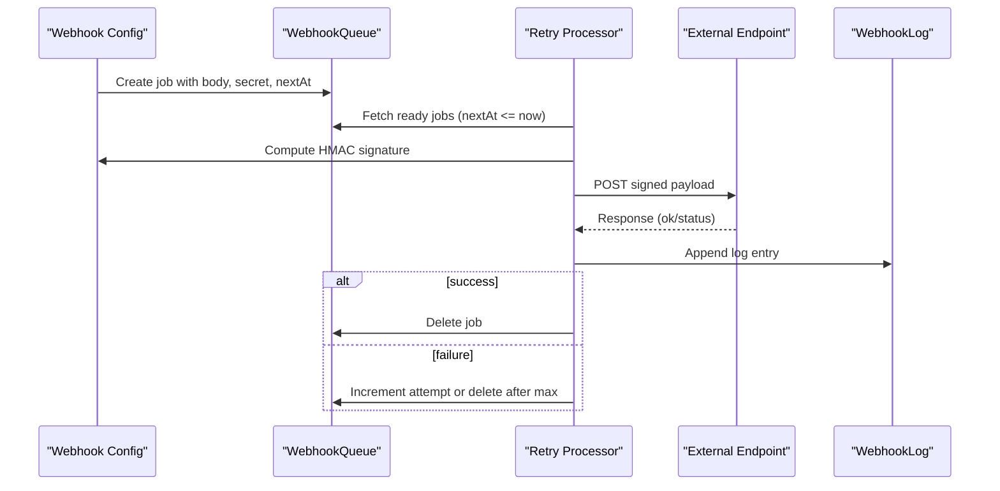
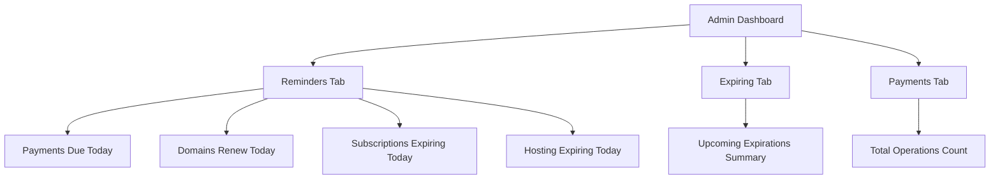
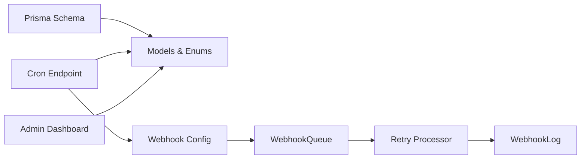

# Notification System

<cite>
**Referenced Files in This Document**
- [schema.prisma](file://prisma/schema.prisma)
- [migration.sql](file://prisma/migrations/20260215091826_init/migration.sql)
- [cron.daily.route.ts](file://src/app/api/cron/daily/route.ts)
- [webhook-config.ts](file://src/lib/webhook-config.ts)
- [dashboard.page.tsx](file://src/app/admin/dashboard/page.tsx)
- [retry.route.ts](file://src/app/api/system/webhooks/retry/route.ts)
- [settings.ts](file://src/lib/settings.ts)
- [settings-client.ts](file://src/lib/settings-client.ts)
</cite>

## Table of Contents
1. [Introduction](#introduction)
2. [Project Structure](#project-structure)
3. [Core Components](#core-components)
4. [Architecture Overview](#architecture-overview)
5. [Detailed Component Analysis](#detailed-component-analysis)
6. [Dependency Analysis](#dependency-analysis)
7. [Performance Considerations](#performance-considerations)
8. [Troubleshooting Guide](#troubleshooting-guide)
9. [Conclusion](#conclusion)

## Introduction
This document describes the notification system for Customer WebMahsul, focusing on automated reminder workflows, notification types, channel management, scheduling mechanisms, and integration with business workflows such as renewal reminders, payment due notices, and service expiry alerts. It also covers webhook-based delivery, retry mechanisms, logging, and administrative dashboards for monitoring.

The system currently supports:
- Notification types for domain/hosting renewals, subscription payments, maintenance expiry, and admin reminders
- Channels for email and SMS
- A daily cron job that triggers reminders and sends webhook events
- Webhook delivery with signing, retries, and logging
- Administrative dashboards for reminders and expiring services

## Project Structure
The notification system spans database models, cron-driven automation, webhook configuration, and UI dashboards:

- Database models define notification types, channels, schedules, and webhook queues/logs
- Cron endpoint performs daily scans and emits webhook events
- Webhook configuration manages endpoints, signatures, retries, and logs
- Admin dashboard surfaces reminders and expiring services

**Diagram sources**
- [schema.prisma](file://prisma/schema.prisma)
- [cron.daily.route.ts](file://src/app/api/cron/daily/route.ts)
- [webhook-config.ts](file://src/lib/webhook-config.ts)
- [dashboard.page.tsx](file://src/app/admin/dashboard/page.tsx)

**Section sources**
- [schema.prisma](file://prisma/schema.prisma)
- [cron.daily.route.ts](file://src/app/api/cron/daily/route.ts)
- [webhook-config.ts](file://src/lib/webhook-config.ts)
- [dashboard.page.tsx](file://src/app/admin/dashboard/page.tsx)

## Core Components
- Notification model: Stores customer-bound notifications with type, channel, message, scheduling, and sent timestamps
- NotificationType enum: Defines supported notification categories
- NotificationChannel enum: Defines delivery channels (email, SMS)
- JobSchedule model: Tracks scheduled jobs (e.g., daily scan)
- WebhookQueue and WebhookLog: Manage asynchronous delivery, retries, and audit trails
- Daily Cron Endpoint: Scans for due/expiring items and emits webhook events
- Webhook Configuration: Manages endpoints, secrets, signing, and retry processing

**Section sources**
- [schema.prisma](file://prisma/schema.prisma)
- [cron.daily.route.ts](file://src/app/api/cron/daily/route.ts)
- [webhook-config.ts](file://src/lib/webhook-config.ts)

## Architecture Overview
The notification architecture combines scheduled scanning, event emission via webhooks, and robust retry/error handling. Administrators can monitor reminders and expiring services through the dashboard.

**Diagram sources**
- [cron.daily.route.ts](file://src/app/api/cron/daily/route.ts)
- [webhook-config.ts](file://src/lib/webhook-config.ts)

## Detailed Component Analysis

### Notification Model and Enums
The Notification model captures per-customer notifications with type and channel metadata, enabling future expansion to in-app notifications and alert systems. The enums define standardized categories and channels.

**Diagram sources**
- [schema.prisma](file://prisma/schema.prisma)

**Section sources**
- [schema.prisma](file://prisma/schema.prisma)
- [migration.sql](file://prisma/migrations/20260215091826_init/migration.sql)

### Daily Cron Automation
The daily cron endpoint:
- Updates overdue payments and expired subscriptions
- Identifies upcoming due/expiring items within a 7-day window
- Emits three webhook events:
  - daily-summary: counts and aggregates upcoming items
  - due-payments: list of payment items due soon
  - expiring-services: list of domains/subscriptions/hosting expiring soon
- Signs payloads using a shared secret and enqueues retries on failure

**Diagram sources**
- [cron.daily.route.ts](file://src/app/api/cron/daily/route.ts)

**Section sources**
- [cron.daily.route.ts](file://src/app/api/cron/daily/route.ts)

### Webhook Configuration, Signing, and Retry
Webhook delivery is managed centrally:
- Loads configured URLs and secret from environment
- Computes HMAC signature for payloads
- Appends logs for each attempt
- Enqueues retries with exponential delays (30s, 5min, 30min)
- Processes queued retries periodically

**Diagram sources**
- [webhook-config.ts](file://src/lib/webhook-config.ts)

**Section sources**
- [webhook-config.ts](file://src/lib/webhook-config.ts)

### Administrative Reminders Dashboard
The admin dashboard displays:
- Today’s reminders for payments due, domains renewing, subscriptions expiring, and hosting expiring
- Summary cards and navigation to relevant sections
- Upcoming expirations overview with totals

**Diagram sources**
- [dashboard.page.tsx](file://src/app/admin/dashboard/page.tsx)

**Section sources**
- [dashboard.page.tsx](file://src/app/admin/dashboard/page.tsx)

### Retry Endpoint for Manual Triggering
A dedicated endpoint rebuilds and re-emits webhook payloads for the same 7-day window, useful for testing or recovery scenarios.

**Section sources**
- [retry.route.ts](file://src/app/api/system/webhooks/retry/route.ts)

### Notification Preferences and User Opt-Out
- The current schema defines NotificationType and NotificationChannel enums but does not include explicit preference fields on the Customer model
- No opt-out mechanism is present in the schema or related APIs
- Recommendation: Add preference flags (e.g., emailAllowed, smsAllowed) and optOutAt timestamps to the Customer model; expose preferences via admin settings and integrate with notification generation logic

[No sources needed since this section provides recommendations without analyzing specific files]

### Notification Templates and Customization
- The Notification model stores a plaintext message field suitable for templated content
- No template engine or template storage is present in the schema
- Recommendation: Introduce a Template model with placeholders and localization support; render messages during notification creation

[No sources needed since this section provides recommendations without analyzing specific files]

### Delivery Tracking
- WebhookLog tracks delivery attempts, HTTP status codes, and errors
- WebhookQueue holds pending deliveries with scheduled retry times
- Recommendation: Extend logs to include customer identifiers and notification IDs for correlation

**Section sources**
- [webhook-config.ts](file://src/lib/webhook-config.ts)

### Integration with Business Workflows
- Renewal reminders: domains and subscriptions expiring soon
- Payment due notices: payments due or late within the 7-day window
- Maintenance expiry: maintenance contracts nearing end date
- Admin reminders: categorized alerts for operational oversight

**Section sources**
- [cron.daily.route.ts](file://src/app/api/cron/daily/route.ts)
- [schema.prisma](file://prisma/schema.prisma)

## Dependency Analysis
The notification system exhibits clear separation of concerns:
- Data modeling: Prisma schema defines enums and models
- Automation: Cron endpoint orchestrates queries and event emission
- Delivery: Webhook configuration encapsulates signing, queuing, and retry logic
- Monitoring: Admin dashboard consumes reminders and expiring data

**Diagram sources**
- [schema.prisma](file://prisma/schema.prisma)
- [cron.daily.route.ts](file://src/app/api/cron/daily/route.ts)
- [webhook-config.ts](file://src/lib/webhook-config.ts)
- [dashboard.page.tsx](file://src/app/admin/dashboard/page.tsx)

**Section sources**
- [schema.prisma](file://prisma/schema.prisma)
- [cron.daily.route.ts](file://src/app/api/cron/daily/route.ts)
- [webhook-config.ts](file://src/lib/webhook-config.ts)
- [dashboard.page.tsx](file://src/app/admin/dashboard/page.tsx)

## Performance Considerations
- Batch operations: The cron endpoint uses Promise.all for concurrent database queries and webhook dispatches
- Retry backoff: Exponential delays reduce load on external endpoints and improve resilience
- Queue limits: Retry processor processes a bounded number of ready jobs per cycle
- Recommendations: Monitor webhook queue depth and retry latency; consider rate limiting for external endpoints; add pagination for large result sets

[No sources needed since this section provides general guidance]

## Troubleshooting Guide
Common issues and remedies:
- Webhook failures: Inspect WebhookLog entries for status codes and error messages; verify WEBHOOK_URLS and WEBHOOK_SECRET environment variables; trigger manual retry via the retry endpoint
- Missing notifications: Confirm JobSchedule entries and cron execution; verify Notification records and scheduledAt timestamps
- Dashboard discrepancies: Ensure reminders are populated in the database and the dashboard fetches correct counts

**Section sources**
- [webhook-config.ts](file://src/lib/webhook-config.ts)
- [retry.route.ts](file://src/app/api/system/webhooks/retry/route.ts)
- [dashboard.page.tsx](file://src/app/admin/dashboard/page.tsx)

## Conclusion
Customer WebMahsul implements a robust, webhook-driven notification system with daily automation, structured retry logic, and administrative visibility. To evolve toward a full-fledged notification platform, extend the schema with customer preferences, opt-out capabilities, and templating; integrate in-app and alert channels; and enhance delivery tracking with richer correlation data.