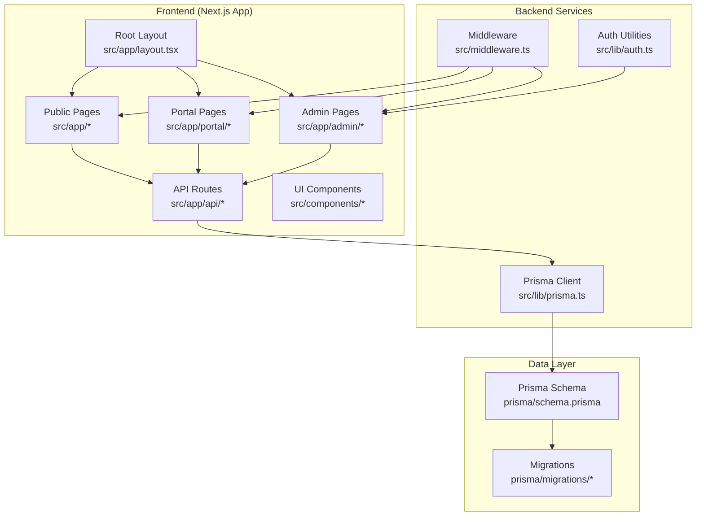
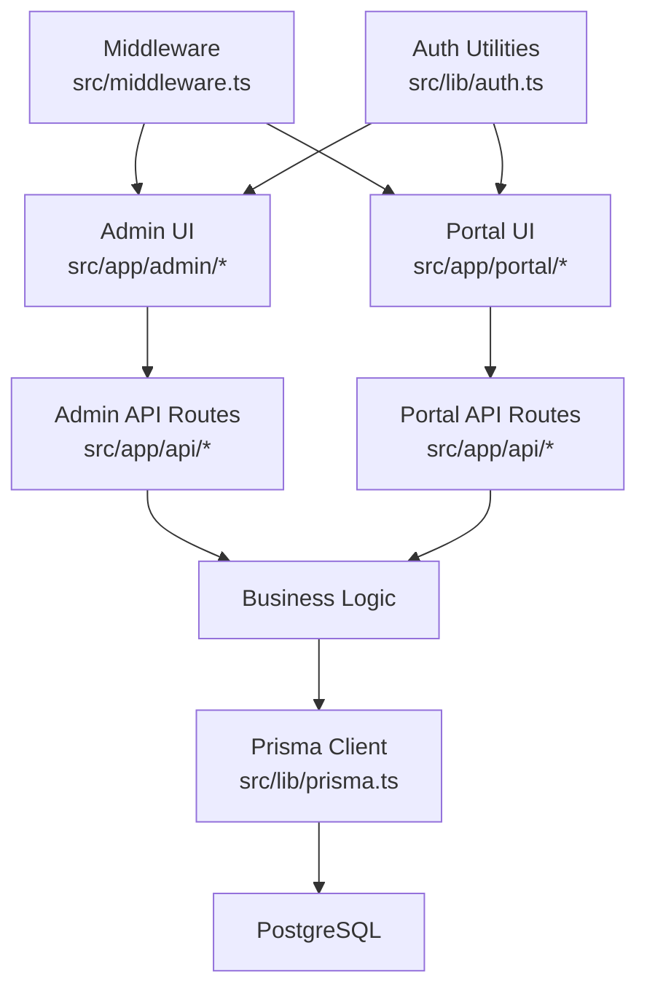
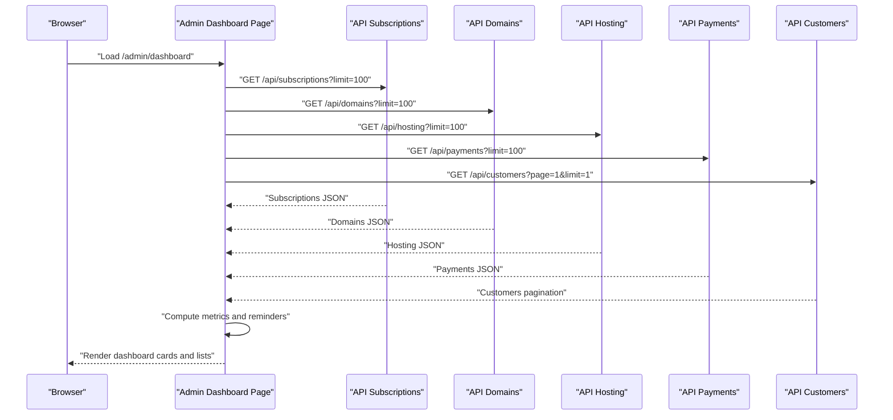
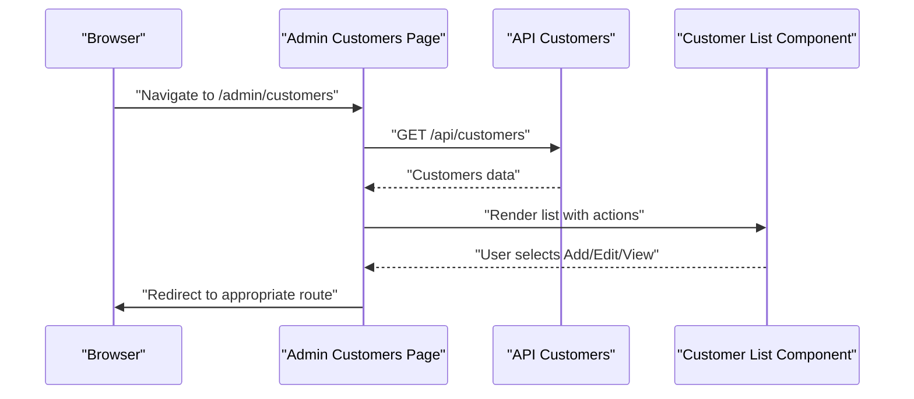
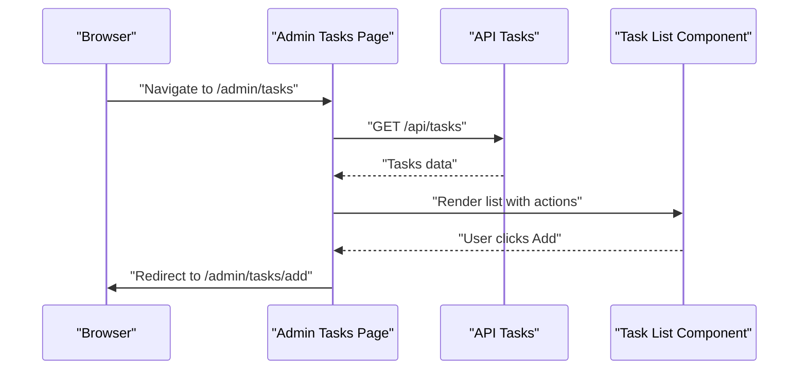
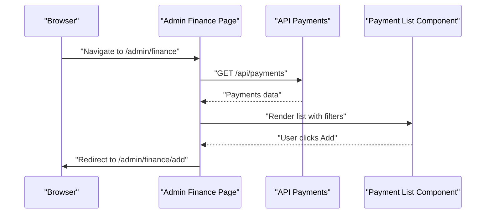
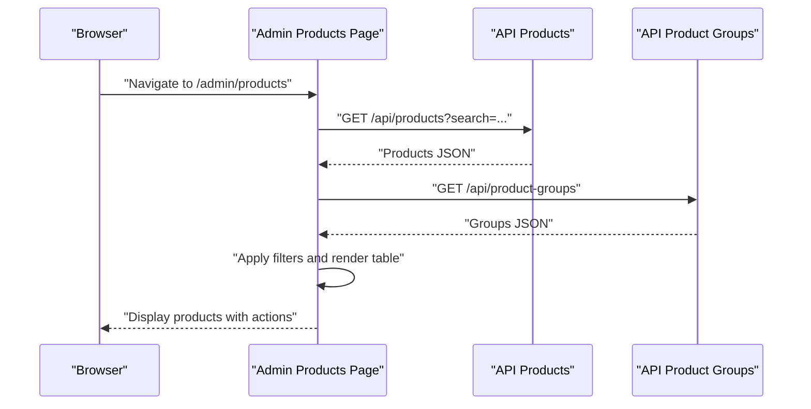
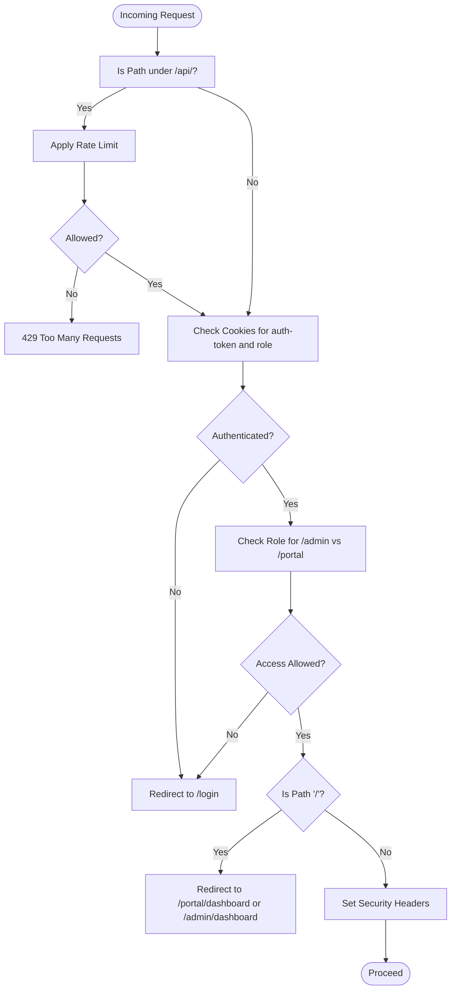
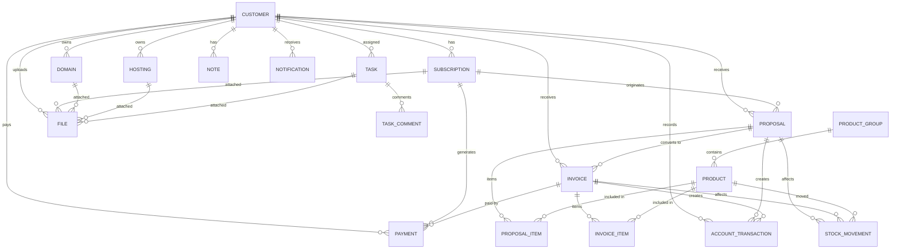
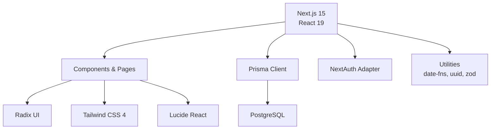

# Project Overview

<cite>
**Referenced Files in This Document**
- [README.md](file://README.md)
- [package.json](file://package.json)
- [src/lib/prisma.ts](file://src/lib/prisma.ts)
- [prisma/schema.prisma](file://prisma/schema.prisma)
- [src/app/layout.tsx](file://src/app/layout.tsx)
- [src/app/admin/dashboard/page.tsx](file://src/app/admin/dashboard/page.tsx)
- [src/app/admin/customers/page.tsx](file://src/app/admin/customers/page.tsx)
- [src/app/admin/tasks/page.tsx](file://src/app/admin/tasks/page.tsx)
- [src/app/admin/finance/page.tsx](file://src/app/admin/finance/page.tsx)
- [src/app/admin/products/page.tsx](file://src/app/admin/products/page.tsx)
- [src/lib/auth.ts](file://src/lib/auth.ts)
- [src/app/admin/layout.tsx](file://src/app/admin/layout.tsx)
- [src/app/portal/layout.tsx](file://src/app/portal/layout.tsx)
- [src/components/app-shell.tsx](file://src/components/app-shell.tsx)
- [src/middleware.ts](file://src/middleware.ts)
</cite>

## Table of Contents
1. [Introduction](#introduction)
2. [Project Structure](#project-structure)
3. [Core Components](#core-components)
4. [Architecture Overview](#architecture-overview)
5. [Detailed Component Analysis](#detailed-component-analysis)
6. [Dependency Analysis](#dependency-analysis)
7. [Performance Considerations](#performance-considerations)
8. [Troubleshooting Guide](#troubleshooting-guide)
9. [Conclusion](#conclusion)

## Introduction
Customer WebMahsul is a comprehensive CRM and business management system designed to streamline customer lifecycle management, service tracking, financial operations, and internal task coordination. It serves business owners, administrators, and support teams by centralizing customer data, subscriptions, domains, hosting, invoicing, payments, proposals, and operational tasks into a unified platform. Built with modern web technologies, it emphasizes developer productivity, maintainability, and scalability while offering a responsive admin and customer portal.

Key value propositions:
- Unified customer and service management across domains, hosting, and subscriptions
- Financial visibility with proposals, invoices, and payment tracking
- Operational efficiency via task management and automated reminders
- Role-based access control ensuring secure and contextual workflows
- Developer-friendly stack enabling rapid iteration and extensibility

## Project Structure
The project follows a Next.js App Router structure with a clear separation of concerns:
- Frontend pages under src/app for admin, portal, and public routes
- Shared UI components under src/components
- Backend logic encapsulated in API routes under src/app/api
- Authentication and middleware logic under src/lib and src/middleware.ts
- Database modeling and migrations under prisma/schema.prisma and prisma/migrations
- Global styles and fonts under src/app/globals.css and src/app/layout.tsx

**Diagram sources**
- [src/app/admin/layout.tsx:1-10](file://src/app/admin/layout.tsx#L1-L10)
- [src/app/portal/layout.tsx:1-10](file://src/app/portal/layout.tsx#L1-L10)
- [src/app/layout.tsx:1-35](file://src/app/layout.tsx#L1-L35)
- [src/middleware.ts:1-101](file://src/middleware.ts#L1-L101)
- [src/lib/auth.ts:1-35](file://src/lib/auth.ts#L1-L35)
- [src/lib/prisma.ts:1-9](file://src/lib/prisma.ts#L1-L9)
- [prisma/schema.prisma:1-756](file://prisma/schema.prisma#L1-L756)

**Section sources**
- [src/app/layout.tsx:1-35](file://src/app/layout.tsx#L1-L35)
- [src/app/admin/layout.tsx:1-10](file://src/app/admin/layout.tsx#L1-L10)
- [src/app/portal/layout.tsx:1-10](file://src/app/portal/layout.tsx#L1-L10)
- [src/middleware.ts:1-101](file://src/middleware.ts#L1-L101)

## Core Components
- Admin Dashboard: Aggregates key metrics, upcoming expirations, payment summaries, and quick actions for managing subscriptions, domains, hosting, and finances.
- Customer Management: Lists, adds, edits, and views customer profiles with integrated notes, subscriptions, domains, hosting, tasks, payments, and notifications.
- Task Management: Centralized view for tasks and customer requests with assignment and status tracking.
- Finance Operations: Payment tracking, revenue summaries, and financial reporting with filters and status controls.
- Product Catalog: Stock-enabled product and group management with usage analytics and stock movement history.
- Authentication and Access Control: Role-based routing and session management for admin and customer portals.
- Middleware Security: Rate limiting for API endpoints, redirects for unauthenticated users, and enforced role-based access.

**Section sources**
- [src/app/admin/dashboard/page.tsx:1-815](file://src/app/admin/dashboard/page.tsx#L1-L815)
- [src/app/admin/customers/page.tsx:1-42](file://src/app/admin/customers/page.tsx#L1-L42)
- [src/app/admin/tasks/page.tsx:1-32](file://src/app/admin/tasks/page.tsx#L1-L32)
- [src/app/admin/finance/page.tsx:1-32](file://src/app/admin/finance/page.tsx#L1-L32)
- [src/app/admin/products/page.tsx:1-313](file://src/app/admin/products/page.tsx#L1-L313)
- [src/lib/auth.ts:1-35](file://src/lib/auth.ts#L1-L35)
- [src/middleware.ts:1-101](file://src/middleware.ts#L1-L101)

## Architecture Overview
The system employs a layered architecture:
- Presentation Layer: Next.js App Router pages and shared UI components
- Business Logic Layer: API routes implementing CRUD and orchestration
- Persistence Layer: Prisma ORM connecting to PostgreSQL
- Security Layer: Middleware enforcing authentication, authorization, and rate limits

**Diagram sources**
- [src/app/admin/dashboard/page.tsx:1-815](file://src/app/admin/dashboard/page.tsx#L1-L815)
- [src/app/admin/customers/page.tsx:1-42](file://src/app/admin/customers/page.tsx#L1-L42)
- [src/app/admin/tasks/page.tsx:1-32](file://src/app/admin/tasks/page.tsx#L1-L32)
- [src/app/admin/finance/page.tsx:1-32](file://src/app/admin/finance/page.tsx#L1-L32)
- [src/app/admin/products/page.tsx:1-313](file://src/app/admin/products/page.tsx#L1-L313)
- [src/lib/prisma.ts:1-9](file://src/lib/prisma.ts#L1-L9)
- [prisma/schema.prisma:1-756](file://prisma/schema.prisma#L1-L756)
- [src/middleware.ts:1-101](file://src/middleware.ts#L1-L101)
- [src/lib/auth.ts:1-35](file://src/lib/auth.ts#L1-L35)

## Detailed Component Analysis

### Admin Dashboard
The dashboard aggregates system-wide metrics and provides quick navigation to core workflows. It fetches data from multiple API endpoints concurrently, computes derived metrics, and renders actionable insights.

**Diagram sources**
- [src/app/admin/dashboard/page.tsx:50-82](file://src/app/admin/dashboard/page.tsx#L50-L82)

**Section sources**
- [src/app/admin/dashboard/page.tsx:1-815](file://src/app/admin/dashboard/page.tsx#L1-L815)

### Customer Management
The customer module provides a searchable, filterable list with inline actions for adding, editing, and viewing customer details. It integrates with related entities such as subscriptions, domains, hosting, tasks, payments, and notifications.

**Diagram sources**
- [src/app/admin/customers/page.tsx:11-41](file://src/app/admin/customers/page.tsx#L11-L41)

**Section sources**
- [src/app/admin/customers/page.tsx:1-42](file://src/app/admin/customers/page.tsx#L1-L42)

### Task Management
The task module centralizes work items and customer requests, enabling assignment, status updates, and collaboration through comments and file attachments.

**Diagram sources**
- [src/app/admin/tasks/page.tsx:10-31](file://src/app/admin/tasks/page.tsx#L10-L31)

**Section sources**
- [src/app/admin/tasks/page.tsx:1-32](file://src/app/admin/tasks/page.tsx#L1-L32)

### Finance Operations
The finance module offers a consolidated view of payments, revenue, and overdue balances with filtering by status, currency, and date range.

**Diagram sources**
- [src/app/admin/finance/page.tsx:10-31](file://src/app/admin/finance/page.tsx#L10-L31)

**Section sources**
- [src/app/admin/finance/page.tsx:1-32](file://src/app/admin/finance/page.tsx#L1-L32)

### Product Catalog
The product catalog supports grouping, stock tracking, pricing, and usage analytics across proposals and invoices.

**Diagram sources**
- [src/app/admin/products/page.tsx:65-96](file://src/app/admin/products/page.tsx#L65-L96)

**Section sources**
- [src/app/admin/products/page.tsx:1-313](file://src/app/admin/products/page.tsx#L1-L313)

### Authentication and Access Control
Role-based routing ensures that authenticated users are directed to the appropriate portal, while unauthorized access is redirected to the login page. The middleware enforces rate limits for API endpoints and sets security headers.

**Diagram sources**
- [src/middleware.ts:9-101](file://src/middleware.ts#L9-L101)
- [src/lib/auth.ts:1-35](file://src/lib/auth.ts#L1-L35)

**Section sources**
- [src/middleware.ts:1-101](file://src/middleware.ts#L1-L101)
- [src/lib/auth.ts:1-35](file://src/lib/auth.ts#L1-L35)

### Data Model Overview
The Prisma schema defines core entities and relationships for customers, subscriptions, domains, hosting, tasks, payments, proposals, invoices, products, and accounting transactions.

**Diagram sources**
- [prisma/schema.prisma:94-756](file://prisma/schema.prisma#L94-L756)

**Section sources**
- [prisma/schema.prisma:1-756](file://prisma/schema.prisma#L1-L756)

## Dependency Analysis
Technology stack highlights:
- Frontend: Next.js 15, React 19, Tailwind CSS 4, Radix UI, Sonner
- Backend: Prisma ORM, PostgreSQL
- Authentication: NextAuth adapter and custom admin utilities
- Tooling: TypeScript, ESLint, PostCSS/Tailwind

**Diagram sources**
- [package.json:12-49](file://package.json#L12-L49)
- [src/lib/prisma.ts:1-9](file://src/lib/prisma.ts#L1-L9)
- [prisma/schema.prisma:1-14](file://prisma/schema.prisma#L1-L14)

**Section sources**
- [package.json:1-64](file://package.json#L1-L64)
- [src/lib/prisma.ts:1-9](file://src/lib/prisma.ts#L1-L9)
- [prisma/schema.prisma:1-14](file://prisma/schema.prisma#L1-L14)

## Performance Considerations
- Concurrent API fetching on the admin dashboard reduces latency and improves perceived responsiveness.
- Rate limiting for API endpoints protects backend resources and prevents abuse.
- Pagination and filtering in customer and product listings minimize payload sizes.
- Prisma client initialization pattern avoids multiple client instances in development.

[No sources needed since this section provides general guidance]

## Troubleshooting Guide
Common issues and resolutions:
- Authentication loops: Verify cookies presence and role values; middleware redirects unauthenticated users to /login and authenticated users to role-specific dashboards.
- API rate limiting errors: Monitor X-RateLimit headers; adjust client-side retry logic accordingly.
- Database connectivity: Confirm DATABASE_URL environment variable and Prisma client initialization.
- UI navigation: Ensure AppShell applies consistently across admin and portal layouts.

**Section sources**
- [src/middleware.ts:31-80](file://src/middleware.ts#L31-L80)
- [src/lib/prisma.ts:1-9](file://src/lib/prisma.ts#L1-L9)
- [src/components/app-shell.tsx:16-90](file://src/components/app-shell.tsx#L16-L90)

## Conclusion
Customer WebMahsul delivers a robust, scalable CRM and business management solution tailored for modern service-based businesses. Its layered architecture, comprehensive data model, and role-based access control enable seamless customer, financial, and operational workflows. By leveraging Next.js, Prisma, and PostgreSQL, it balances developer productivity with long-term maintainability and growth potential.