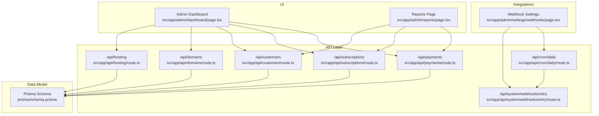
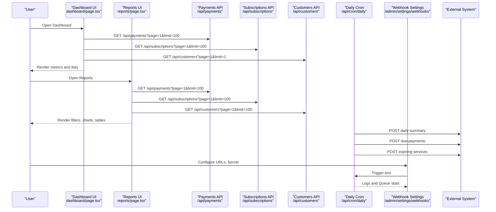
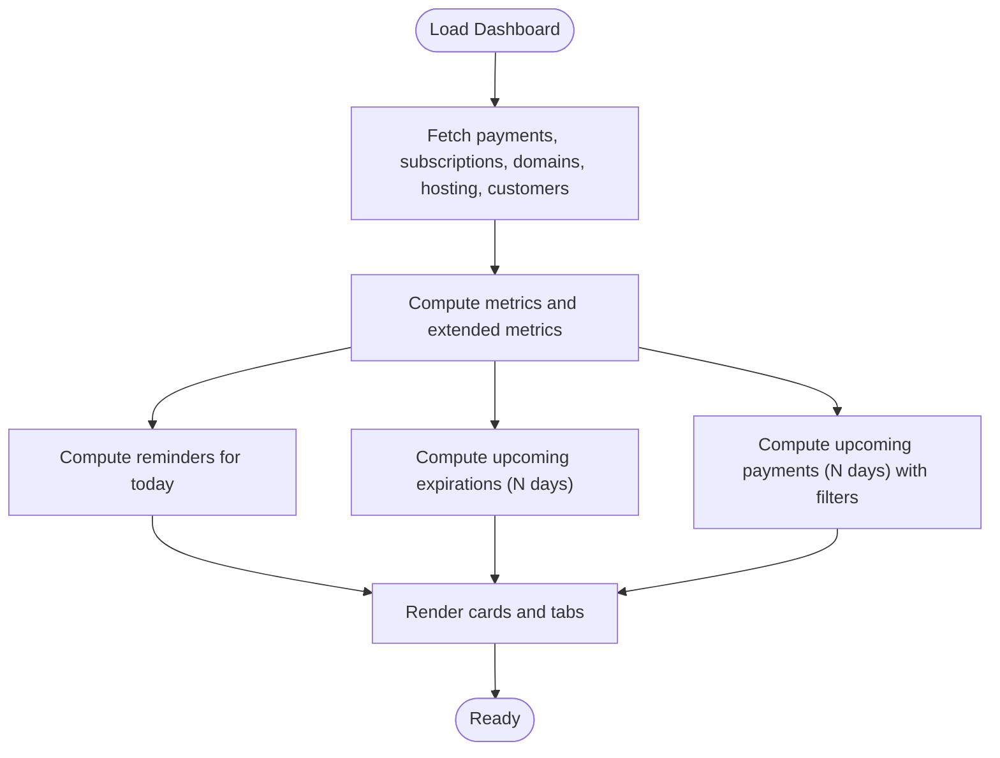
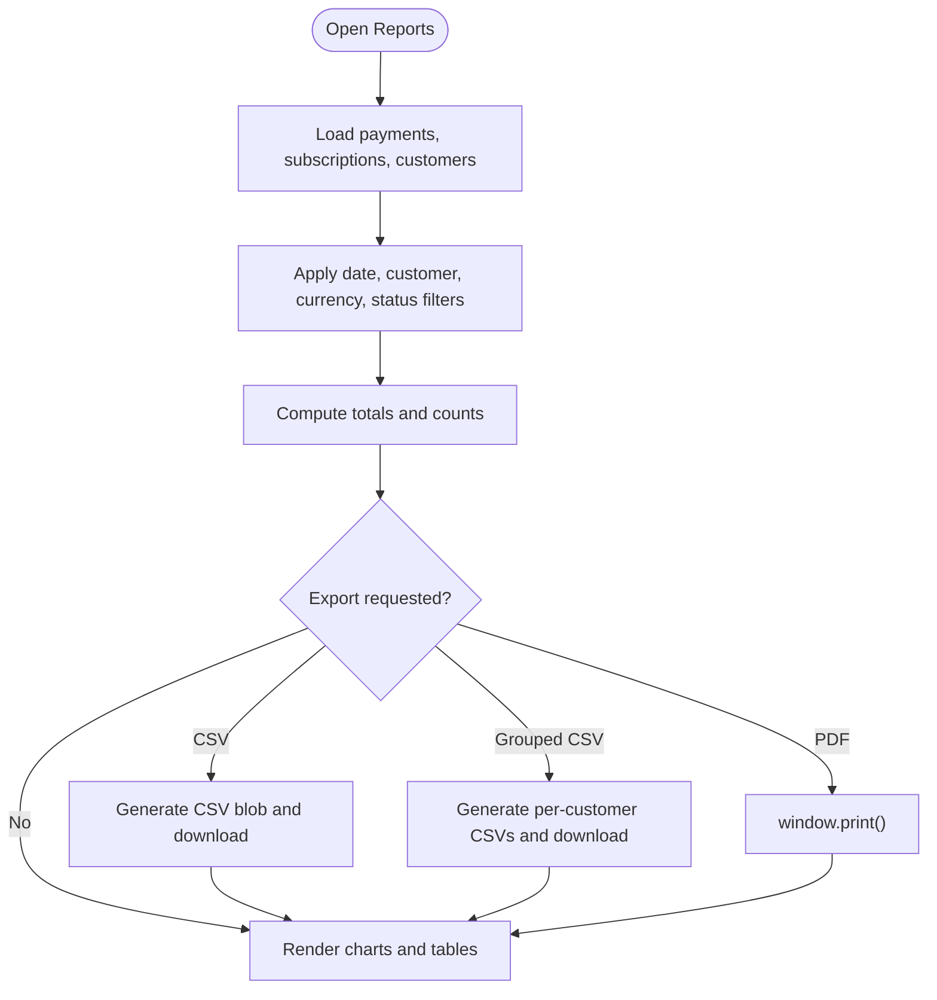
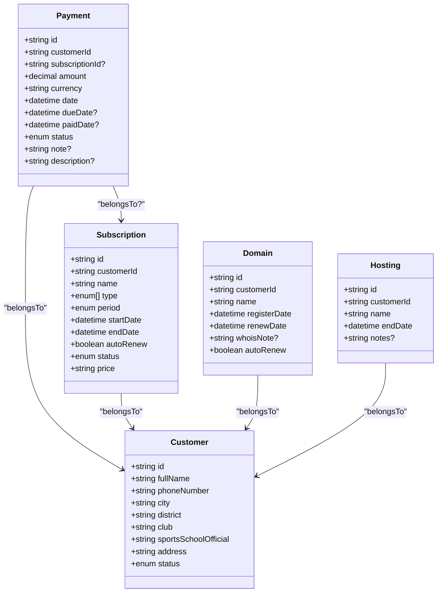
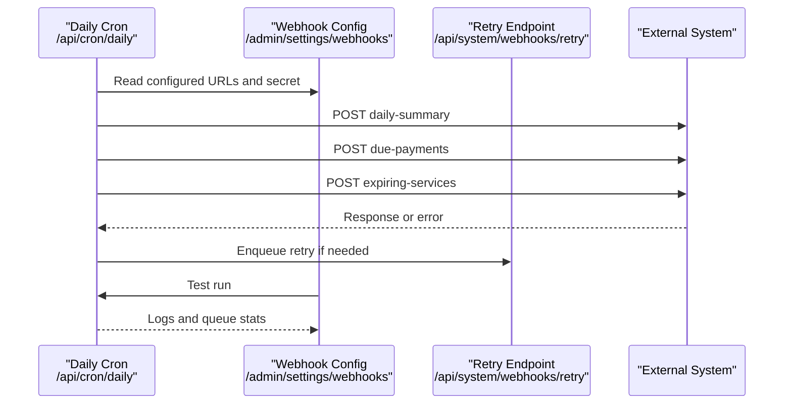
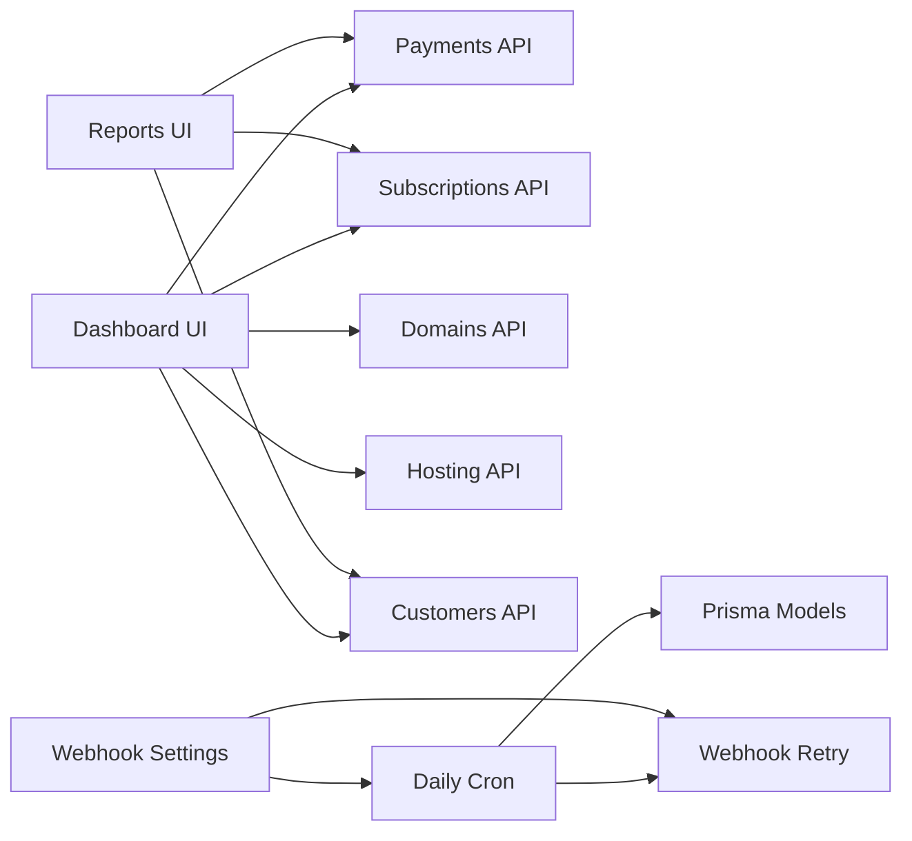

# Reporting & Analytics

<cite>
**Referenced Files in This Document**
- [src/app/admin/dashboard/page.tsx](file://src/app/admin/dashboard/page.tsx)
- [src/app/admin/reports/page.tsx](file://src/app/admin/reports/page.tsx)
- [src/app/api/payments/route.ts](file://src/app/api/payments/route.ts)
- [src/app/api/subscriptions/route.ts](file://src/app/api/subscriptions/route.ts)
- [src/app/api/customers/route.ts](file://src/app/api/customers/route.ts)
- [src/app/api/domains/route.ts](file://src/app/api/domains/route.ts)
- [src/app/api/hosting/route.ts](file://src/app/api/hosting/route.ts)
- [src/app/api/cron/daily/route.ts](file://src/app/api/cron/daily/route.ts)
- [src/app/admin/settings/webhooks/page.tsx](file://src/app/admin/settings/webhooks/page.tsx)
- [src/app/api/system/webhooks/retry/route.ts](file://src/app/api/system/webhooks/retry/route.ts)
- [prisma/schema.prisma](file://prisma/schema.prisma)
- [src/lib/validations.ts](file://src/lib/validations.ts)
</cite>

## Table of Contents
1. [Introduction](#introduction)
2. [Project Structure](#project-structure)
3. [Core Components](#core-components)
4. [Architecture Overview](#architecture-overview)
5. [Detailed Component Analysis](#detailed-component-analysis)
6. [Dependency Analysis](#dependency-analysis)
7. [Performance Considerations](#performance-considerations)
8. [Troubleshooting Guide](#troubleshooting-guide)
9. [Conclusion](#conclusion)
10. [Appendices](#appendices)

## Introduction
This document explains the reporting and analytics capabilities of Customer WebMahsul. It covers dashboard components, business intelligence features, performance metrics, and export functionalities. It also documents financial reporting, customer analytics, operational insights, customizable filters, data visualization components, automated reporting schedules, and integration with external reporting tools via webhooks.

## Project Structure
The reporting and analytics features are centered around:
- Admin Dashboard: real-time operational overview and key performance indicators
- Reports page: customizable filters, charts, and exports for payments and subscriptions
- API endpoints: paginated, filterable data retrieval for payments, subscriptions, customers, domains, and hosting
- Automated reporting: daily cron job that emits events and pushes summaries to configured webhooks
- Webhook settings: configuration, testing, logging, and retry mechanisms

**Diagram sources**
- [src/app/admin/dashboard/page.tsx:32-82](file://src/app/admin/dashboard/page.tsx#L32-L82)
- [src/app/admin/reports/page.tsx:25-63](file://src/app/admin/reports/page.tsx#L25-L63)
- [src/app/api/payments/route.ts:7-51](file://src/app/api/payments/route.ts#L7-L51)
- [src/app/api/subscriptions/route.ts:7-44](file://src/app/api/subscriptions/route.ts#L7-L44)
- [src/app/api/customers/route.ts:7-61](file://src/app/api/customers/route.ts#L7-L61)
- [src/app/api/domains/route.ts:6-42](file://src/app/api/domains/route.ts#L6-L42)
- [src/app/api/hosting/route.ts:6-42](file://src/app/api/hosting/route.ts#L6-L42)
- [src/app/api/cron/daily/route.ts:7-50](file://src/app/api/cron/daily/route.ts#L7-L50)
- [src/app/admin/settings/webhooks/page.tsx:17-51](file://src/app/admin/settings/webhooks/page.tsx#L17-L51)
- [src/app/api/system/webhooks/retry/route.ts:9-53](file://src/app/api/system/webhooks/retry/route.ts#L9-L53)
- [prisma/schema.prisma:95-343](file://prisma/schema.prisma#L95-L343)

**Section sources**
- [src/app/admin/dashboard/page.tsx:32-82](file://src/app/admin/dashboard/page.tsx#L32-L82)
- [src/app/admin/reports/page.tsx:25-63](file://src/app/admin/reports/page.tsx#L25-L63)
- [src/app/api/payments/route.ts:7-51](file://src/app/api/payments/route.ts#L7-L51)
- [src/app/api/subscriptions/route.ts:7-44](file://src/app/api/subscriptions/route.ts#L7-L44)
- [src/app/api/customers/route.ts:7-61](file://src/app/api/customers/route.ts#L7-L61)
- [src/app/api/domains/route.ts:6-42](file://src/app/api/domains/route.ts#L6-L42)
- [src/app/api/hosting/route.ts:6-42](file://src/app/api/hosting/route.ts#L6-L42)
- [src/app/api/cron/daily/route.ts:7-50](file://src/app/api/cron/daily/route.ts#L7-L50)
- [src/app/admin/settings/webhooks/page.tsx:17-51](file://src/app/admin/settings/webhooks/page.tsx#L17-L51)
- [src/app/api/system/webhooks/retry/route.ts:9-53](file://src/app/api/system/webhooks/retry/route.ts#L9-L53)
- [prisma/schema.prisma:95-343](file://prisma/schema.prisma#L95-L343)

## Core Components
- Admin Dashboard
  - Real-time metrics: total customers, active subscriptions, upcoming expirations, upcoming receivables
  - Extended financial metrics: total revenue, pending revenue, late payments, active subscription percentage
  - Upcoming reminders and payment lists with filtering and currency grouping
- Reports Page
  - Filters: source (payments/subscriptions), date range, customer, currency, statuses
  - Visualizations: totals by currency, counts by status, tabular listings
  - Exports: CSV (ungrouped, grouped by customer), PDF (browser print)
- API Endpoints
  - Payments: paginated, filterable by customer, subscription, status, currency, due date range
  - Subscriptions: paginated, filterable by search and customer
  - Customers: paginated, searchable by full name, city, district, club
  - Domains and Hosting: paginated, filterable by search and customer
- Automated Reporting
  - Daily cron updates statuses and emits three webhook events: daily-summary, due-payments, expiring-services
  - Webhook settings UI for configuration, testing, logging, and retry
- Data Model
  - Entities: Customer, Subscription, Domain, Hosting, Payment, Proposal, Invoice, AccountTransaction
  - Enumerations: statuses, types, periods, transaction types, proposal types, invoice types

**Section sources**
- [src/app/admin/dashboard/page.tsx:167-216](file://src/app/admin/dashboard/page.tsx#L167-L216)
- [src/app/admin/reports/page.tsx:25-199](file://src/app/admin/reports/page.tsx#L25-L199)
- [src/app/api/payments/route.ts:7-51](file://src/app/api/payments/route.ts#L7-L51)
- [src/app/api/subscriptions/route.ts:7-44](file://src/app/api/subscriptions/route.ts#L7-L44)
- [src/app/api/customers/route.ts:7-61](file://src/app/api/customers/route.ts#L7-L61)
- [src/app/api/domains/route.ts:6-42](file://src/app/api/domains/route.ts#L6-L42)
- [src/app/api/hosting/route.ts:6-42](file://src/app/api/hosting/route.ts#L6-L42)
- [src/app/api/cron/daily/route.ts:7-135](file://src/app/api/cron/daily/route.ts#L7-L135)
- [src/app/admin/settings/webhooks/page.tsx:17-315](file://src/app/admin/settings/webhooks/page.tsx#L17-L315)
- [prisma/schema.prisma:95-343](file://prisma/schema.prisma#L95-L343)

## Architecture Overview
The system combines client-side dashboards and reports with server-side APIs and a daily automation pipeline. Data flows from the database through Prisma to API endpoints and then to the UI. Automated events are emitted by the daily cron and delivered to external systems via webhooks with retry and logging.

**Diagram sources**
- [src/app/admin/dashboard/page.tsx:50-82](file://src/app/admin/dashboard/page.tsx#L50-L82)
- [src/app/admin/reports/page.tsx:39-63](file://src/app/admin/reports/page.tsx#L39-L63)
- [src/app/api/payments/route.ts:7-51](file://src/app/api/payments/route.ts#L7-L51)
- [src/app/api/subscriptions/route.ts:7-44](file://src/app/api/subscriptions/route.ts#L7-L44)
- [src/app/api/customers/route.ts:7-61](file://src/app/api/customers/route.ts#L7-L61)
- [src/app/api/cron/daily/route.ts:52-135](file://src/app/api/cron/daily/route.ts#L52-L135)
- [src/app/admin/settings/webhooks/page.tsx:53-83](file://src/app/admin/settings/webhooks/page.tsx#L53-L83)

## Detailed Component Analysis

### Admin Dashboard
Key capabilities:
- Metrics cards: total customers, active subscriptions, upcoming expirations, upcoming receivables
- Extended financial metrics: total revenue, pending revenue, late payments, active subscription percentage
- Upcoming reminders: payments due today, domain renewals, subscription expirations, hosting expirations
- Upcoming expirations list with configurable day range and service type toggles
- Upcoming payments list with status filters, currency filtering, and totals by currency
- Navigation to relevant sections for quick actions

**Diagram sources**
- [src/app/admin/dashboard/page.tsx:50-82](file://src/app/admin/dashboard/page.tsx#L50-L82)
- [src/app/admin/dashboard/page.tsx:110-175](file://src/app/admin/dashboard/page.tsx#L110-L175)
- [src/app/admin/dashboard/page.tsx:185-216](file://src/app/admin/dashboard/page.tsx#L185-L216)

**Section sources**
- [src/app/admin/dashboard/page.tsx:167-216](file://src/app/admin/dashboard/page.tsx#L167-L216)
- [src/app/admin/dashboard/page.tsx:238-301](file://src/app/admin/dashboard/page.tsx#L238-L301)
- [src/app/admin/dashboard/page.tsx:406-501](file://src/app/admin/dashboard/page.tsx#L406-L501)
- [src/app/admin/dashboard/page.tsx:503-800](file://src/app/admin/dashboard/page.tsx#L503-L800)

### Reports Page
Key capabilities:
- Source toggle: payments vs subscriptions
- Filters: date range, customer, currency (payments), status checkboxes (payments)
- Visualizations:
  - Totals by currency (payments)
  - Counts by status (payments)
  - Status counts (subscriptions)
- Export functions:
  - CSV export (ungrouped)
  - Grouped CSV export by customer
  - PDF export (browser print)

**Diagram sources**
- [src/app/admin/reports/page.tsx:39-63](file://src/app/admin/reports/page.tsx#L39-L63)
- [src/app/admin/reports/page.tsx:74-113](file://src/app/admin/reports/page.tsx#L74-L113)
- [src/app/admin/reports/page.tsx:119-199](file://src/app/admin/reports/page.tsx#L119-L199)

**Section sources**
- [src/app/admin/reports/page.tsx:25-199](file://src/app/admin/reports/page.tsx#L25-L199)

### API Endpoints and Data Access
- Payments endpoint
  - GET: paginated, filterable by customer, subscription, status, currency, due date range
  - Supports limit up to 100
- Subscriptions endpoint
  - GET: paginated, filterable by search and customer
  - Includes customer full name
- Customers endpoint
  - GET: paginated, filterable by search, city, club
- Domains and Hosting endpoints
  - GET: paginated, filterable by search and customer

**Diagram sources**
- [prisma/schema.prisma:305-343](file://prisma/schema.prisma#L305-L343)
- [prisma/schema.prisma:206-226](file://prisma/schema.prisma#L206-L226)
- [prisma/schema.prisma:95-134](file://prisma/schema.prisma#L95-L134)
- [prisma/schema.prisma:228-242](file://prisma/schema.prisma#L228-L242)
- [prisma/schema.prisma:244-256](file://prisma/schema.prisma#L244-L256)

**Section sources**
- [src/app/api/payments/route.ts:7-51](file://src/app/api/payments/route.ts#L7-L51)
- [src/app/api/subscriptions/route.ts:7-44](file://src/app/api/subscriptions/route.ts#L7-L44)
- [src/app/api/customers/route.ts:7-61](file://src/app/api/customers/route.ts#L7-L61)
- [src/app/api/domains/route.ts:6-42](file://src/app/api/domains/route.ts#L6-L42)
- [src/app/api/hosting/route.ts:6-42](file://src/app/api/hosting/route.ts#L6-L42)
- [prisma/schema.prisma:305-343](file://prisma/schema.prisma#L305-L343)
- [prisma/schema.prisma:206-226](file://prisma/schema.prisma#L206-L226)
- [prisma/schema.prisma:95-134](file://prisma/schema.prisma#L95-L134)
- [prisma/schema.prisma:228-242](file://prisma/schema.prisma#L228-L242)
- [prisma/schema.prisma:244-256](file://prisma/schema.prisma#L244-L256)

### Automated Reporting and Webhooks
- Daily cron job
  - Updates overdue payments and expired subscriptions
  - Builds summary payload with upcoming counts
  - Emits three events: daily-summary, due-payments, expiring-services
  - Signs payloads with HMAC SHA-256 when secret is configured
- Webhook settings
  - Configure multiple URLs and optional secret
  - Test daily cron execution
  - View logs, queue stats, and retry failed deliveries
  - Batch and selective retries

**Diagram sources**
- [src/app/api/cron/daily/route.ts:7-135](file://src/app/api/cron/daily/route.ts#L7-L135)
- [src/app/admin/settings/webhooks/page.tsx:53-83](file://src/app/admin/settings/webhooks/page.tsx#L53-L83)
- [src/app/api/system/webhooks/retry/route.ts:9-53](file://src/app/api/system/webhooks/retry/route.ts#L9-L53)

**Section sources**
- [src/app/api/cron/daily/route.ts:7-135](file://src/app/api/cron/daily/route.ts#L7-L135)
- [src/app/admin/settings/webhooks/page.tsx:17-315](file://src/app/admin/settings/webhooks/page.tsx#L17-L315)
- [src/app/api/system/webhooks/retry/route.ts:9-53](file://src/app/api/system/webhooks/retry/route.ts#L9-L53)

## Dependency Analysis
- UI depends on API endpoints for paginated, filterable datasets
- Dashboard computes derived metrics from fetched data
- Reports page applies client-side filters and computes aggregations
- Daily cron depends on Prisma models and webhook configuration
- Webhook settings depend on cron and retry endpoints for testing and monitoring

**Diagram sources**
- [src/app/admin/dashboard/page.tsx:50-82](file://src/app/admin/dashboard/page.tsx#L50-L82)
- [src/app/admin/reports/page.tsx:39-63](file://src/app/admin/reports/page.tsx#L39-L63)
- [src/app/api/cron/daily/route.ts:7-50](file://src/app/api/cron/daily/route.ts#L7-L50)
- [src/app/admin/settings/webhooks/page.tsx:17-51](file://src/app/admin/settings/webhooks/page.tsx#L17-L51)
- [src/app/api/system/webhooks/retry/route.ts:9-53](file://src/app/api/system/webhooks/retry/route.ts#L9-L53)
- [prisma/schema.prisma:95-343](file://prisma/schema.prisma#L95-L343)

**Section sources**
- [src/app/admin/dashboard/page.tsx:50-82](file://src/app/admin/dashboard/page.tsx#L50-L82)
- [src/app/admin/reports/page.tsx:39-63](file://src/app/admin/reports/page.tsx#L39-L63)
- [src/app/api/cron/daily/route.ts:7-50](file://src/app/api/cron/daily/route.ts#L7-L50)
- [src/app/admin/settings/webhooks/page.tsx:17-51](file://src/app/admin/settings/webhooks/page.tsx#L17-L51)
- [src/app/api/system/webhooks/retry/route.ts:9-53](file://src/app/api/system/webhooks/retry/route.ts#L9-L53)
- [prisma/schema.prisma:95-343](file://prisma/schema.prisma#L95-L343)

## Performance Considerations
- API limit: requests are limited to 100 items per page to prevent heavy loads
- Client-side computations: filtering and aggregation occur in the browser; keep filter sets reasonable for large datasets
- Daily cron batching: webhook delivery is asynchronous with retry and logging to avoid blocking the main process
- Recommendations:
  - Use date range filters to reduce dataset sizes
  - Prefer grouped CSV exports for large customer lists
  - Monitor webhook queue and logs to detect and resolve delivery issues early

[No sources needed since this section provides general guidance]

## Troubleshooting Guide
- Dashboard fails to load data
  - Verify API endpoints are reachable and return 2xx
  - Check network tab for errors
- Reports export fails
  - CSV/PDF operations rely on browser capabilities; ensure pop-ups are allowed and try again
- Webhook deliveries fail
  - Review logs in Webhook Settings for status codes and errors
  - Use batch retry or retry selected entries
  - Confirm secret configuration matches external system expectations
- Cron not triggering
  - Test via Webhook Settings “Test Daily” button
  - Inspect queue stats and recent logs

**Section sources**
- [src/app/admin/reports/page.tsx:119-199](file://src/app/admin/reports/page.tsx#L119-L199)
- [src/app/admin/settings/webhooks/page.tsx:85-156](file://src/app/admin/settings/webhooks/page.tsx#L85-L156)
- [src/app/api/cron/daily/route.ts:52-135](file://src/app/api/cron/daily/route.ts#L52-L135)

## Conclusion
Customer WebMahsul provides a practical, real-time reporting and analytics toolkit. The Admin Dashboard surfaces key operational and financial indicators, while the Reports page offers flexible filtering, visualizations, and export options. Automated daily webhooks enable integration with external reporting systems, ensuring timely delivery of summaries and alerts. Together, these components support informed decision-making, efficient operations, and scalable integrations.

[No sources needed since this section summarizes without analyzing specific files]

## Appendices

### Key Performance Indicators (KPIs)
- Total customers
- Active subscriptions and percentage of active among total subscriptions
- Upcoming expirations (subscriptions, domains, hosting) within N-day windows
- Upcoming receivables (DUE/LATE) within N-day windows
- Total revenue (PAID) and pending revenue (DUE/LATE)
- Late payments amount and count

**Section sources**
- [src/app/admin/dashboard/page.tsx:167-216](file://src/app/admin/dashboard/page.tsx#L167-L216)

### Financial Reporting Capabilities
- Revenue analytics: total revenue, pending revenue, late revenue
- Payment status distribution: counts and totals by status
- Currency breakdown for payments
- Export formats: CSV (ungrouped/grouped), PDF

**Section sources**
- [src/app/admin/dashboard/page.tsx:194-202](file://src/app/admin/dashboard/page.tsx#L194-L202)
- [src/app/admin/reports/page.tsx:87-100](file://src/app/admin/reports/page.tsx#L87-L100)
- [src/app/admin/reports/page.tsx:119-199](file://src/app/admin/reports/page.tsx#L119-L199)

### Customer Acquisition Tracking
- Customer list with search and filters
- Customer analytics: total count, pagination
- Integration with subscriptions and payments for acquisition insights

**Section sources**
- [src/app/api/customers/route.ts:7-61](file://src/app/api/customers/route.ts#L7-L61)
- [prisma/schema.prisma:95-134](file://prisma/schema.prisma#L95-L134)

### Service Utilization Reports
- Subscriptions: counts by status, pricing, periods
- Domains: renewal dates and auto-renew settings
- Hosting: end dates and notes
- Upcoming expirations and renewal reminders

**Section sources**
- [src/app/api/subscriptions/route.ts:7-44](file://src/app/api/subscriptions/route.ts#L7-L44)
- [src/app/api/domains/route.ts:6-42](file://src/app/api/domains/route.ts#L6-L42)
- [src/app/api/hosting/route.ts:6-42](file://src/app/api/hosting/route.ts#L6-L42)
- [src/app/admin/dashboard/page.tsx:124-143](file://src/app/admin/dashboard/page.tsx#L124-L143)

### Data Visualization Components
- Metric cards with icons and progress indicators
- Bar charts for totals by currency
- Status badges for quick status recognition
- Tabbed views for reminders, expirations, and payments

**Section sources**
- [src/app/admin/dashboard/page.tsx:238-301](file://src/app/admin/dashboard/page.tsx#L238-L301)
- [src/app/admin/dashboard/page.tsx:406-501](file://src/app/admin/dashboard/page.tsx#L406-L501)
- [src/app/admin/reports/page.tsx:312-368](file://src/app/admin/reports/page.tsx#L312-L368)

### Export and Integration Capabilities
- CSV exports: ungrouped and grouped by customer
- PDF export: browser print integration
- Webhook configuration: multiple URLs, optional secret, HMAC signing
- Automated events: daily-summary, due-payments, expiring-services
- Retry and logging: queue stats, failure logs, batch and selective retries

**Section sources**
- [src/app/admin/reports/page.tsx:119-199](file://src/app/admin/reports/page.tsx#L119-L199)
- [src/app/admin/settings/webhooks/page.tsx:17-315](file://src/app/admin/settings/webhooks/page.tsx#L17-L315)
- [src/app/api/cron/daily/route.ts:52-135](file://src/app/api/cron/daily/route.ts#L52-L135)
- [src/app/api/system/webhooks/retry/route.ts:9-53](file://src/app/api/system/webhooks/retry/route.ts#L9-L53)