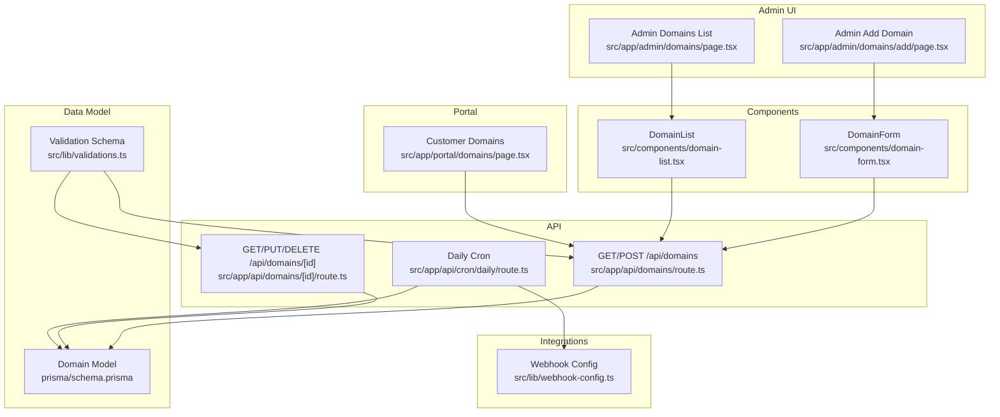
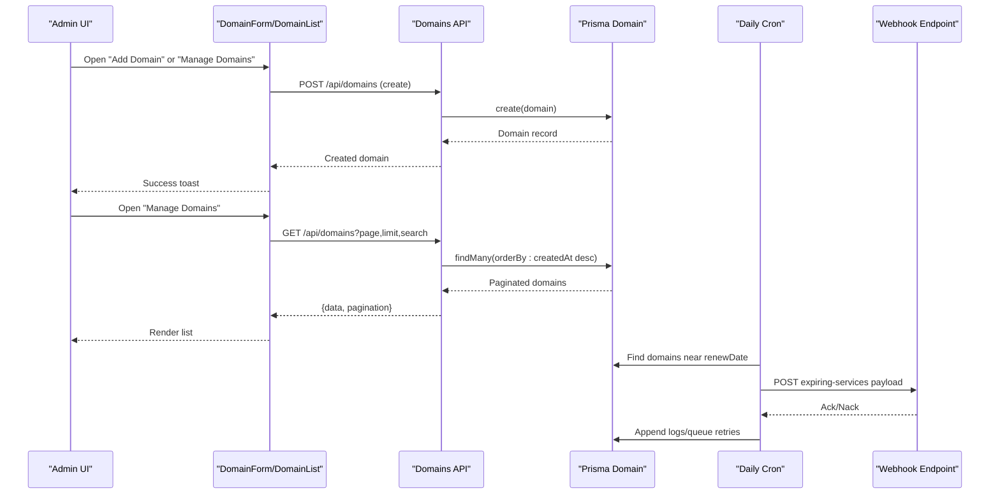
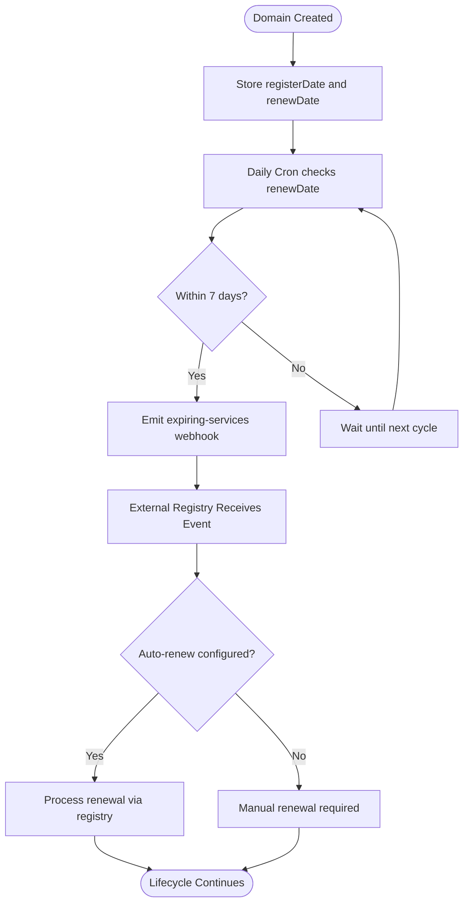
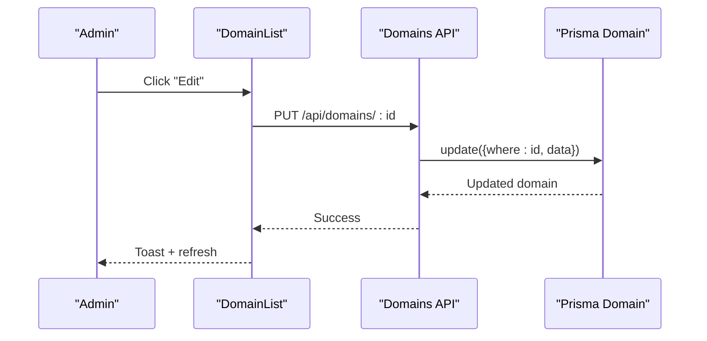
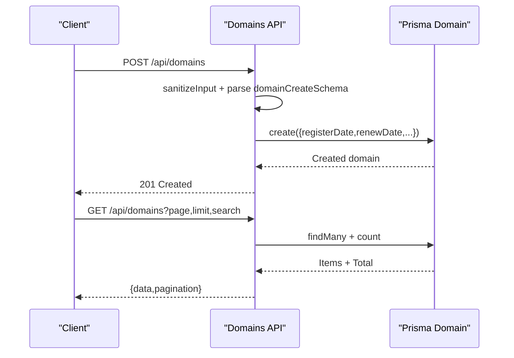
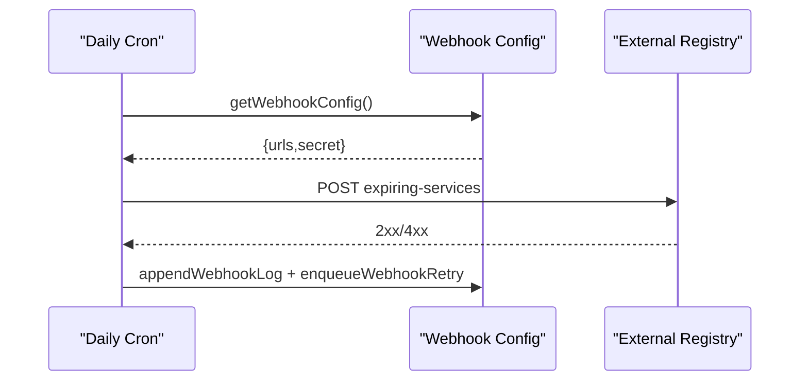
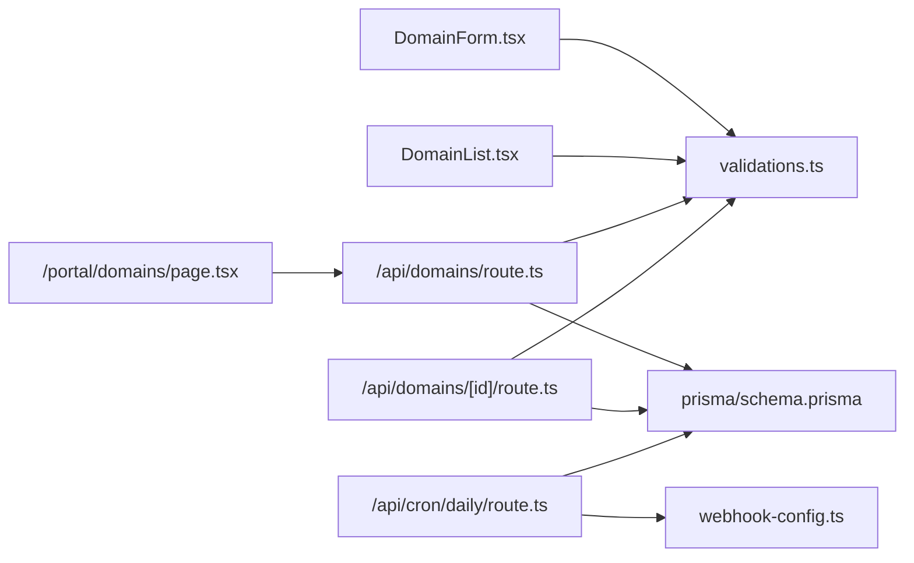

# Domain Management

<cite>
**Referenced Files in This Document**
- [src/app/admin/domains/page.tsx](file://src/app/admin/domains/page.tsx)
- [src/app/admin/domains/add/page.tsx](file://src/app/admin/domains/add/page.tsx)
- [src/components/domain-form.tsx](file://src/components/domain-form.tsx)
- [src/components/domain-list.tsx](file://src/components/domain-list.tsx)
- [src/app/api/domains/route.ts](file://src/app/api/domains/route.ts)
- [src/app/api/domains/[id]/route.ts](file://src/app/api/domains/[id]/route.ts)
- [src/lib/validations.ts](file://src/lib/validations.ts)
- [prisma/schema.prisma](file://prisma/schema.prisma)
- [src/app/api/cron/daily/route.ts](file://src/app/api/cron/daily/route.ts)
- [src/app/portal/domains/page.tsx](file://src/app/portal/domains/page.tsx)
- [src/lib/webhook-config.ts](file://src/lib/webhook-config.ts)
</cite>

## Table of Contents
1. [Introduction](#introduction)
2. [Project Structure](#project-structure)
3. [Core Components](#core-components)
4. [Architecture Overview](#architecture-overview)
5. [Detailed Component Analysis](#detailed-component-analysis)
6. [Dependency Analysis](#dependency-analysis)
7. [Performance Considerations](#performance-considerations)
8. [Troubleshooting Guide](#troubleshooting-guide)
9. [Conclusion](#conclusion)

## Introduction
This document describes the Domain Management system implemented in the project. It covers domain registration tracking, WHOIS information management, renewal scheduling, auto-renewal configuration, and the domain lifecycle from registration to expiration. It also documents administrative interfaces for domain creation, editing, and bulk operations, along with API endpoints for domain CRUD operations, validation rules, and integration with external domain registries via webhooks.

## Project Structure
The Domain Management system spans frontend pages, shared UI components, backend API routes, and a Prisma data model. Administrative and customer portal views are provided, with a daily cron job responsible for renewal scheduling and webhook notifications.



**Diagram sources**
- [src/app/admin/domains/page.tsx:1-32](file://src/app/admin/domains/page.tsx#L1-L32)
- [src/app/admin/domains/add/page.tsx:1-15](file://src/app/admin/domains/add/page.tsx#L1-L15)
- [src/components/domain-form.tsx:1-173](file://src/components/domain-form.tsx#L1-L173)
- [src/components/domain-list.tsx:1-254](file://src/components/domain-list.tsx#L1-L254)
- [src/app/api/domains/route.ts:1-65](file://src/app/api/domains/route.ts#L1-L65)
- [src/app/api/domains/[id]/route.ts:1-66](file://src/app/api/domains/[id]/route.ts#L1-L66)
- [src/app/api/cron/daily/route.ts:1-135](file://src/app/api/cron/daily/route.ts#L1-L135)
- [prisma/schema.prisma:228-242](file://prisma/schema.prisma#L228-L242)
- [src/lib/validations.ts:140-148](file://src/lib/validations.ts#L140-L148)
- [src/app/portal/domains/page.tsx:1-97](file://src/app/portal/domains/page.tsx#L1-L97)
- [src/lib/webhook-config.ts:1-107](file://src/lib/webhook-config.ts#L1-L107)

**Section sources**
- [src/app/admin/domains/page.tsx:1-32](file://src/app/admin/domains/page.tsx#L1-L32)
- [src/app/admin/domains/add/page.tsx:1-15](file://src/app/admin/domains/add/page.tsx#L1-L15)
- [src/components/domain-form.tsx:1-173](file://src/components/domain-form.tsx#L1-L173)
- [src/components/domain-list.tsx:1-254](file://src/components/domain-list.tsx#L1-L254)
- [src/app/api/domains/route.ts:1-65](file://src/app/api/domains/route.ts#L1-L65)
- [src/app/api/domains/[id]/route.ts:1-66](file://src/app/api/domains/[id]/route.ts#L1-L66)
- [src/lib/validations.ts:140-148](file://src/lib/validations.ts#L140-L148)
- [prisma/schema.prisma:228-242](file://prisma/schema.prisma#L228-L242)
- [src/app/api/cron/daily/route.ts:1-135](file://src/app/api/cron/daily/route.ts#L1-L135)
- [src/app/portal/domains/page.tsx:1-97](file://src/app/portal/domains/page.tsx#L1-L97)
- [src/lib/webhook-config.ts:1-107](file://src/lib/webhook-config.ts#L1-L107)

## Core Components
- DomainForm: Client-side form for creating and editing domains with validation and submission to the API.
- DomainList: Admin list with pagination, search, edit dialog, and delete confirmation.
- API Routes: Full CRUD for domains with input sanitization and validation.
- Validation Schema: Zod schemas for domain create/update ensuring data integrity.
- Data Model: Prisma Domain model with relations to Customer and optional files.
- Daily Cron: Scans upcoming renewals and emits webhook events for integrations.
- Portal View: Customer-facing domain listing filtered by logged-in customer.

**Section sources**
- [src/components/domain-form.tsx:1-173](file://src/components/domain-form.tsx#L1-L173)
- [src/components/domain-list.tsx:1-254](file://src/components/domain-list.tsx#L1-L254)
- [src/app/api/domains/route.ts:1-65](file://src/app/api/domains/route.ts#L1-L65)
- [src/app/api/domains/[id]/route.ts:1-66](file://src/app/api/domains/[id]/route.ts#L1-L66)
- [src/lib/validations.ts:140-148](file://src/lib/validations.ts#L140-L148)
- [prisma/schema.prisma:228-242](file://prisma/schema.prisma#L228-L242)
- [src/app/api/cron/daily/route.ts:1-135](file://src/app/api/cron/daily/route.ts#L1-L135)
- [src/app/portal/domains/page.tsx:1-97](file://src/app/portal/domains/page.tsx#L1-L97)

## Architecture Overview
The system follows a layered architecture:
- Frontend: Next.js app pages and shared UI components.
- Backend: Next.js API routes implementing CRUD operations.
- Data Access: Prisma ORM with PostgreSQL.
- Integrations: Webhooks for external registry notifications.



**Diagram sources**
- [src/components/domain-form.tsx:52-72](file://src/components/domain-form.tsx#L52-L72)
- [src/components/domain-list.tsx:32-47](file://src/components/domain-list.tsx#L32-L47)
- [src/app/api/domains/route.ts:6-42](file://src/app/api/domains/route.ts#L6-L42)
- [src/app/api/domains/route.ts:44-64](file://src/app/api/domains/route.ts#L44-L64)
- [src/app/api/cron/daily/route.ts:32-129](file://src/app/api/cron/daily/route.ts#L32-L129)
- [src/lib/webhook-config.ts:51-107](file://src/lib/webhook-config.ts#L51-L107)

## Detailed Component Analysis

### Domain Lifecycle Management
- Registration Tracking: Domains store registration date and renewal date; admin and portal views show these dates.
- Renewal Scheduling: Daily cron scans domains whose renewDate falls within the next seven days and publishes webhook events for integrations.
- Auto-Renewal Configuration: The model includes an autoRenew flag; while not enforced by the current backend, it is persisted and can be used by integrations.



**Diagram sources**
- [src/app/api/cron/daily/route.ts:32-129](file://src/app/api/cron/daily/route.ts#L32-L129)
- [prisma/schema.prisma:228-242](file://prisma/schema.prisma#L228-L242)

**Section sources**
- [src/app/api/cron/daily/route.ts:1-135](file://src/app/api/cron/daily/route.ts#L1-L135)
- [prisma/schema.prisma:228-242](file://prisma/schema.prisma#L228-L242)

### Administrative Interfaces
- Admin Domains List: Provides pagination, search, edit dialog, and delete confirmation.
- Admin Add Domain: Embedded form for creating domains with customer selection and validation.
- Edit Dialog: Inline editing of domain attributes with server update.



**Diagram sources**
- [src/components/domain-list.tsx:173-253](file://src/components/domain-list.tsx#L173-L253)
- [src/app/api/domains/[id]/route.ts:24-50](file://src/app/api/domains/[id]/route.ts#L24-L50)

**Section sources**
- [src/app/admin/domains/page.tsx:1-32](file://src/app/admin/domains/page.tsx#L1-L32)
- [src/app/admin/domains/add/page.tsx:1-15](file://src/app/admin/domains/add/page.tsx#L1-L15)
- [src/components/domain-form.tsx:1-173](file://src/components/domain-form.tsx#L1-L173)
- [src/components/domain-list.tsx:1-254](file://src/components/domain-list.tsx#L1-L254)

### API Endpoints for Domain CRUD Operations
- GET /api/domains
  - Query parameters: page, limit (≤100), search, customerId
  - Returns paginated domains ordered by createdAt desc
- POST /api/domains
  - Body validated by domainCreateSchema
  - Sanitized inputs stored with dates normalized
- GET /api/domains/[id]
  - Returns single domain by id
- PUT /api/domains/[id]
  - Partial updates validated by partial domainCreateSchema
- DELETE /api/domains/[id]
  - Deletes domain by id



**Diagram sources**
- [src/app/api/domains/route.ts:6-42](file://src/app/api/domains/route.ts#L6-L42)
- [src/app/api/domains/route.ts:44-64](file://src/app/api/domains/route.ts#L44-L64)
- [src/lib/validations.ts:140-148](file://src/lib/validations.ts#L140-L148)

**Section sources**
- [src/app/api/domains/route.ts:1-65](file://src/app/api/domains/route.ts#L1-L65)
- [src/app/api/domains/[id]/route.ts:1-66](file://src/app/api/domains/[id]/route.ts#L1-L66)
- [src/lib/validations.ts:140-148](file://src/lib/validations.ts#L140-L148)

### Data Model and Relations
- Domain model fields include customer relation, unique domain name, registration and renewal timestamps, optional WHOIS note, autoRenew flag, and createdAt/updatedAt.
- Domain belongs to a Customer; optional files can be attached.

```mermaid
erDiagram
CUSTOMER ||--o{ DOMAIN : "has many"
DOMAIN }o--|| FILE : "can attach"
DOMAIN {
string id PK
string customerId FK
string name UK
datetime registerDate
datetime renewDate
string whoisNote
boolean autoRenew
datetime createdAt
datetime updatedAt
}
CUSTOMER {
string id PK
string fullName
string firmaAdi
string phoneNumber
string city
string district
string club
string sportsSchoolOfficial
string hosting
string duration
string startDate
string endDate
string offer
string address
string status
string price
datetime createdAt
datetime updatedAt
}
FILE {
string id PK
string url
string name
string type
int size
string customerId FK?
string domainId FK?
}
```

**Diagram sources**
- [prisma/schema.prisma:95-134](file://prisma/schema.prisma#L95-L134)
- [prisma/schema.prisma:228-242](file://prisma/schema.prisma#L228-L242)
- [prisma/schema.prisma:388-407](file://prisma/schema.prisma#L388-L407)

**Section sources**
- [prisma/schema.prisma:228-242](file://prisma/schema.prisma#L228-L242)

### Registrar Integration and WHOIS Information
- Registrar and firm name fields were removed from the domain model in a past migration.
- WHOIS note is stored as a free-text field in the Domain model for internal annotations.
- External registry integration occurs via webhooks emitted by the daily cron job.



**Diagram sources**
- [src/app/api/cron/daily/route.ts:52-129](file://src/app/api/cron/daily/route.ts#L52-L129)
- [src/lib/webhook-config.ts:1-107](file://src/lib/webhook-config.ts#L1-L107)

**Section sources**
- [prisma/migrations/20260328175634_remove_firma_adi_registrar_from_domain/migration.sql:1-10](file://prisma/migrations/20260328175634_remove_firma_adi_registrar_from_domain/migration.sql#L1-L10)
- [prisma/schema.prisma:228-242](file://prisma/schema.prisma#L228-L242)
- [src/app/api/cron/daily/route.ts:1-135](file://src/app/api/cron/daily/route.ts#L1-L135)
- [src/lib/webhook-config.ts:1-107](file://src/lib/webhook-config.ts#L1-L107)

### DNS Management and Domain Transfer Processes
- The current implementation does not expose DNS records or transfer state fields in the Domain model or API.
- DNS management and transfers would require extending the model with appropriate fields and corresponding API endpoints and UI components.

[No sources needed since this section analyzes absence of features and proposes extensions conceptually]

### Status Monitoring
- The system tracks domain renewal dates and emits webhook events for upcoming expirations.
- Customer portal displays domains associated with the logged-in customer, including registration and renewal dates.

**Section sources**
- [src/app/api/cron/daily/route.ts:32-129](file://src/app/api/cron/daily/route.ts#L32-L129)
- [src/app/portal/domains/page.tsx:1-97](file://src/app/portal/domains/page.tsx#L1-L97)

## Dependency Analysis
- Components depend on shared validation schemas for form inputs.
- API routes depend on Prisma client and error handling utilities.
- Daily cron depends on webhook configuration and queue management.
- Domain model depends on Customer and optional File relations.



**Diagram sources**
- [src/components/domain-form.tsx:11](file://src/components/domain-form.tsx#L11)
- [src/components/domain-list.tsx:8](file://src/components/domain-list.tsx#L8)
- [src/app/api/domains/route.ts:3](file://src/app/api/domains/route.ts#L3)
- [src/app/api/domains/[id]/route.ts:3](file://src/app/api/domains/[id]/route.ts#L3)
- [src/app/api/cron/daily/route.ts:2](file://src/app/api/cron/daily/route.ts#L2)
- [src/lib/webhook-config.ts:1](file://src/lib/webhook-config.ts#L1)
- [src/app/portal/domains/page.tsx:36](file://src/app/portal/domains/page.tsx#L36)

**Section sources**
- [src/lib/validations.ts:140-148](file://src/lib/validations.ts#L140-L148)
- [prisma/schema.prisma:228-242](file://prisma/schema.prisma#L228-L242)
- [src/app/api/cron/daily/route.ts:1-135](file://src/app/api/cron/daily/route.ts#L1-L135)
- [src/lib/webhook-config.ts:1-107](file://src/lib/webhook-config.ts#L1-L107)
- [src/app/portal/domains/page.tsx:1-97](file://src/app/portal/domains/page.tsx#L1-L97)

## Performance Considerations
- Pagination limits: API enforces a maximum page size to prevent heavy queries.
- Efficient queries: Sorting by createdAt desc and filtering by search/customerId reduces index usage overhead.
- Daily scan: Cron queries only the next seven days to minimize workload.
- Webhook retries: Built-in retry queue with exponential delays prevents overload.

[No sources needed since this section provides general guidance]

## Troubleshooting Guide
- Domain creation fails: Validate input against domainCreateSchema; check sanitized inputs and date formats.
- Domain list empty: Verify pagination parameters and search filters; ensure customer filter matches the logged-in user.
- Webhook delivery failures: Inspect webhook logs and queue stats; confirm environment variables for webhook URLs and secret.
- Cron not emitting events: Confirm cron endpoint is reachable and that domains have renewDate within the next seven days.

**Section sources**
- [src/lib/validations.ts:140-148](file://src/lib/validations.ts#L140-L148)
- [src/app/api/domains/route.ts:6-42](file://src/app/api/domains/route.ts#L6-L42)
- [src/lib/webhook-config.ts:22-49](file://src/lib/webhook-config.ts#L22-L49)
- [src/app/api/cron/daily/route.ts:7-27](file://src/app/api/cron/daily/route.ts#L7-L27)

## Conclusion
The Domain Management system provides a solid foundation for tracking domain registrations, managing renewal schedules, and integrating with external registries via webhooks. Administrators can create, edit, and delete domains, while customers can view their domains. Future enhancements could include DNS record management, transfer state tracking, and explicit auto-renewal enforcement integrated with the registry.