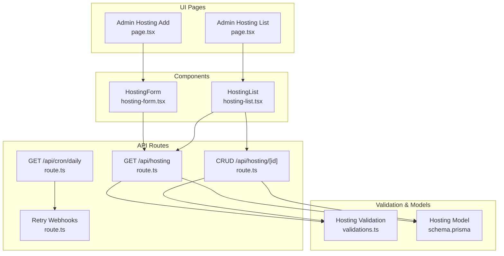
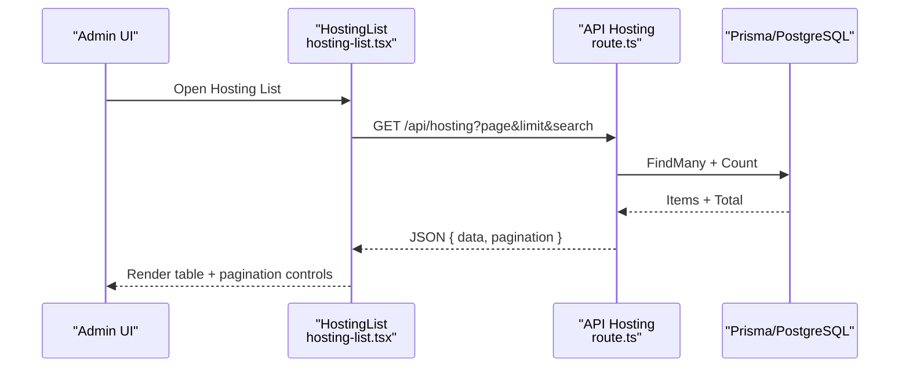
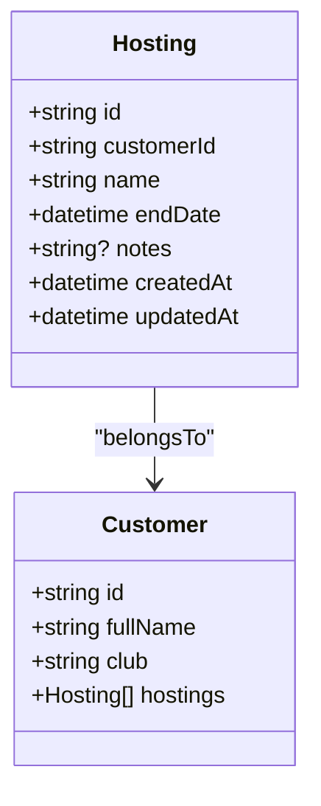
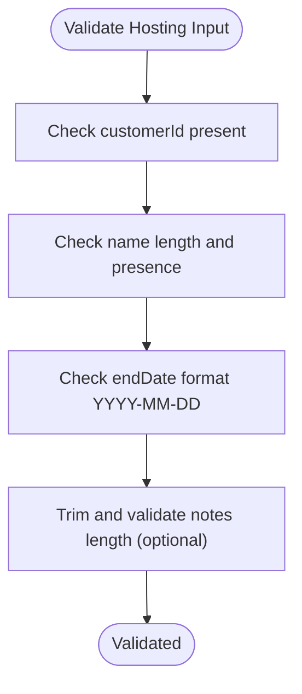
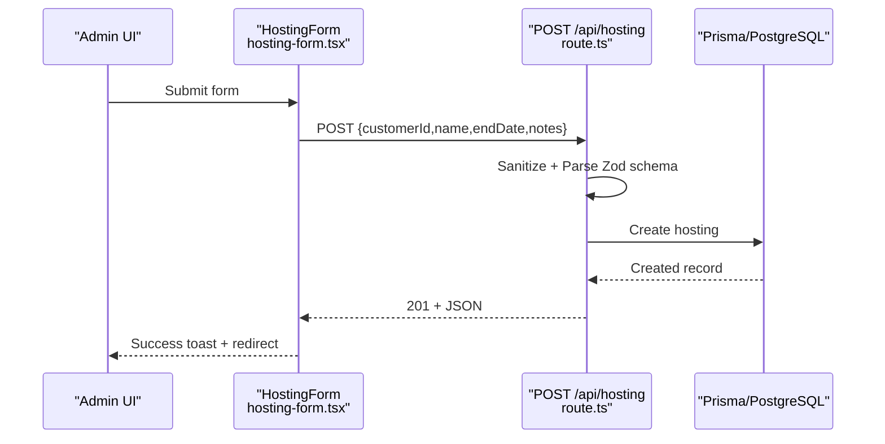
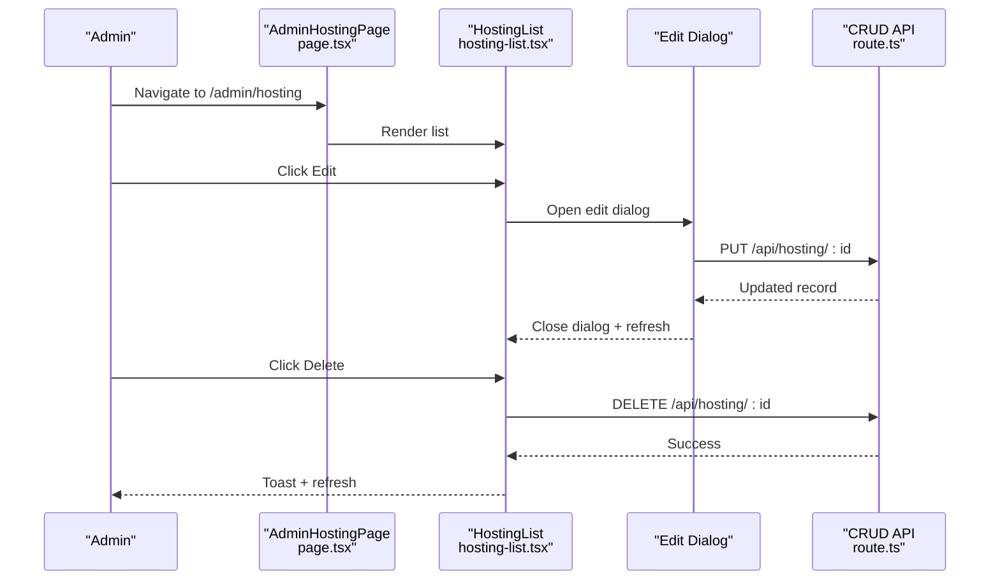
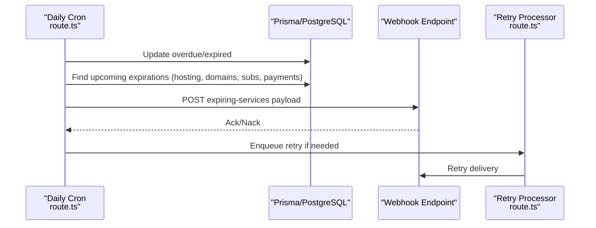
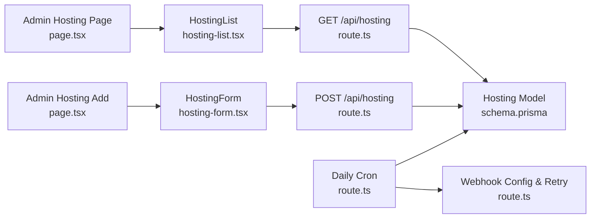

# Hosting Management

<cite>
**Referenced Files in This Document**
- [schema.prisma](file://prisma/schema.prisma)
- [validations.ts](file://src/lib/validations.ts)
- [route.ts](file://src/app/api/hosting/route.ts)
- [route.ts](file://src/app/api/hosting/[id]/route.ts)
- [page.tsx](file://src/app/admin/hosting/page.tsx)
- [page.tsx](file://src/app/admin/hosting/add/page.tsx)
- [hosting-form.tsx](file://src/components/hosting-form.tsx)
- [hosting-list.tsx](file://src/components/hosting-list.tsx)
- [route.ts](file://src/app/api/cron/daily/route.ts)
- [route.ts](file://src/app/api/system/webhooks/retry/route.ts)
- [page.tsx](file://src/app/admin/dashboard/page.tsx)
</cite>

## Table of Contents
1. [Introduction](#introduction)
2. [Project Structure](#project-structure)
3. [Core Components](#core-components)
4. [Architecture Overview](#architecture-overview)
5. [Detailed Component Analysis](#detailed-component-analysis)
6. [Dependency Analysis](#dependency-analysis)
7. [Performance Considerations](#performance-considerations)
8. [Troubleshooting Guide](#troubleshooting-guide)
9. [Conclusion](#conclusion)

## Introduction
This document describes the Hosting Management system, focusing on hosting service tracking, end date management, technical specifications monitoring, and renewal alerts. It explains hosting service types, server configurations, and resource allocation tracking, and covers hosting-specific features such as disk space monitoring, bandwidth tracking, and service status management. Administrative interfaces for hosting creation, configuration updates, and performance monitoring are documented alongside API endpoints for hosting CRUD operations, validation schemas, and integrations with hosting providers and monitoring systems.

## Project Structure
The Hosting Management system spans UI pages, shared components, API routes, validation schemas, and database models. The system is organized by feature and layer:
- UI pages under admin and portal for viewing and managing hosting records
- Shared components for forms and lists
- API routes implementing CRUD operations and renewal alert triggers
- Validation schemas ensuring data integrity
- Prisma schema defining the hosting model and related relations

**Diagram sources**
- [page.tsx:10-31](file://src/app/admin/hosting/page.tsx#L10-L31)
- [page.tsx:6-14](file://src/app/admin/hosting/add/page.tsx#L6-L14)
- [hosting-form.tsx:23-70](file://src/components/hosting-form.tsx#L23-L70)
- [hosting-list.tsx:18-47](file://src/components/hosting-list.tsx#L18-L47)
- [route.ts:6-42](file://src/app/api/hosting/route.ts#L6-L42)
- [route.ts:7-22](file://src/app/api/hosting/[id]/route.ts#L7-L22)
- [route.ts:7-37](file://src/app/api/cron/daily/route.ts#L7-L37)
- [route.ts:9-53](file://src/app/api/system/webhooks/retry/route.ts#L9-L53)
- [validations.ts:150-156](file://src/lib/validations.ts#L150-L156)
- [schema.prisma:244-256](file://prisma/schema.prisma#L244-L256)

**Section sources**
- [page.tsx:10-31](file://src/app/admin/hosting/page.tsx#L10-L31)
- [page.tsx:6-14](file://src/app/admin/hosting/add/page.tsx#L6-L14)
- [hosting-form.tsx:23-70](file://src/components/hosting-form.tsx#L23-L70)
- [hosting-list.tsx:18-47](file://src/components/hosting-list.tsx#L18-L47)
- [route.ts:6-42](file://src/app/api/hosting/route.ts#L6-L42)
- [route.ts:7-22](file://src/app/api/hosting/[id]/route.ts#L7-L22)
- [route.ts:7-37](file://src/app/api/cron/daily/route.ts#L7-L37)
- [route.ts:9-53](file://src/app/api/system/webhooks/retry/route.ts#L9-L53)
- [validations.ts:150-156](file://src/lib/validations.ts#L150-L156)
- [schema.prisma:244-256](file://prisma/schema.prisma#L244-L256)

## Core Components
- Hosting model and relations: The hosting entity stores customer linkage, name, end date, optional notes, and timestamps. It supports file attachments and belongs to a customer.
- Validation schemas: Strongly typed schemas enforce required fields, formats, and lengths for hosting creation and updates.
- API endpoints: Provide listing, creation, retrieval, update, and deletion of hosting records with pagination and filtering.
- UI components: Forms and lists enable administrators to create, edit, delete, and paginate hosting records with customer selection and search.
- Renewal alerts: Daily cron job detects upcoming expirations and emits webhooks for “expiring-services” and related events.

**Section sources**
- [schema.prisma:244-256](file://prisma/schema.prisma#L244-L256)
- [validations.ts:150-156](file://src/lib/validations.ts#L150-L156)
- [route.ts:6-42](file://src/app/api/hosting/route.ts#L6-L42)
- [route.ts:7-22](file://src/app/api/hosting/[id]/route.ts#L7-L22)
- [hosting-form.tsx:23-70](file://src/components/hosting-form.tsx#L23-L70)
- [hosting-list.tsx:18-47](file://src/components/hosting-list.tsx#L18-L47)
- [route.ts:32-37](file://src/app/api/cron/daily/route.ts#L32-L37)

## Architecture Overview
The system follows a layered architecture:
- Presentation layer: Next.js pages and components render the admin UI and collect user input.
- API layer: Next.js routes implement REST-like endpoints for hosting management and integrate with a background job for renewal alerts.
- Persistence layer: Prisma ORM maps to PostgreSQL, enforcing referential integrity and cascading deletes.

**Diagram sources**
- [hosting-list.tsx:32-47](file://src/components/hosting-list.tsx#L32-L47)
- [route.ts:6-42](file://src/app/api/hosting/route.ts#L6-L42)
- [schema.prisma:244-256](file://prisma/schema.prisma#L244-L256)

**Section sources**
- [hosting-list.tsx:32-47](file://src/components/hosting-list.tsx#L32-L47)
- [route.ts:6-42](file://src/app/api/hosting/route.ts#L6-L42)
- [schema.prisma:244-256](file://prisma/schema.prisma#L244-L256)

## Detailed Component Analysis

### Hosting Model and Relations
The hosting model defines:
- Identity: unique identifier
- Customer relation: foreign key to customer with cascade delete
- Attributes: name, end date, optional notes
- Timestamps: created/updated
- Files: optional file attachments

**Diagram sources**
- [schema.prisma:95-134](file://prisma/schema.prisma#L95-L134)
- [schema.prisma:244-256](file://prisma/schema.prisma#L244-L256)

**Section sources**
- [schema.prisma:95-134](file://prisma/schema.prisma#L95-L134)
- [schema.prisma:244-256](file://prisma/schema.prisma#L244-L256)

### Validation Schema for Hosting
The validation schema ensures:
- customerId is required
- name is required and length-limited
- endDate is required and matches a date pattern
- notes are optional and length-limited

**Diagram sources**
- [validations.ts:150-156](file://src/lib/validations.ts#L150-L156)

**Section sources**
- [validations.ts:150-156](file://src/lib/validations.ts#L150-L156)

### API Endpoints for Hosting CRUD
- GET /api/hosting: Lists hosting with pagination and optional filters (search, customerId)
- POST /api/hosting: Creates a new hosting record with sanitized and validated input
- GET /api/hosting/[id]: Retrieves a single hosting record
- PUT /api/hosting/[id]: Updates an existing hosting record with partial validation
- DELETE /api/hosting/[id]: Deletes a hosting record

**Diagram sources**
- [hosting-form.tsx:50-70](file://src/components/hosting-form.tsx#L50-L70)
- [route.ts:44-63](file://src/app/api/hosting/route.ts#L44-L63)
- [schema.prisma:244-256](file://prisma/schema.prisma#L244-L256)

**Section sources**
- [route.ts:6-42](file://src/app/api/hosting/route.ts#L6-L42)
- [route.ts:7-22](file://src/app/api/hosting/[id]/route.ts#L7-L22)
- [hosting-form.tsx:50-70](file://src/components/hosting-form.tsx#L50-L70)

### Administrative Interfaces
- Admin Hosting List: Displays paginated hosting records, search, edit, and delete actions via dialogs.
- Admin Hosting Add: Provides a form to create new hosting entries with customer selection and date input.
- Hosting Form: Uses Zod validation, fetches customer list, and submits to API or custom onSubmit handler.
- Hosting List: Implements pagination, search, edit dialog, and delete confirmation with toast feedback.

**Diagram sources**
- [page.tsx:10-31](file://src/app/admin/hosting/page.tsx#L10-L31)
- [hosting-list.tsx:72-94](file://src/components/hosting-list.tsx#L72-L94)
- [route.ts:24-49](file://src/app/api/hosting/[id]/route.ts#L24-L49)

**Section sources**
- [page.tsx:10-31](file://src/app/admin/hosting/page.tsx#L10-L31)
- [page.tsx:6-14](file://src/app/admin/hosting/add/page.tsx#L6-L14)
- [hosting-form.tsx:23-70](file://src/components/hosting-form.tsx#L23-L70)
- [hosting-list.tsx:18-47](file://src/components/hosting-list.tsx#L18-L47)
- [route.ts:24-49](file://src/app/api/hosting/[id]/route.ts#L24-L49)

### Renewal Alerts and Monitoring
- Daily Cron: Updates statuses for overdue payments and expired subscriptions, then queries upcoming expirations (including hosting) and emits webhooks for “daily-summary”, “due-payments”, and “expiring-services”.
- Webhook Retry: Dedicated endpoint builds payloads and retries failed webhook deliveries.
- Dashboard: Displays reminders for services expiring today, including hosting.

**Diagram sources**
- [route.ts:32-37](file://src/app/api/cron/daily/route.ts#L32-L37)
- [route.ts:101-128](file://src/app/api/cron/daily/route.ts#L101-L128)
- [route.ts:9-53](file://src/app/api/system/webhooks/retry/route.ts#L9-L53)

**Section sources**
- [route.ts:32-37](file://src/app/api/cron/daily/route.ts#L32-L37)
- [route.ts:101-128](file://src/app/api/cron/daily/route.ts#L101-L128)
- [route.ts:9-53](file://src/app/api/system/webhooks/retry/route.ts#L9-L53)
- [page.tsx:585-594](file://src/app/admin/dashboard/page.tsx#L585-L594)

## Dependency Analysis
- UI depends on components for forms and lists
- Components depend on validation schemas and API routes
- API routes depend on Prisma client and error handling utilities
- Cron jobs depend on webhook configuration and retry mechanisms
- Hosting model depends on customer model with cascade delete

**Diagram sources**
- [page.tsx:10-31](file://src/app/admin/hosting/page.tsx#L10-L31)
- [page.tsx:6-14](file://src/app/admin/hosting/add/page.tsx#L6-L14)
- [hosting-form.tsx:23-70](file://src/components/hosting-form.tsx#L23-L70)
- [hosting-list.tsx:18-47](file://src/components/hosting-list.tsx#L18-L47)
- [route.ts:6-42](file://src/app/api/hosting/route.ts#L6-L42)
- [route.ts:7-37](file://src/app/api/cron/daily/route.ts#L7-L37)
- [route.ts:9-53](file://src/app/api/system/webhooks/retry/route.ts#L9-L53)
- [schema.prisma:244-256](file://prisma/schema.prisma#L244-L256)

**Section sources**
- [page.tsx:10-31](file://src/app/admin/hosting/page.tsx#L10-L31)
- [page.tsx:6-14](file://src/app/admin/hosting/add/page.tsx#L6-L14)
- [hosting-form.tsx:23-70](file://src/components/hosting-form.tsx#L23-L70)
- [hosting-list.tsx:18-47](file://src/components/hosting-list.tsx#L18-L47)
- [route.ts:6-42](file://src/app/api/hosting/route.ts#L6-L42)
- [route.ts:7-37](file://src/app/api/cron/daily/route.ts#L7-L37)
- [route.ts:9-53](file://src/app/api/system/webhooks/retry/route.ts#L9-L53)
- [schema.prisma:244-256](file://prisma/schema.prisma#L244-L256)

## Performance Considerations
- Pagination: API endpoints support page and limit parameters with a capped maximum to prevent heavy queries.
- Filtering: Search and customer filters reduce dataset size server-side.
- Bulk operations: Daily cron uses batch updates for overdue/expired records.
- Client-side caching: Consider caching customer lists and hosting lists with appropriate invalidation.
- Database indexing: Ensure date-based queries (endDate, renewDate, dueDate) benefit from proper indexing.

[No sources needed since this section provides general guidance]

## Troubleshooting Guide
Common issues and resolutions:
- Validation errors on create/update: Ensure input matches the Zod schema (required fields, date format, length limits).
- 404 Not Found on GET /api/hosting/[id]: Verify the hosting ID exists.
- API errors: Review error handling responses and logs; confirm sanitization and schema parsing steps.
- Renewal alerts not firing: Check cron job execution, webhook configuration, and retry processor status.

**Section sources**
- [route.ts:44-63](file://src/app/api/hosting/route.ts#L44-L63)
- [route.ts:15-18](file://src/app/api/hosting/[id]/route.ts#L15-L18)
- [route.ts:132-135](file://src/app/api/cron/daily/route.ts#L132-L135)
- [route.ts:1-53](file://src/app/api/system/webhooks/retry/route.ts#L1-L53)

## Conclusion
The Hosting Management system provides a robust foundation for tracking hosting services, managing end dates, and automating renewal alerts. Its layered design separates concerns across UI, API, and persistence, while validation and schema-driven development ensure data integrity. Administrators can efficiently create, update, and monitor hosting records, and the system integrates with external monitoring and provider systems through webhooks and cron-based workflows.