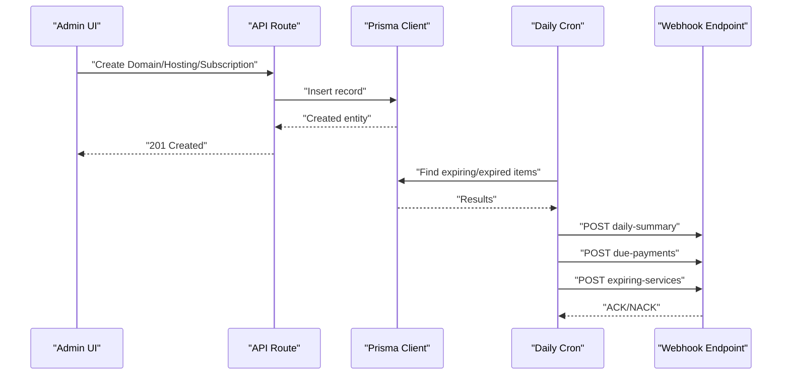
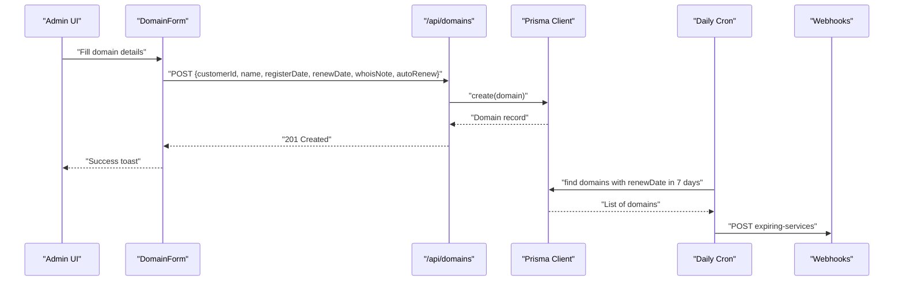
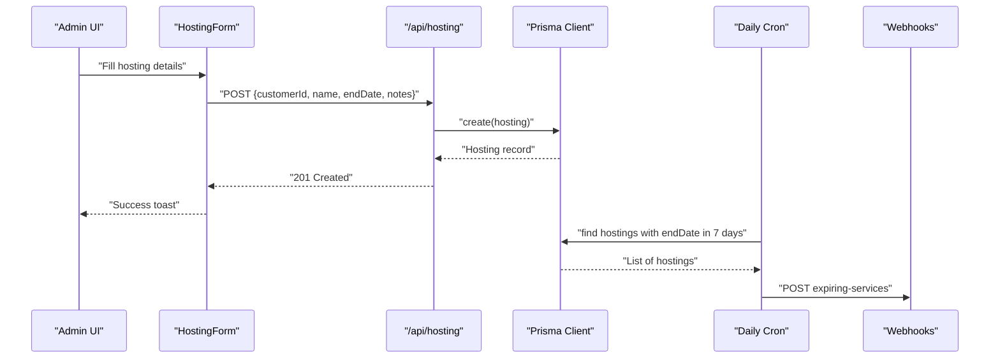
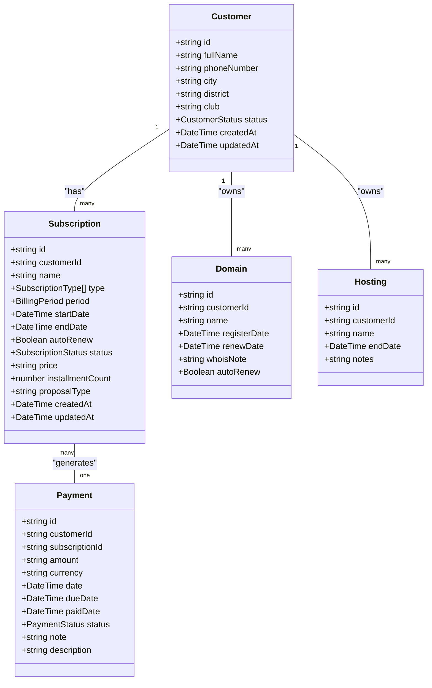
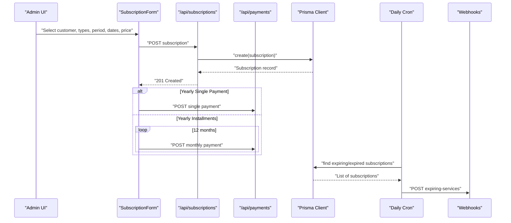
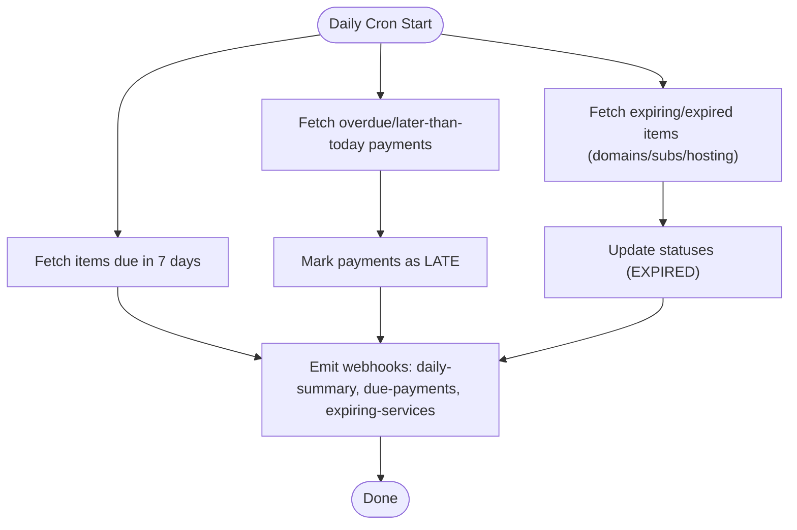
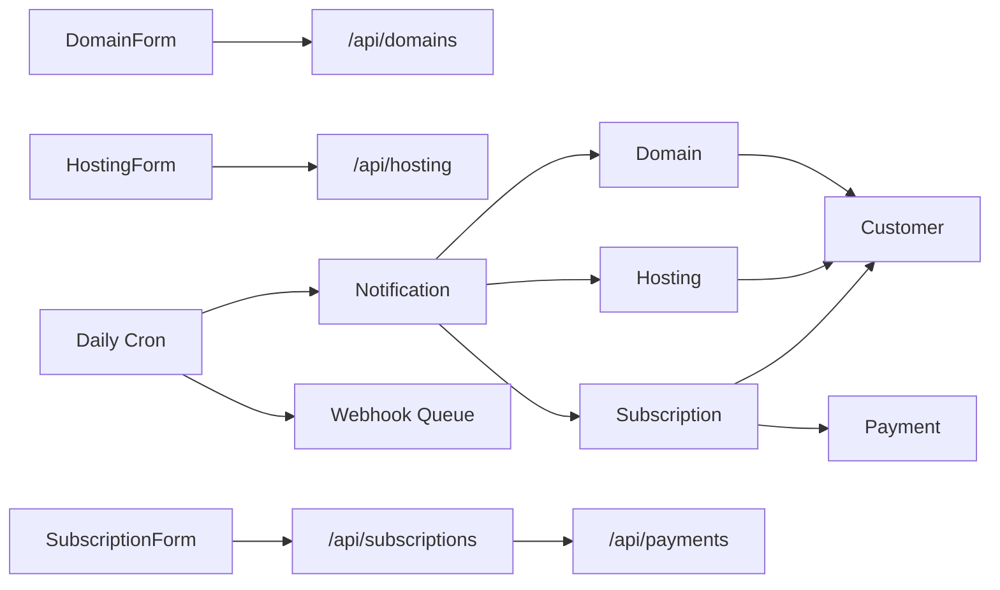

# Service Management

<cite>
**Referenced Files in This Document**
- [schema.prisma](file://prisma/schema.prisma)
- [types.ts](file://src/lib/types.ts)
- [route.ts](file://src/app/api/domains/route.ts)
- [route.ts](file://src/app/api/hosting/route.ts)
- [route.ts](file://src/app/api/subscriptions/route.ts)
- [route.ts](file://src/app/api/cron/daily/route.ts)
- [domain-form.tsx](file://src/components/domain-form.tsx)
- [hosting-form.tsx](file://src/components/hosting-form.tsx)
- [subscription-form.tsx](file://src/components/subscription-form.tsx)
- [page.tsx](file://src/app/admin/domains/page.tsx)
- [page.tsx](file://src/app/admin/hosting/page.tsx)
- [page.tsx](file://src/app/admin/subscriptions/page.tsx)
- [page.tsx](file://src/app/admin/domains/add/page.tsx)
- [page.tsx](file://src/app/admin/hosting/add/page.tsx)
- [page.tsx](file://src/app/admin/subscriptions/add/page.tsx)
- [validations.ts](file://src/lib/validations.ts)
</cite>

## Table of Contents
1. [Introduction](#introduction)
2. [Project Structure](#project-structure)
3. [Core Components](#core-components)
4. [Architecture Overview](#architecture-overview)
5. [Detailed Component Analysis](#detailed-component-analysis)
6. [Dependency Analysis](#dependency-analysis)
7. [Performance Considerations](#performance-considerations)
8. [Troubleshooting Guide](#troubleshooting-guide)
9. [Conclusion](#conclusion)

## Introduction
This document describes the Service Management system that handles three primary service categories:
- Domains: registration, renewal tracking, and optional auto-renewal
- Hosting: package lifecycle with end dates and notes
- Subscriptions: unified billing model supporting multiple service types, billing periods, and renewal cycles

It explains service enrollment, renewal tracking, auto-renewal configuration, status management, lifecycle handling, and integration with customer profiles. It also documents the unified subscription model that can combine multiple service types and billing cadences, along with technical specifications and webhook-driven notifications for upcoming expirations.

## Project Structure
The Service Management system spans database modeling, API routes, React components, and administrative pages:
- Database schema defines models for customers, domains, hosting, subscriptions, payments, and notifications
- API routes expose CRUD operations and a daily cron endpoint for renewal tracking and notifications
- React components provide forms for enrollment and configuration
- Administrative pages orchestrate navigation and list views

```mermaid
graph TB
subgraph "Database"
A["Customer"]
B["Domain"]
C["Hosting"]
D["Subscription"]
E["Payment"]
F["Notification"]
end
subgraph "API"
G["GET/POST/PUT/DELETE /api/domains"]
H["GET/POST /api/hosting"]
I["GET/POST/PATCH/DELETE /api/subscriptions"]
J["GET /api/cron/daily"]
end
subgraph "UI"
K["Admin Domains Page"]
L["Admin Hosting Page"]
M["Admin Subscriptions Page"]
N["Domain Form"]
O["Hosting Form"]
P["Subscription Form"]
end
A <- --> B
A <- --> C
A <- --> D
D --> E
D --> F
B --> F
C --> F
K --> G
L --> H
M --> I
N --> G
O --> H
P --> I
J --> F
```

**Diagram sources**
- [schema.prisma](file://prisma/schema.prisma)
- [route.ts](file://src/app/api/domains/route.ts)
- [route.ts](file://src/app/api/hosting/route.ts)
- [route.ts](file://src/app/api/subscriptions/route.ts)
- [route.ts](file://src/app/api/cron/daily/route.ts)
- [page.tsx](file://src/app/admin/domains/page.tsx)
- [page.tsx](file://src/app/admin/hosting/page.tsx)
- [page.tsx](file://src/app/admin/subscriptions/page.tsx)
- [domain-form.tsx](file://src/components/domain-form.tsx)
- [hosting-form.tsx](file://src/components/hosting-form.tsx)
- [subscription-form.tsx](file://src/components/subscription-form.tsx)

**Section sources**
- [schema.prisma](file://prisma/schema.prisma)
- [route.ts](file://src/app/api/domains/route.ts)
- [route.ts](file://src/app/api/hosting/route.ts)
- [route.ts](file://src/app/api/subscriptions/route.ts)
- [route.ts](file://src/app/api/cron/daily/route.ts)
- [page.tsx](file://src/app/admin/domains/page.tsx)
- [page.tsx](file://src/app/admin/hosting/page.tsx)
- [page.tsx](file://src/app/admin/subscriptions/page.tsx)
- [domain-form.tsx](file://src/components/domain-form.tsx)
- [hosting-form.tsx](file://src/components/hosting-form.tsx)
- [subscription-form.tsx](file://src/components/subscription-form.tsx)

## Core Components
- Customer model links services to clients and supports notes, payments, tasks, and more
- Domain model tracks registration/renewal dates, optional auto-renewal, and WHOIS notes
- Hosting model stores package identifiers and end dates with optional notes
- Subscription model unifies billing across multiple service types, billing periods, and renewal cycles; integrates with payments and notifications
- Daily cron job updates statuses and emits webhooks for upcoming expirations

Key data relationships:
- Customer has many Domains, Hostings, Subscriptions, Payments, Tasks, and Notes
- Subscription has many Payments and can be linked to a Proposal Type
- Notifications are emitted for domain renewals, hosting expirations, subscription payments, and maintenance reminders

**Section sources**
- [schema.prisma](file://prisma/schema.prisma)
- [types.ts](file://src/lib/types.ts)

## Architecture Overview
The system follows a layered architecture:
- Presentation layer: Next.js admin pages and forms
- API layer: Next.js API routes implementing CRUD and automation
- Persistence layer: Prisma ORM over PostgreSQL
- Automation layer: Daily cron job for renewal tracking and webhook dispatch



**Diagram sources**
- [route.ts](file://src/app/api/domains/route.ts)
- [route.ts](file://src/app/api/hosting/route.ts)
- [route.ts](file://src/app/api/subscriptions/route.ts)
- [route.ts](file://src/app/api/cron/daily/route.ts)

## Detailed Component Analysis

### Domain Management
- Enrollment: Admins create domains via a form that posts to the domains API
- Renewal tracking: Domains maintain registration and renewal dates; the daily cron identifies upcoming renewals and triggers notifications
- Auto-renewal: Optional toggle stored per domain; can be combined with notifications
- WHOIS management: Optional notes captured during enrollment for WHOIS-related tracking



**Diagram sources**
- [domain-form.tsx](file://src/components/domain-form.tsx)
- [route.ts](file://src/app/api/domains/route.ts)
- [route.ts](file://src/app/api/cron/daily/route.ts)

**Section sources**
- [domain-form.tsx](file://src/components/domain-form.tsx)
- [route.ts](file://src/app/api/domains/route.ts)
- [route.ts](file://src/app/api/cron/daily/route.ts)
- [validations.ts](file://src/lib/validations.ts)

### Hosting Management
- Enrollment: Admins create hosting packages with end dates and optional notes
- Lifecycle: Hosting records are managed independently; the daily cron detects nearing end dates and notifies
- No auto-renew flag: Hosting does not include an auto-renew field; renewal decisions are manual



**Diagram sources**
- [hosting-form.tsx](file://src/components/hosting-form.tsx)
- [route.ts](file://src/app/api/hosting/route.ts)
- [route.ts](file://src/app/api/cron/daily/route.ts)

**Section sources**
- [hosting-form.tsx](file://src/components/hosting-form.tsx)
- [route.ts](file://src/app/api/hosting/route.ts)
- [route.ts](file://src/app/api/cron/daily/route.ts)
- [validations.ts](file://src/lib/validations.ts)

### Unified Subscription Model
- Multi-service types: Subscriptions can include multiple service types (e.g., Domain, Hosting, Software Rental, Maintenance)
- Billing periods: Monthly or yearly billing supported
- Renewal cycles: Auto-renew flag configurable; yearly plans support single payment or monthly installments
- Payment linkage: Subscriptions generate payments; the form can create a single yearly payment or 12 monthly installments
- Proposal type association: Subscriptions can be linked to a proposal type for reporting and accounting alignment



**Diagram sources**
- [schema.prisma](file://prisma/schema.prisma)



**Diagram sources**
- [subscription-form.tsx](file://src/components/subscription-form.tsx)
- [route.ts](file://src/app/api/subscriptions/route.ts)
- [route.ts](file://src/app/api/cron/daily/route.ts)

**Section sources**
- [subscription-form.tsx](file://src/components/subscription-form.tsx)
- [route.ts](file://src/app/api/subscriptions/route.ts)
- [route.ts](file://src/app/api/cron/daily/route.ts)
- [validations.ts](file://src/lib/validations.ts)

### Renewal Tracking and Auto-Renewal
- Renewal tracking: The daily cron identifies overdue or soon-to-expire items across domains, subscriptions, and hosting
- Status updates: Overdue payments are marked late; active subscriptions past their end date are marked expired
- Notifications: Webhooks are dispatched for daily summaries, due payments, and expiring services
- Auto-renewal: Supported for domains; subscriptions can be configured for auto-renew depending on type and policy



**Diagram sources**
- [route.ts](file://src/app/api/cron/daily/route.ts)

**Section sources**
- [route.ts](file://src/app/api/cron/daily/route.ts)

### Service Lifecycle Management
- Creation: Forms submit to API routes; validation ensures required fields and formats
- Enrollment: Entities are persisted with customer linkage
- Monitoring: Daily cron updates statuses and sends notifications
- Renewal: Manual or automated depending on service type and configuration

**Section sources**
- [domain-form.tsx](file://src/components/domain-form.tsx)
- [hosting-form.tsx](file://src/components/hosting-form.tsx)
- [subscription-form.tsx](file://src/components/subscription-form.tsx)
- [route.ts](file://src/app/api/domains/route.ts)
- [route.ts](file://src/app/api/hosting/route.ts)
- [route.ts](file://src/app/api/subscriptions/route.ts)
- [route.ts](file://src/app/api/cron/daily/route.ts)

### Technical Specifications Tracking
- Domains: name, registration date, renewal date, optional WHOIS notes, optional auto-renewal
- Hosting: name, end date, optional notes
- Subscriptions: customer, name, types, period, start/end dates, auto-renew, status, price, optional proposal type, optional installment count

**Section sources**
- [schema.prisma](file://prisma/schema.prisma)
- [validations.ts](file://src/lib/validations.ts)

### Integration with Customer Profiles
- All services are associated with a customer via foreign keys
- Lists and forms fetch customer metadata to populate selection controls
- Notifications and payments reference the customer for communication and accounting

**Section sources**
- [schema.prisma](file://prisma/schema.prisma)
- [domain-form.tsx](file://src/components/domain-form.tsx)
- [hosting-form.tsx](file://src/components/hosting-form.tsx)
- [subscription-form.tsx](file://src/components/subscription-form.tsx)

## Dependency Analysis
- Domain depends on Customer; Hosting depends on Customer; Subscription depends on Customer and Payment
- Subscription generates Payment entries; Notifications depend on upcoming/expiring entities
- UI components depend on API routes; API routes depend on Prisma client; Cron depends on webhook configuration



**Diagram sources**
- [schema.prisma](file://prisma/schema.prisma)
- [route.ts](file://src/app/api/domains/route.ts)
- [route.ts](file://src/app/api/hosting/route.ts)
- [route.ts](file://src/app/api/subscriptions/route.ts)
- [route.ts](file://src/app/api/cron/daily/route.ts)

**Section sources**
- [schema.prisma](file://prisma/schema.prisma)
- [route.ts](file://src/app/api/domains/route.ts)
- [route.ts](file://src/app/api/hosting/route.ts)
- [route.ts](file://src/app/api/subscriptions/route.ts)
- [route.ts](file://src/app/api/cron/daily/route.ts)

## Performance Considerations
- Pagination: API routes accept page and limit parameters with a capped maximum to prevent heavy queries
- Asynchronous operations: Bulk updates and parallel webhook dispatch improve throughput
- Indexing: Ensure database indexes on frequently queried fields (dates, status) for optimal performance
- Validation: Client-side and server-side validation reduce invalid writes and downstream errors

[No sources needed since this section provides general guidance]

## Troubleshooting Guide
Common issues and resolutions:
- Invalid IDs: API routes validate presence and type of IDs before performing operations
- Validation failures: Ensure date formats match YYYY-MM-DD and numeric fields contain only digits
- Webhook delivery: Cron logs webhook attempts and enqueues retries; check webhook configuration and network connectivity
- Status mismatches: Verify cron execution and date boundaries for late payments and expired subscriptions

**Section sources**
- [route.ts](file://src/app/api/subscriptions/route.ts)
- [route.ts](file://src/app/api/cron/daily/route.ts)
- [validations.ts](file://src/lib/validations.ts)

## Conclusion
The Service Management system provides a unified, customer-centric approach to managing domains, hosting, and subscriptions. It supports flexible billing models, renewal tracking, and automated notifications via webhooks. The architecture cleanly separates concerns across UI, API, persistence, and automation layers, enabling scalable growth and reliable operations.