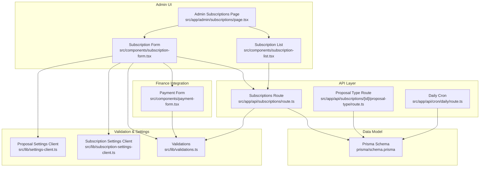
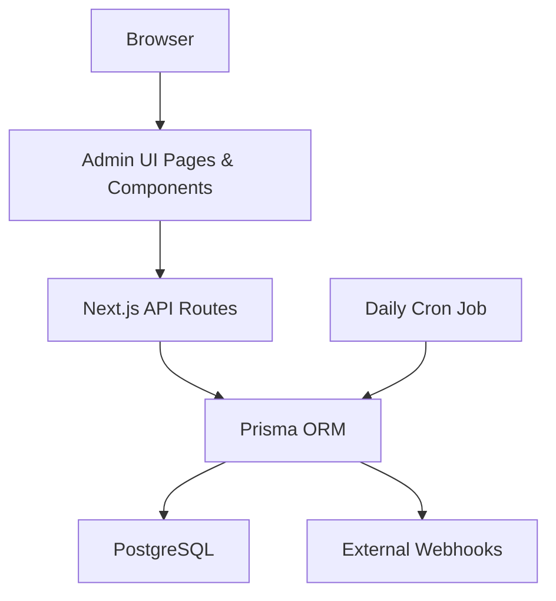
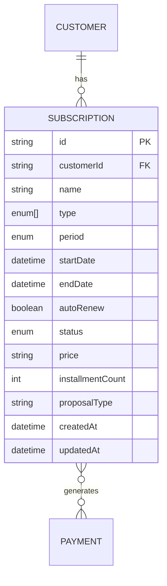
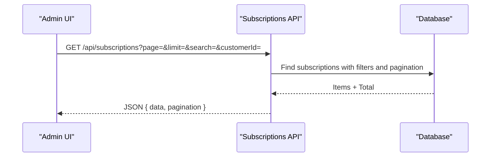
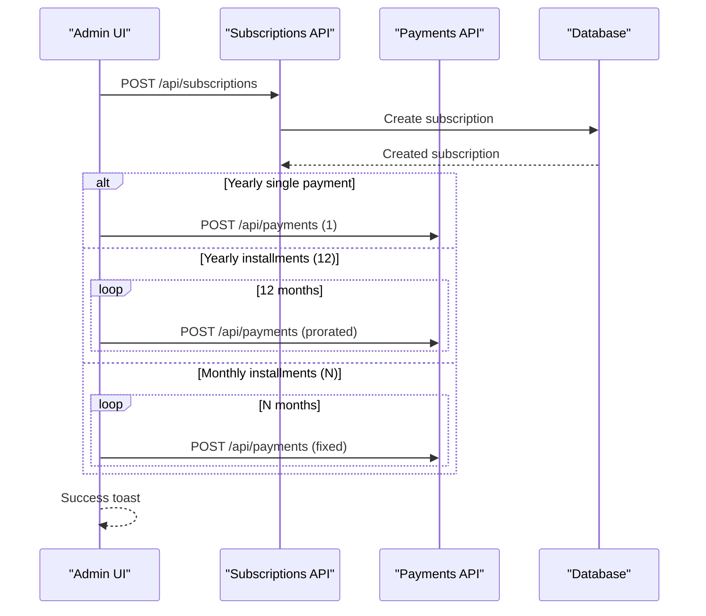
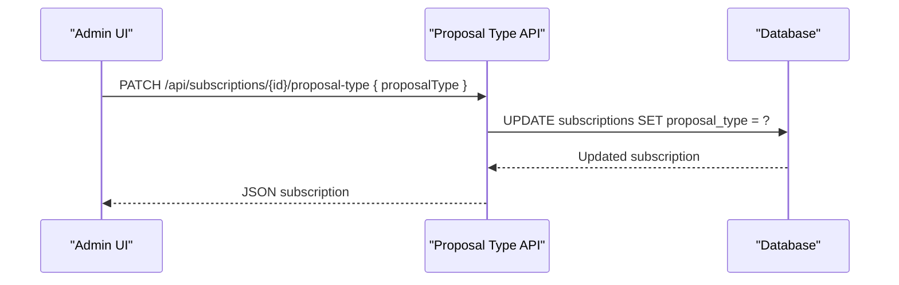
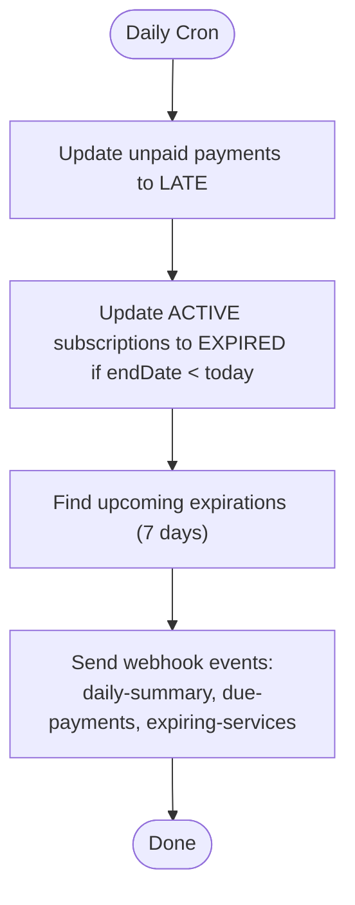
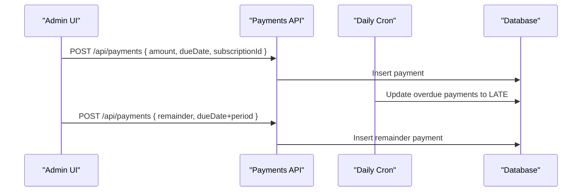
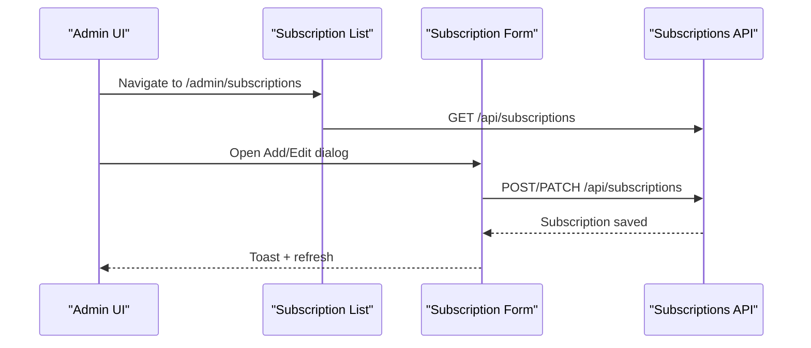
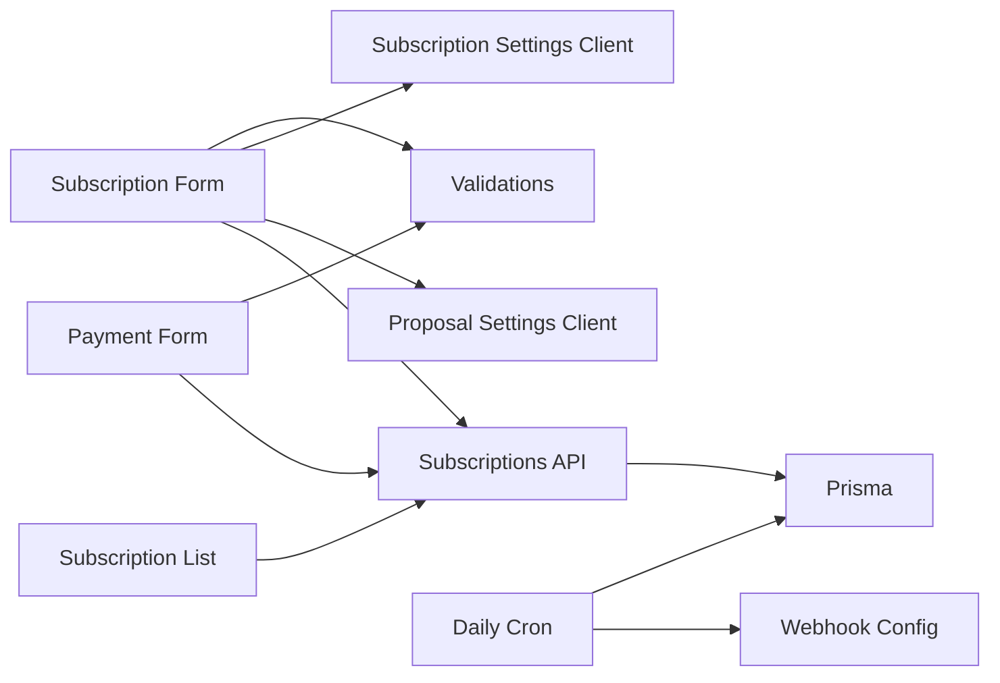

# Subscription Management

<cite>
**Referenced Files in This Document**
- [src/app/admin/subscriptions/page.tsx](file://src/app/admin/subscriptions/page.tsx)
- [src/components/subscription-form.tsx](file://src/components/subscription-form.tsx)
- [src/components/subscription-list.tsx](file://src/components/subscription-list.tsx)
- [src/lib/subscription-settings-client.ts](file://src/lib/subscription-settings-client.ts)
- [src/lib/settings-client.ts](file://src/lib/settings-client.ts)
- [src/app/api/subscriptions/route.ts](file://src/app/api/subscriptions/route.ts)
- [src/app/api/subscriptions/[id]/proposal-type/route.ts](file://src/app/api/subscriptions/[id]/proposal-type/route.ts)
- [src/lib/validations.ts](file://src/lib/validations.ts)
- [prisma/schema.prisma](file://prisma/schema.prisma)
- [src/app/api/cron/daily/route.ts](file://src/app/api/cron/daily/route.ts)
- [src/components/payment-form.tsx](file://src/components/payment-form.tsx)
</cite>

## Table of Contents
1. [Introduction](#introduction)
2. [Project Structure](#project-structure)
3. [Core Components](#core-components)
4. [Architecture Overview](#architecture-overview)
5. [Detailed Component Analysis](#detailed-component-analysis)
6. [Dependency Analysis](#dependency-analysis)
7. [Performance Considerations](#performance-considerations)
8. [Troubleshooting Guide](#troubleshooting-guide)
9. [Conclusion](#conclusion)

## Introduction
This document describes the Subscription Management system that unifies multiple service types (domains, hosting, and others) under a single subscription model. It covers lifecycle management, billing periods, renewal cycles, automatic renewal configuration, multi-service subscription handling, billing cycle management, proration calculations, service bundling, administrative interfaces, and API endpoints for CRUD operations, proposal-type associations, and financial integration.

## Project Structure
The Subscription Management system spans UI components, server-side APIs, validation schemas, database models, and background jobs:
- Administrative UI: subscription listing, creation, editing, and cancellation
- Client-side forms and lists manage subscription data and integrate with backend APIs
- Backend APIs handle CRUD operations, proposal-type association, and financial integrations
- Validation schemas enforce input correctness
- Database schema defines the subscription entity, enums, and relationships
- Daily cron job manages status transitions and sends webhook notifications

**Diagram sources**
- [src/app/admin/subscriptions/page.tsx:1-32](file://src/app/admin/subscriptions/page.tsx#L1-L32)
- [src/components/subscription-list.tsx:1-416](file://src/components/subscription-list.tsx#L1-L416)
- [src/components/subscription-form.tsx:1-459](file://src/components/subscription-form.tsx#L1-L459)
- [src/app/api/subscriptions/route.ts:1-134](file://src/app/api/subscriptions/route.ts#L1-L134)
- [src/app/api/subscriptions/[id]/proposal-type/route.ts:1-47](file://src/app/api/subscriptions/[id]/proposal-type/route.ts#L1-L47)
- [src/app/api/cron/daily/route.ts:1-135](file://src/app/api/cron/daily/route.ts#L1-L135)
- [src/lib/validations.ts:101-138](file://src/lib/validations.ts#L101-L138)
- [src/lib/subscription-settings-client.ts:1-24](file://src/lib/subscription-settings-client.ts#L1-L24)
- [src/lib/settings-client.ts:1-126](file://src/lib/settings-client.ts#L1-L126)
- [prisma/schema.prisma:206-226](file://prisma/schema.prisma#L206-L226)
- [src/components/payment-form.tsx:1-361](file://src/components/payment-form.tsx#L1-L361)

**Section sources**
- [src/app/admin/subscriptions/page.tsx:1-32](file://src/app/admin/subscriptions/page.tsx#L1-L32)
- [src/components/subscription-list.tsx:1-416](file://src/components/subscription-list.tsx#L1-L416)
- [src/components/subscription-form.tsx:1-459](file://src/components/subscription-form.tsx#L1-L459)
- [src/app/api/subscriptions/route.ts:1-134](file://src/app/api/subscriptions/route.ts#L1-L134)
- [src/app/api/subscriptions/[id]/proposal-type/route.ts:1-47](file://src/app/api/subscriptions/[id]/proposal-type/route.ts#L1-L47)
- [src/lib/validations.ts:101-138](file://src/lib/validations.ts#L101-L138)
- [prisma/schema.prisma:206-226](file://prisma/schema.prisma#L206-L226)
- [src/app/api/cron/daily/route.ts:1-135](file://src/app/api/cron/daily/route.ts#L1-L135)
- [src/components/payment-form.tsx:1-361](file://src/components/payment-form.tsx#L1-L361)

## Core Components
- Unified subscription model supporting multiple service types via an array of enums and optional proposal-type association
- Administrative UI for listing, filtering, viewing, editing, and deleting subscriptions
- Client-side form with validation, proposal-type selection, and financial integration for monthly installments and yearly plans
- Backend APIs for CRUD operations and proposal-type association
- Daily cron job for status transitions and webhook notifications
- Financial integration for proration and recurring billing

Key capabilities:
- Multi-service subscription handling: a subscription can include multiple service types (e.g., domains, hosting)
- Billing periods: monthly and yearly
- Renewal cycles: auto-renew flag and end-date driven lifecycle
- Proposal-type association: optional link to proposal types for reporting and categorization
- Financial integration: automatic payment creation for monthly installments and yearly plans

**Section sources**
- [prisma/schema.prisma:184-226](file://prisma/schema.prisma#L184-L226)
- [src/lib/validations.ts:101-138](file://src/lib/validations.ts#L101-L138)
- [src/components/subscription-form.tsx:104-213](file://src/components/subscription-form.tsx#L104-L213)
- [src/app/api/subscriptions/route.ts:46-112](file://src/app/api/subscriptions/route.ts#L46-L112)
- [src/app/api/subscriptions/[id]/proposal-type/route.ts:5-46](file://src/app/api/subscriptions/[id]/proposal-type/route.ts#L5-L46)
- [src/app/api/cron/daily/route.ts:7-27](file://src/app/api/cron/daily/route.ts#L7-L27)

## Architecture Overview
The system follows a layered architecture:
- Presentation layer: Next.js pages and components
- API layer: Next.js API routes handling CRUD and integrations
- Domain and persistence layer: Prisma ORM with PostgreSQL
- Background processing: daily cron job for lifecycle and notifications

**Diagram sources**
- [src/app/admin/subscriptions/page.tsx:1-32](file://src/app/admin/subscriptions/page.tsx#L1-L32)
- [src/components/subscription-list.tsx:1-416](file://src/components/subscription-list.tsx#L1-L416)
- [src/components/subscription-form.tsx:1-459](file://src/components/subscription-form.tsx#L1-L459)
- [src/app/api/subscriptions/route.ts:1-134](file://src/app/api/subscriptions/route.ts#L1-L134)
- [src/app/api/cron/daily/route.ts:1-135](file://src/app/api/cron/daily/route.ts#L1-L135)
- [prisma/schema.prisma:1-14](file://prisma/schema.prisma#L1-L14)

## Detailed Component Analysis

### Subscription Data Model
The subscription entity supports:
- Customer relationship
- Name, type (array of enums), period (monthly/yearly), dates, auto-renew flag, status, price, optional installment count, optional proposal type
- Payments relationship for financial tracking

**Diagram sources**
- [prisma/schema.prisma:206-226](file://prisma/schema.prisma#L206-L226)
- [prisma/schema.prisma:95-134](file://prisma/schema.prisma#L95-L134)
- [prisma/schema.prisma:305-343](file://prisma/schema.prisma#L305-L343)

**Section sources**
- [prisma/schema.prisma:184-226](file://prisma/schema.prisma#L184-L226)

### Administrative UI: Listing and Filtering
The subscription list provides:
- Stats cards for totals, active, expired, and total value
- Filters by type, period, and status
- Pagination and search
- Actions: view, edit, delete
- Integration with the subscriptions API

**Diagram sources**
- [src/components/subscription-list.tsx:60-75](file://src/components/subscription-list.tsx#L60-L75)
- [src/app/api/subscriptions/route.ts:7-44](file://src/app/api/subscriptions/route.ts#L7-L44)

**Section sources**
- [src/components/subscription-list.tsx:27-416](file://src/components/subscription-list.tsx#L27-L416)
- [src/app/api/subscriptions/route.ts:7-44](file://src/app/api/subscriptions/route.ts#L7-L44)

### Subscription Creation and Financial Integration
The subscription creation form supports:
- Customer selection
- Type selection (from proposal types)
- Period selection (monthly/yearly)
- Auto-renew configuration for yearly
- Monthly installment count
- Automatic payment creation:
  - Yearly single payment
  - Yearly 12 installments with proration
  - Monthly installments over N months

**Diagram sources**
- [src/components/subscription-form.tsx:104-213](file://src/components/subscription-form.tsx#L104-L213)
- [src/app/api/subscriptions/route.ts:46-85](file://src/app/api/subscriptions/route.ts#L46-L85)
- [src/app/api/subscriptions/[id]/proposal-type/route.ts:5-46](file://src/app/api/subscriptions/[id]/proposal-type/route.ts#L5-L46)

**Section sources**
- [src/components/subscription-form.tsx:25-213](file://src/components/subscription-form.tsx#L25-L213)
- [src/app/api/subscriptions/route.ts:46-85](file://src/app/api/subscriptions/route.ts#L46-L85)

### Proposal-Type Association
Subscriptions can be associated with a proposal type for reporting and categorization. The association is handled via a dedicated endpoint that updates the subscription’s proposal type field.

**Diagram sources**
- [src/app/api/subscriptions/[id]/proposal-type/route.ts:5-46](file://src/app/api/subscriptions/[id]/proposal-type/route.ts#L5-L46)

**Section sources**
- [src/app/api/subscriptions/[id]/proposal-type/route.ts:5-46](file://src/app/api/subscriptions/[id]/proposal-type/route.ts#L5-L46)

### Subscription Lifecycle Management and Renewal
Lifecycle management includes:
- Status transitions: active → expired based on end date
- Upcoming expiration notifications via webhooks
- Optional auto-renew flag for yearly subscriptions

**Diagram sources**
- [src/app/api/cron/daily/route.ts:7-135](file://src/app/api/cron/daily/route.ts#L7-L135)

**Section sources**
- [src/app/api/cron/daily/route.ts:7-135](file://src/app/api/cron/daily/route.ts#L7-L135)

### Billing Cycle Management and Proration
Billing cycle management integrates with the payment system:
- Monthly installments over N months
- Yearly single payment
- Yearly installments with proration across 12 months
- Automatic remainder creation when partial payments are made

**Diagram sources**
- [src/components/payment-form.tsx:100-152](file://src/components/payment-form.tsx#L100-L152)
- [src/app/api/cron/daily/route.ts:12-27](file://src/app/api/cron/daily/route.ts#L12-L27)

**Section sources**
- [src/components/payment-form.tsx:100-152](file://src/components/payment-form.tsx#L100-L152)
- [src/app/api/cron/daily/route.ts:12-27](file://src/app/api/cron/daily/route.ts#L12-L27)

### Administrative Interfaces
- Admin subscriptions page with navigation to add new subscriptions
- Subscription list with filtering, pagination, and actions
- Subscription form with validation and financial integration
- Edit dialog with pre-filled data and patch updates

**Diagram sources**
- [src/app/admin/subscriptions/page.tsx:10-31](file://src/app/admin/subscriptions/page.tsx#L10-L31)
- [src/components/subscription-list.tsx:27-416](file://src/components/subscription-list.tsx#L27-L416)
- [src/components/subscription-form.tsx:104-213](file://src/components/subscription-form.tsx#L104-L213)
- [src/app/api/subscriptions/route.ts:46-112](file://src/app/api/subscriptions/route.ts#L46-L112)

**Section sources**
- [src/app/admin/subscriptions/page.tsx:10-31](file://src/app/admin/subscriptions/page.tsx#L10-L31)
- [src/components/subscription-list.tsx:27-416](file://src/components/subscription-list.tsx#L27-L416)
- [src/components/subscription-form.tsx:25-213](file://src/components/subscription-form.tsx#L25-L213)
- [src/app/api/subscriptions/route.ts:46-112](file://src/app/api/subscriptions/route.ts#L46-L112)

## Dependency Analysis
- UI components depend on:
  - Validation schemas for form correctness
  - Settings clients for proposal-type and subscription-type options
  - API routes for CRUD and financial operations
- API routes depend on:
  - Prisma for database operations
  - Error handler utilities
- Daily cron job depends on:
  - Prisma for status updates and notifications
  - Webhook configuration for external events

**Diagram sources**
- [src/components/subscription-form.tsx:104-213](file://src/components/subscription-form.tsx#L104-L213)
- [src/lib/validations.ts:101-138](file://src/lib/validations.ts#L101-L138)
- [src/lib/subscription-settings-client.ts:20-24](file://src/lib/subscription-settings-client.ts#L20-L24)
- [src/lib/settings-client.ts:10-32](file://src/lib/settings-client.ts#L10-L32)
- [src/app/api/subscriptions/route.ts:46-112](file://src/app/api/subscriptions/route.ts#L46-L112)
- [src/app/api/cron/daily/route.ts:1-135](file://src/app/api/cron/daily/route.ts#L1-L135)
- [src/components/payment-form.tsx:100-152](file://src/components/payment-form.tsx#L100-L152)

**Section sources**
- [src/lib/validations.ts:101-138](file://src/lib/validations.ts#L101-L138)
- [src/lib/subscription-settings-client.ts:20-24](file://src/lib/subscription-settings-client.ts#L20-L24)
- [src/lib/settings-client.ts:10-32](file://src/lib/settings-client.ts#L10-L32)
- [src/app/api/subscriptions/route.ts:46-112](file://src/app/api/subscriptions/route.ts#L46-L112)
- [src/app/api/cron/daily/route.ts:1-135](file://src/app/api/cron/daily/route.ts#L1-L135)
- [src/components/payment-form.tsx:100-152](file://src/components/payment-form.tsx#L100-L152)

## Performance Considerations
- Pagination and filtering reduce payload sizes for subscription listing
- Batched payment creation uses Promise.all for concurrent requests
- Daily cron consolidates status updates and notifications
- Client-side caching of customer and proposal-type lists reduces repeated network calls

## Troubleshooting Guide
Common issues and resolutions:
- Validation errors on subscription creation/edit: ensure required fields are filled and formatted correctly (dates, amounts)
- Proposal-type association failures: verify the subscription exists and the proposal type value is valid
- Payment creation anomalies: confirm subscription period and dates; verify proration logic for yearly installments
- Status not transitioning to expired: ensure cron job runs and system date/time is correct
- Webhook delivery failures: check webhook configuration and retry queue

**Section sources**
- [src/lib/validations.ts:101-138](file://src/lib/validations.ts#L101-L138)
- [src/app/api/subscriptions/[id]/proposal-type/route.ts:5-46](file://src/app/api/subscriptions/[id]/proposal-type/route.ts#L5-L46)
- [src/app/api/cron/daily/route.ts:7-135](file://src/app/api/cron/daily/route.ts#L7-L135)

## Conclusion
The Subscription Management system provides a unified, extensible model for managing diverse services with robust lifecycle controls, financial integration, and administrative capabilities. Its modular design supports future enhancements such as dynamic subscription types, advanced proration rules, and expanded webhook integrations.