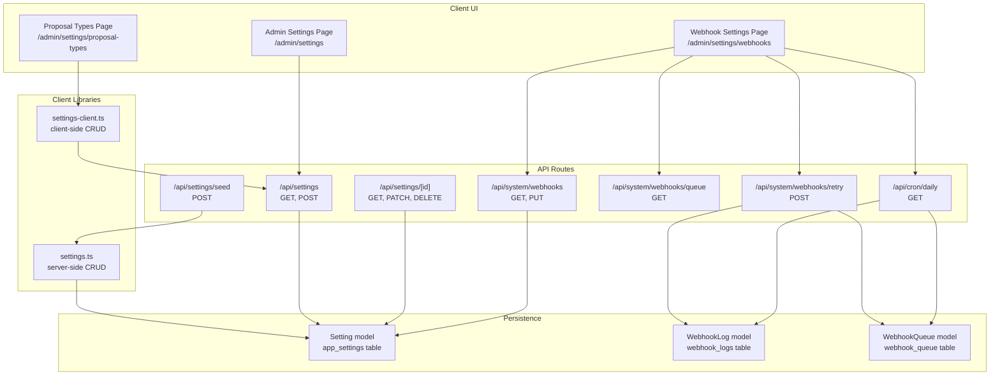
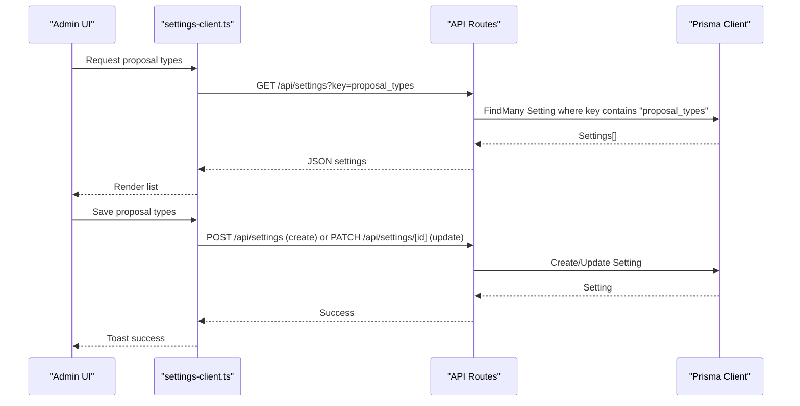
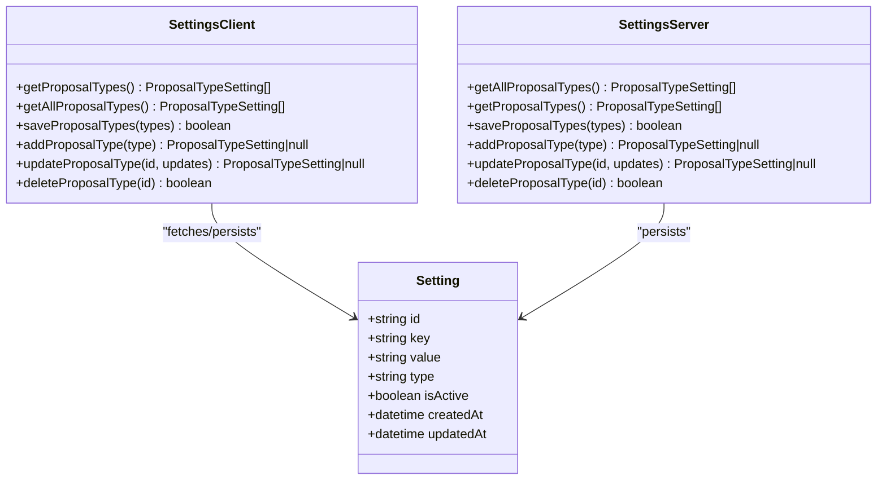
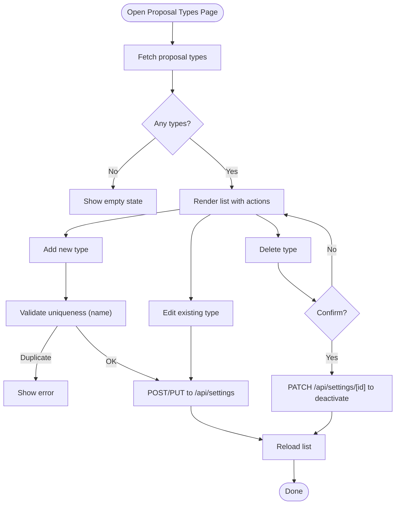
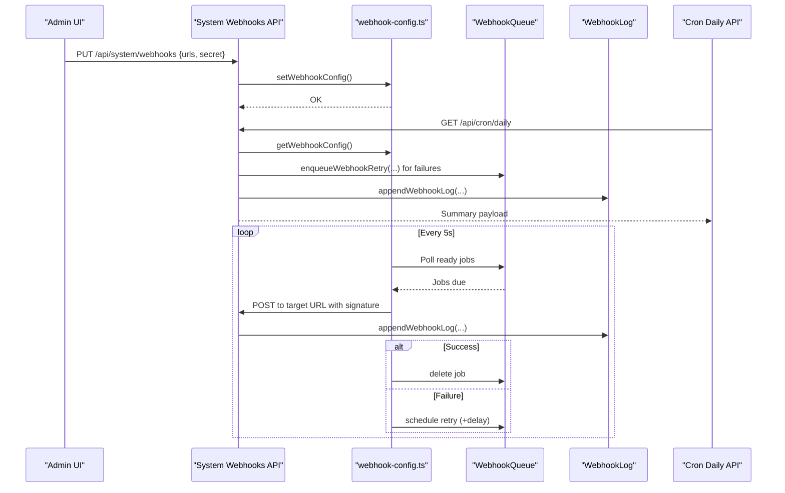
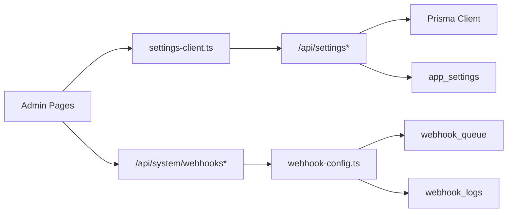

# Settings & Configuration

<cite>
**Referenced Files in This Document**
- [schema.prisma](file://prisma/schema.prisma)
- [20260215095355_add_key_value_settings/migration.sql](file://prisma/migrations/20260215095355_add_key_value_settings/migration.sql)
- [settings.ts](file://src/lib/settings.ts)
- [settings-client.ts](file://src/lib/settings-client.ts)
- [proposal-types/page.tsx](file://src/app/admin/settings/proposal-types/page.tsx)
- [proposal-type-list.tsx](file://src/components/proposal-type-list.tsx)
- [seed-settings.js](file://scripts/seed-settings.js)
- [settings/route.ts](file://src/app/api/settings/route.ts)
- [settings/[id]/route.ts](file://src/app/api/settings/[id]/route.ts)
- [settings/seed/route.ts](file://src/app/api/settings/seed/route.ts)
- [webhook-config.ts](file://src/lib/webhook-config.ts)
- [system/webhooks/route.ts](file://src/app/api/system/webhooks/route.ts)
- [system/webhooks/queue/route.ts](file://src/app/api/system/webhooks/queue/route.ts)
- [system/webhooks/retry/route.ts](file://src/app/api/system/webhooks/retry/route.ts)
- [cron/daily/route.ts](file://src/app/api/cron/daily/route.ts)
- [webhooks/page.tsx](file://src/app/admin/settings/webhooks/page.tsx)
</cite>

## Table of Contents
1. [Introduction](#introduction)
2. [Project Structure](#project-structure)
3. [Core Components](#core-components)
4. [Architecture Overview](#architecture-overview)
5. [Detailed Component Analysis](#detailed-component-analysis)
6. [Dependency Analysis](#dependency-analysis)
7. [Performance Considerations](#performance-considerations)
8. [Troubleshooting Guide](#troubleshooting-guide)
9. [Conclusion](#conclusion)
10. [Appendices](#appendices)

## Introduction
This document explains how to configure and manage settings in Customer WebMahsul. It covers:
- System-wide application parameters and key-value settings
- Webhook configuration and retry mechanisms
- Business configuration settings such as proposal types
- Notification preferences and branding options
- Operational parameters and cron-driven events
- Backup and restoration strategies
- Validation and troubleshooting procedures
- The relationship between client-side and server-side settings management

## Project Structure
Customer WebMahsul organizes settings into two primary categories:
- Key-value settings persisted in the database via a dedicated Setting model
- Environment-based webhook configuration with runtime persistence in memory

**Diagram sources**
- [webhooks/page.tsx:17-315](file://src/app/admin/settings/webhooks/page.tsx#L17-L315)
- [proposal-types/page.tsx:7-22](file://src/app/admin/settings/proposal-types/page.tsx#L7-L22)
- [settings-client.ts:10-126](file://src/lib/settings-client.ts#L10-L126)
- [settings.ts:12-154](file://src/lib/settings.ts#L12-L154)
- [settings/route.ts:4-72](file://src/app/api/settings/route.ts#L4-L72)
- [settings/[id]/route.ts:4-82](file://src/app/api/settings/[id]/route.ts#L4-L82)
- [settings/seed/route.ts:4-21](file://src/app/api/settings/seed/route.ts#L4-L21)
- [system/webhooks/route.ts:5-26](file://src/app/api/system/webhooks/route.ts#L5-L26)
- [system/webhooks/queue/route.ts:4-7](file://src/app/api/system/webhooks/queue/route.ts#L4-L7)
- [system/webhooks/retry/route.ts:55-88](file://src/app/api/system/webhooks/retry/route.ts#L55-L88)
- [cron/daily/route.ts:7-135](file://src/app/api/cron/daily/route.ts#L7-L135)
- [schema.prisma:157-182](file://prisma/schema.prisma#L157-L182)
- [schema.prisma:409-433](file://prisma/schema.prisma#L409-L433)

**Section sources**
- [schema.prisma:157-182](file://prisma/schema.prisma#L157-L182)
- [20260215095355_add_key_value_settings/migration.sql:1-16](file://prisma/migrations/20260215095355_add_key_value_settings/migration.sql#L1-L16)

## Core Components
- Key-value settings engine
  - Data model: Setting with unique key, value, type, and activation flag
  - Client library: Fetch, create, update, and soft-delete settings
  - Server routes: Retrieve, create, and update settings with validation
- Proposal types configuration
  - Client-side list and forms backed by client library
  - Server-side seed and persistence via Setting model
- Webhook configuration and retry
  - Runtime configuration via environment variables with in-memory caching
  - Persistent logs and retry queue for failed deliveries
  - Cron-triggered daily summaries and on-demand retries

**Section sources**
- [settings-client.ts:10-126](file://src/lib/settings-client.ts#L10-L126)
- [settings.ts:12-154](file://src/lib/settings.ts#L12-L154)
- [settings/route.ts:4-72](file://src/app/api/settings/route.ts#L4-L72)
- [settings/[id]/route.ts:4-82](file://src/app/api/settings/[id]/route.ts#L4-L82)
- [proposal-types/page.tsx:7-22](file://src/app/admin/settings/proposal-types/page.tsx#L7-L22)
- [proposal-type-list.tsx:13-177](file://src/components/proposal-type-list.tsx#L13-L177)
- [seed-settings.js:5-56](file://scripts/seed-settings.js#L5-L56)
- [webhook-config.ts:8-107](file://src/lib/webhook-config.ts#L8-L107)
- [system/webhooks/route.ts:5-26](file://src/app/api/system/webhooks/route.ts#L5-L26)
- [system/webhooks/retry/route.ts:55-88](file://src/app/api/system/webhooks/retry/route.ts#L55-L88)

## Architecture Overview
The settings subsystem integrates client UI, client libraries, API routes, and persistent storage. Webhooks operate alongside cron jobs and a retry processor.

**Diagram sources**
- [settings-client.ts:10-71](file://src/lib/settings-client.ts#L10-L71)
- [settings/route.ts:4-72](file://src/app/api/settings/route.ts#L4-L72)
- [settings/[id]/route.ts:28-56](file://src/app/api/settings/[id]/route.ts#L28-L56)

## Detailed Component Analysis

### Key-Value Settings Engine
- Data model
  - Unique key constraint ensures single-source-of-truth per setting
  - Type field supports string, JSON, and other types
  - isActive flag enables deactivation without deletion
- Client library
  - Fetches settings by key and falls back to defaults when missing
  - Supports create/update/delete operations
- Server routes
  - GET retrieves active settings optionally filtered by key
  - POST validates presence of key and value, prevents duplicates
  - PATCH updates selective fields; DELETE performs soft-deactivate

**Diagram sources**
- [schema.prisma:171-182](file://prisma/schema.prisma#L171-L182)
- [settings-client.ts:10-126](file://src/lib/settings-client.ts#L10-L126)
- [settings.ts:12-154](file://src/lib/settings.ts#L12-L154)

**Section sources**
- [schema.prisma:171-182](file://prisma/schema.prisma#L171-L182)
- [settings-client.ts:10-126](file://src/lib/settings-client.ts#L10-L126)
- [settings.ts:12-154](file://src/lib/settings.ts#L12-L154)
- [settings/route.ts:4-72](file://src/app/api/settings/route.ts#L4-L72)
- [settings/[id]/route.ts:4-82](file://src/app/api/settings/[id]/route.ts#L4-L82)

### Proposal Types Management
- Client UI
  - Lists active/inactive proposal types with actions to edit or delete
  - Form-based creation and updates
- Client library
  - Adds unique-by-name enforcement and JSON serialization
- Server-side seed
  - Seeds default proposal types into the Setting model

**Diagram sources**
- [proposal-type-list.tsx:19-81](file://src/components/proposal-type-list.tsx#L19-L81)
- [settings-client.ts:73-94](file://src/lib/settings-client.ts#L73-L94)
- [settings/[id]/route.ts:58-81](file://src/app/api/settings/[id]/route.ts#L58-L81)
- [seed-settings.js:5-56](file://scripts/seed-settings.js#L5-L56)

**Section sources**
- [proposal-types/page.tsx:7-22](file://src/app/admin/settings/proposal-types/page.tsx#L7-L22)
- [proposal-type-list.tsx:13-177](file://src/components/proposal-type-list.tsx#L13-L177)
- [settings-client.ts:73-126](file://src/lib/settings-client.ts#L73-L126)
- [settings/[id]/route.ts:28-81](file://src/app/api/settings/[id]/route.ts#L28-L81)
- [seed-settings.js:5-56](file://scripts/seed-settings.js#L5-L56)

### Webhook Configuration and Retry
- Runtime configuration
  - Loaded from environment variables and cached in memory
  - Exposed via GET/PUT endpoints for admin UI
- Delivery and logging
  - Daily cron builds payloads and posts to configured URLs
  - Logs successful and failed attempts with signatures
  - Queues retries with exponential backoff
- Retry processor
  - Periodic background job processes queued retries
  - Updates attempts and removes after max retries

**Diagram sources**
- [system/webhooks/route.ts:5-26](file://src/app/api/system/webhooks/route.ts#L5-L26)
- [webhook-config.ts:8-107](file://src/lib/webhook-config.ts#L8-L107)
- [system/webhooks/retry/route.ts:55-88](file://src/app/api/system/webhooks/retry/route.ts#L55-L88)
- [cron/daily/route.ts:52-131](file://src/app/api/cron/daily/route.ts#L52-L131)

**Section sources**
- [webhook-config.ts:8-107](file://src/lib/webhook-config.ts#L8-L107)
- [system/webhooks/route.ts:5-26](file://src/app/api/system/webhooks/route.ts#L5-L26)
- [system/webhooks/queue/route.ts:4-7](file://src/app/api/system/webhooks/queue/route.ts#L4-L7)
- [system/webhooks/retry/route.ts:55-88](file://src/app/api/system/webhooks/retry/route.ts#L55-L88)
- [cron/daily/route.ts:52-131](file://src/app/api/cron/daily/route.ts#L52-L131)
- [webhooks/page.tsx:17-315](file://src/app/admin/settings/webhooks/page.tsx#L17-L315)

### Application Parameters and Business Configuration
- Application parameters
  - Managed via the Settings model (registrationOpen, maxTeamsPerStage, allowedAgeGroups, availableStages, notificationEmail)
  - Accessible through dedicated admin pages and APIs
- Business configuration
  - Proposal types: managed via Setting with key "proposal_types" and JSON value
  - Notification preferences: modeled by Notification entity; integration points exist in cron and webhook flows
- Branding options
  - ProductGroup.color influences UI presentation; configurable per group
- Operational parameters
  - JobSchedule governs cron-like orchestration; daily scan currently implemented

**Section sources**
- [schema.prisma:157-169](file://prisma/schema.prisma#L157-L169)
- [schema.prisma:358-370](file://prisma/schema.prisma#L358-L370)
- [schema.prisma:376-386](file://prisma/schema.prisma#L376-L386)
- [schema.prisma:549-562](file://prisma/schema.prisma#L549-L562)

### Custom Field Definitions and System Behavior Modifications
- Custom fields
  - No generic custom fields model is present in the schema
  - Proposal types are extensible via the Setting mechanism
- System behavior
  - Proposal types are validated for uniqueness by name
  - Webhook delivery supports HMAC signing when secret is configured
  - Cron daily updates statuses and triggers webhook events

**Section sources**
- [settings-client.ts:73-94](file://src/lib/settings-client.ts#L73-L94)
- [webhook-config.ts:76-84](file://src/lib/webhook-config.ts#L76-L84)
- [cron/daily/route.ts:12-27](file://src/app/api/cron/daily/route.ts#L12-L27)

## Dependency Analysis
- Client-server separation
  - Client library handles proposal types; server persists via Setting model
  - Webhook configuration is environment-driven but surfaced via admin API
- Persistence dependencies
  - Setting model depends on Prisma client
  - WebhookLog and WebhookQueue models depend on Prisma client
- API dependencies
  - System webhook APIs depend on webhook-config module
  - Cron daily API depends on webhook-config and Prisma client

**Diagram sources**
- [settings-client.ts:10-126](file://src/lib/settings-client.ts#L10-L126)
- [settings/route.ts:4-72](file://src/app/api/settings/route.ts#L4-L72)
- [system/webhooks/route.ts:5-26](file://src/app/api/system/webhooks/route.ts#L5-L26)
- [webhook-config.ts:22-49](file://src/lib/webhook-config.ts#L22-L49)
- [schema.prisma:171-182](file://prisma/schema.prisma#L171-L182)
- [schema.prisma:409-433](file://prisma/schema.prisma#L409-L433)

**Section sources**
- [schema.prisma:171-182](file://prisma/schema.prisma#L171-L182)
- [schema.prisma:409-433](file://prisma/schema.prisma#L409-L433)
- [webhook-config.ts:22-49](file://src/lib/webhook-config.ts#L22-L49)

## Performance Considerations
- Webhook retry processor runs every 5 seconds; tune frequency based on workload
- Queue statistics endpoint allows monitoring pending jobs and next execution timing
- Cron daily batches multiple webhook requests; consider rate limits on external endpoints
- Proposal types are stored as JSON; keep the array compact for efficient retrieval

[No sources needed since this section provides general guidance]

## Troubleshooting Guide
- Settings not loading
  - Verify Setting records exist for the requested key
  - Check API responses for validation errors (missing key/value)
- Duplicate key errors
  - POST to settings requires unique keys; update existing via PATCH
- Proposal type conflicts
  - Adding a type with an existing name fails; change the technical name
- Webhook failures
  - Inspect webhook logs for status codes and errors
  - Trigger retry for individual entries or batch retry for multiple failures
  - Ensure secret is configured consistently for signature verification
- Cron daily not firing
  - Confirm cron endpoint is reachable and environment variables are set
  - Check queue stats for pending jobs and next execution timing

**Section sources**
- [settings/route.ts:37-72](file://src/app/api/settings/route.ts#L37-L72)
- [settings/[id]/route.ts:58-81](file://src/app/api/settings/[id]/route.ts#L58-L81)
- [settings-client.ts:73-94](file://src/lib/settings-client.ts#L73-L94)
- [webhooks/page.tsx:85-156](file://src/app/admin/settings/webhooks/page.tsx#L85-L156)
- [system/webhooks/retry/route.ts:55-88](file://src/app/api/system/webhooks/retry/route.ts#L55-L88)
- [system/webhooks/queue/route.ts:4-7](file://src/app/api/system/webhooks/queue/route.ts#L4-L7)

## Conclusion
Customer WebMahsul provides a robust settings framework centered on a key-value Setting model and environment-backed webhook configuration. Administrators can manage proposal types, configure webhooks, and monitor delivery reliability. The system’s design separates client-side UX from server-side persistence, enabling safe validation and controlled updates.

[No sources needed since this section summarizes without analyzing specific files]

## Appendices

### Configuration Backup and Restoration
- Database backup
  - Back up the PostgreSQL database containing app_settings, webhook_logs, and webhook_queue tables
- Restore procedure
  - Restore database to target environment
  - Re-seed proposal types if needed using the seed endpoint
- Notes
  - Environment variables for webhook configuration are not persisted in the database; reconfigure after restore

**Section sources**
- [seed-settings.js:5-56](file://scripts/seed-settings.js#L5-L56)
- [schema.prisma:171-182](file://prisma/schema.prisma#L171-L182)
- [schema.prisma:409-433](file://prisma/schema.prisma#L409-L433)

### Settings Validation Rules
- Key-value settings
  - Key must be unique; required fields include key and value
  - Type defaults to string; JSON values are supported
- Proposal types
  - Name must be unique; enforced by client library
  - Value is a JSON array of type definitions
- Webhooks
  - URLs are comma-separated; secret is optional
  - Signature header is applied when secret is configured

**Section sources**
- [settings/route.ts:41-50](file://src/app/api/settings/route.ts#L41-L50)
- [settings-client.ts:73-85](file://src/lib/settings-client.ts#L73-L85)
- [system/webhooks/route.ts:17-21](file://src/app/api/system/webhooks/route.ts#L17-L21)
- [webhook-config.ts:76-84](file://src/lib/webhook-config.ts#L76-L84)

### Relationship Between Client-Side and Server-Side Settings Management
- Client library responsibilities
  - Fetch, create, update, and delete settings via API
  - Enforce uniqueness and default fallbacks
- Server responsibilities
  - Validate requests and persist to Setting model
  - Seed default proposal types and maintain data integrity

**Section sources**
- [settings-client.ts:10-126](file://src/lib/settings-client.ts#L10-L126)
- [settings.ts:12-154](file://src/lib/settings.ts#L12-L154)
- [settings/route.ts:4-72](file://src/app/api/settings/route.ts#L4-L72)
- [settings/[id]/route.ts:4-82](file://src/app/api/settings/[id]/route.ts#L4-L82)
- [settings/seed/route.ts:4-21](file://src/app/api/settings/seed/route.ts#L4-L21)