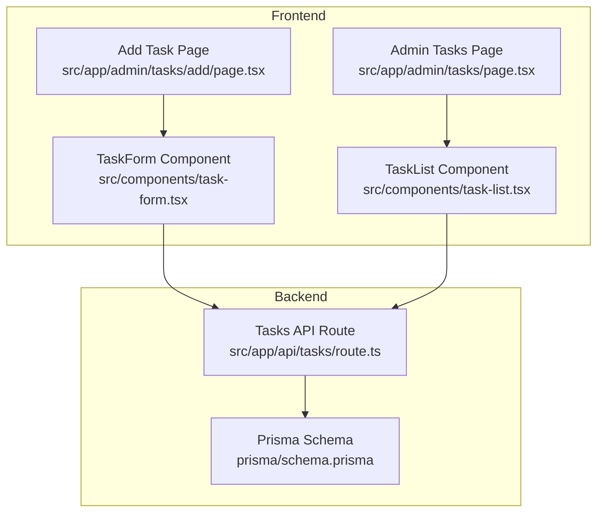
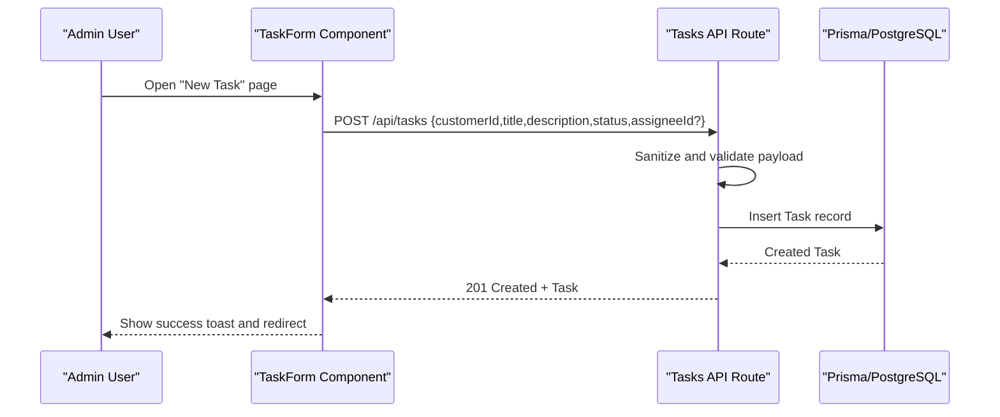
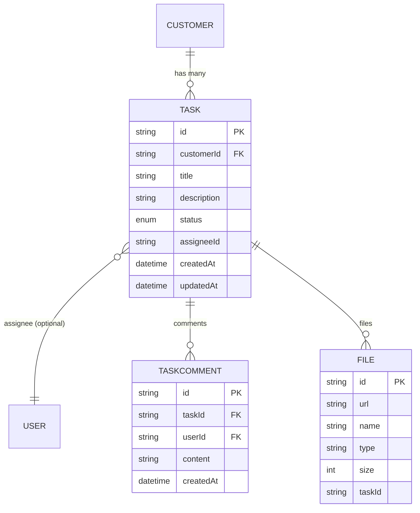
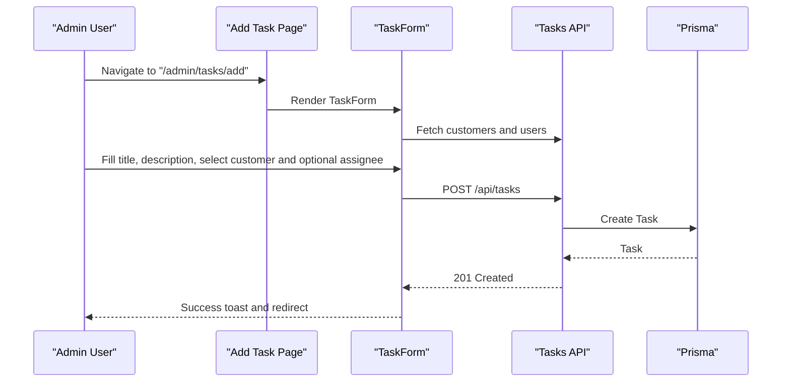
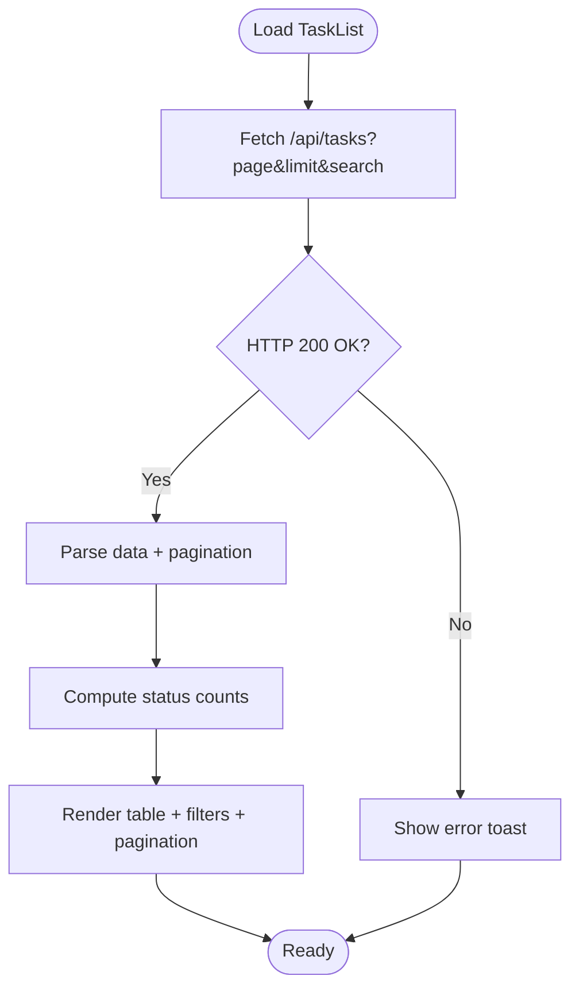
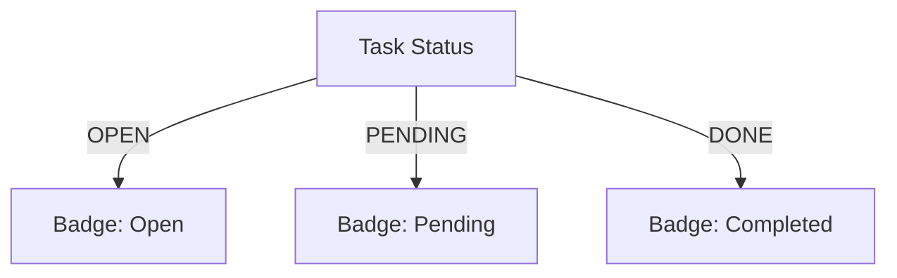
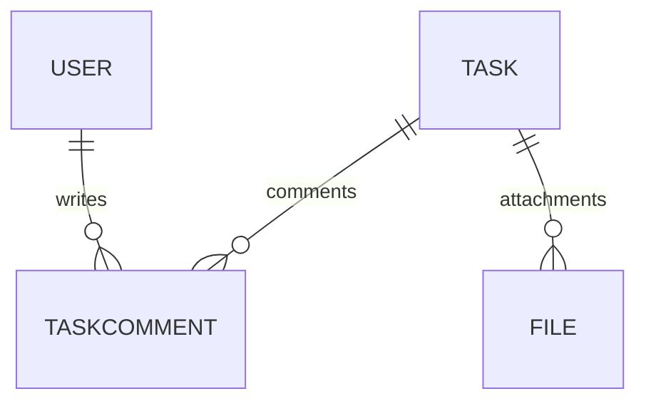
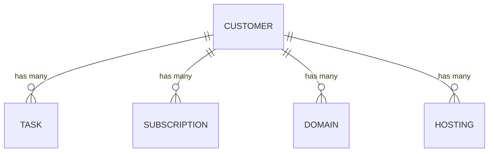
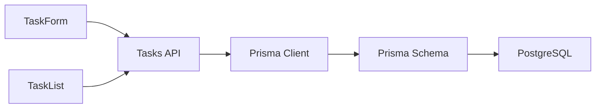

# Task Management

<cite>
**Referenced Files in This Document**
- [schema.prisma](file://prisma/schema.prisma)
- [route.ts](file://src/app/api/tasks/route.ts)
- [task-form.tsx](file://src/components/task-form.tsx)
- [task-list.tsx](file://src/components/task-list.tsx)
- [page.tsx](file://src/app/admin/tasks/page.tsx)
- [page.tsx](file://src/app/admin/tasks/add/page.tsx)
- [types.ts](file://src/lib/types.ts)
- [validations.ts](file://src/lib/validations.ts)
- [status-badge.tsx](file://src/components/status-badge.tsx)
</cite>

## Table of Contents
1. [Introduction](#introduction)
2. [Project Structure](#project-structure)
3. [Core Components](#core-components)
4. [Architecture Overview](#architecture-overview)
5. [Detailed Component Analysis](#detailed-component-analysis)
6. [Dependency Analysis](#dependency-analysis)
7. [Performance Considerations](#performance-considerations)
8. [Troubleshooting Guide](#troubleshooting-guide)
9. [Conclusion](#conclusion)
10. [Appendices](#appendices)

## Introduction
This document explains the task management capabilities in Customer WebMahsul with a focus on creation, assignment, progress tracking, completion, collaboration, comments, file attachments, templates and recurrence, deadlines, notifications, integration with customer profiles, service tracking, project workflows, status management, and reporting. It synthesizes the frontend UI components, backend API routes, and Prisma database schema to present a complete picture of how tasks are modeled and managed in the system.

## Project Structure
Task management spans three layers:
- Frontend pages and components for task creation and listing
- API routes for task CRUD operations
- Prisma schema defining the Task entity, relationships, and supporting models

**Diagram sources**
- [page.tsx:10-31](file://src/app/admin/tasks/page.tsx#L10-L31)
- [page.tsx:8-24](file://src/app/admin/tasks/add/page.tsx#L8-L24)
- [task-form.tsx:27-85](file://src/components/task-form.tsx#L27-L85)
- [task-list.tsx:35-64](file://src/components/task-list.tsx#L35-L64)
- [route.ts:7-43](file://src/app/api/tasks/route.ts#L7-L43)
- [schema.prisma:264-279](file://prisma/schema.prisma#L264-L279)

**Section sources**
- [page.tsx:10-31](file://src/app/admin/tasks/page.tsx#L10-L31)
- [page.tsx:8-24](file://src/app/admin/tasks/add/page.tsx#L8-L24)
- [task-form.tsx:27-85](file://src/components/task-form.tsx#L27-L85)
- [task-list.tsx:35-64](file://src/components/task-list.tsx#L35-L64)
- [route.ts:7-43](file://src/app/api/tasks/route.ts#L7-L43)
- [schema.prisma:264-279](file://prisma/schema.prisma#L264-L279)

## Core Components
- Task entity and relationships: The Task model includes customer linkage, optional assignee, status, timestamps, and associations to comments and files.
- Task API: Provides paginated listing and creation endpoints with input sanitization and validation.
- Task UI: Two primary components—TaskForm for creation and TaskList for browsing, filtering, and pagination.
- Validation and types: Strongly typed schemas for task creation and updates, plus shared pagination types.

Key capabilities:
- Creation with customer selection, title, description, status, and optional assignee
- Listing with search and pagination
- Filtering by status via UI
- Integration with customer profiles and user accounts
- Collaboration-ready structure via comments and file attachments

**Section sources**
- [schema.prisma:258-279](file://prisma/schema.prisma#L258-L279)
- [route.ts:7-43](file://src/app/api/tasks/route.ts#L7-L43)
- [task-form.tsx:27-85](file://src/components/task-form.tsx#L27-L85)
- [task-list.tsx:35-64](file://src/components/task-list.tsx#L35-L64)
- [validations.ts:158-165](file://src/lib/validations.ts#L158-L165)
- [types.ts:11-19](file://src/lib/types.ts#L11-L19)

## Architecture Overview
The task lifecycle is driven by the UI components and the API route, backed by Prisma ORM and PostgreSQL.

**Diagram sources**
- [task-form.tsx:65-85](file://src/components/task-form.tsx#L65-L85)
- [route.ts:45-63](file://src/app/api/tasks/route.ts#L45-L63)
- [schema.prisma:264-279](file://prisma/schema.prisma#L264-L279)

## Detailed Component Analysis

### Task Entity Model
The Task model defines the core attributes and relationships used across the system.

**Diagram sources**
- [schema.prisma:95-124](file://prisma/schema.prisma#L95-L124)
- [schema.prisma:264-279](file://prisma/schema.prisma#L264-L279)
- [schema.prisma:281-291](file://prisma/schema.prisma#L281-L291)
- [schema.prisma:388-407](file://prisma/schema.prisma#L388-L407)

**Section sources**
- [schema.prisma:258-279](file://prisma/schema.prisma#L258-L279)
- [schema.prisma:281-291](file://prisma/schema.prisma#L281-L291)
- [schema.prisma:388-407](file://prisma/schema.prisma#L388-L407)

### Task Creation Workflow
- The Add Task page renders the TaskForm component.
- TaskForm fetches customers and users for selection, validates inputs, and submits to the API.
- The API route sanitizes and validates the payload, persists the task, and returns the created record.

**Diagram sources**
- [page.tsx:8-24](file://src/app/admin/tasks/add/page.tsx#L8-L24)
- [task-form.tsx:43-85](file://src/components/task-form.tsx#L43-L85)
- [route.ts:45-63](file://src/app/api/tasks/route.ts#L45-L63)

**Section sources**
- [page.tsx:8-24](file://src/app/admin/tasks/add/page.tsx#L8-L24)
- [task-form.tsx:27-85](file://src/components/task-form.tsx#L27-L85)
- [route.ts:45-63](file://src/app/api/tasks/route.ts#L45-L63)
- [validations.ts:158-165](file://src/lib/validations.ts#L158-L165)

### Task Listing and Filtering
- The Admin Tasks page renders the TaskList component.
- TaskList supports:
  - Pagination (page, limit)
  - Search by title
  - Status filter
  - Stats cards per status
  - Skeleton loading and empty state handling

**Diagram sources**
- [task-list.tsx:44-64](file://src/components/task-list.tsx#L44-L64)
- [route.ts:7-43](file://src/app/api/tasks/route.ts#L7-L43)

**Section sources**
- [page.tsx:10-31](file://src/app/admin/tasks/page.tsx#L10-L31)
- [task-list.tsx:35-64](file://src/components/task-list.tsx#L35-L64)
- [route.ts:7-43](file://src/app/api/tasks/route.ts#L7-L43)

### Status Management and UI
- Task statuses are OPEN, PENDING, DONE.
- The TaskList displays badges for each status with appropriate icons and colors.
- A reusable StatusBadge component exists for other entities, but TaskList uses its own mapping for task statuses.

**Diagram sources**
- [schema.prisma:258-262](file://prisma/schema.prisma#L258-L262)
- [task-list.tsx:72-90](file://src/components/task-list.tsx#L72-L90)
- [status-badge.tsx:20-30](file://src/components/status-badge.tsx#L20-L30)

**Section sources**
- [schema.prisma:258-262](file://prisma/schema.prisma#L258-L262)
- [task-list.tsx:72-90](file://src/components/task-list.tsx#L72-L90)
- [status-badge.tsx:20-30](file://src/components/status-badge.tsx#L20-L30)

### Team Collaboration Features
- Comments: The TaskComment model links comments to tasks and users, enabling threaded collaboration on tasks.
- Files: The File model supports attaching files to tasks via the taskId relation, enabling evidence and attachments.

**Diagram sources**
- [schema.prisma:281-291](file://prisma/schema.prisma#L281-L291)
- [schema.prisma:388-407](file://prisma/schema.prisma#L388-L407)

**Section sources**
- [schema.prisma:281-291](file://prisma/schema.prisma#L281-L291)
- [schema.prisma:388-407](file://prisma/schema.prisma#L388-L407)

### Task Templates and Recurrence
- Current schema and API do not define dedicated template or recurrence fields for tasks.
- Template-like reuse can be achieved by copying existing tasks and adjusting fields manually.

**Section sources**
- [schema.prisma:264-279](file://prisma/schema.prisma#L264-L279)
- [route.ts:45-63](file://src/app/api/tasks/route.ts#L45-L63)

### Deadline Management
- The Task model does not include a deadline/deadlineDate field.
- Deadlines can be represented in the description or managed externally; no built-in deadline UI or alerts are present.

**Section sources**
- [schema.prisma:264-279](file://prisma/schema.prisma#L264-L279)

### Notifications
- The Notification model supports scheduling and sending messages to customers via channels.
- There is no explicit task deadline or task status change notification wiring shown in the current schema/API.
- Notifications can be integrated by extending task creation/update handlers to enqueue notifications.

**Section sources**
- [schema.prisma:358-370](file://prisma/schema.prisma#L358-L370)

### Integration with Customer Profiles and Services
- Tasks belong to a customer via customerId and can be filtered by customerId in the API.
- The Customer model includes subscriptions, domains, hostings, and other services; tasks can be cross-linked conceptually to support project workflows.

**Diagram sources**
- [schema.prisma:95-134](file://prisma/schema.prisma#L95-L134)
- [schema.prisma:206-226](file://prisma/schema.prisma#L206-L226)
- [schema.prisma:228-256](file://prisma/schema.prisma#L228-L256)
- [schema.prisma:244-256](file://prisma/schema.prisma#L244-L256)

**Section sources**
- [schema.prisma:95-134](file://prisma/schema.prisma#L95-L134)
- [route.ts:12-21](file://src/app/api/tasks/route.ts#L12-L21)

### Reporting Capabilities
- The TaskList computes status-based statistics (total, open, pending, done) and presents them in summary cards.
- Pagination metadata is returned by the API, enabling clients to build broader reporting views.

**Section sources**
- [task-list.tsx:72-77](file://src/components/task-list.tsx#L72-L77)
- [route.ts:36-39](file://src/app/api/tasks/route.ts#L36-L39)

## Dependency Analysis
- UI depends on:
  - TaskForm for creation and TaskList for listing
  - API route for persistence and retrieval
- API depends on:
  - Prisma client and schema for database operations
  - Validation schemas for input sanitization and enforcement
- Database schema defines:
  - Task, TaskComment, and File relations
  - Customer-task relationship and optional assignee-user relationship

**Diagram sources**
- [task-form.tsx:27-85](file://src/components/task-form.tsx#L27-L85)
- [task-list.tsx:35-64](file://src/components/task-list.tsx#L35-L64)
- [route.ts:7-43](file://src/app/api/tasks/route.ts#L7-L43)
- [schema.prisma:264-279](file://prisma/schema.prisma#L264-L279)

**Section sources**
- [task-form.tsx:27-85](file://src/components/task-form.tsx#L27-L85)
- [task-list.tsx:35-64](file://src/components/task-list.tsx#L35-L64)
- [route.ts:7-43](file://src/app/api/tasks/route.ts#L7-L43)
- [schema.prisma:264-279](file://prisma/schema.prisma#L264-L279)

## Performance Considerations
- Pagination: The API enforces a maximum page size and uses skip/take for efficient fetching.
- Filtering: The API applies title contains and customerId filters to reduce dataset size server-side.
- Rendering: TaskList uses skeleton loaders and empty states to maintain responsiveness during fetches.

Recommendations:
- Add database indexes for frequently filtered fields (e.g., customerId, status, createdAt).
- Consider adding a deadline index and status+deadline composite index if deadlines are introduced.
- Optimize comment and file counts in list views by aggregating counts at query time.

**Section sources**
- [route.ts:10-13](file://src/app/api/tasks/route.ts#L10-L13)
- [route.ts:17-22](file://src/app/api/tasks/route.ts#L17-L22)
- [task-list.tsx:205-213](file://src/components/task-list.tsx#L205-L213)

## Troubleshooting Guide
Common issues and resolutions:
- Validation errors on creation:
  - Ensure title length, description length, and status enum match validation rules.
  - Confirm customerId is present and assigneeId (if provided) is valid.
- Fetch failures:
  - Verify API endpoint availability and network connectivity.
  - Check pagination parameters and search term encoding.
- Status display anomalies:
  - Ensure status values are one of OPEN, PENDING, DONE.
- Attachments and comments:
  - Confirm taskId is set on files and comments; otherwise they will not appear under a task.

**Section sources**
- [validations.ts:158-165](file://src/lib/validations.ts#L158-L165)
- [route.ts:45-63](file://src/app/api/tasks/route.ts#L45-L63)
- [task-list.tsx:72-90](file://src/components/task-list.tsx#L72-L90)
- [schema.prisma:388-407](file://prisma/schema.prisma#L388-L407)

## Conclusion
Customer WebMahsul provides a solid foundation for task management with creation, assignment, status tracking, and collaboration-ready structures for comments and file attachments. While templates, recurrence, and deadline management are not currently implemented, the schema and API are extensible to support these features. Integrations with customer profiles and services enable contextual task workflows, and the UI offers efficient listing, filtering, and reporting capabilities.

## Appendices

### API Definitions
- GET /api/tasks
  - Query parameters: page (default 1), limit (max 100), search (title contains), customerId
  - Response: data array of tasks + pagination metadata
- POST /api/tasks
  - Request body: { customerId, title, description, status, assigneeId? }
  - Response: created task object

**Section sources**
- [route.ts:7-43](file://src/app/api/tasks/route.ts#L7-L43)
- [route.ts:45-63](file://src/app/api/tasks/route.ts#L45-L63)
- [validations.ts:158-165](file://src/lib/validations.ts#L158-L165)