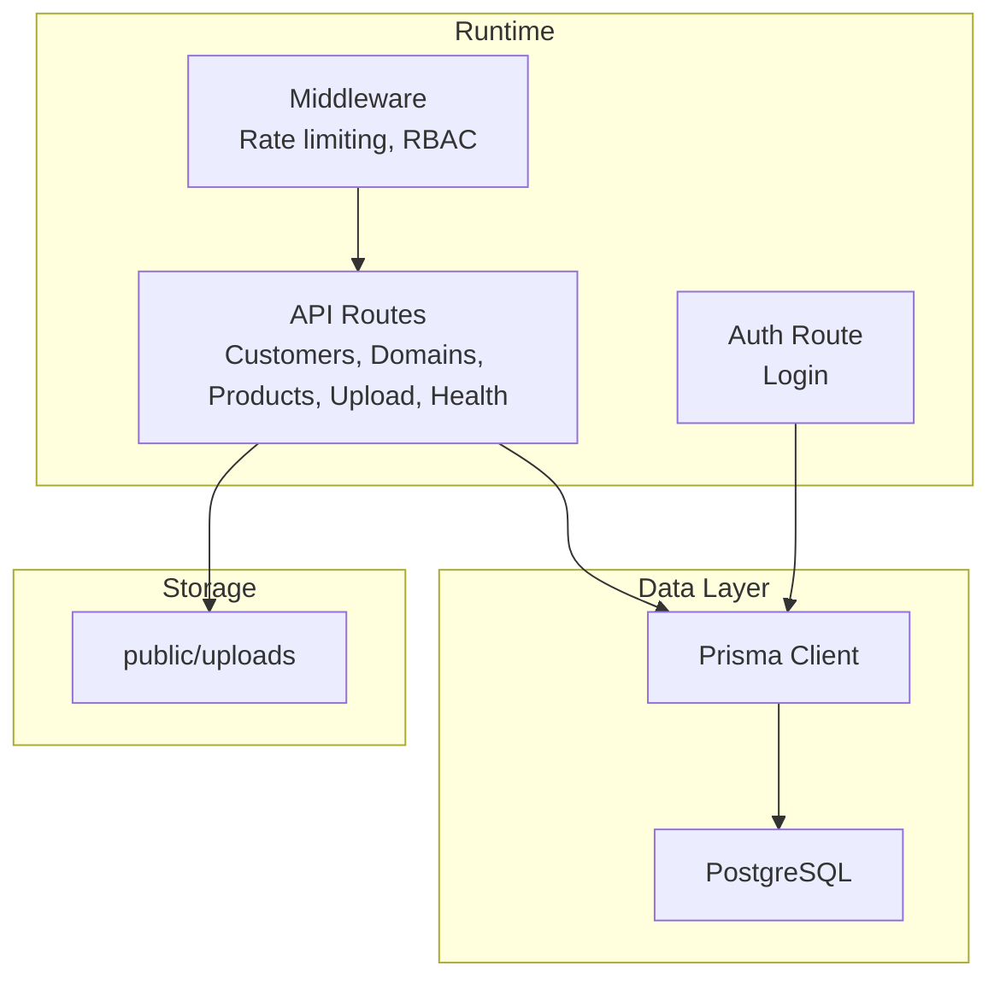
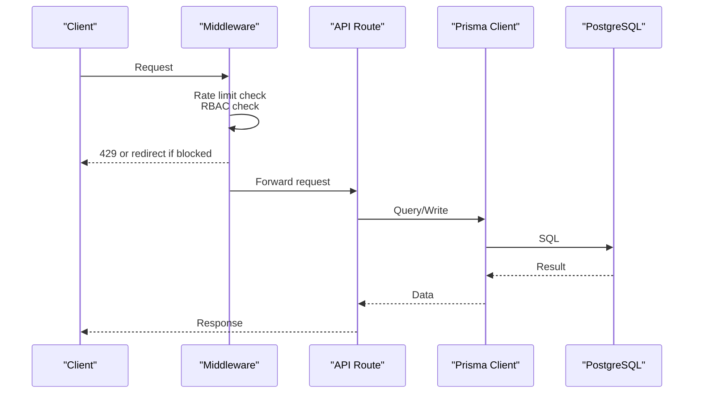
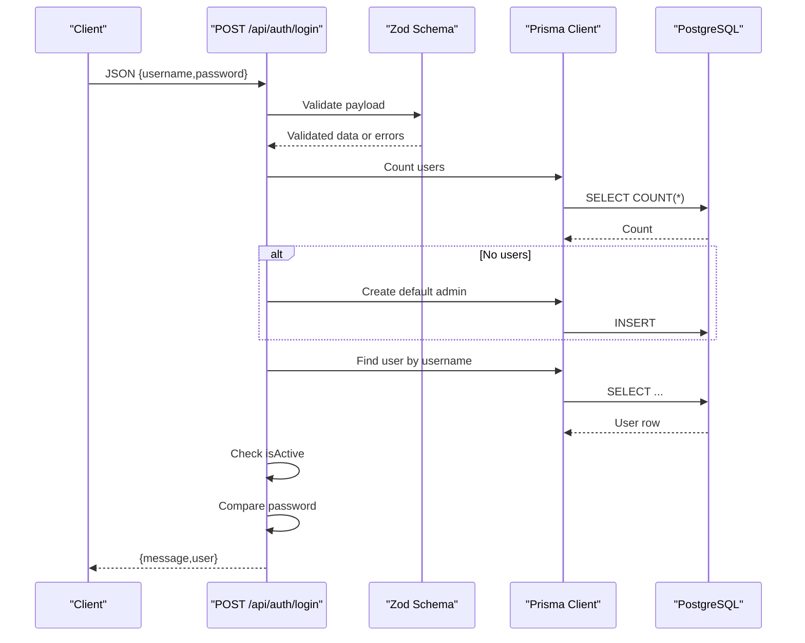
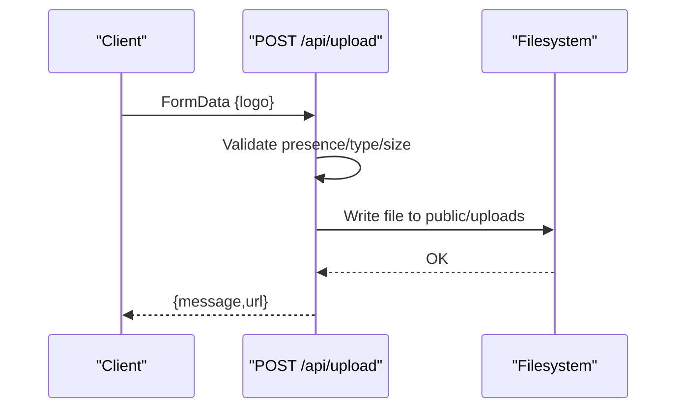
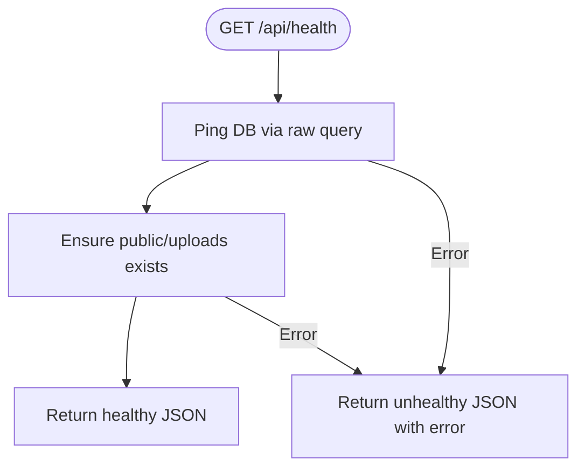
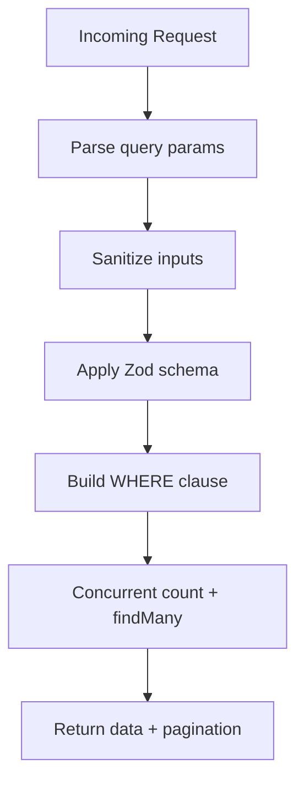
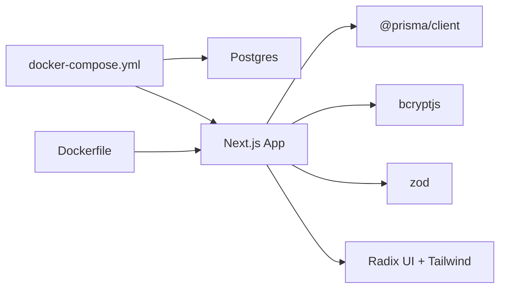

# Troubleshooting & FAQ

<cite>
**Referenced Files in This Document**
- [README.md](file://README.md)
- [package.json](file://package.json)
- [docker-compose.yml](file://docker-compose.yml)
- [Dockerfile](file://Dockerfile)
- [src/lib/error-handler.ts](file://src/lib/error-handler.ts)
- [src/lib/auth.ts](file://src/lib/auth.ts)
- [src/lib/prisma.ts](file://src/lib/prisma.ts)
- [src/lib/validations.ts](file://src/lib/validations.ts)
- [src/middleware.ts](file://src/middleware.ts)
- [src/app/api/health/route.ts](file://src/app/api/health/route.ts)
- [src/app/api/upload/route.ts](file://src/app/api/upload/route.ts)
- [src/app/api/auth/login/route.ts](file://src/app/api/auth/login/route.ts)
- [src/app/api/customers/route.ts](file://src/app/api/customers/route.ts)
- [src/app/api/domains/route.ts](file://src/app/api/domains/route.ts)
- [src/app/api/products/route.ts](file://src/app/api/products/route.ts)
- [prisma/schema.prisma](file://prisma/schema.prisma)
</cite>

## Table of Contents
1. [Introduction](#introduction)
2. [Project Structure](#project-structure)
3. [Core Components](#core-components)
4. [Architecture Overview](#architecture-overview)
5. [Detailed Component Analysis](#detailed-component-analysis)
6. [Dependency Analysis](#dependency-analysis)
7. [Performance Considerations](#performance-considerations)
8. [Troubleshooting Guide](#troubleshooting-guide)
9. [FAQ](#faq)
10. [Conclusion](#conclusion)

## Introduction
This document provides a comprehensive troubleshooting and FAQ guide for Customer WebMahsul. It focuses on diagnosing and resolving common issues such as database connectivity, authentication failures, file upload problems, and API errors. It also covers debugging techniques, log analysis, performance tuning, memory optimization, database query tuning, and operational maintenance. The content is grounded in the repository’s source files to ensure accuracy and actionable steps.

## Project Structure
Customer WebMahsul is a Next.js application with:
- A Prisma-based data layer for PostgreSQL
- API routes under src/app/api
- Middleware for rate limiting and role-based access control
- Health checks and upload handling
- Validation schemas for request payloads
- Dockerized deployment with a Postgres backend

**Diagram sources**
- [src/middleware.ts:1-101](file://src/middleware.ts#L1-L101)
- [src/app/api/customers/route.ts:1-105](file://src/app/api/customers/route.ts#L1-L105)
- [src/app/api/domains/route.ts:1-65](file://src/app/api/domains/route.ts#L1-L65)
- [src/app/api/products/route.ts:1-105](file://src/app/api/products/route.ts#L1-L105)
- [src/app/api/upload/route.ts:1-65](file://src/app/api/upload/route.ts#L1-L65)
- [src/app/api/health/route.ts:1-37](file://src/app/api/health/route.ts#L1-L37)
- [src/app/api/auth/login/route.ts:1-86](file://src/app/api/auth/login/route.ts#L1-L86)
- [src/lib/prisma.ts:1-9](file://src/lib/prisma.ts#L1-L9)
- [prisma/schema.prisma:1-756](file://prisma/schema.prisma#L1-L756)

**Section sources**
- [package.json:1-64](file://package.json#L1-L64)
- [docker-compose.yml:1-49](file://docker-compose.yml#L1-L49)
- [Dockerfile:1-73](file://Dockerfile#L1-L73)

## Core Components
- Error handling utilities for API routes and input sanitization
- Authentication route with validation and user lookup
- Middleware enforcing rate limits and role-based access control
- Health endpoint validating DB connectivity and uploads directory
- File upload endpoint with type and size validation
- API routes for customers, domains, and products with validation and pagination
- Prisma client initialization and schema for PostgreSQL

**Section sources**
- [src/lib/error-handler.ts:1-34](file://src/lib/error-handler.ts#L1-L34)
- [src/lib/auth.ts:1-35](file://src/lib/auth.ts#L1-L35)
- [src/middleware.ts:1-101](file://src/middleware.ts#L1-L101)
- [src/app/api/health/route.ts:1-37](file://src/app/api/health/route.ts#L1-L37)
- [src/app/api/upload/route.ts:1-65](file://src/app/api/upload/route.ts#L1-L65)
- [src/app/api/customers/route.ts:1-105](file://src/app/api/customers/route.ts#L1-L105)
- [src/app/api/domains/route.ts:1-65](file://src/app/api/domains/route.ts#L1-L65)
- [src/app/api/products/route.ts:1-105](file://src/app/api/products/route.ts#L1-L105)
- [src/lib/prisma.ts:1-9](file://src/lib/prisma.ts#L1-L9)
- [prisma/schema.prisma:1-756](file://prisma/schema.prisma#L1-L756)

## Architecture Overview
The system integrates middleware, API routes, Prisma ORM, and a PostgreSQL database. Health checks validate connectivity and filesystem readiness. Authentication is handled via a dedicated login route with input validation and user verification against the database.

**Diagram sources**
- [src/middleware.ts:1-101](file://src/middleware.ts#L1-L101)
- [src/app/api/customers/route.ts:1-105](file://src/app/api/customers/route.ts#L1-L105)
- [src/lib/prisma.ts:1-9](file://src/lib/prisma.ts#L1-L9)
- [prisma/schema.prisma:1-756](file://prisma/schema.prisma#L1-L756)

## Detailed Component Analysis

### Authentication Flow
The login route validates input, ensures at least one user exists, queries the user by username, checks activity, compares passwords, and returns user data without sensitive fields.

**Diagram sources**
- [src/app/api/auth/login/route.ts:1-86](file://src/app/api/auth/login/route.ts#L1-L86)
- [src/lib/validations.ts:87-90](file://src/lib/validations.ts#L87-L90)
- [src/lib/prisma.ts:1-9](file://src/lib/prisma.ts#L1-L9)
- [prisma/schema.prisma:724-743](file://prisma/schema.prisma#L724-L743)

**Section sources**
- [src/app/api/auth/login/route.ts:1-86](file://src/app/api/auth/login/route.ts#L1-L86)
- [src/lib/validations.ts:87-90](file://src/lib/validations.ts#L87-L90)
- [src/lib/prisma.ts:1-9](file://src/lib/prisma.ts#L1-L9)
- [prisma/schema.prisma:724-743](file://prisma/schema.prisma#L724-L743)

### File Upload Pipeline
The upload route accepts multipart form data, validates file type and size, writes to the uploads directory, and returns a public URL.

**Diagram sources**
- [src/app/api/upload/route.ts:1-65](file://src/app/api/upload/route.ts#L1-L65)

**Section sources**
- [src/app/api/upload/route.ts:1-65](file://src/app/api/upload/route.ts#L1-L65)

### Health Endpoint
The health route checks database connectivity and uploads directory accessibility, returning a structured health status.

**Diagram sources**
- [src/app/api/health/route.ts:1-37](file://src/app/api/health/route.ts#L1-L37)

**Section sources**
- [src/app/api/health/route.ts:1-37](file://src/app/api/health/route.ts#L1-L37)

### API Pagination and Filtering
Customer, domain, and product APIs implement pagination and filtering. They sanitize inputs, apply Zod validation, and query the database concurrently for items and counts.

**Diagram sources**
- [src/app/api/customers/route.ts:1-105](file://src/app/api/customers/route.ts#L1-L105)
- [src/app/api/domains/route.ts:1-65](file://src/app/api/domains/route.ts#L1-L65)
- [src/app/api/products/route.ts:1-105](file://src/app/api/products/route.ts#L1-L105)
- [src/lib/error-handler.ts:27-33](file://src/lib/error-handler.ts#L27-L33)
- [src/lib/validations.ts:4-49](file://src/lib/validations.ts#L4-L49)

**Section sources**
- [src/app/api/customers/route.ts:1-105](file://src/app/api/customers/route.ts#L1-L105)
- [src/app/api/domains/route.ts:1-65](file://src/app/api/domains/route.ts#L1-L65)
- [src/app/api/products/route.ts:1-105](file://src/app/api/products/route.ts#L1-L105)
- [src/lib/error-handler.ts:27-33](file://src/lib/error-handler.ts#L27-L33)
- [src/lib/validations.ts:4-49](file://src/lib/validations.ts#L4-L49)

## Dependency Analysis
- Runtime dependencies include Next.js, Prisma Client, bcrypt, radix UI, UUID, and Zod.
- Docker Compose defines a Postgres service and the Next.js app with environment variables for DATABASE_URL and NextAuth.
- The Dockerfile builds the app, generates Prisma Client, creates the uploads directory, and runs a health check.

**Diagram sources**
- [package.json:12-49](file://package.json#L12-L49)
- [docker-compose.yml:1-49](file://docker-compose.yml#L1-L49)
- [Dockerfile:1-73](file://Dockerfile#L1-L73)

**Section sources**
- [package.json:12-49](file://package.json#L12-L49)
- [docker-compose.yml:1-49](file://docker-compose.yml#L1-L49)
- [Dockerfile:1-73](file://Dockerfile#L1-L73)

## Performance Considerations
- Database connectivity: Use the health endpoint to confirm DB readiness before scaling.
- Pagination: Prefer paginated endpoints for large datasets to reduce payload sizes.
- Concurrency: Leverage concurrent count + fetch patterns in list endpoints to minimize latency.
- File storage: Ensure the uploads directory is writable and monitored for disk usage.
- Rate limiting: Middleware enforces per-IP rate limiting; tune thresholds if needed.
- Memory: Monitor heap usage in production containers; avoid loading large files into memory unnecessarily.
- Queries: Use selective field projections and appropriate indexes as defined by the schema.

[No sources needed since this section provides general guidance]

## Troubleshooting Guide

### Database Connection Problems
Symptoms:
- Health endpoint returns an unhealthy status with an error message.
- API routes fail with database-related errors.

Common causes and fixes:
- Incorrect DATABASE_URL: Verify the environment variable matches the Postgres service configuration.
- Postgres not ready: Ensure the Postgres container is healthy and accepting connections.
- Prisma client initialization: Confirm Prisma Client is initialized correctly in non-production environments.

Diagnostic steps:
- Call the health endpoint to inspect the returned error.
- Check Docker logs for the Postgres and app containers.
- Validate Prisma schema and migrations.

**Section sources**
- [src/app/api/health/route.ts:1-37](file://src/app/api/health/route.ts#L1-L37)
- [src/lib/prisma.ts:1-9](file://src/lib/prisma.ts#L1-L9)
- [docker-compose.yml:25-28](file://docker-compose.yml#L25-L28)

### Authentication Failures
Symptoms:
- Login returns invalid credentials or forbidden messages.
- Users cannot access protected routes.

Common causes and fixes:
- Missing initial user: The login route creates a default admin if none exists; ensure the route executes and the database is writable.
- Disabled user: Check that the user is marked active.
- Wrong credentials: Ensure username/password match the stored hash.

Diagnostic steps:
- Review login route error responses and logs.
- Verify user existence and activity status in the database.

**Section sources**
- [src/app/api/auth/login/route.ts:1-86](file://src/app/api/auth/login/route.ts#L1-L86)
- [prisma/schema.prisma:724-743](file://prisma/schema.prisma#L724-L743)

### File Upload Issues
Symptoms:
- Upload returns “file not found” or validation errors.
- Upload succeeds but the file is not accessible via the expected URL.

Common causes and fixes:
- Missing form field: Ensure the multipart form includes the expected file field.
- Invalid type: Only specific image MIME types are accepted.
- Size exceeded: Files must be under the configured maximum size.
- Permissions: The uploads directory must be writable by the runtime user.

Diagnostic steps:
- Inspect upload route error responses.
- Check filesystem permissions and disk space.
- Verify the returned URL path and static serving configuration.

**Section sources**
- [src/app/api/upload/route.ts:1-65](file://src/app/api/upload/route.ts#L1-L65)
- [Dockerfile:45-47](file://Dockerfile#L45-L47)

### API Errors and Validation Failures
Symptoms:
- 400 responses with validation errors.
- Unexpected 500 errors.

Common causes and fixes:
- Payload does not match Zod schemas: Adjust client requests to satisfy validation rules.
- Unhandled exceptions: Centralized error handler returns generic messages; inspect server logs for stack traces.

Diagnostic steps:
- Decode the JSON error payload and review validation details.
- Check server logs for thrown exceptions.
- Use sanitized inputs and ensure filters conform to allowed ranges.

**Section sources**
- [src/lib/error-handler.ts:1-34](file://src/lib/error-handler.ts#L1-L34)
- [src/lib/validations.ts:4-49](file://src/lib/validations.ts#L4-L49)
- [src/app/api/customers/route.ts:1-105](file://src/app/api/customers/route.ts#L1-L105)
- [src/app/api/domains/route.ts:1-65](file://src/app/api/domains/route.ts#L1-L65)
- [src/app/api/products/route.ts:1-105](file://src/app/api/products/route.ts#L1-L105)

### Rate Limiting and Access Control
Symptoms:
- 429 Too Many Requests.
- Redirects to login for protected routes.

Common causes and fixes:
- Exceeded request quota per IP: Wait for the window to reset or adjust limits.
- Missing or invalid auth cookies: Ensure proper authentication and role cookies are set.
- Role mismatch: Admin or portal routes require matching roles.

Diagnostic steps:
- Inspect X-RateLimit-* headers for remaining quota.
- Verify auth-token and role cookies.
- Confirm middleware matcher and redirect logic.

**Section sources**
- [src/middleware.ts:1-101](file://src/middleware.ts#L1-L101)

### Debugging Techniques and Log Analysis
- Enable verbose logging in development and review console output for API errors and validation issues.
- Use the health endpoint to quickly assess DB and filesystem status.
- For Docker deployments, check container logs for startup and runtime errors.
- Validate Prisma schema correctness and migrations before troubleshooting data issues.

**Section sources**
- [src/app/api/health/route.ts:1-37](file://src/app/api/health/route.ts#L1-L37)
- [docker-compose.yml:37-41](file://docker-compose.yml#L37-L41)

### Maintenance Recommendations
- Keep Prisma Client updated and schema aligned with migrations.
- Regularly prune old webhook logs and monitor queue throughput.
- Back up the database regularly and test restore procedures.
- Monitor disk usage in public/uploads and enforce quotas if needed.

**Section sources**
- [prisma/schema.prisma:409-433](file://prisma/schema.prisma#L409-L433)
- [Dockerfile:45-47](file://Dockerfile#L45-L47)

## FAQ

Q: How do I initialize the database?
A: Use Docker Compose to start Postgres and the app; migrations are applied automatically during startup.

Q: How do I access the admin login?
A: Navigate to the login page; after successful authentication, you are redirected based on your role.

Q: Why am I getting a validation error on customer creation?
A: Ensure the payload satisfies the customer creation schema, including length and format constraints.

Q: How can I check if the system is healthy?
A: Call the health endpoint to verify database connectivity and uploads directory accessibility.

Q: How do I upload a logo?
A: Send a multipart form with the expected file field; only specific image types and sizes are accepted.

Q: What environment variables are required?
A: DATABASE_URL, NEXTAUTH_SECRET, NEXTAUTH_URL are required for the app to connect and authenticate.

Q: How are requests rate-limited?
A: The middleware enforces a per-IP limit; excessive requests receive a 429 response with reset timing.

Q: How do I scale the application?
A: Use the provided Dockerfile and docker-compose.yml; ensure shared volumes and network configuration are correct.

**Section sources**
- [docker-compose.yml:25-28](file://docker-compose.yml#L25-L28)
- [src/app/api/health/route.ts:1-37](file://src/app/api/health/route.ts#L1-L37)
- [src/app/api/upload/route.ts:1-65](file://src/app/api/upload/route.ts#L1-L65)
- [src/lib/validations.ts:4-49](file://src/lib/validations.ts#L4-L49)
- [src/middleware.ts:1-101](file://src/middleware.ts#L1-L101)
- [Dockerfile:1-73](file://Dockerfile#L1-L73)

## Conclusion
This guide consolidates practical troubleshooting steps, diagnostics, and maintenance advice for Customer WebMahsul. By leveraging the health endpoint, middleware protections, centralized error handling, and validated API routes, most issues can be identified and resolved efficiently. For persistent problems, consult the referenced source files and logs, and consider adjusting environment variables, schema, or deployment configuration as needed.