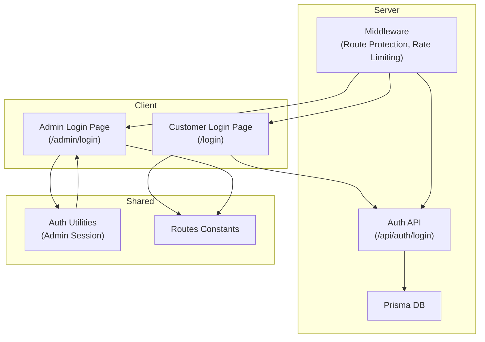
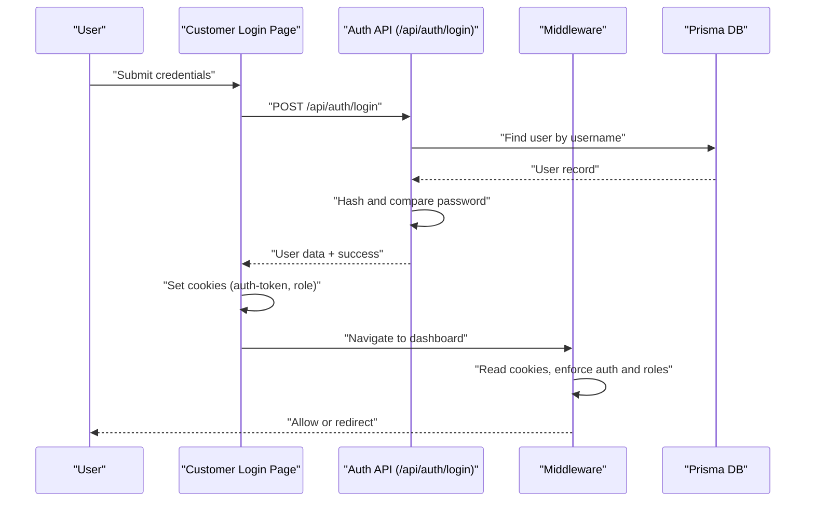
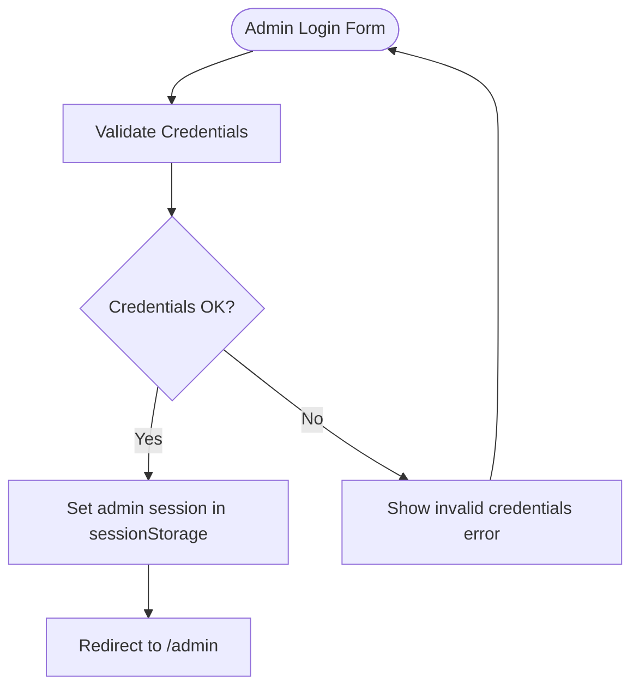
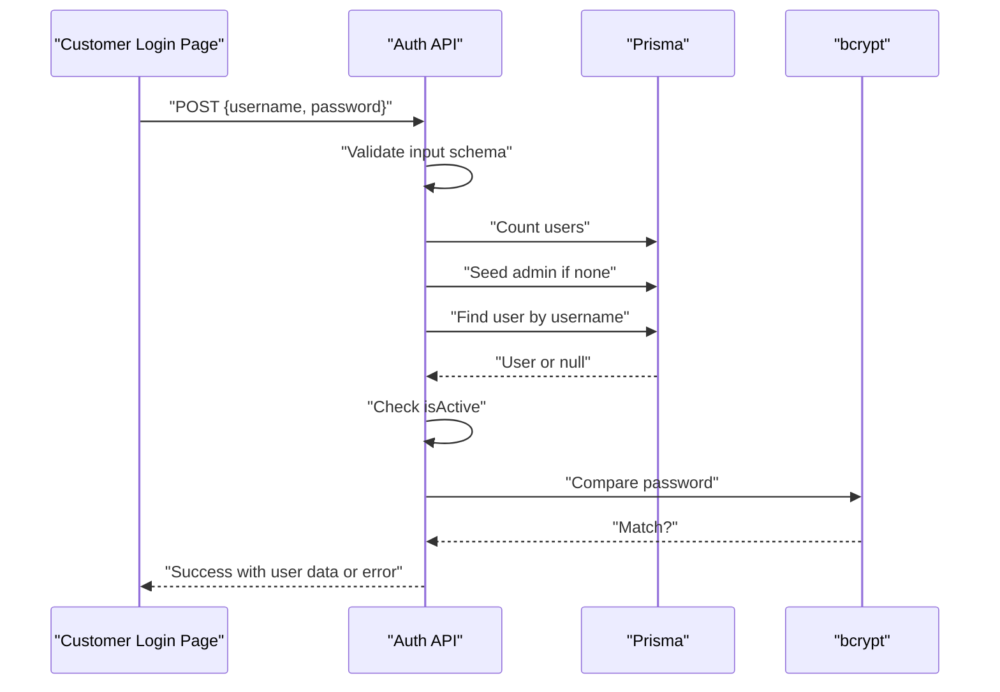
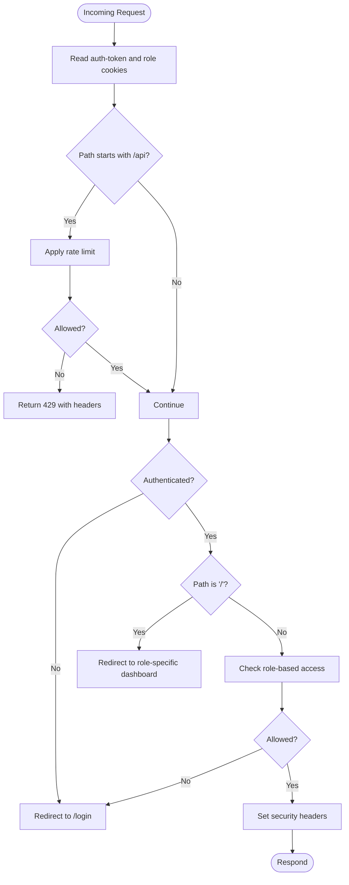
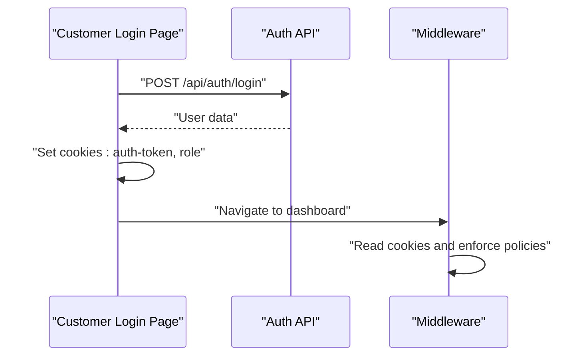
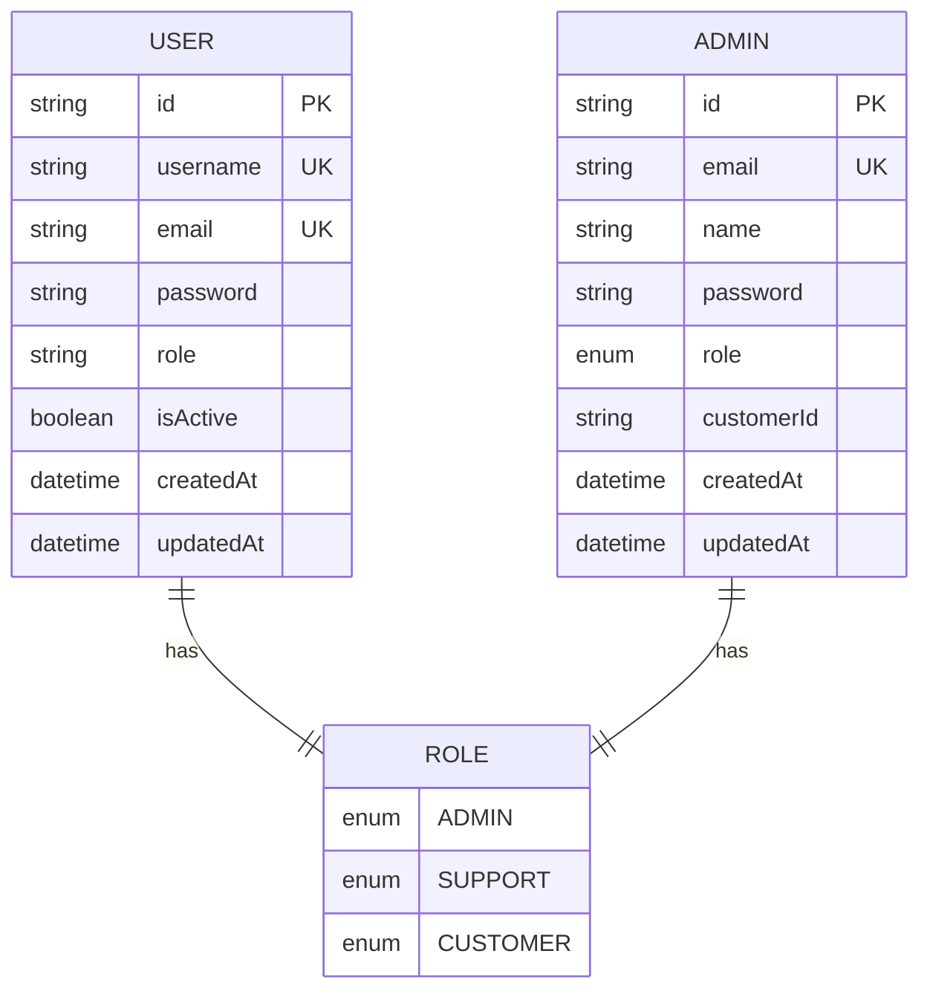
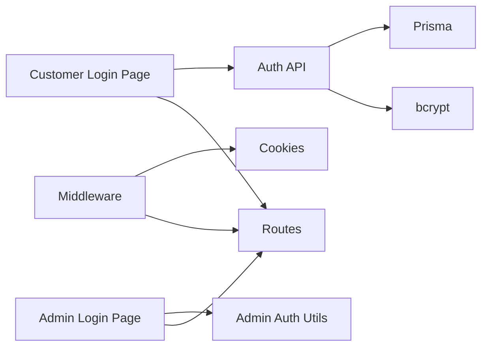

# Authentication System

<cite>
**Referenced Files in This Document**
- [auth.ts](file://src/lib/auth.ts)
- [middleware.ts](file://src/middleware.ts)
- [login/page.tsx](file://src/app/login/page.tsx)
- [admin/login/page.tsx](file://src/app/admin/login/page.tsx)
- [auth/login/route.ts](file://src/app/api/auth/login/route.ts)
- [routes.ts](file://src/lib/routes.ts)
- [schema.prisma](file://prisma/schema.prisma)
- [validations.ts](file://src/lib/validations.ts)
</cite>

## Table of Contents
1. [Introduction](#introduction)
2. [Project Structure](#project-structure)
3. [Core Components](#core-components)
4. [Architecture Overview](#architecture-overview)
5. [Detailed Component Analysis](#detailed-component-analysis)
6. [Dependency Analysis](#dependency-analysis)
7. [Performance Considerations](#performance-considerations)
8. [Troubleshooting Guide](#troubleshooting-guide)
9. [Conclusion](#conclusion)

## Introduction
This document explains the multi-layered authentication system used in the application. It covers:
- Admin credentials validation for the admin panel
- Session management via cookies for the main application
- Middleware protection for route access and rate limiting
- Integration with NextAuth.js for the primary application authentication
- Custom admin authentication utility and its lifecycle
- Security considerations, session lifecycle management, and authentication state handling across roles

## Project Structure
The authentication system spans several layers:
- Frontend login pages for customer and admin
- Backend authentication API endpoint
- Middleware for route protection and rate limiting
- Shared authentication utilities for admin panel
- Prisma schema defining user roles and models
- Route constants for navigation after login

**Diagram sources**
- [login/page.tsx:1-144](file://src/app/login/page.tsx#L1-L144)
- [admin/login/page.tsx:1-129](file://src/app/admin/login/page.tsx#L1-L129)
- [auth/login/route.ts:1-86](file://src/app/api/auth/login/route.ts#L1-L86)
- [middleware.ts:1-101](file://src/middleware.ts#L1-L101)
- [auth.ts:1-35](file://src/lib/auth.ts#L1-L35)
- [routes.ts:1-43](file://src/lib/routes.ts#L1-L43)

**Section sources**
- [login/page.tsx:1-144](file://src/app/login/page.tsx#L1-L144)
- [admin/login/page.tsx:1-129](file://src/app/admin/login/page.tsx#L1-L129)
- [auth/login/route.ts:1-86](file://src/app/api/auth/login/route.ts#L1-L86)
- [middleware.ts:1-101](file://src/middleware.ts#L1-L101)
- [auth.ts:1-35](file://src/lib/auth.ts#L1-L35)
- [routes.ts:1-43](file://src/lib/routes.ts#L1-L43)

## Core Components
- Admin authentication utility: Validates admin credentials, sets/clears admin session in browser storage, and checks authentication state.
- Main application authentication: Uses a backend login endpoint that validates credentials against the database, hashes passwords, and returns user data.
- Middleware protection: Enforces authentication, role-based access control, redirects unauthenticated users, and applies rate limiting for API endpoints.
- Frontend login pages: Customer login posts to the backend API and stores cookies; admin login uses local admin utility and sessionStorage.

Key responsibilities:
- Admin credentials validation and session persistence
- Password hashing and user lookup
- Cookie-based session for authenticated users
- Role-aware routing and redirection
- Rate limiting for API endpoints

**Section sources**
- [auth.ts:1-35](file://src/lib/auth.ts#L1-L35)
- [auth/login/route.ts:1-86](file://src/app/api/auth/login/route.ts#L1-L86)
- [middleware.ts:1-101](file://src/middleware.ts#L1-L101)
- [login/page.tsx:1-144](file://src/app/login/page.tsx#L1-L144)
- [admin/login/page.tsx:1-129](file://src/app/admin/login/page.tsx#L1-L129)

## Architecture Overview
The system implements two complementary authentication flows:
- Customer/Admin main application: Backend login validates credentials, returns user info, and sets cookies for session management.
- Admin panel: Local admin utility validates credentials and persists a flag in sessionStorage.

**Diagram sources**
- [login/page.tsx:21-62](file://src/app/login/page.tsx#L21-L62)
- [auth/login/route.ts:7-86](file://src/app/api/auth/login/route.ts#L7-L86)
- [middleware.ts:31-80](file://src/middleware.ts#L31-L80)

**Section sources**
- [login/page.tsx:1-144](file://src/app/login/page.tsx#L1-L144)
- [auth/login/route.ts:1-86](file://src/app/api/auth/login/route.ts#L1-L86)
- [middleware.ts:1-101](file://src/middleware.ts#L1-L101)

## Detailed Component Analysis

### Admin Authentication Utility
The admin utility provides lightweight local authentication for the admin panel:
- Credential validation against hardcoded values
- Session persistence using sessionStorage
- Helper functions to check authentication state

**Diagram sources**
- [admin/login/page.tsx:22-38](file://src/app/admin/login/page.tsx#L22-L38)
- [auth.ts:13-35](file://src/lib/auth.ts#L13-L35)

**Section sources**
- [auth.ts:1-35](file://src/lib/auth.ts#L1-L35)
- [admin/login/page.tsx:1-129](file://src/app/admin/login/page.tsx#L1-L129)

### Main Application Authentication Flow
The main application uses a backend login endpoint:
- Input validation using Zod schemas
- Automatic seeding of an admin user if none exists
- User lookup by username and verification of activity status
- Password comparison using bcrypt
- Response payload excludes sensitive fields

**Diagram sources**
- [auth/login/route.ts:7-86](file://src/app/api/auth/login/route.ts#L7-L86)
- [validations.ts:87-90](file://src/lib/validations.ts#L87-L90)

**Section sources**
- [auth/login/route.ts:1-86](file://src/app/api/auth/login/route.ts#L1-L86)
- [validations.ts:87-90](file://src/lib/validations.ts#L87-L90)

### Middleware Protection and Role-Based Access Control
The middleware enforces:
- Authentication via cookie presence
- Role awareness (ADMIN, SUPPORT, CUSTOMER)
- Redirects for unauthenticated users and role mismatches
- Root-to-dashboard redirection based on role
- API rate limiting with sliding window
- Security headers for non-API routes

**Diagram sources**
- [middleware.ts:9-94](file://src/middleware.ts#L9-L94)

**Section sources**
- [middleware.ts:1-101](file://src/middleware.ts#L1-L101)

### Session Management and Cookies
- After successful login, the frontend sets two cookies:
  - auth-token: user identifier
  - role: user role for access control
- These cookies are used by middleware to enforce authentication and role checks.

**Diagram sources**
- [login/page.tsx:45-52](file://src/app/login/page.tsx#L45-L52)
- [middleware.ts:31-37](file://src/middleware.ts#L31-L37)

**Section sources**
- [login/page.tsx:1-144](file://src/app/login/page.tsx#L1-L144)
- [middleware.ts:1-101](file://src/middleware.ts#L1-L101)

### Role Definitions and Models
The Prisma schema defines roles and models used by the authentication system:
- Role enum includes ADMIN, SUPPORT, CUSTOMER
- User model fields include username, email, password, role, and isActive
- Admin model exists separately for administrative accounts

**Diagram sources**
- [schema.prisma:88-92](file://prisma/schema.prisma#L88-L92)
- [schema.prisma:725-743](file://prisma/schema.prisma#L725-L743)
- [schema.prisma:144-155](file://prisma/schema.prisma#L144-L155)

**Section sources**
- [schema.prisma:88-92](file://prisma/schema.prisma#L88-L92)
- [schema.prisma:725-743](file://prisma/schema.prisma#L725-L743)
- [schema.prisma:144-155](file://prisma/schema.prisma#L144-L155)

## Dependency Analysis
- The customer login page depends on the auth API and route constants.
- The middleware depends on cookies and route constants for redirection.
- The auth API depends on Prisma for user lookup and bcrypt for password comparison.
- The admin login page depends on the admin utility for validation and session management.

**Diagram sources**
- [login/page.tsx:1-144](file://src/app/login/page.tsx#L1-L144)
- [admin/login/page.tsx:1-129](file://src/app/admin/login/page.tsx#L1-L129)
- [auth.ts:1-35](file://src/lib/auth.ts#L1-L35)
- [auth/login/route.ts:1-86](file://src/app/api/auth/login/route.ts#L1-L86)
- [middleware.ts:1-101](file://src/middleware.ts#L1-L101)
- [routes.ts:1-43](file://src/lib/routes.ts#L1-L43)

**Section sources**
- [login/page.tsx:1-144](file://src/app/login/page.tsx#L1-L144)
- [admin/login/page.tsx:1-129](file://src/app/admin/login/page.tsx#L1-L129)
- [auth.ts:1-35](file://src/lib/auth.ts#L1-L35)
- [auth/login/route.ts:1-86](file://src/app/api/auth/login/route.ts#L1-L86)
- [middleware.ts:1-101](file://src/middleware.ts#L1-L101)
- [routes.ts:1-43](file://src/lib/routes.ts#L1-L43)

## Performance Considerations
- Rate limiting for API endpoints prevents abuse and ensures fair usage.
- Sliding window implementation tracks request bursts and resets automatically.
- Cookie-based session checks are lightweight and avoid frequent server calls.
- Client-side admin session uses sessionStorage, minimizing server overhead.

[No sources needed since this section provides general guidance]

## Troubleshooting Guide
Common issues and resolutions:
- Invalid credentials during main login:
  - Ensure username and password match a valid user and that the user is active.
  - Check for proper input validation errors returned by the API.
- Admin login fails:
  - Confirm credentials match the admin utility’s hardcoded values.
  - Verify sessionStorage contains the admin authentication flag.
- Redirect loops or incorrect role redirection:
  - Confirm cookies auth-token and role are set correctly after login.
  - Ensure middleware role checks align with user roles.
- API rate limit exceeded:
  - Wait until the rate limit resets or reduce client-side request frequency.

**Section sources**
- [auth/login/route.ts:39-62](file://src/app/api/auth/login/route.ts#L39-L62)
- [auth.ts:13-35](file://src/lib/auth.ts#L13-L35)
- [middleware.ts:40-54](file://src/middleware.ts#L40-L54)
- [login/page.tsx:45-55](file://src/app/login/page.tsx#L45-L55)

## Conclusion
The authentication system combines a secure backend login flow with robust middleware protections and a simple, effective admin panel utility. It supports multiple user roles, enforces access control, and maintains session state through cookies and browser storage. Proper configuration of environment variables, secure password handling, and adherence to middleware policies are essential for maintaining security and reliability.