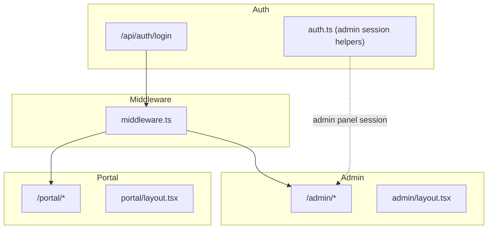
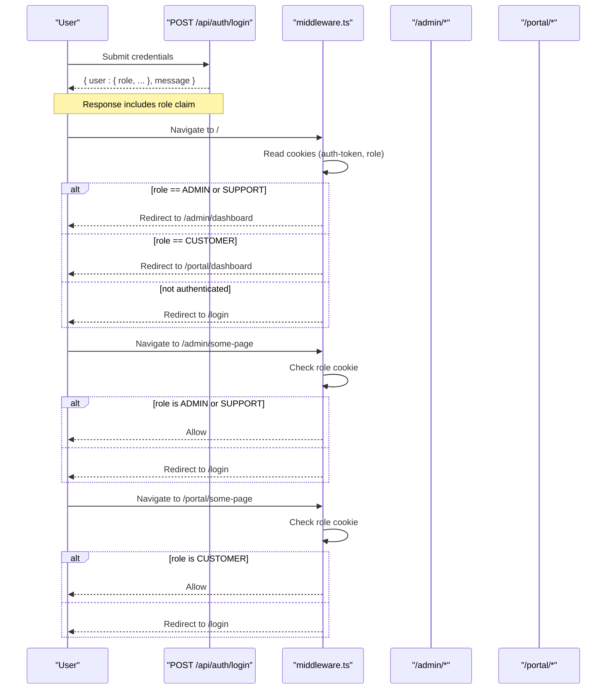
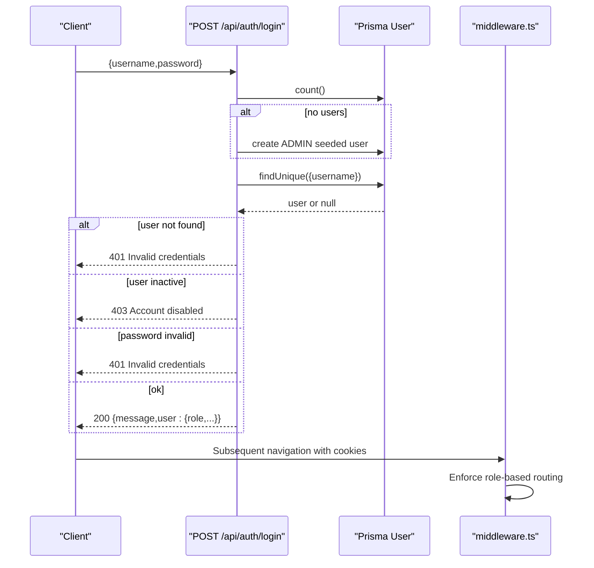
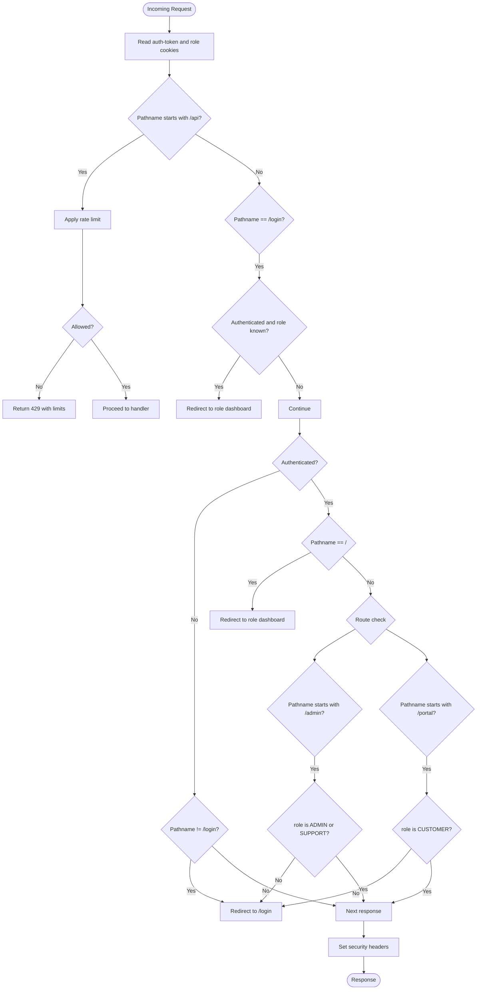
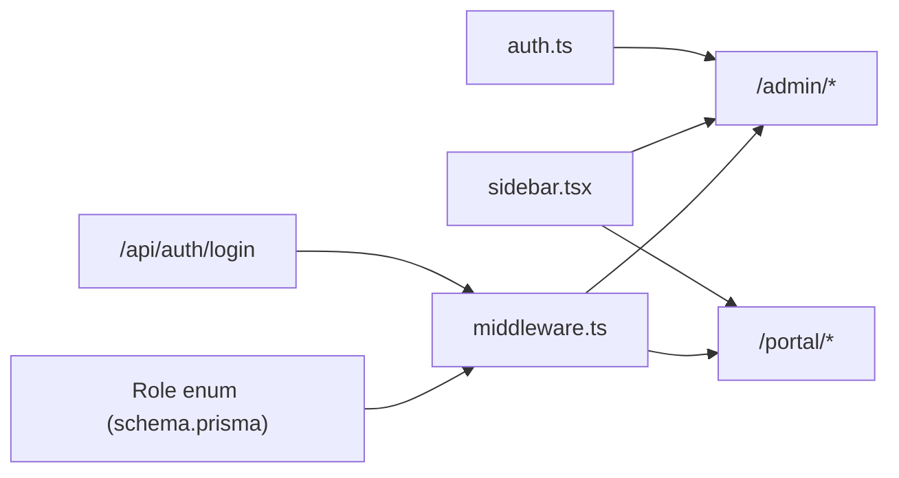

# Role-Based Permissions

<cite>
**Referenced Files in This Document**
- [middleware.ts](file://src/middleware.ts)
- [schema.prisma](file://prisma/schema.prisma)
- [login/route.ts](file://src/app/api/auth/login/route.ts)
- [auth.ts](file://src/lib/auth.ts)
- [layout.tsx (Admin)](file://src/app/admin/layout.tsx)
- [layout.tsx (Portal)](file://src/app/portal/layout.tsx)
- [sidebar.tsx](file://src/components/sidebar.tsx)
- [dashboard/page.tsx (Portal)](file://src/app/portal/dashboard/page.tsx)
</cite>

## Table of Contents
1. [Introduction](#introduction)
2. [Project Structure](#project-structure)
3. [Core Components](#core-components)
4. [Architecture Overview](#architecture-overview)
5. [Detailed Component Analysis](#detailed-component-analysis)
6. [Dependency Analysis](#dependency-analysis)
7. [Performance Considerations](#performance-considerations)
8. [Troubleshooting Guide](#troubleshooting-guide)
9. [Conclusion](#conclusion)

## Introduction
This document explains the role-based permissions system that separates administrative and customer-facing access. It defines roles, permission hierarchies, and enforcement mechanisms across the application. It also documents how middleware enforces role-based routing, protected route access, and role-specific feature availability, and how the system distinguishes admin panel access from customer portal access.

## Project Structure
The application uses a shared middleware for global enforcement and two distinct UI shells:
- Admin shell under /admin for administrative users (ADMIN and SUPPORT)
- Customer portal shell under /portal for end customers (CUSTOMER)

**Diagram sources**
- [middleware.ts:1-101](file://src/middleware.ts#L1-L101)
- [layout.tsx (Admin):1-10](file://src/app/admin/layout.tsx#L1-L10)
- [layout.tsx (Portal):1-10](file://src/app/portal/layout.tsx#L1-L10)
- [login/route.ts:1-86](file://src/app/api/auth/login/route.ts#L1-L86)
- [auth.ts:1-35](file://src/lib/auth.ts#L1-L35)

**Section sources**
- [middleware.ts:1-101](file://src/middleware.ts#L1-L101)
- [layout.tsx (Admin):1-10](file://src/app/admin/layout.tsx#L1-L10)
- [layout.tsx (Portal):1-10](file://src/app/portal/layout.tsx#L1-L10)
- [login/route.ts:1-86](file://src/app/api/auth/login/route.ts#L1-L86)
- [auth.ts:1-35](file://src/lib/auth.ts#L1-L35)

## Core Components
- Roles and model definition
  - Role enum includes ADMIN, SUPPORT, CUSTOMER.
  - Users are authenticated via the user model and returned with role claims.
- Middleware enforcement
  - Reads auth-token and role cookies to enforce role-based routing and redirects.
  - Protects admin and portal routes based on role.
  - Redirects unauthenticated users to /login except for API routes.
- Admin panel session helpers
  - Provides admin panel session management for local admin UI flows.
- UI shells
  - Admin layout wraps admin pages.
  - Portal layout wraps customer portal pages.
- Portal dashboard
  - Uses customer-scoped data retrieval via API endpoints filtered by customerId.

**Section sources**
- [schema.prisma:88-92](file://prisma/schema.prisma#L88-L92)
- [login/route.ts:37-78](file://src/app/api/auth/login/route.ts#L37-L78)
- [middleware.ts:31-80](file://src/middleware.ts#L31-L80)
- [auth.ts:13-35](file://src/lib/auth.ts#L13-L35)
- [layout.tsx (Admin):1-10](file://src/app/admin/layout.tsx#L1-L10)
- [layout.tsx (Portal):1-10](file://src/app/portal/layout.tsx#L1-L10)
- [dashboard/page.tsx (Portal):17-78](file://src/app/portal/dashboard/page.tsx#L17-L78)

## Architecture Overview
The system enforces role-based access at the edge via middleware and at the UI level via separate layouts. Authentication returns a role claim that middleware uses to decide access to /admin or /portal routes.

**Diagram sources**
- [login/route.ts:1-86](file://src/app/api/auth/login/route.ts#L1-L86)
- [middleware.ts:31-80](file://src/middleware.ts#L31-L80)

## Detailed Component Analysis

### Roles and Permission Model
- Role enum
  - ADMIN: Full administrative access.
  - SUPPORT: Administrative access (treated equivalently to ADMIN for routing in middleware).
  - CUSTOMER: End-customer access to portal.
- Enforcement in middleware
  - roleIsAdmin considers ADMIN and SUPPORT equivalent for routing.
  - roleIsCustomer restricts access to portal routes.
  - roleKnown ensures only recognized roles proceed.

**Section sources**
- [schema.prisma:88-92](file://prisma/schema.prisma#L88-L92)
- [middleware.ts:35-37](file://src/middleware.ts#L35-L37)

### Authentication and Login Flow
- Input validation and seeding
  - Validates payload and seeds an ADMIN user if none exists.
- User lookup and checks
  - Finds user by username, verifies active status, and compares password.
- Response
  - Returns user without sensitive fields and includes role claim.

**Diagram sources**
- [login/route.ts:22-78](file://src/app/api/auth/login/route.ts#L22-L78)
- [middleware.ts:31-80](file://src/middleware.ts#L31-L80)

**Section sources**
- [login/route.ts:1-86](file://src/app/api/auth/login/route.ts#L1-L86)

### Middleware Enforcement Details
- Cookies and role detection
  - Reads auth-token and role cookies.
  - Treats ADMIN and SUPPORT as admin-equivalent for routing.
- Redirects
  - Unauthenticated non-API routes go to /login.
  - Root (/) redirects to role-appropriate dashboard (/admin/dashboard or /portal/dashboard).
  - Access to /admin blocked for non-admin roles; access to /portal blocked for non-CUSTOMER roles.
- Security headers
  - Sets security headers for non-API responses.
- Rate limiting
  - Applies rate limiting for API routes with X-RateLimit-* headers.

**Diagram sources**
- [middleware.ts:9-94](file://src/middleware.ts#L9-L94)

**Section sources**
- [middleware.ts:31-80](file://src/middleware.ts#L31-L80)

### Admin Panel Session Helpers
- Purpose
  - Manage admin panel session state locally (sessionStorage).
- Typical usage
  - setAdminSession after successful admin login.
  - clearAdminSession on logout.
  - isAdminAuthenticated to gate admin UI flows.

**Section sources**
- [auth.ts:13-35](file://src/lib/auth.ts#L13-L35)

### UI Shells and Role-Specific Routing
- Admin shell
  - Wraps admin pages under /admin.
- Portal shell
  - Wraps portal pages under /portal.
- Side navigation
  - Builds role-aware navigation items; CUSTOMER sees portal menus while ADMIN/SUPPORT see administrative menus.

**Section sources**
- [layout.tsx (Admin):1-10](file://src/app/admin/layout.tsx#L1-L10)
- [layout.tsx (Portal):1-10](file://src/app/portal/layout.tsx#L1-L10)
- [sidebar.tsx:127-171](file://src/components/sidebar.tsx#L127-L171)

### Customer Portal Access and Data Scoping
- Dashboard
  - Reads user from localStorage to extract customerId.
  - Fetches portal data from API endpoints scoped to the customerId.
- Implication
  - Even though middleware enforces role-based routing, data access is further scoped server-side by customerId in API handlers.

**Section sources**
- [dashboard/page.tsx (Portal):17-78](file://src/app/portal/dashboard/page.tsx#L17-L78)

## Dependency Analysis
- Role model and enforcement
  - Role enum drives middleware decisions.
- Authentication and middleware
  - Login endpoint returns role; middleware reads cookies to enforce routing.
- UI shells
  - Admin and portal layouts encapsulate role-specific UIs.
- Side navigation
  - Consumes role to build appropriate menu items.

**Diagram sources**
- [schema.prisma:88-92](file://prisma/schema.prisma#L88-L92)
- [login/route.ts:1-86](file://src/app/api/auth/login/route.ts#L1-L86)
- [middleware.ts:31-80](file://src/middleware.ts#L31-L80)
- [sidebar.tsx:127-171](file://src/components/sidebar.tsx#L127-L171)
- [auth.ts:13-35](file://src/lib/auth.ts#L13-L35)

**Section sources**
- [schema.prisma:88-92](file://prisma/schema.prisma#L88-L92)
- [login/route.ts:1-86](file://src/app/api/auth/login/route.ts#L1-L86)
- [middleware.ts:31-80](file://src/middleware.ts#L31-L80)
- [sidebar.tsx:127-171](file://src/components/sidebar.tsx#L127-L171)
- [auth.ts:13-35](file://src/lib/auth.ts#L13-L35)

## Performance Considerations
- Middleware rate limiting
  - API requests are rate-limited per IP with sliding window; middleware tracks timestamps and returns X-RateLimit headers.
- Recommendations
  - Consider externalizing rate store for distributed deployments.
  - Tune limits based on traffic patterns.
  - Apply caching for static assets and reduce unnecessary redirects.

**Section sources**
- [middleware.ts:4-29](file://src/middleware.ts#L4-L29)
- [middleware.ts:40-54](file://src/middleware.ts#L40-L54)
- [middleware.ts:88-91](file://src/middleware.ts#L88-L91)

## Troubleshooting Guide
- Symptoms
  - Redirect loops to /login despite being authenticated.
- Likely causes
  - Missing or expired auth-token cookie.
  - role cookie mismatch or missing.
  - Root path behavior redirecting to wrong dashboard.
- Checks
  - Confirm cookies presence and values.
  - Verify middleware role checks and redirects.
  - Ensure login endpoint returns role claim.
- Admin panel session
  - If using admin panel helpers, confirm setAdminSession/clearAdminSession usage.

**Section sources**
- [middleware.ts:31-80](file://src/middleware.ts#L31-L80)
- [login/route.ts:64-78](file://src/app/api/auth/login/route.ts#L64-L78)
- [auth.ts:18-35](file://src/lib/auth.ts#L18-L35)

## Conclusion
The application enforces role-based access centrally via middleware, treating ADMIN and SUPPORT equivalently for routing while restricting portal access to CUSTOMER. Authentication returns a role claim consumed by middleware to protect routes and redirect appropriately. UI shells and side navigation reflect role-aware access, and the customer portal scopes data by customerId. Together, these components provide a clear separation between admin panel and customer portal access with robust enforcement at the edge.