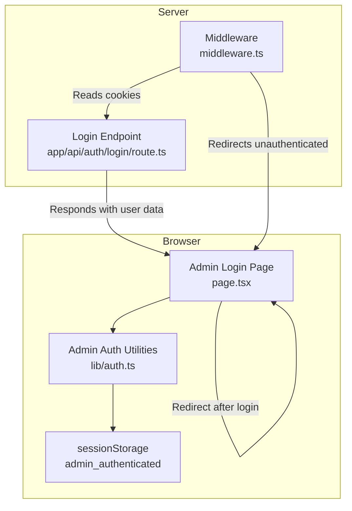
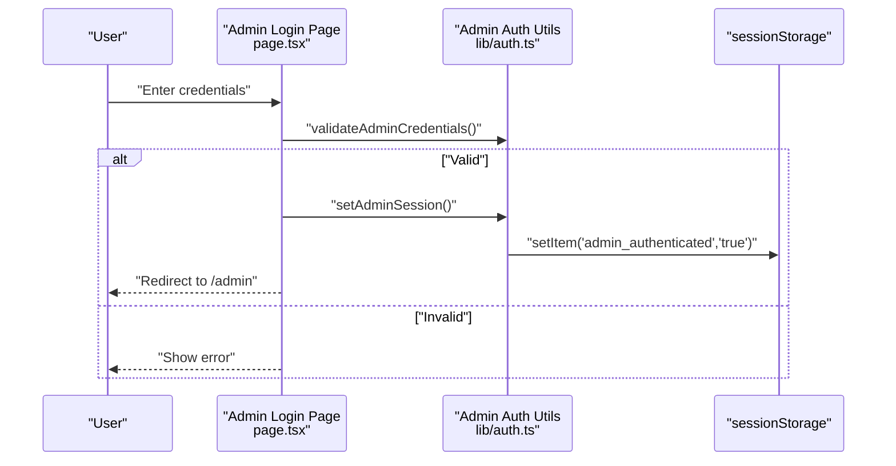
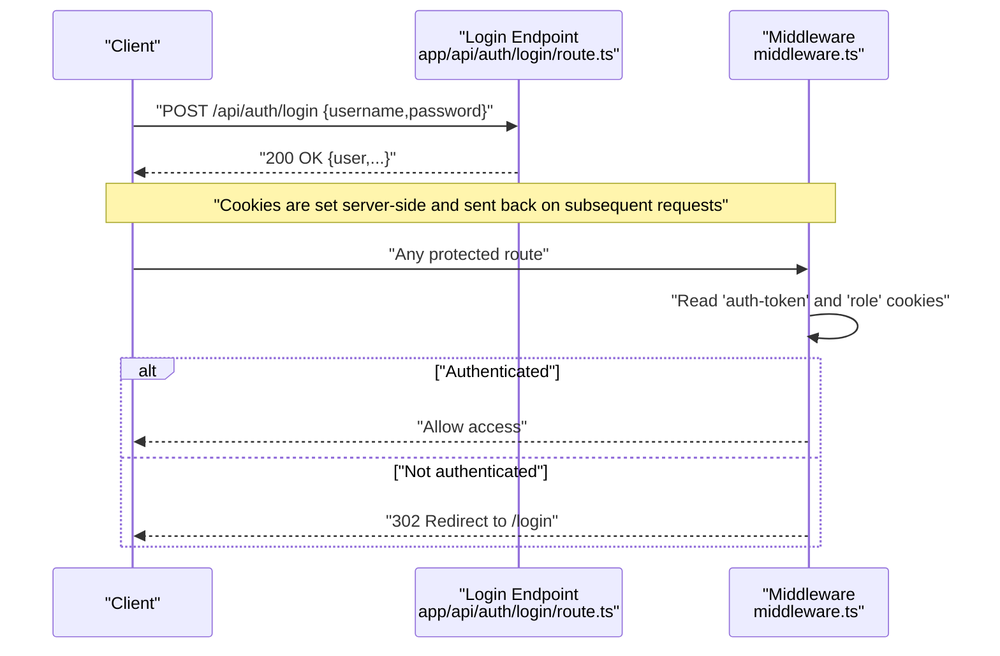
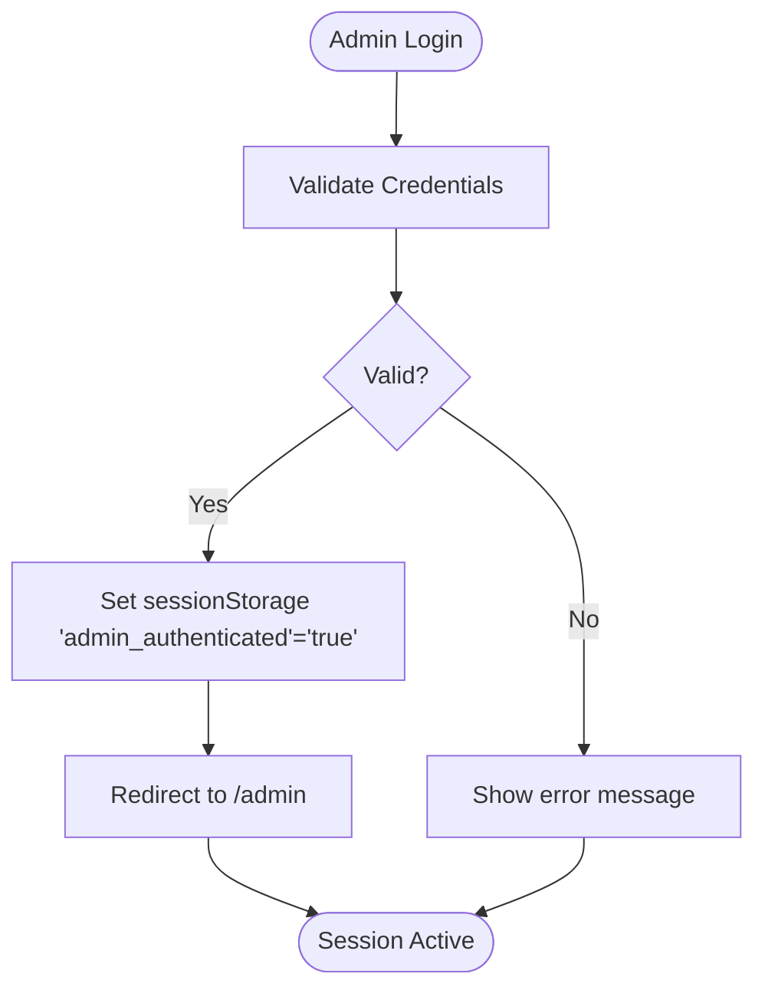
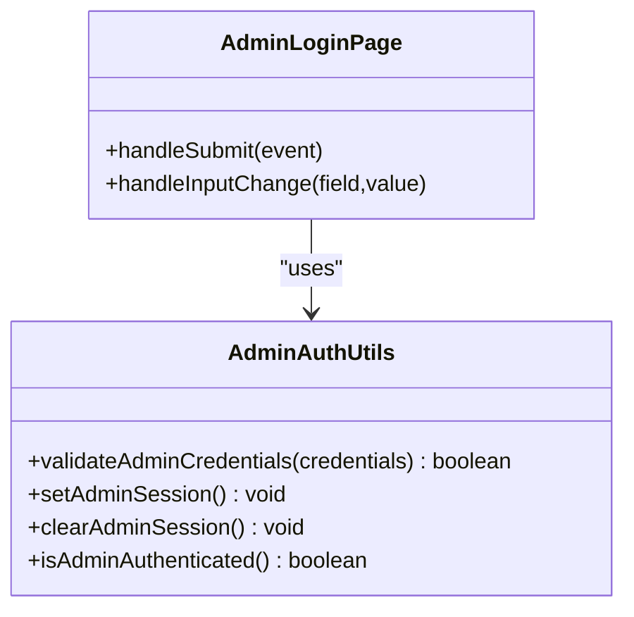
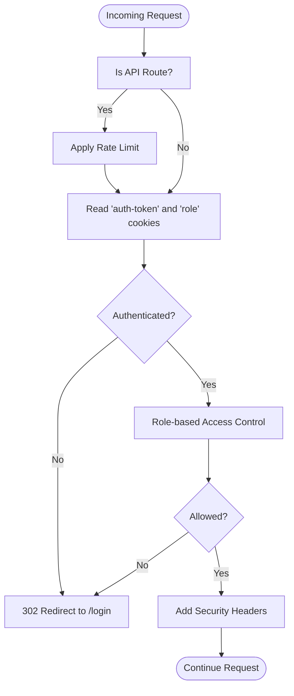
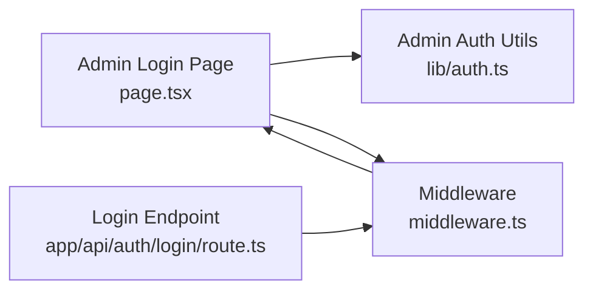

# Session Management

<cite>
**Referenced Files in This Document**
- [src/lib/auth.ts](file://src/lib/auth.ts)
- [src/app/admin/login/page.tsx](file://src/app/admin/login/page.tsx)
- [src/middleware.ts](file://src/middleware.ts)
- [src/app/api/auth/login/route.ts](file://src/app/api/auth/login/route.ts)
</cite>

## Table of Contents
1. [Introduction](#introduction)
2. [Project Structure](#project-structure)
3. [Core Components](#core-components)
4. [Architecture Overview](#architecture-overview)
5. [Detailed Component Analysis](#detailed-component-analysis)
6. [Dependency Analysis](#dependency-analysis)
7. [Performance Considerations](#performance-considerations)
8. [Troubleshooting Guide](#troubleshooting-guide)
9. [Conclusion](#conclusion)

## Introduction
This document explains the session management implementation across the application, focusing on:
- Admin panel session handling via browser sessionStorage
- Main application authentication state persistence using cookies
- Middleware-driven session validation and role-based access control
- Session lifecycle: creation, maintenance, and termination
- Security measures, timeouts, automatic logout, and best practices
- Cross-tab synchronization and session cleanup patterns

## Project Structure
The session management spans three primary areas:
- Admin login and session state in the browser (sessionStorage)
- Main application authentication handled by a lightweight login endpoint and middleware
- Shared cookie-based authentication tokens used by middleware for protection and redirection

**Diagram sources**
- [src/app/admin/login/page.tsx:1-129](file://src/app/admin/login/page.tsx#L1-L129)
- [src/lib/auth.ts:1-35](file://src/lib/auth.ts#L1-L35)
- [src/app/api/auth/login/route.ts:1-86](file://src/app/api/auth/login/route.ts#L1-L86)
- [src/middleware.ts:1-101](file://src/middleware.ts#L1-L101)

**Section sources**
- [src/app/admin/login/page.tsx:1-129](file://src/app/admin/login/page.tsx#L1-L129)
- [src/lib/auth.ts:1-35](file://src/lib/auth.ts#L1-L35)
- [src/app/api/auth/login/route.ts:1-86](file://src/app/api/auth/login/route.ts#L1-L86)
- [src/middleware.ts:1-101](file://src/middleware.ts#L1-L101)

## Core Components
- Admin session utilities:
  - Validation of admin credentials
  - Setting/clearing admin session flag in sessionStorage
  - Checking admin authentication state
- Admin login page:
  - Captures credentials, validates, sets admin session, and navigates to admin area
- Main application login endpoint:
  - Validates input, checks user existence and activity, compares passwords, and returns user metadata
- Middleware:
  - Reads authentication cookies
  - Enforces redirects for unauthenticated users
  - Applies role-based access control
  - Adds security headers
  - Enforces rate limiting for API routes

**Section sources**
- [src/lib/auth.ts:1-35](file://src/lib/auth.ts#L1-L35)
- [src/app/admin/login/page.tsx:1-129](file://src/app/admin/login/page.tsx#L1-L129)
- [src/app/api/auth/login/route.ts:1-86](file://src/app/api/auth/login/route.ts#L1-L86)
- [src/middleware.ts:1-101](file://src/middleware.ts#L1-L101)

## Architecture Overview
The system separates admin and main application authentication concerns:
- Admin panel uses client-side sessionStorage to persist a simple boolean flag indicating admin authentication
- Main application uses a server-side login endpoint returning user data; authentication state is maintained via cookies read by middleware
- Middleware enforces:
  - Unauthenticated access redirection
  - Role-based routing
  - Security headers
  - Rate limiting for API routes

**Diagram sources**
- [src/app/admin/login/page.tsx:22-38](file://src/app/admin/login/page.tsx#L22-L38)
- [src/lib/auth.ts:13-22](file://src/lib/auth.ts#L13-L22)

**Diagram sources**
- [src/app/api/auth/login/route.ts:7-78](file://src/app/api/auth/login/route.ts#L7-L78)
- [src/middleware.ts:31-64](file://src/middleware.ts#L31-L64)

## Detailed Component Analysis

### Admin Session Management (sessionStorage)
- Purpose: Lightweight client-side session for admin panel access
- Lifecycle:
  - Creation: On successful admin login, a boolean flag is stored in sessionStorage
  - Maintenance: Flag persists until cleared or tab is closed
  - Termination: Explicit removal on logout or programmatic clearing
- Data structure: Single key-value pair representing authentication state
- Cross-tab synchronization: sessionStorage is per-tab; flags are not shared across tabs
- Timeout handling: No built-in timeout; relies on manual clearing or tab closure
- Security considerations:
  - sessionStorage is client-side and not transmitted to the server
  - Keep sensitive admin credentials out of client code
  - Avoid storing secrets or tokens in sessionStorage

**Diagram sources**
- [src/app/admin/login/page.tsx:22-38](file://src/app/admin/login/page.tsx#L22-L38)
- [src/lib/auth.ts:18-22](file://src/lib/auth.ts#L18-L22)

**Section sources**
- [src/lib/auth.ts:13-35](file://src/lib/auth.ts#L13-L35)
- [src/app/admin/login/page.tsx:13-38](file://src/app/admin/login/page.tsx#L13-L38)

### Main Application Authentication (Cookie-Based)
- Purpose: Server-managed authentication state persisted via cookies
- Lifecycle:
  - Creation: Successful login returns user data; cookies are set server-side and included on subsequent requests
  - Maintenance: Cookies are validated by middleware on each request
  - Termination: Cookies can be removed server-side or via logout actions
- Data structure: Cookies include an authentication token and role metadata
- Cross-tab synchronization: Cookies are shared across tabs and windows
- Timeout handling: Not implemented in the current code; consider adding token expiration and refresh mechanisms
- Security considerations:
  - Use HttpOnly and SameSite cookies for CSRF and XSS protection
  - Enforce secure flags for HTTPS-only transmission
  - Rotate tokens and invalidate on logout

**Diagram sources**
- [src/lib/auth.ts:1-35](file://src/lib/auth.ts#L1-L35)
- [src/app/admin/login/page.tsx:1-129](file://src/app/admin/login/page.tsx#L1-L129)

**Section sources**
- [src/app/api/auth/login/route.ts:1-86](file://src/app/api/auth/login/route.ts#L1-L86)
- [src/middleware.ts:31-80](file://src/middleware.ts#L31-L80)

### Middleware and Access Control
- Responsibilities:
  - Read authentication cookies and roles
  - Redirect unauthenticated users to the login page
  - Redirect authenticated users away from the login page
  - Apply role-based access control for admin and portal routes
  - Add security headers
  - Enforce rate limiting for API routes
- Behavior highlights:
  - Redirects based on role to appropriate dashboards
  - Blocks unauthorized access to admin or portal routes
  - Sets security headers for non-API routes
  - Returns rate-limit metadata for API routes

**Diagram sources**
- [src/middleware.ts:31-94](file://src/middleware.ts#L31-L94)

**Section sources**
- [src/middleware.ts:9-94](file://src/middleware.ts#L9-L94)

### Session Validation Mechanisms
- Admin panel:
  - Client-side check against sessionStorage flag
- Main application:
  - Server-side validation via middleware reading cookies
  - Additional validation in login endpoint ensuring user activity and correct credentials
- Combined effect:
  - Client-side convenience for admin panel
  - Server-side enforcement for main application

**Section sources**
- [src/lib/auth.ts:30-35](file://src/lib/auth.ts#L30-L35)
- [src/middleware.ts:31-37](file://src/middleware.ts#L31-L37)
- [src/app/api/auth/login/route.ts:37-62](file://src/app/api/auth/login/route.ts#L37-L62)

### Automatic Logout Procedures
- Admin panel:
  - No explicit logout action is present in the provided code
  - Manual clearing of sessionStorage flag is required to terminate admin session
- Main application:
  - No explicit logout action is present in the provided code
  - Cookies are not cleared server-side in the provided code
- Recommendation:
  - Implement a logout endpoint that clears cookies and redirects to login
  - Clear sessionStorage for admin panel on logout

**Section sources**
- [src/lib/auth.ts:24-28](file://src/lib/auth.ts#L24-L28)
- [src/middleware.ts:31-37](file://src/middleware.ts#L31-L37)

### Session Cleanup Processes
- Admin panel:
  - Removal of sessionStorage flag on logout or programmatic clearing
- Main application:
  - Cookies are not cleared in the provided code
- Recommendation:
  - Implement server-side cookie invalidation on logout
  - Consider token revocation mechanisms

**Section sources**
- [src/lib/auth.ts:24-28](file://src/lib/auth.ts#L24-L28)
- [src/middleware.ts:31-37](file://src/middleware.ts#L31-L37)

### Cross-Tab Session Synchronization
- Admin panel:
  - sessionStorage is tab-scoped; synchronized across tabs only if the same key is used consistently
- Main application:
  - Cookies are shared across tabs and windows
- Recommendation:
  - For admin panel, consider broadcasting session changes across tabs using localStorage events if needed
  - For main application, rely on cookie sharing for consistent state

**Section sources**
- [src/lib/auth.ts:18-22](file://src/lib/auth.ts#L18-L22)
- [src/middleware.ts:31-37](file://src/middleware.ts#L31-L37)

### Session Hijacking Prevention and Secure Patterns
- Admin panel:
  - Avoid storing secrets in sessionStorage
  - Keep credentials out of client code
  - Consider adding CSRF protection and input sanitization
- Main application:
  - Use HttpOnly and SameSite cookies
  - Enforce secure flags for HTTPS-only cookies
  - Implement token expiration and refresh
  - Add IP binding or device fingerprinting for advanced protection
- General:
  - Enforce strict Content Security Policy
  - Sanitize and validate all inputs
  - Log and monitor suspicious activities

[No sources needed since this section provides general guidance]

## Dependency Analysis
- Admin login page depends on admin auth utilities for validation and session setting
- Middleware depends on cookies for authentication and role checks
- Login endpoint provides user data and participates in cookie-based authentication flow
- No circular dependencies observed among these components

**Diagram sources**
- [src/app/admin/login/page.tsx:11-38](file://src/app/admin/login/page.tsx#L11-L38)
- [src/lib/auth.ts:13-22](file://src/lib/auth.ts#L13-L22)
- [src/app/api/auth/login/route.ts:7-78](file://src/app/api/auth/login/route.ts#L7-L78)
- [src/middleware.ts:31-80](file://src/middleware.ts#L31-L80)

**Section sources**
- [src/app/admin/login/page.tsx:11-38](file://src/app/admin/login/page.tsx#L11-L38)
- [src/lib/auth.ts:13-22](file://src/lib/auth.ts#L13-L22)
- [src/app/api/auth/login/route.ts:7-78](file://src/app/api/auth/login/route.ts#L7-L78)
- [src/middleware.ts:31-80](file://src/middleware.ts#L31-L80)

## Performance Considerations
- Admin panel:
  - Client-side checks avoid network overhead but offer minimal security
- Main application:
  - Middleware adds negligible overhead for cookie reads and redirects
  - Rate limiting reduces API load but requires careful tuning
- Recommendations:
  - Cache frequently accessed user roles and permissions
  - Optimize rate-limit storage and cleanup
  - Minimize cookie payload to reduce bandwidth

[No sources needed since this section provides general guidance]

## Troubleshooting Guide
- Admin login fails silently:
  - Verify credential validation and error messaging
  - Ensure sessionStorage is writable and not blocked by browser settings
- Redirect loops to login:
  - Confirm cookie presence and correctness
  - Check role cookie values and middleware redirection logic
- Role-based access denied:
  - Verify role cookie values and middleware role checks
- Rate limit exceeded:
  - Review rate-limit thresholds and client-side retry behavior

**Section sources**
- [src/app/admin/login/page.tsx:30-35](file://src/app/admin/login/page.tsx#L30-L35)
- [src/lib/auth.ts:13-16](file://src/lib/auth.ts#L13-L16)
- [src/middleware.ts:56-79](file://src/middleware.ts#L56-L79)
- [src/middleware.ts:40-54](file://src/middleware.ts#L40-L54)

## Conclusion
The application implements a dual-session model:
- Admin panel uses client-side sessionStorage for convenience
- Main application uses server-managed cookies with middleware enforcement
To harden security and improve user experience, consider implementing:
- Token expiration and refresh for main application
- Explicit logout with cookie invalidation
- Enhanced admin session timeout and cross-tab synchronization
- HttpOnly and SameSite cookies for CSRF/XSS protection
- Centralized session cleanup and audit logging