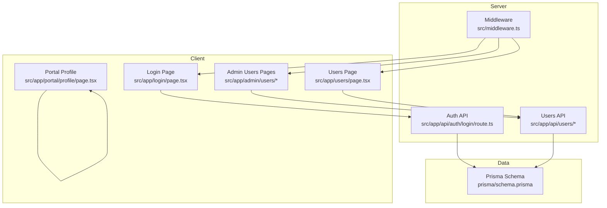
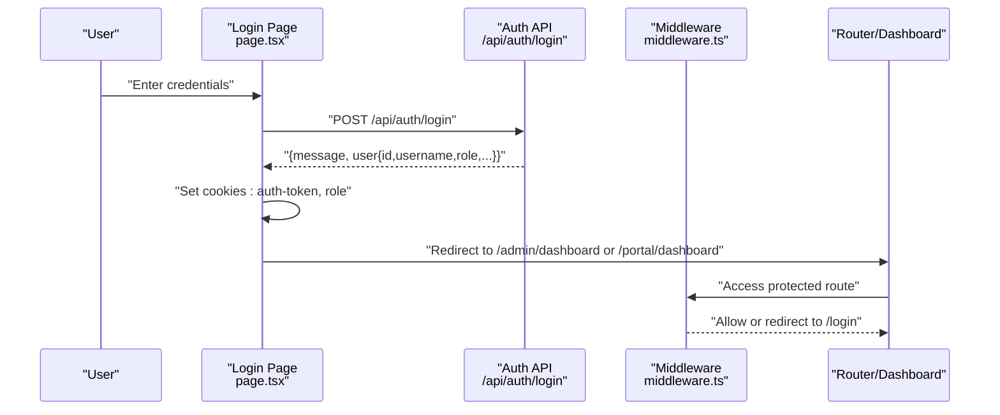
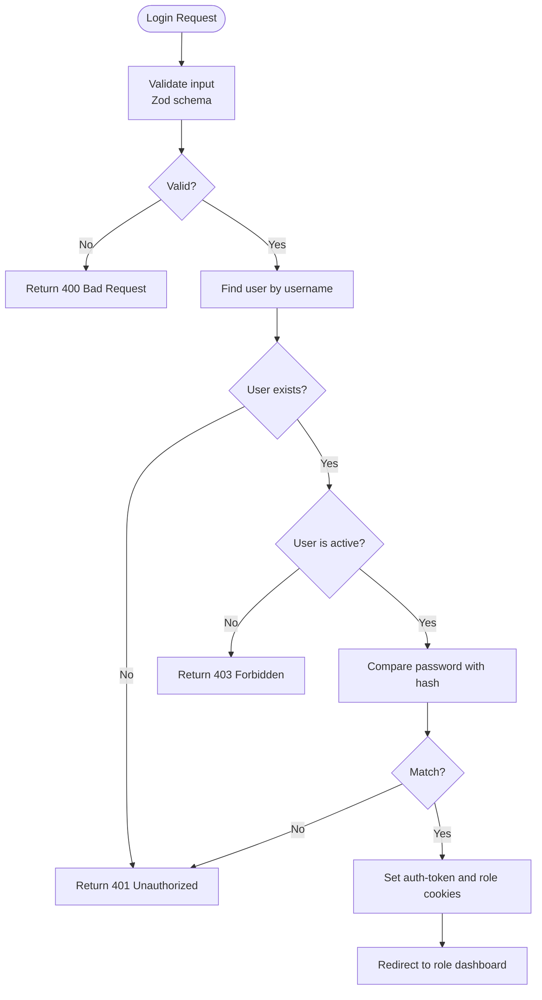
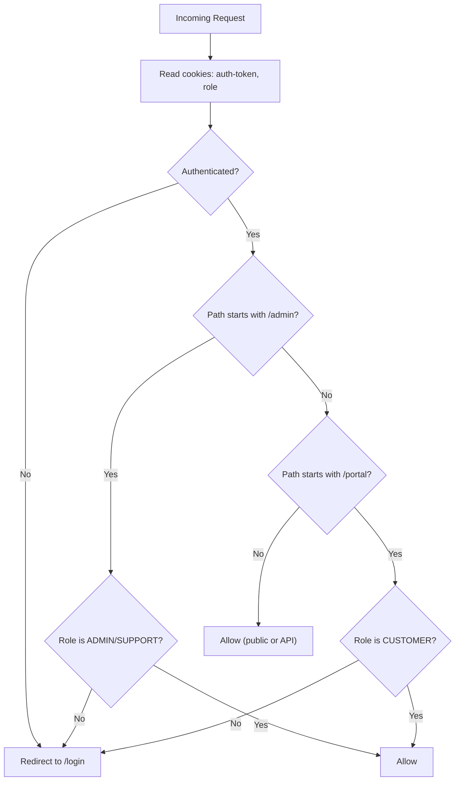
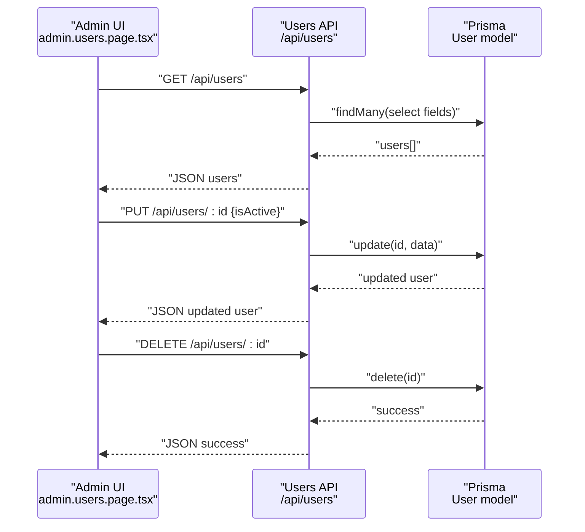
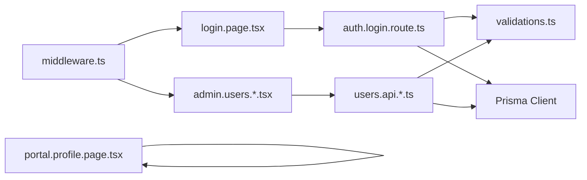

# User Management

<cite>
**Referenced Files in This Document**
- [middleware.ts](file://src/middleware.ts)
- [auth.ts](file://src/lib/auth.ts)
- [schema.prisma](file://prisma/schema.prisma)
- [auth.login.route.ts](file://src/app/api/auth/login/route.ts)
- [login.page.tsx](file://src/app/login/page.tsx)
- [admin.users.page.tsx](file://src/app/admin/users/page.tsx)
- [admin.users.add.page.tsx](file://src/app/admin/users/add/page.tsx)
- [admin.users.edit.page.tsx](file://src/app/admin/users/[id]/edit/page.tsx)
- [users.api.route.ts](file://src/app/api/users/route.ts)
- [users.api.[id].route.ts](file://src/app/api/users/[id]/route.ts)
- [users.page.tsx](file://src/app/users/page.tsx)
- [profile.page.tsx](file://src/app/portal/profile/page.tsx)
- [validations.ts](file://src/lib/validations.ts)
</cite>

## Table of Contents
1. [Introduction](#introduction)
2. [Project Structure](#project-structure)
3. [Core Components](#core-components)
4. [Architecture Overview](#architecture-overview)
5. [Detailed Component Analysis](#detailed-component-analysis)
6. [Dependency Analysis](#dependency-analysis)
7. [Performance Considerations](#performance-considerations)
8. [Troubleshooting Guide](#troubleshooting-guide)
9. [Conclusion](#conclusion)

## Introduction
This document explains the user management subsystem, including multi-role authentication, user profiles, permissions, and session handling. It covers user registration and onboarding, role-based access control (RBAC), user profile management, session lifecycle, administrator user management, user permissions and privileges, activity monitoring, account settings, password management, and user deactivation procedures. It also documents integration with authentication middleware and authorization systems.

## Project Structure
The user management system spans UI pages, API routes, middleware, and the Prisma schema:
- Authentication and session: login page, login API, middleware, admin session helpers
- User administration: admin UI for listing, adding, editing, and deactivating users
- API endpoints: CRUD for users with validation and hashing
- Data model: Prisma schema defines the User entity and roles
- Profile: portal user profile page reads local storage



**Diagram sources**
- [login.page.tsx:1-144](file://src/app/login/page.tsx#L1-L144)
- [auth.login.route.ts:1-86](file://src/app/api/auth/login/route.ts#L1-L86)
- [admin.users.page.tsx:1-315](file://src/app/admin/users/page.tsx#L1-L315)
- [admin.users.add.page.tsx:1-229](file://src/app/admin/users/add/page.tsx#L1-L229)
- [admin.users.edit.page.tsx:1-310](file://src/app/admin/users/[id]/edit/page.tsx#L1-L310)
- [users.api.route.ts:1-93](file://src/app/api/users/route.ts#L1-L93)
- [users.api.[id].route.ts](file://src/app/api/users/[id]/route.ts#L1-L164)
- [middleware.ts:1-101](file://src/middleware.ts#L1-L101)
- [schema.prisma:724-743](file://prisma/schema.prisma#L724-L743)

**Section sources**
- [login.page.tsx:1-144](file://src/app/login/page.tsx#L1-L144)
- [auth.login.route.ts:1-86](file://src/app/api/auth/login/route.ts#L1-L86)
- [admin.users.page.tsx:1-315](file://src/app/admin/users/page.tsx#L1-L315)
- [users.api.route.ts:1-93](file://src/app/api/users/route.ts#L1-L93)
- [middleware.ts:1-101](file://src/middleware.ts#L1-L101)
- [schema.prisma:724-743](file://prisma/schema.prisma#L724-L743)

## Core Components
- Authentication and session:
  - Login form posts credentials to the login API
  - Login API validates input, checks user existence, verifies password, and responds with user data
  - Client sets session cookies for auth-token and role, then redirects to role-specific dashboards
  - Middleware enforces authentication and role-based access control for protected routes
  - Admin session helpers manage admin panel authentication via browser sessionStorage

- User administration:
  - Admin UI lists users, supports filtering and toggling activation status, and deletion
  - Add and edit forms submit to users API with Zod validation
  - Users API handles creation (with password hashing), updates (including optional password), and deletion

- Data model:
  - User entity includes username, email, password hash, full name, role, activity flag, and relations
  - Roles include ADMIN, SUPPORT, CUSTOMER

- Profile:
  - Portal profile reads user info from local storage

**Section sources**
- [login.page.tsx:1-144](file://src/app/login/page.tsx#L1-L144)
- [auth.login.route.ts:1-86](file://src/app/api/auth/login/route.ts#L1-L86)
- [middleware.ts:1-101](file://src/middleware.ts#L1-L101)
- [auth.ts:1-35](file://src/lib/auth.ts#L1-L35)
- [admin.users.page.tsx:1-315](file://src/app/admin/users/page.tsx#L1-L315)
- [admin.users.add.page.tsx:1-229](file://src/app/admin/users/add/page.tsx#L1-L229)
- [admin.users.edit.page.tsx:1-310](file://src/app/admin/users/[id]/edit/page.tsx#L1-L310)
- [users.api.route.ts:1-93](file://src/app/api/users/route.ts#L1-L93)
- [users.api.[id].route.ts](file://src/app/api/users/[id]/route.ts#L1-L164)
- [schema.prisma:724-743](file://prisma/schema.prisma#L724-L743)
- [profile.page.tsx:1-56](file://src/app/portal/profile/page.tsx#L1-L56)

## Architecture Overview
The system uses a cookie-based session model:
- Successful login stores an auth-token cookie (user identifier) and a role cookie
- Middleware reads cookies to enforce authentication and RBAC
- Protected routes redirect unauthenticated users to the login page
- Role determines the destination after login and restricts access to admin or portal areas



**Diagram sources**
- [login.page.tsx:34-62](file://src/app/login/page.tsx#L34-L62)
- [auth.login.route.ts:75-78](file://src/app/api/auth/login/route.ts#L75-L78)
- [middleware.ts:31-80](file://src/middleware.ts#L31-L80)

**Section sources**
- [login.page.tsx:1-144](file://src/app/login/page.tsx#L1-L144)
- [auth.login.route.ts:1-86](file://src/app/api/auth/login/route.ts#L1-L86)
- [middleware.ts:1-101](file://src/middleware.ts#L1-L101)

## Detailed Component Analysis

### Authentication and Session Handling
- Login flow:
  - Frontend validates presence of username and password
  - Posts to login API with Zod validation
  - On success, sets auth-token and role cookies and redirects to role-specific dashboard
- Password verification:
  - Login API compares bcrypt-hashed passwords
- Middleware enforcement:
  - Reads auth-token and role cookies
  - Redirects unauthenticated users to login
  - Enforces role-based access (admin vs portal)
  - Applies rate limiting for API routes
- Admin panel session:
  - Separate helpers manage admin panel authentication via sessionStorage



**Diagram sources**
- [login.page.tsx:21-62](file://src/app/login/page.tsx#L21-L62)
- [auth.login.route.ts:12-78](file://src/app/api/auth/login/route.ts#L12-L78)
- [middleware.ts:31-80](file://src/middleware.ts#L31-L80)

**Section sources**
- [login.page.tsx:1-144](file://src/app/login/page.tsx#L1-L144)
- [auth.login.route.ts:1-86](file://src/app/api/auth/login/route.ts#L1-L86)
- [middleware.ts:1-101](file://src/middleware.ts#L1-L101)
- [auth.ts:1-35](file://src/lib/auth.ts#L1-L35)

### Role-Based Access Control (RBAC)
- Roles:
  - ADMIN and SUPPORT can access admin routes
  - CUSTOMER can access portal routes
- Middleware enforces:
  - Root redirection based on role
  - Route protection for /admin and /portal
  - Rate limiting for API endpoints



**Diagram sources**
- [middleware.ts:35-80](file://src/middleware.ts#L35-L80)

**Section sources**
- [middleware.ts:1-101](file://src/middleware.ts#L1-L101)

### User Administration (Admin UI)
- Listing users:
  - Fetches users from /api/users
  - Supports search by username/full name/email
  - Toggle activation status via PUT to /api/users/:id
  - Delete user via DELETE to /api/users/:id
- Adding users:
  - Validates with userCreateSchema
  - Hashes password before persisting
- Editing users:
  - Optional password update
  - Prevents username conflicts



**Diagram sources**
- [admin.users.page.tsx:56-112](file://src/app/admin/users/page.tsx#L56-L112)
- [users.api.route.ts:8-33](file://src/app/api/users/route.ts#L8-L33)
- [users.api.[id].route.ts](file://src/app/api/users/[id]/route.ts#L44-L130)

**Section sources**
- [admin.users.page.tsx:1-315](file://src/app/admin/users/page.tsx#L1-L315)
- [admin.users.add.page.tsx:1-229](file://src/app/admin/users/add/page.tsx#L1-L229)
- [admin.users.edit.page.tsx:1-310](file://src/app/admin/users/[id]/edit/page.tsx#L1-L310)
- [users.api.route.ts:1-93](file://src/app/api/users/route.ts#L1-L93)
- [users.api.[id].route.ts](file://src/app/api/users/[id]/route.ts#L1-L164)

### Data Model: User Entity
- Fields:
  - Unique username and email
  - Password hash
  - Full name, role, activity flag
  - Relations to customer and tasks
- Roles:
  - Enum includes ADMIN, SUPPORT, CUSTOMER

```mermaid
erDiagram
USER {
string id PK
string username UK
string email UK
string password
string fullName
string role
boolean isActive
datetime createdAt
datetime updatedAt
}
CUSTOMER {
string id PK
string fullName
string phoneNumber
string city
string district
string club
string sportsSchoolOfficial
string hosting
string duration
string startDate
string endDate
string offer
string address
enum status
decimal openingBalance
datetime openingBalanceDate
}
TASK {
string id PK
string title
string description
enum status
string assigneeId FK?
string customerId FK
}
USER ||--o{ TASK : "assignedTasks"
CUSTOMER ||--o{ USER : "userAccounts"
```

**Diagram sources**
- [schema.prisma:724-743](file://prisma/schema.prisma#L724-L743)
- [schema.prisma:95-134](file://prisma/schema.prisma#L95-L134)
- [schema.prisma:264-279](file://prisma/schema.prisma#L264-L279)

**Section sources**
- [schema.prisma:724-743](file://prisma/schema.prisma#L724-L743)

### Validation and Sanitization
- Zod schemas:
  - userCreateSchema and userUpdateSchema for user operations
  - loginSchema for login endpoint
- Validation ensures:
  - Username/email/password length/format constraints
  - Optional fields handled safely
  - Non-empty passwords only hashed when provided

**Section sources**
- [validations.ts:77-90](file://src/lib/validations.ts#L77-L90)
- [users.api.route.ts:35-46](file://src/app/api/users/route.ts#L35-L46)
- [users.api.[id].route.ts](file://src/app/api/users/[id]/route.ts#L44-L58)
- [auth.login.route.ts:12-18](file://src/app/api/auth/login/route.ts#L12-L18)

### Password Management
- Creation:
  - Passwords are hashed with bcrypt before storing
- Updates:
  - Optional password update hashes new value
- Login:
  - Compares provided password against stored hash

**Section sources**
- [users.api.route.ts:62-63](file://src/app/api/users/route.ts#L62-L63)
- [users.api.[id].route.ts](file://src/app/api/users/[id]/route.ts#L103-L105)
- [auth.login.route.ts:55-55](file://src/app/api/auth/login/route.ts#L55-L55)

### User Deactivation and Activity Monitoring
- Deactivation:
  - Admin UI toggles isActive via PUT to /api/users/:id
- Activity monitoring:
  - Middleware logs and rate limits API requests
  - UI displays user creation dates and statuses

**Section sources**
- [admin.users.page.tsx:92-112](file://src/app/admin/users/page.tsx#L92-L112)
- [users.api.[id].route.ts](file://src/app/api/users/[id]/route.ts#L108-L122)
- [middleware.ts:4-54](file://src/middleware.ts#L4-L54)

### Administrator User Management Capabilities
- Create users:
  - Admin UI add form posts to /api/users with validation
- Edit users:
  - Admin UI edit form supports optional password change
- Deactivate users:
  - Toggle isActive from admin UI
- Bulk operations:
  - Filtering and search in admin user list

**Section sources**
- [admin.users.add.page.tsx:51-74](file://src/app/admin/users/add/page.tsx#L51-L74)
- [admin.users.edit.page.tsx:91-119](file://src/app/admin/users/[id]/edit/page.tsx#L91-L119)
- [admin.users.page.tsx:114-119](file://src/app/admin/users/page.tsx#L114-L119)

### User Permissions and Privileges
- Roles:
  - ADMIN and SUPPORT: access admin area
  - CUSTOMER: access portal area
- Middleware enforces:
  - Path-based access restrictions
  - Redirects unauthorized users to login

**Section sources**
- [middleware.ts:35-80](file://src/middleware.ts#L35-L80)

### Session Lifecycle
- Login:
  - Sets auth-token and role cookies
- Middleware:
  - Reads cookies to determine access
  - Applies rate limiting for API
- Logout:
  - No explicit logout endpoint; rely on cookie expiration or manual clearing

**Section sources**
- [login.page.tsx:46-52](file://src/app/login/page.tsx#L46-L52)
- [middleware.ts:31-91](file://src/middleware.ts#L31-L91)

### User Account Settings and Profile Management
- Portal profile:
  - Reads user info from local storage
- Admin user management:
  - Edit form allows updating username, email, full name, and activation status
  - Optional password change

**Section sources**
- [profile.page.tsx:10-19](file://src/app/portal/profile/page.tsx#L10-L19)
- [admin.users.edit.page.tsx:254-266](file://src/app/admin/users/[id]/edit/page.tsx#L254-L266)

## Dependency Analysis
- UI depends on:
  - API routes for user operations
  - Middleware for access control
- API depends on:
  - Prisma client for persistence
  - Zod schemas for validation
  - bcrypt for password hashing
- Middleware depends on:
  - Cookies for session and role
  - Rate limiter for API protection



**Diagram sources**
- [login.page.tsx:34-62](file://src/app/login/page.tsx#L34-L62)
- [auth.login.route.ts:12-78](file://src/app/api/auth/login/route.ts#L12-L78)
- [admin.users.page.tsx:56-112](file://src/app/admin/users/page.tsx#L56-L112)
- [users.api.route.ts:35-92](file://src/app/api/users/route.ts#L35-L92)
- [middleware.ts:31-91](file://src/middleware.ts#L31-L91)
- [validations.ts:77-90](file://src/lib/validations.ts#L77-L90)

**Section sources**
- [login.page.tsx:1-144](file://src/app/login/page.tsx#L1-L144)
- [auth.login.route.ts:1-86](file://src/app/api/auth/login/route.ts#L1-L86)
- [admin.users.page.tsx:1-315](file://src/app/admin/users/page.tsx#L1-L315)
- [users.api.route.ts:1-93](file://src/app/api/users/route.ts#L1-L93)
- [middleware.ts:1-101](file://src/middleware.ts#L1-L101)
- [validations.ts:1-243](file://src/lib/validations.ts#L1-L243)

## Performance Considerations
- Rate limiting:
  - Middleware applies per-IP rate limiting for API routes
- Validation overhead:
  - Zod parsing occurs on server-side; keep payloads minimal
- Password hashing:
  - bcrypt cost factor is set; consider tuning for deployment needs
- UI rendering:
  - Admin user list supports client-side filtering; consider server-side pagination for large datasets

[No sources needed since this section provides general guidance]

## Troubleshooting Guide
- Login fails with invalid credentials:
  - Ensure username and password meet validation requirements
  - Confirm user exists and is active
- Password errors during update:
  - New password must meet minimum length requirement
- Duplicate username:
  - Creating or updating a user with an existing username returns conflict
- Not authorized to access admin/portal:
  - Verify role cookie and ensure middleware is applied to routes
- API rate limit exceeded:
  - Middleware returns 429 with rate limit headers

**Section sources**
- [auth.login.route.ts:39-51](file://src/app/api/auth/login/route.ts#L39-L51)
- [users.api.route.ts:50-60](file://src/app/api/users/route.ts#L50-L60)
- [users.api.[id].route.ts](file://src/app/api/users/[id]/route.ts#L75-L90)
- [middleware.ts:40-54](file://src/middleware.ts#L40-L54)

## Conclusion
The user management system provides a clear, layered approach to authentication, authorization, and user administration:
- Cookie-based sessions with role-aware middleware
- Admin UI for managing users with validation and hashing
- Prisma-backed data model supporting roles and relations
- Practical controls for activation, password changes, and deactivation
- Extensible foundation for further enhancements such as explicit logout, audit logging, and advanced RBAC