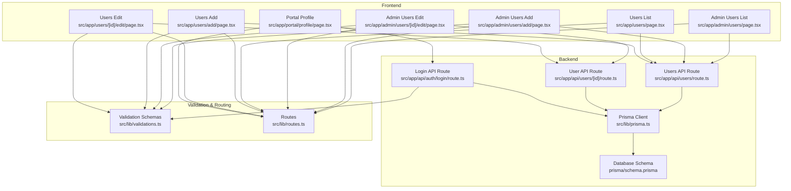
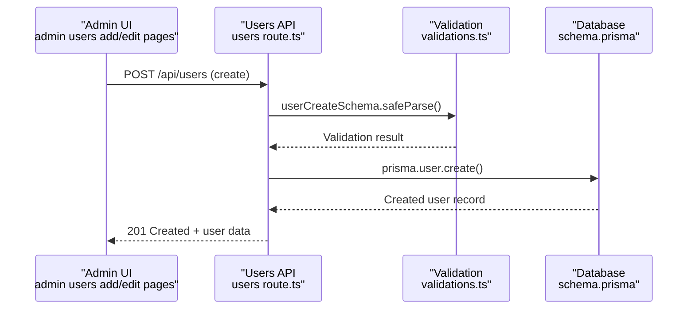
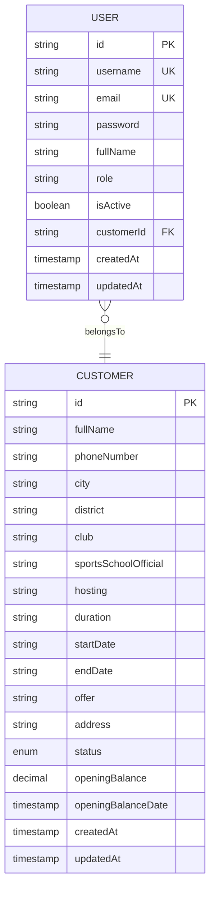
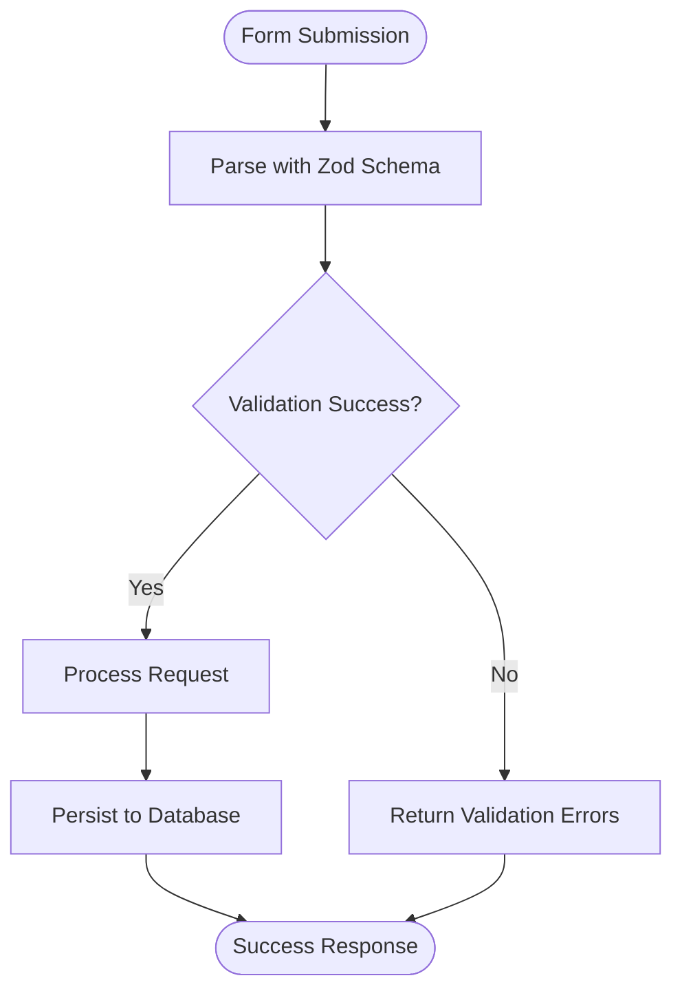
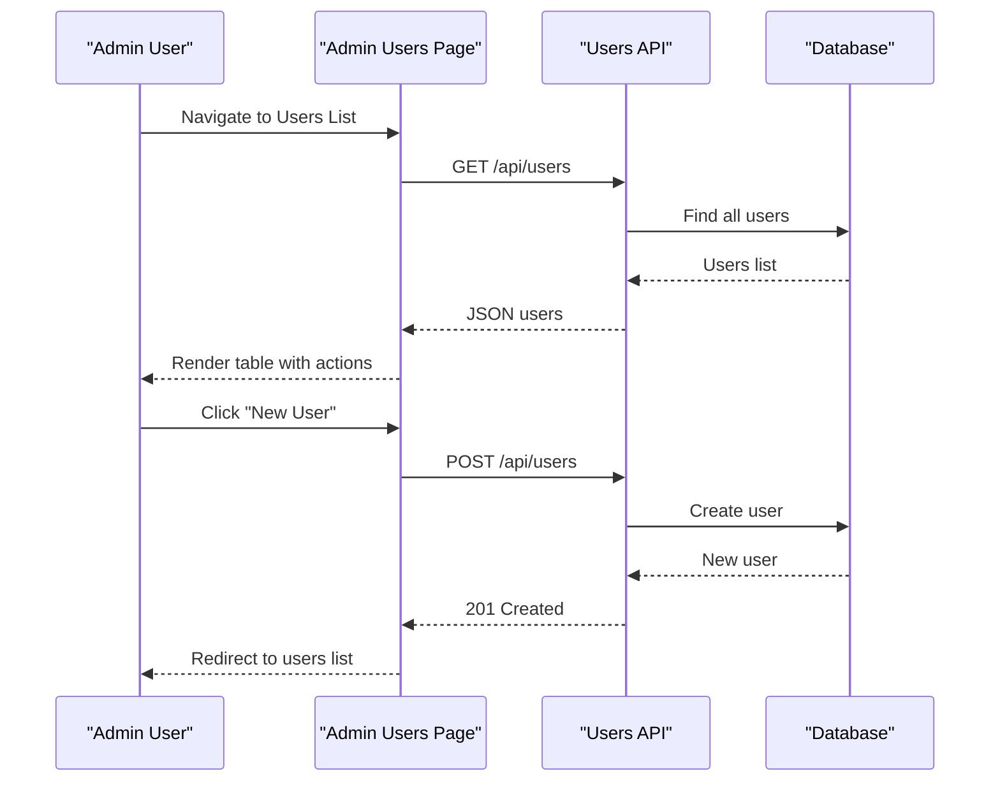
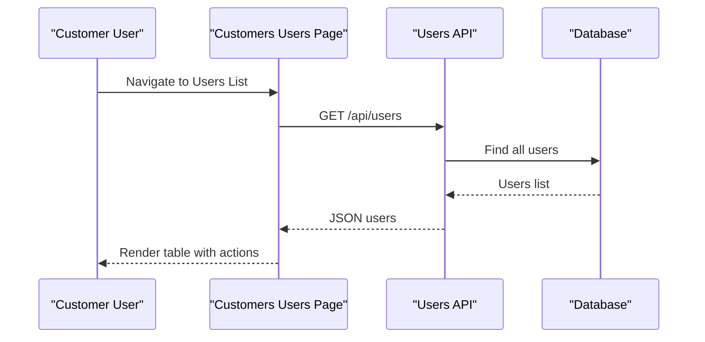
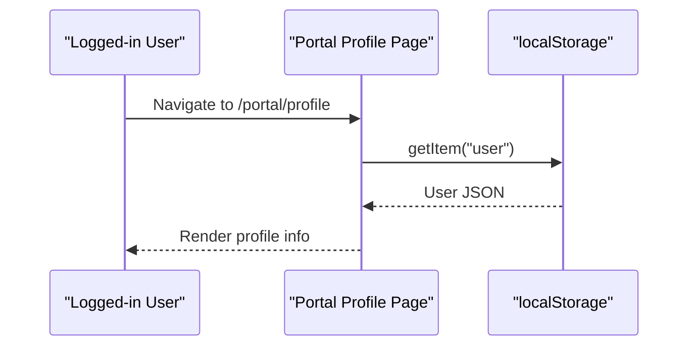
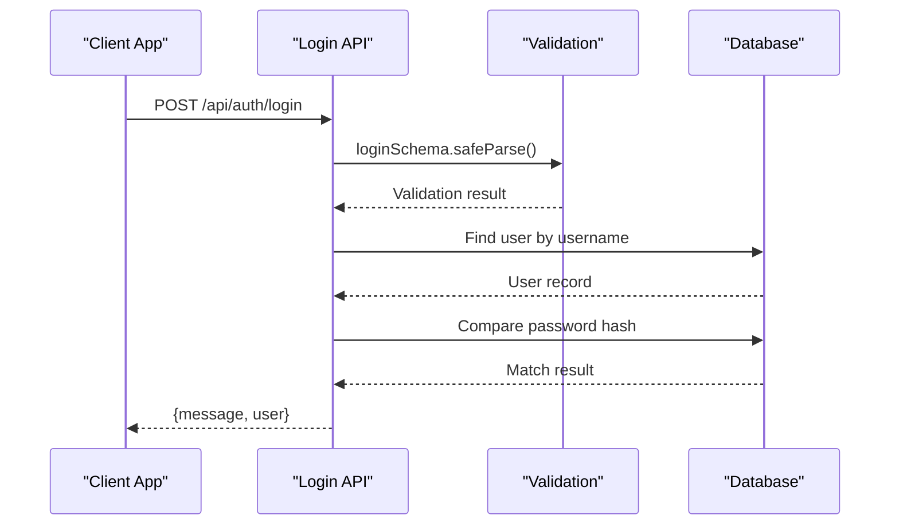
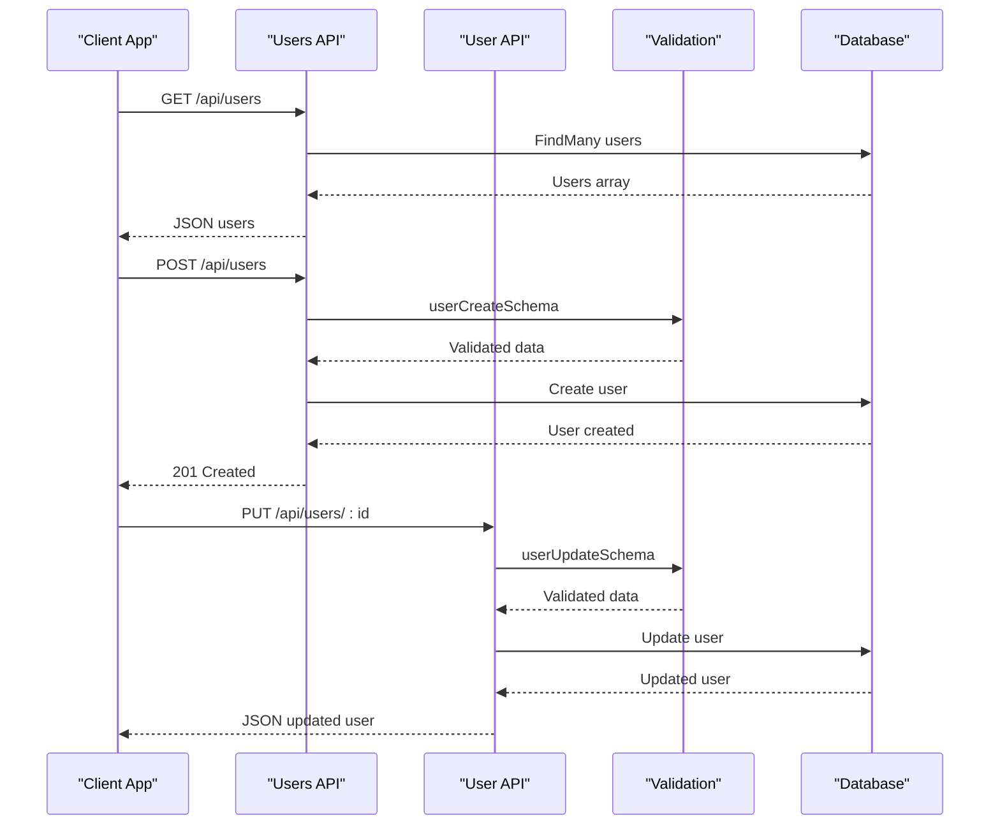
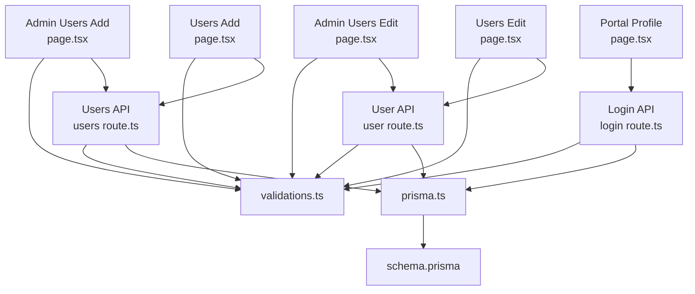

# User Profile Management

<cite>
**Referenced Files in This Document**
- [schema.prisma](file://prisma/schema.prisma)
- [prisma.ts](file://src/lib/prisma.ts)
- [validations.ts](file://src/lib/validations.ts)
- [auth.ts](file://src/lib/auth.ts)
- [routes.ts](file://src/lib/routes.ts)
- [users route.ts](file://src/app/api/users/route.ts)
- [user route.ts](file://src/app/api/users/[id]/route.ts)
- [login route.ts](file://src/app/api/auth/login/route.ts)
- [admin users page.tsx](file://src/app/admin/users/page.tsx)
- [admin users add page.tsx](file://src/app/admin/users/add/page.tsx)
- [admin users edit page.tsx](file://src/app/admin/users/[id]/edit/page.tsx)
- [users page.tsx](file://src/app/users/page.tsx)
- [users add page.tsx](file://src/app/users/add/page.tsx)
- [users edit page.tsx](file://src/app/users/[id]/edit/page.tsx)
- [portal profile page.tsx](file://src/app/portal/profile/page.tsx)
</cite>

## Table of Contents
1. [Introduction](#introduction)
2. [Project Structure](#project-structure)
3. [Core Components](#core-components)
4. [Architecture Overview](#architecture-overview)
5. [Detailed Component Analysis](#detailed-component-analysis)
6. [Dependency Analysis](#dependency-analysis)
7. [Performance Considerations](#performance-considerations)
8. [Troubleshooting Guide](#troubleshooting-guide)
9. [Conclusion](#conclusion)

## Introduction
This document provides comprehensive user profile management documentation for the customer.webmahsul application. It covers user creation, editing, and profile updates across admin and customer portals, including the registration workflow, form validation, data persistence, and profile modification processes. It also explains user profile fields, validation rules, data integrity constraints, profile views, visibility controls, and integration between user forms, validation schemas, and backend API endpoints.

## Project Structure
User profile management spans frontend pages, backend API routes, validation schemas, and the Prisma database schema. The system supports two primary user roles: administrative users and customer users, each with distinct portals and capabilities.

**Diagram sources**
- [admin users page.tsx:46-314](file://src/app/admin/users/page.tsx#L46-L314)
- [admin users add page.tsx:36-228](file://src/app/admin/users/add/page.tsx#L36-L228)
- [admin users edit page.tsx:45-309](file://src/app/admin/users/[id]/edit/page.tsx#L45-L309)
- [users page.tsx:17-196](file://src/app/users/page.tsx#L17-L196)
- [users add page.tsx:13-174](file://src/app/users/add/page.tsx#L13-L174)
- [users edit page.tsx:13-221](file://src/app/users/[id]/edit/page.tsx#L13-L221)
- [portal profile page.tsx:21-55](file://src/app/portal/profile/page.tsx#L21-L55)
- [users route.ts:1-93](file://src/app/api/users/route.ts#L1-L93)
- [user route.ts:1-164](file://src/app/api/users/[id]/route.ts#L1-L164)
- [login route.ts:1-86](file://src/app/api/auth/login/route.ts#L1-L86)
- [prisma.ts:1-9](file://src/lib/prisma.ts#L1-L9)
- [schema.prisma:724-743](file://prisma/schema.prisma#L724-L743)
- [validations.ts:76-90](file://src/lib/validations.ts#L76-L90)
- [routes.ts:1-43](file://src/lib/routes.ts#L1-L43)

**Section sources**
- [admin users page.tsx:46-314](file://src/app/admin/users/page.tsx#L46-L314)
- [admin users add page.tsx:36-228](file://src/app/admin/users/add/page.tsx#L36-L228)
- [admin users edit page.tsx:45-309](file://src/app/admin/users/[id]/edit/page.tsx#L45-L309)
- [users page.tsx:17-196](file://src/app/users/page.tsx#L17-L196)
- [users add page.tsx:13-174](file://src/app/users/add/page.tsx#L13-L174)
- [users edit page.tsx:13-221](file://src/app/users/[id]/edit/page.tsx#L13-L221)
- [portal profile page.tsx:21-55](file://src/app/portal/profile/page.tsx#L21-L55)
- [users route.ts:1-93](file://src/app/api/users/route.ts#L1-L93)
- [user route.ts:1-164](file://src/app/api/users/[id]/route.ts#L1-L164)
- [login route.ts:1-86](file://src/app/api/auth/login/route.ts#L1-L86)
- [prisma.ts:1-9](file://src/lib/prisma.ts#L1-L9)
- [schema.prisma:724-743](file://prisma/schema.prisma#L724-L743)
- [validations.ts:76-90](file://src/lib/validations.ts#L76-L90)
- [routes.ts:1-43](file://src/lib/routes.ts#L1-L43)

## Core Components
- User model: Defines user fields, uniqueness constraints, and relations to other entities.
- Validation schemas: Enforce field requirements, formats, and constraints for user creation and updates.
- API routes: Handle CRUD operations for users, including retrieval, creation, update, and deletion.
- Frontend pages: Provide admin and customer portals for viewing, creating, editing, and managing user profiles.
- Authentication utilities: Support admin session management and basic login flow.

Key user profile fields and constraints:
- Username: Unique, minimum length enforced.
- Email: Optional but validated if provided.
- Password: Required for creation, optional for updates; hashed before persistence.
- Full name: Optional.
- Active status: Boolean flag controlling account activity.
- Role: Enumerated role values (e.g., ADMIN, SUPPORT, CUSTOMER).
- Customer association: Optional foreign key linking users to customer records.

**Section sources**
- [schema.prisma:724-743](file://prisma/schema.prisma#L724-L743)
- [validations.ts:76-90](file://src/lib/validations.ts#L76-L90)
- [users route.ts:35-93](file://src/app/api/users/route.ts#L35-L93)
- [user route.ts:44-164](file://src/app/api/users/[id]/route.ts#L44-L164)

## Architecture Overview
The user profile management system follows a layered architecture:
- Presentation layer: Next.js pages for admin and customer portals.
- Validation layer: Zod schemas ensuring data integrity.
- API layer: Next.js API routes handling HTTP requests and responses.
- Persistence layer: Prisma ORM interacting with PostgreSQL.

**Diagram sources**
- [admin users add page.tsx:51-74](file://src/app/admin/users/add/page.tsx#L51-L74)
- [users route.ts:35-93](file://src/app/api/users/route.ts#L35-L93)
- [validations.ts:76-85](file://src/lib/validations.ts#L76-L85)
- [schema.prisma:724-743](file://prisma/schema.prisma#L724-L743)

**Section sources**
- [admin users add page.tsx:51-74](file://src/app/admin/users/add/page.tsx#L51-L74)
- [users route.ts:35-93](file://src/app/api/users/route.ts#L35-L93)
- [validations.ts:76-85](file://src/lib/validations.ts#L76-L85)
- [schema.prisma:724-743](file://prisma/schema.prisma#L724-L743)

## Detailed Component Analysis

### User Model and Data Integrity
The User model defines the core attributes and constraints:
- Unique identifiers for username and email.
- Password hashing for security.
- Role enumeration and active status flag.
- Optional customer association for customer portal users.
- Timestamps for creation and updates.

**Diagram sources**
- [schema.prisma:724-743](file://prisma/schema.prisma#L724-L743)
- [schema.prisma:94-134](file://prisma/schema.prisma#L94-L134)

**Section sources**
- [schema.prisma:724-743](file://prisma/schema.prisma#L724-L743)
- [schema.prisma:94-134](file://prisma/schema.prisma#L94-L134)

### Validation Rules and Constraints
Validation schemas enforce strict rules for user data:
- Creation schema requires username, password, and optionally full name and email; includes length and format checks.
- Update schema allows partial updates with optional fields.
- Login schema validates credentials presence.

**Diagram sources**
- [validations.ts:76-90](file://src/lib/validations.ts#L76-L90)
- [users route.ts:35-93](file://src/app/api/users/route.ts#L35-L93)
- [user route.ts:44-164](file://src/app/api/users/[id]/route.ts#L44-L164)

**Section sources**
- [validations.ts:76-90](file://src/lib/validations.ts#L76-L90)
- [users route.ts:35-93](file://src/app/api/users/route.ts#L35-L93)
- [user route.ts:44-164](file://src/app/api/users/[id]/route.ts#L44-L164)

### Admin User Management Portal
The admin portal provides comprehensive user management:
- Listing users with filtering, sorting, and status toggling.
- Creating new users via a structured form with validation.
- Editing existing users with optional password updates.
- Deleting users with confirmation.

**Diagram sources**
- [admin users page.tsx:56-112](file://src/app/admin/users/page.tsx#L56-L112)
- [admin users add page.tsx:51-74](file://src/app/admin/users/add/page.tsx#L51-L74)
- [users route.ts:8-33](file://src/app/api/users/route.ts#L8-L33)
- [users route.ts:35-93](file://src/app/api/users/route.ts#L35-L93)

**Section sources**
- [admin users page.tsx:46-314](file://src/app/admin/users/page.tsx#L46-L314)
- [admin users add page.tsx:36-228](file://src/app/admin/users/add/page.tsx#L36-L228)
- [users route.ts:8-33](file://src/app/api/users/route.ts#L8-L33)
- [users route.ts:35-93](file://src/app/api/users/route.ts#L35-L93)

### Customer User Management Portal
The customer portal offers simplified user management:
- Listing users with basic actions.
- Creating and editing users with straightforward forms.
- Status toggling and deletion support.

**Diagram sources**
- [users page.tsx:27-81](file://src/app/users/page.tsx#L27-L81)
- [users route.ts:8-33](file://src/app/api/users/route.ts#L8-L33)

**Section sources**
- [users page.tsx:17-196](file://src/app/users/page.tsx#L17-L196)
- [users add page.tsx:13-174](file://src/app/users/add/page.tsx#L13-L174)
- [users edit page.tsx:13-221](file://src/app/users/[id]/edit/page.tsx#L13-L221)
- [users route.ts:8-33](file://src/app/api/users/route.ts#L8-L33)

### Customer Portal Profile View
The customer portal profile displays user information retrieved from local storage:
- Retrieves user data from localStorage under the "user" key.
- Renders username, full name, and email if available.
- Provides navigation back to the portal dashboard.

**Diagram sources**
- [portal profile page.tsx:10-27](file://src/app/portal/profile/page.tsx#L10-L27)

**Section sources**
- [portal profile page.tsx:21-55](file://src/app/portal/profile/page.tsx#L21-L55)

### Authentication Integration
Authentication integrates with user management:
- Login endpoint validates credentials, checks user activity, compares passwords, and returns user data.
- Admin session utilities manage admin authentication state in browser storage.

**Diagram sources**
- [login route.ts:7-86](file://src/app/api/auth/login/route.ts#L7-L86)
- [validations.ts:87-90](file://src/lib/validations.ts#L87-L90)
- [schema.prisma:724-743](file://prisma/schema.prisma#L724-L743)

**Section sources**
- [login route.ts:7-86](file://src/app/api/auth/login/route.ts#L7-L86)
- [validations.ts:87-90](file://src/lib/validations.ts#L87-L90)
- [auth.ts:1-35](file://src/lib/auth.ts#L1-L35)

### API Endpoints and Data Persistence
The backend API exposes endpoints for user management:
- GET /api/users: Returns paginated and ordered user lists with selected fields.
- POST /api/users: Creates a new user after validation and password hashing.
- GET /api/users/[id]: Retrieves a single user by ID.
- PUT /api/users/[id]: Updates user details with optional password change.
- DELETE /api/users/[id]: Removes a user by ID.

**Diagram sources**
- [users route.ts:8-33](file://src/app/api/users/route.ts#L8-L33)
- [users route.ts:35-93](file://src/app/api/users/route.ts#L35-L93)
- [user route.ts:8-42](file://src/app/api/users/[id]/route.ts#L8-L42)
- [user route.ts:44-164](file://src/app/api/users/[id]/route.ts#L44-L164)

**Section sources**
- [users route.ts:8-33](file://src/app/api/users/route.ts#L8-L33)
- [users route.ts:35-93](file://src/app/api/users/route.ts#L35-L93)
- [user route.ts:8-42](file://src/app/api/users/[id]/route.ts#L8-L42)
- [user route.ts:44-164](file://src/app/api/users/[id]/route.ts#L44-L164)

## Dependency Analysis
The user profile management system exhibits clear separation of concerns:
- Frontend pages depend on validation schemas and routes for user interactions.
- API routes depend on validation schemas and Prisma client for data operations.
- Prisma client depends on the database schema for type-safe queries.
- Authentication utilities integrate with the login API for session management.

**Diagram sources**
- [admin users add page.tsx:36-228](file://src/app/admin/users/add/page.tsx#L36-L228)
- [admin users edit page.tsx:45-309](file://src/app/admin/users/[id]/edit/page.tsx#L45-L309)
- [users add page.tsx:13-174](file://src/app/users/add/page.tsx#L13-L174)
- [users edit page.tsx:13-221](file://src/app/users/[id]/edit/page.tsx#L13-L221)
- [portal profile page.tsx:21-55](file://src/app/portal/profile/page.tsx#L21-L55)
- [login route.ts:1-86](file://src/app/api/auth/login/route.ts#L1-L86)
- [users route.ts:1-93](file://src/app/api/users/route.ts#L1-L93)
- [user route.ts:1-164](file://src/app/api/users/[id]/route.ts#L1-L164)
- [validations.ts:76-90](file://src/lib/validations.ts#L76-L90)
- [prisma.ts:1-9](file://src/lib/prisma.ts#L1-L9)
- [schema.prisma:724-743](file://prisma/schema.prisma#L724-L743)

**Section sources**
- [admin users add page.tsx:36-228](file://src/app/admin/users/add/page.tsx#L36-L228)
- [admin users edit page.tsx:45-309](file://src/app/admin/users/[id]/edit/page.tsx#L45-L309)
- [users add page.tsx:13-174](file://src/app/users/add/page.tsx#L13-L174)
- [users edit page.tsx:13-221](file://src/app/users/[id]/edit/page.tsx#L13-L221)
- [portal profile page.tsx:21-55](file://src/app/portal/profile/page.tsx#L21-L55)
- [login route.ts:1-86](file://src/app/api/auth/login/route.ts#L1-L86)
- [users route.ts:1-93](file://src/app/api/users/route.ts#L1-L93)
- [user route.ts:1-164](file://src/app/api/users/[id]/route.ts#L1-L164)
- [validations.ts:76-90](file://src/lib/validations.ts#L76-L90)
- [prisma.ts:1-9](file://src/lib/prisma.ts#L1-L9)
- [schema.prisma:724-743](file://prisma/schema.prisma#L724-L743)

## Performance Considerations
- Validation overhead: Zod schemas provide runtime validation but add minimal overhead compared to database round-trips.
- Password hashing: bcrypt hashing occurs during user creation and updates; consider batching operations for bulk updates.
- Database queries: Select only required fields to minimize payload sizes.
- Caching: Implement caching for frequently accessed user lists if scalability demands arise.

## Troubleshooting Guide
Common issues and resolutions:
- Validation errors: Ensure form data matches validation rules (length, format, presence).
- Duplicate usernames: The system prevents duplicate usernames; choose a unique identifier.
- Password mismatches: Verify password hashes match during login attempts.
- Database connectivity: Confirm Prisma client initialization and connection string configuration.
- Session management: For admin portal, verify session storage keys and authentication state.

**Section sources**
- [users route.ts:35-93](file://src/app/api/users/route.ts#L35-L93)
- [user route.ts:44-164](file://src/app/api/users/[id]/route.ts#L44-L164)
- [login route.ts:7-86](file://src/app/api/auth/login/route.ts#L7-L86)
- [prisma.ts:1-9](file://src/lib/prisma.ts#L1-L9)

## Conclusion
The user profile management system provides robust functionality for creating, editing, and maintaining user profiles across admin and customer portals. It leverages strong validation schemas, secure password handling, and a clear API design to ensure data integrity and usability. The modular architecture supports future enhancements such as user data export, advanced visibility controls, and expanded role-based permissions.